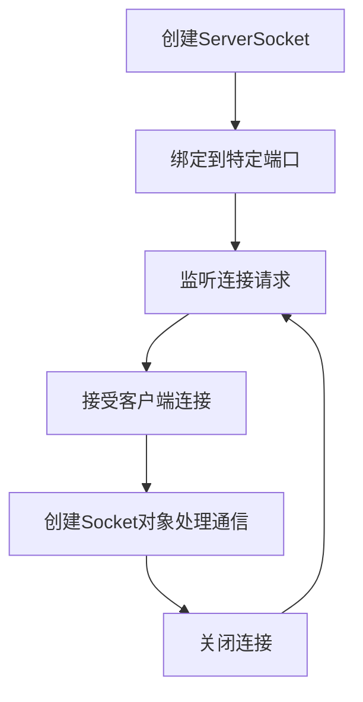

# Java ServerSocket类

## 介绍

在网络编程中，ServerSocket类是Java提供的用于创建服务器端套接字的关键类。它位于`java.net`包中，主要用于等待和接受来自客户端的连接请求。ServerSocket是实现TCP/IP协议服务器端的基础，它能让Java应用程序作为服务器监听指定端口上的网络连接请求。

当你开发网络应用如网页服务器、聊天程序或任何客户端-服务器架构的应用时，ServerSocket都是不可或缺的组件。

## ServerSocket的基本概念

ServerSocket在服务器端工作的基本流程如下：



服务器端套接字的主要功能是监听网络端口，并在客户端请求到达时建立连接。每当建立一个新连接时，ServerSocket会创建一个新的Socket对象来处理与该客户端的通信。

## ServerSocket类的主要构造方法

以下是ServerSocket类的主要构造方法：

```java
// 创建绑定到指定端口的服务器套接字
public ServerSocket(int port) throws IOException

// 创建绑定到指定端口的服务器套接字，使用指定的积压队列长度
public ServerSocket(int port, int backlog) throws IOException

// 创建绑定到指定端口、指定积压队列长度、指定本地IP地址的服务器套接字
public ServerSocket(int port, int backlog, InetAddress bindAddr) throws IOException
```

参数说明：
- `port`: 服务器要监听的端口
- `backlog`: 积压队列的最大长度（等待接受的连接数）
- `bindAddr`: 服务器要绑定的本地IP地址

## ServerSocket的主要方法

ServerSocket类提供了多个用于管理服务器套接字的方法：

- `accept()`: 监听并接受连接，返回一个Socket对象
- `close()`: 关闭服务器套接字
- `isClosed()`: 检查服务器套接字是否已关闭
- `getSoTimeout()`: 获取套接字超时时间
- `setSoTimeout(int timeout)`: 设置套接字超时时间

## 基本使用示例

下面是一个简单的服务器端程序，它监听端口6666，并接受客户端连接：

```java
import java.io.*;
import java.net.*;

public class SimpleServer {
    public static void main(String[] args) {
        try {
            // 创建服务器套接字并绑定到端口6666
            ServerSocket serverSocket = new ServerSocket(6666);
            System.out.println("服务器已启动，等待客户端连接...");
            
            // 接受客户端连接
            Socket socket = serverSocket.accept();
            System.out.println("客户端已连接：" + socket.getInetAddress());
            
            // 获取输入输出流
            BufferedReader in = new BufferedReader(
                new InputStreamReader(socket.getInputStream()));
            PrintWriter out = new PrintWriter(
                socket.getOutputStream(), true);
            
            // 读取客户端发送的消息
            String message = in.readLine();
            System.out.println("收到客户端消息：" + message);
            
            // 向客户端发送响应
            out.println("服务器已收到你的消息：" + message);
            
            // 关闭连接
            socket.close();
            serverSocket.close();
            
        } catch (IOException e) {
            e.printStackTrace();
        }
    }
}
```

对应的客户端代码看起来会像这样：

```java
import java.io.*;
import java.net.*;

public class SimpleClient {
    public static void main(String[] args) {
        try {
            // 连接到服务器
            Socket socket = new Socket("localhost", 6666);
            
            // 获取输入输出流
            BufferedReader in = new BufferedReader(
                new InputStreamReader(socket.getInputStream()));
            PrintWriter out = new PrintWriter(
                socket.getOutputStream(), true);
            
            // 向服务器发送消息
            out.println("你好，服务器！");
            
            // 读取服务器响应
            String response = in.readLine();
            System.out.println("服务器响应：" + response);
            
            // 关闭连接
            socket.close();
            
        } catch (IOException e) {
            e.printStackTrace();
        }
    }
}
```

输出示例：

**服务器端**:
```
服务器已启动，等待客户端连接...
客户端已连接：/127.0.0.1
收到客户端消息：你好，服务器！
```

**客户端**:
```
服务器响应：服务器已收到你的消息：你好，服务器！
```

## 多客户端处理

在实际应用中，服务器通常需要同时处理多个客户端连接。下面是一个使用线程处理多客户端连接的示例：

```java
import java.io.*;
import java.net.*;

public class MultiClientServer {
    public static void main(String[] args) {
        try {
            // 创建服务器套接字
            ServerSocket serverSocket = new ServerSocket(6666);
            System.out.println("多客户端服务器已启动，等待连接...");
            
            while (true) {
                // 接受客户端连接
                Socket clientSocket = serverSocket.accept();
                System.out.println("新客户端已连接：" + clientSocket.getInetAddress());
                
                // 创建新线程处理客户端
                ClientHandler handler = new ClientHandler(clientSocket);
                new Thread(handler).start();
            }
            
        } catch (IOException e) {
            e.printStackTrace();
        }
    }
}

class ClientHandler implements Runnable {
    private Socket clientSocket;
    
    public ClientHandler(Socket socket) {
        this.clientSocket = socket;
    }
    
    @Override
    public void run() {
        try {
            // 获取输入输出流
            BufferedReader in = new BufferedReader(
                new InputStreamReader(clientSocket.getInputStream()));
            PrintWriter out = new PrintWriter(
                clientSocket.getOutputStream(), true);
            
            String message;
            // 持续读取客户端消息，直到客户端断开连接
            while ((message = in.readLine()) != null) {
                System.out.println("来自客户端的消息：" + message);
                out.println("Echo: " + message);
            }
            
            // 关闭客户端连接
            clientSocket.close();
            System.out.println("客户端断开连接：" + clientSocket.getInetAddress());
            
        } catch (IOException e) {
            System.out.println("客户端处理异常：" + e.getMessage());
        }
    }
}
```

## ServerSocket的常见问题和解决方案

### 1. 端口已被占用

如果你尝试绑定到一个已被其他程序占用的端口，会抛出`BindException`。

:::tip 解决方案
- 选择另一个未被占用的端口
- 使用`netstat -ano`命令（Windows）或`netstat -anp`命令（Linux）检查端口占用情况
:::

### 2. 连接超时

当`accept()`方法长时间无法接受连接时，可能会导致程序阻塞。

:::tip 解决方案
使用`setSoTimeout(int timeout)`设置超时时间，超时后会抛出`SocketTimeoutException`：
```java
ServerSocket serverSocket = new ServerSocket(6666);
// 设置accept()方法的超时时间为10000毫秒（10秒）
serverSocket.setSoTimeout(10000);
```
:::

### 3. 关闭资源

忘记关闭ServerSocket会导致资源泄漏。

:::caution 注意
始终在`finally`块或使用try-with-resources语句关闭ServerSocket：
```java
try (ServerSocket serverSocket = new ServerSocket(6666)) {
    // 使用serverSocket
} catch (IOException e) {
    e.printStackTrace();
}
```
:::

## 实际应用案例：简易HTTP服务器

下面是一个简单的HTTP服务器实现，它能够响应基本的GET请求并返回HTML内容：

```java
import java.io.*;
import java.net.*;
import java.util.Date;

public class SimpleHttpServer {
    public static void main(String[] args) {
        try {
            // 创建在8080端口监听的HTTP服务器
            ServerSocket serverSocket = new ServerSocket(8080);
            System.out.println("HTTP服务器已启动，监听端口8080...");
            
            while (true) {
                // 等待并接受连接
                Socket client = serverSocket.accept();
                System.out.println("新连接：" + client.getInetAddress());
                
                // 处理HTTP请求
                handleRequest(client);
            }
            
        } catch (IOException e) {
            e.printStackTrace();
        }
    }
    
    private static void handleRequest(Socket client) throws IOException {
        BufferedReader in = new BufferedReader(
            new InputStreamReader(client.getInputStream()));
        PrintWriter out = new PrintWriter(client.getOutputStream(), true);
        
        // 读取HTTP请求头
        String requestLine = in.readLine();
        System.out.println(requestLine);
        
        // 读取并忽略其余请求头
        String line;
        while ((line = in.readLine()) != null && !line.isEmpty()) {
            System.out.println(line);
        }
        
        // 发送HTTP响应
        out.println("HTTP/1.1 200 OK");
        out.println("Content-Type: text/html; charset=UTF-8");
        out.println("Date: " + new Date());
        out.println();  // 空行表示头部结束
        
        // 发送HTML内容
        out.println("<!DOCTYPE html>");
        out.println("<html>");
        out.println("<head><title>简易HTTP服务器</title></head>");
        out.println("<body>");
        out.println("<h1>欢迎访问我的简易HTTP服务器！</h1>");
        out.println("<p>这是使用Java ServerSocket实现的HTTP服务器演示。</p>");
        out.println("<p>当前时间: " + new Date() + "</p>");
        out.println("</body>");
        out.println("</html>");
        
        // 关闭连接
        client.close();
    }
}
```

使用方法：
1. 编译并运行上述代码
2. 打开浏览器，访问 http://localhost:8080
3. 你将看到一个简单的HTML页面，显示欢迎消息和当前时间

## 总结

Java ServerSocket类是网络编程中实现服务器端功能的基础组件。通过本文，我们了解了：

1. ServerSocket的基本概念和工作原理
2. 如何创建和使用ServerSocket
3. ServerSocket的主要方法和属性
4. 如何实现单客户端和多客户端服务器
5. 解决常见问题的方法
6. 实现简易HTTP服务器的实际应用

ServerSocket为Java开发者提供了强大的网络通信能力，是构建分布式应用、网络服务和互联网应用的重要工具。

## 练习

1. 修改简易HTTP服务器，使其能够返回不同的网页内容，根据URL路径的不同返回不同的页面。
2. 实现一个聊天服务器，允许多个客户端连接并相互发送消息。
3. 为HTTP服务器添加日志记录功能，记录所有客户端请求的详细信息。
4. 实现一个文件传输服务器，允许客户端上传和下载文件。

## 附加资源

- [Java官方文档 - ServerSocket类](https://docs.oracle.com/javase/8/docs/api/java/net/ServerSocket.html)
- [TCP/IP协议详解](https://www.rfc-editor.org/rfc/rfc793)
- [HTTP协议规范](https://www.rfc-editor.org/rfc/rfc2616)

通过掌握ServerSocket类，你已经迈出了成为Java网络编程专家的重要一步！继续练习并探索更多高级主题，将帮助你构建更复杂、更强大的网络应用。