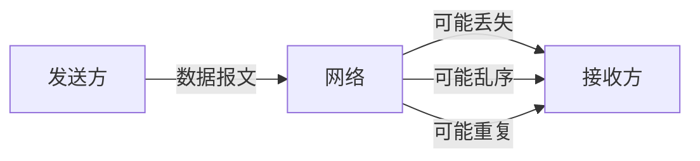

# Java UDP通信

## 什么是UDP通信

UDP(用户数据报协议)是一种简单的面向数据报的传输层协议，它在TCP/IP网络模型中与TCP协议处于同一层。与TCP协议不同，UDP是一种**无连接**的通信协议，它不需要在数据传输前建立连接，也不保证数据传输的可靠性和有序性。

:::note
UDP通信的特点：
- 无连接：发送数据前不需要建立连接
- 不可靠：不保证数据一定能到达目的地
- 高效：传输速度快，开销小
- 适用于对实时性要求高、对可靠性要求相对较低的场景
:::



## Java 中的UDP通信基础类

Java在`java.net`包中提供了两个核心类来支持UDP通信：

1. `DatagramSocket`：用于发送和接收数据报包
2. `DatagramPacket`：表示数据报包，包含了要发送或接收的数据以及地址信息

### DatagramPacket类

`DatagramPacket`类用于封装UDP数据报，主要包含以下信息：
- 要传输的数据字节数组
- 数据长度
- 目标IP地址
- 目标端口号

常用构造方法：

```java
// 用于接收数据的数据报包
DatagramPacket(byte[] buf, int length)

// 用于发送数据的数据报包
DatagramPacket(byte[] buf, int length, InetAddress address, int port)
```

### DatagramSocket类

`DatagramSocket`类用于发送和接收UDP数据报，主要方法包括：

```java
// 创建数据报套接字并将其绑定到本地主机上的指定端口
DatagramSocket(int port)

// 发送数据报包
void send(DatagramPacket p)

// 接收数据报包
void receive(DatagramPacket p)

// 关闭套接字
void close()
```

## UDP通信实现步骤

### 发送端实现步骤

1. 创建`DatagramSocket`对象
2. 创建`DatagramPacket`对象，指定数据、长度、地址和端口
3. 调用`DatagramSocket`的`send()`方法发送数据
4. 关闭`DatagramSocket`

### 接收端实现步骤

1. 创建`DatagramSocket`对象，指定监听端口
2. 创建`DatagramPacket`对象，用于接收数据
3. 调用`DatagramSocket`的`receive()`方法接收数据
4. 解析接收到的数据
5. 关闭`DatagramSocket`

## 代码示例：简单的UDP通信

### UDP发送端

```java
import java.io.IOException;
import java.net.DatagramPacket;
import java.net.DatagramSocket;
import java.net.InetAddress;

public class UDPSender {
    public static void main(String[] args) {
        try {
            // 1. 创建DatagramSocket对象
            DatagramSocket socket = new DatagramSocket();
            
            // 2. 准备要发送的数据
            String message = "Hello, UDP!";
            byte[] data = message.getBytes();
            
            // 3. 确定发送地址和端口
            InetAddress address = InetAddress.getByName("localhost");
            int port = 8888;
            
            // 4. 创建DatagramPacket对象
            DatagramPacket packet = new DatagramPacket(data, data.length, address, port);
            
            // 5. 发送数据
            socket.send(packet);
            System.out.println("数据发送成功：" + message);
            
            // 6. 关闭资源
            socket.close();
            
        } catch (IOException e) {
            e.printStackTrace();
        }
    }
}
```

### UDP接收端

```java
import java.io.IOException;
import java.net.DatagramPacket;
import java.net.DatagramSocket;

public class UDPReceiver {
    public static void main(String[] args) {
        try {
            // 1. 创建DatagramSocket对象，指定端口
            DatagramSocket socket = new DatagramSocket(8888);
            
            // 2. 创建用于接收数据的DatagramPacket对象
            byte[] buffer = new byte[1024]; // 缓冲区
            DatagramPacket packet = new DatagramPacket(buffer, buffer.length);
            
            System.out.println("等待接收数据...");
            
            // 3. 接收数据（此方法会阻塞，直到收到数据）
            socket.receive(packet);
            
            // 4. 解析数据
            String receivedData = new String(packet.getData(), 0, packet.getLength());
            System.out.println("接收到的数据：" + receivedData);
            System.out.println("数据来源IP：" + packet.getAddress().getHostAddress());
            System.out.println("数据来源端口：" + packet.getPort());
            
            // 5. 关闭资源
            socket.close();
            
        } catch (IOException e) {
            e.printStackTrace();
        }
    }
}
```

### 输出示例

接收端输出：
```
等待接收数据...
接收到的数据：Hello, UDP!
数据来源IP：127.0.0.1
数据来源端口：52368
```

发送端输出：
```
数据发送成功：Hello, UDP!
```

## 实现双向通信

在实际应用中，通常需要实现双向通信。下面是一个简单的UDP双向通信示例：

### UDP客户端

```java
import java.io.IOException;
import java.net.DatagramPacket;
import java.net.DatagramSocket;
import java.net.InetAddress;
import java.util.Scanner;

public class UDPClient {
    public static void main(String[] args) {
        try {
            DatagramSocket socket = new DatagramSocket();
            InetAddress serverAddress = InetAddress.getByName("localhost");
            int serverPort = 9999;
            Scanner scanner = new Scanner(System.in);
            
            while (true) {
                // 发送数据
                System.out.print("请输入要发送的消息：");
                String message = scanner.nextLine();
                
                if ("exit".equalsIgnoreCase(message)) {
                    break;
                }
                
                byte[] sendData = message.getBytes();
                DatagramPacket sendPacket = new DatagramPacket(
                    sendData, sendData.length, serverAddress, serverPort
                );
                socket.send(sendPacket);
                
                // 接收服务器响应
                byte[] receiveData = new byte[1024];
                DatagramPacket receivePacket = new DatagramPacket(receiveData, receiveData.length);
                socket.receive(receivePacket);
                
                String response = new String(receivePacket.getData(), 0, receivePacket.getLength());
                System.out.println("服务器响应：" + response);
            }
            
            socket.close();
            scanner.close();
            
        } catch (IOException e) {
            e.printStackTrace();
        }
    }
}
```

### UDP服务器

```java
import java.io.IOException;
import java.net.DatagramPacket;
import java.net.DatagramSocket;
import java.net.InetAddress;

public class UDPServer {
    public static void main(String[] args) {
        try {
            DatagramSocket socket = new DatagramSocket(9999);
            System.out.println("UDP服务器已启动，监听端口9999...");
            
            while (true) {
                // 接收数据
                byte[] receiveData = new byte[1024];
                DatagramPacket receivePacket = new DatagramPacket(receiveData, receiveData.length);
                socket.receive(receivePacket);
                
                // 处理接收的数据
                String message = new String(receivePacket.getData(), 0, receivePacket.getLength());
                InetAddress clientAddress = receivePacket.getAddress();
                int clientPort = receivePacket.getPort();
                
                System.out.println("接收到来自 " + clientAddress.getHostAddress() + ":" 
                    + clientPort + " 的消息：" + message);
                
                // 发送响应
                String response = "服务器已收到消息：" + message;
                byte[] sendData = response.getBytes();
                DatagramPacket sendPacket = new DatagramPacket(
                    sendData, sendData.length, clientAddress, clientPort
                );
                socket.send(sendPacket);
            }
            
        } catch (IOException e) {
            e.printStackTrace();
        }
    }
}
```

## UDP广播通信

UDP支持广播功能，可以向局域网内所有主机发送消息。

```java
import java.io.IOException;
import java.net.DatagramPacket;
import java.net.DatagramSocket;
import java.net.InetAddress;

public class UDPBroadcaster {
    public static void main(String[] args) {
        try {
            DatagramSocket socket = new DatagramSocket();
            socket.setBroadcast(true); // 启用广播
            
            String message = "这是一条广播消息!";
            byte[] data = message.getBytes();
            
            // 广播地址255.255.255.255
            InetAddress broadcastAddress = InetAddress.getByName("255.255.255.255");
            int port = 8888;
            
            DatagramPacket packet = new DatagramPacket(data, data.length, broadcastAddress, port);
            socket.send(packet);
            
            System.out.println("广播消息已发送");
            socket.close();
            
        } catch (IOException e) {
            e.printStackTrace();
        }
    }
}
```

:::caution
广播消息会发送到网络中的所有设备，可能会导致网络拥塞。在实际应用中，应谨慎使用广播功能。
:::

## 实际应用场景

UDP通信在许多实际应用场景中都有广泛应用：

### 1. 实时游戏

在网络游戏中，对实时性要求高但可以容忍少量数据丢失的场景，如玩家位置更新、动作状态同步等，通常使用UDP协议。

### 2. 流媒体传输

视频会议、直播等应用中，视频和音频数据的传输往往使用UDP，因为：
- 丢失几个数据包只会导致短暂的画面或声音干扰
- 重传延迟的数据包往往没有意义（已经过时）

### 3. DNS查询

DNS(域名系统)查询通常使用UDP协议，因为查询操作简单、数据量小，即使偶尔失败可以重试。

### 4. 网络时间协议(NTP)

用于同步计算机时钟的NTP协议也是基于UDP实现的。

### 5. 物联网(IoT)设备通信

资源受限的IoT设备经常使用UDP进行通信，以减少协议开销。

## 实战案例：简易聊天室

以下是一个简单的UDP聊天室实现，包括一个服务器和多个客户端：

### 聊天室服务器

```java
import java.io.IOException;
import java.net.DatagramPacket;
import java.net.DatagramSocket;
import java.net.InetAddress;
import java.util.ArrayList;
import java.util.List;

public class ChatServer {
    private static final int PORT = 9000;
    private static List<ClientInfo> clients = new ArrayList<>();
    
    // 客户端信息类
    static class ClientInfo {
        InetAddress address;
        int port;
        
        ClientInfo(InetAddress address, int port) {
            this.address = address;
            this.port = port;
        }
        
        @Override
        public boolean equals(Object obj) {
            if (!(obj instanceof ClientInfo)) return false;
            ClientInfo other = (ClientInfo) obj;
            return address.equals(other.address) && port == other.port;
        }
    }
    
    public static void main(String[] args) {
        try {
            DatagramSocket socket = new DatagramSocket(PORT);
            System.out.println("聊天服务器已启动，监听端口：" + PORT);
            
            while (true) {
                // 接收消息
                byte[] buffer = new byte[1024];
                DatagramPacket packet = new DatagramPacket(buffer, buffer.length);
                socket.receive(packet);
                
                // 处理客户端信息
                ClientInfo client = new ClientInfo(packet.getAddress(), packet.getPort());
                if (!clients.contains(client)) {
                    clients.add(client);
                    System.out.println("新客户端加入：" + client.address.getHostAddress() + ":" + client.port);
                }
                
                // 解析消息
                String message = new String(packet.getData(), 0, packet.getLength());
                String broadcastMessage = client.address.getHostAddress() + ":" + client.port + " 说：" + message;
                System.out.println(broadcastMessage);
                
                // 广播给所有客户端
                byte[] broadcastData = broadcastMessage.getBytes();
                for (ClientInfo c : clients) {
                    DatagramPacket broadcastPacket = new DatagramPacket(
                        broadcastData, broadcastData.length, c.address, c.port
                    );
                    socket.send(broadcastPacket);
                }
            }
            
        } catch (IOException e) {
            e.printStackTrace();
        }
    }
}
```

### 聊天室客户端

```java
import java.io.IOException;
import java.net.DatagramPacket;
import java.net.DatagramSocket;
import java.net.InetAddress;
import java.util.Scanner;

public class ChatClient {
    public static void main(String[] args) {
        try {
            DatagramSocket socket = new DatagramSocket();
            InetAddress serverAddress = InetAddress.getByName("localhost");
            int serverPort = 9000;
            
            // 启动接收线程
            Thread receiveThread = new Thread(() -> {
                try {
                    while (true) {
                        byte[] buffer = new byte[1024];
                        DatagramPacket packet = new DatagramPacket(buffer, buffer.length);
                        socket.receive(packet);
                        String message = new String(packet.getData(), 0, packet.getLength());
                        System.out.println(message);
                    }
                } catch (IOException e) {
                    e.printStackTrace();
                }
            });
            receiveThread.setDaemon(true);
            receiveThread.start();
            
            // 发送消息
            Scanner scanner = new Scanner(System.in);
            System.out.println("开始聊天 (输入'exit'退出):");
            
            while (true) {
                String message = scanner.nextLine();
                if ("exit".equalsIgnoreCase(message)) {
                    break;
                }
                
                byte[] data = message.getBytes();
                DatagramPacket packet = new DatagramPacket(data, data.length, serverAddress, serverPort);
                socket.send(packet);
            }
            
            scanner.close();
            socket.close();
            
        } catch (IOException e) {
            e.printStackTrace();
        }
    }
}
```

## UDP通信的优缺点

### 优点

1. **高效**：无需建立连接，协议开销小
2. **实时性好**：没有重传和确认机制，延迟低
3. **资源消耗少**：不维护连接状态，服务器能支持更多客户端
4. **支持广播和多播**：可以一次性向多个接收者发送数据

### 缺点

1. **不可靠**：不保证数据包到达目的地
2. **无序**：接收方收到的数据包顺序可能与发送顺序不同
3. **无流量控制**：可能导致网络拥塞或接收方缓冲区溢出
4. **安全性低**：易受到IP欺骗和数据篡改攻击

## 总结

Java UDP通信提供了一种简单、高效的网络通信方式，特别适用于实时性要求高、可以容忍一定数据丢失的应用场景。

通过`DatagramSocket`和`DatagramPacket`两个核心类，开发者可以轻松实现UDP通信功能。UDP协议的无连接特性使其在实时游戏、流媒体传输、DNS查询等领域有广泛应用。

但是，由于UDP不保证可靠传输，在开发需要数据完整性的应用时，应考虑使用TCP协议或在UDP上实现自定义的可靠性机制。

## 练习题

1. 编写一个UDP程序，实现文件传输功能。
2. 实现一个UDP心跳检测系统，客户端定期向服务器发送心跳包，服务器检测客户端是否在线。
3. 改进聊天室程序，增加用户名功能，允许用户设置自己的昵称。
4. 实现一个基于UDP的简单网络时间协议客户端，从NTP服务器获取当前时间。

## 延伸阅读

- Java网络编程官方文档：[java.net包](https://docs.oracle.com/en/java/javase/11/docs/api/java.base/java/net/package-summary.html)
- TCP与UDP的详细比较
- 如何在UDP上实现可靠传输
- 网络协议栈与OSI七层模型

:::tip
UDP通信虽然简单，但在实际应用中，通常需要考虑网络环境、数据大小、安全性等多种因素。根据具体需求，选择合适的通信协议和实现方式至关重要。
:::