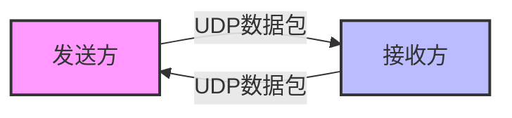

# Java DatagramSocket

## 引言

在网络编程中，有两种主要的通信协议：TCP和UDP。TCP(传输控制协议)是一种可靠的、面向连接的协议，而UDP(用户数据报协议)则是一种无连接的、不可靠的协议。虽然UDP不像TCP那样可靠，但它速度更快，开销更小，适用于对实时性要求高但对数据完整性要求较低的应用场景，如视频流、游戏等。

Java中，我们通过`DatagramSocket`类来实现UDP通信。本文将全面介绍如何使用`DatagramSocket`进行UDP网络编程。

## UDP基础概念

在深入了解`DatagramSocket`之前，让我们先简单回顾一下UDP的几个关键特点：

- 无连接：发送数据前不需要建立连接
- 不可靠：不保证数据一定会到达目的地
- 快速：因为没有连接建立和数据确认的开销，所以传输速度快
- 数据包大小限制：单个UDP数据包的最大大小通常为65507字节



## DatagramSocket类概述

`DatagramSocket`是Java提供的用于UDP通信的类，位于`java.net`包中。它允许程序通过UDP协议发送和接收数据包。

主要功能包括：
- 发送`DatagramPacket`(数据报包)到指定目的地
- 接收来自网络的`DatagramPacket`
- 绑定到特定端口以监听数据包

## DatagramPacket类

在使用`DatagramSocket`之前，我们需要了解`DatagramPacket`类，它用来表示UDP通信中的数据包。

`DatagramPacket`主要包含以下信息：
- 要发送或接收的字节数据
- 数据的长度
- 目标IP地址(发送时)
- 目标端口号(发送时)
- 发送方IP地址(接收时)
- 发送方端口号(接收时)

## 创建DatagramSocket

要使用`DatagramSocket`，首先需要创建一个实例。有几种不同的构造方法：

```java
// 创建一个未绑定端口的DatagramSocket
DatagramSocket socket = new DatagramSocket();

// 创建一个绑定到特定端口的DatagramSocket
DatagramSocket socket = new DatagramSocket(9090);

// 创建一个绑定到特定IP和端口的DatagramSocket
DatagramSocket socket = new DatagramSocket(9090, InetAddress.getByName("192.168.1.100"));
```

## 发送数据

使用`DatagramSocket`发送数据的步骤如下：

1. 创建要发送的字节数组数据
2. 创建一个`DatagramPacket`，指定目标地址和端口
3. 使用`DatagramSocket`的`send()`方法发送数据包

```java
// 示例代码：发送UDP数据包
try {
    // 1. 创建DatagramSocket
    DatagramSocket socket = new DatagramSocket();
    
    // 2. 准备要发送的数据
    String message = "Hello, UDP!";
    byte[] buffer = message.getBytes();
    
    // 3. 确定接收方的IP地址和端口号
    InetAddress address = InetAddress.getByName("localhost");
    int port = 9090;
    
    // 4. 创建DatagramPacket
    DatagramPacket packet = new DatagramPacket(buffer, buffer.length, address, port);
    
    // 5. 发送数据包
    socket.send(packet);
    System.out.println("数据已发送：" + message);
    
    // 6. 关闭资源
    socket.close();
} catch (IOException e) {
    e.printStackTrace();
}
```

## 接收数据

接收数据的步骤如下：

1. 创建一个绑定到特定端口的`DatagramSocket`
2. 创建一个`DatagramPacket`用于存储接收到的数据
3. 调用`DatagramSocket`的`receive()`方法接收数据
4. 从数据包中提取收到的数据

```java
// 示例代码：接收UDP数据包
try {
    // 1. 创建DatagramSocket，绑定端口
    DatagramSocket socket = new DatagramSocket(9090);
    
    // 2. 创建DatagramPacket用于接收数据
    byte[] buffer = new byte[1024]; // 创建缓冲区
    DatagramPacket packet = new DatagramPacket(buffer, buffer.length);
    
    System.out.println("等待接收数据...");
    
    // 3. 接收数据包（这是一个阻塞调用）
    socket.receive(packet);
    
    // 4. 处理接收到的数据
    String receivedData = new String(packet.getData(), 0, packet.getLength());
    System.out.println("接收到数据：" + receivedData);
    System.out.println("发送者地址：" + packet.getAddress());
    System.out.println("发送者端口：" + packet.getPort());
    
    // 5. 关闭资源
    socket.close();
} catch (IOException e) {
    e.printStackTrace();
}
```

:::tip
`receive()`方法会阻塞程序，直到收到一个数据包。如果需要持续接收数据，可以将接收代码放在循环中。
:::

## 超时设置

对于`DatagramSocket`，我们可以设置超时时间，使`receive()`方法不会无限期地阻塞：

```java
// 设置接收超时时间为5秒
socket.setSoTimeout(5000);
```

这样，如果在5秒内没有接收到数据包，`receive()`方法将抛出`SocketTimeoutException`异常。

## UDP聊天程序示例

下面是一个简单的UDP聊天程序示例，包括一个发送器和一个接收器：

### UDP聊天发送器

```java
import java.io.*;
import java.net.*;

public class UDPChatSender {
    public static void main(String[] args) {
        try {
            DatagramSocket socket = new DatagramSocket();
            InetAddress address = InetAddress.getByName("localhost");
            int port = 9090;
            
            BufferedReader userInput = new BufferedReader(new InputStreamReader(System.in));
            System.out.println("UDP聊天已启动，输入'exit'退出");
            
            String message;
            while (true) {
                System.out.print("发送消息: ");
                message = userInput.readLine();
                
                if ("exit".equalsIgnoreCase(message)) {
                    break;
                }
                
                byte[] sendData = message.getBytes();
                DatagramPacket sendPacket = new DatagramPacket(
                    sendData, sendData.length, address, port);
                socket.send(sendPacket);
            }
            
            socket.close();
            System.out.println("聊天已结束");
        } catch (IOException e) {
            e.printStackTrace();
        }
    }
}
```

### UDP聊天接收器

```java
import java.io.*;
import java.net.*;

public class UDPChatReceiver {
    public static void main(String[] args) {
        try {
            DatagramSocket socket = new DatagramSocket(9090);
            System.out.println("UDP聊天接收器已启动，等待消息...");
            
            byte[] receiveData = new byte[1024];
            
            while (true) {
                DatagramPacket receivePacket = new DatagramPacket(
                    receiveData, receiveData.length);
                socket.receive(receivePacket);
                
                String message = new String(
                    receivePacket.getData(), 0, receivePacket.getLength());
                System.out.println("收到来自 " + receivePacket.getAddress() + 
                    " 的消息: " + message);
                
                // 清空接收缓冲区
                receiveData = new byte[1024];
            }
        } catch (IOException e) {
            e.printStackTrace();
        }
    }
}
```

## 广播和组播

### 广播

UDP支持广播功能，即向网络中的所有设备发送消息：

```java
// 广播示例
DatagramSocket socket = new DatagramSocket();
socket.setBroadcast(true);  // 启用广播
InetAddress broadcastAddress = InetAddress.getByName("255.255.255.255");
byte[] buffer = "广播消息".getBytes();
DatagramPacket packet = new DatagramPacket(buffer, buffer.length, 
    broadcastAddress, 9090);
socket.send(packet);
```

### 组播

组播允许将数据包发送到特定的组播地址，只有加入该组的接收者才能收到消息：

```java
// 组播发送示例
MulticastSocket socket = new MulticastSocket();
InetAddress groupAddress = InetAddress.getByName("230.0.0.1"); // 组播地址范围: 224.0.0.0 - 239.255.255.255
byte[] buffer = "组播消息".getBytes();
DatagramPacket packet = new DatagramPacket(buffer, buffer.length, 
    groupAddress, 9090);
socket.send(packet);
```

```java
// 组播接收示例
MulticastSocket socket = new MulticastSocket(9090);
InetAddress groupAddress = InetAddress.getByName("230.0.0.1");
socket.joinGroup(groupAddress);  // 加入组播组
byte[] buffer = new byte[1024];
DatagramPacket packet = new DatagramPacket(buffer, buffer.length);
socket.receive(packet);  // 接收组播消息
```

## DatagramSocket常用方法

以下是`DatagramSocket`类的一些常用方法：

| 方法名 | 描述 |
|-------|------|
| `send(DatagramPacket p)` | 发送数据包 |
| `receive(DatagramPacket p)` | 接收数据包 |
| `close()` | 关闭套接字 |
| `setSoTimeout(int timeout)` | 设置接收超时时间(毫秒) |
| `connect(InetAddress address, int port)` | 将套接字连接到远程地址和端口 |
| `disconnect()` | 断开套接字连接 |
| `getLocalPort()` | 获取套接字绑定的本地端口 |
| `getLocalAddress()` | 获取套接字绑定的本地地址 |
| `setSendBufferSize(int size)` | 设置发送缓冲区大小 |
| `setReceiveBufferSize(int size)` | 设置接收缓冲区大小 |

## UDP与TCP比较

:::info
**UDP特点：**
- 无连接，发送前无需建立连接
- 不可靠，不保证数据到达
- 传输速度快
- 适合实时应用，如游戏、流媒体等

**TCP特点：**
- 面向连接，通信前需建立连接
- 可靠传输，确保数据按顺序到达
- 传输速度相对较慢
- 适合对数据完整性要求高的应用，如文件传输、电子邮件等
:::

## 实际应用场景

UDP在实际应用中有很多用途，包括：

1. **DNS查询**：域名解析通常使用UDP协议
2. **视频/音频流**：如网络电话、视频会议
3. **在线游戏**：实时性要求高的多人游戏
4. **IoT设备通信**：物联网中的简单设备通信
5. **日志收集系统**：如ELK Stack中的Logstash
6. **网络时间协议(NTP)**：时间同步

## 性能与安全考虑

在使用`DatagramSocket`进行UDP编程时，应注意以下几点：

1. **包大小限制**：单个UDP数据包大小最好不要超过65507字节
2. **错误处理**：由于UDP不可靠，应考虑数据包丢失的情况
3. **线程安全**：在多线程环境中使用同一个`DatagramSocket`时需要注意线程安全
4. **安全性**：UDP通信本身不加密，如需安全传输，应考虑DTLS(Datagram Transport Layer Security)

## 总结

Java中的`DatagramSocket`提供了一种实现UDP通信的简单方式。虽然UDP不如TCP可靠，但它在许多需要低延迟和高效率的应用场景中非常有用。

本文介绍了：
- `DatagramSocket`和`DatagramPacket`的基本概念
- 如何发送和接收UDP数据包
- 超时设置和资源管理
- 广播和组播功能
- 实际应用场景

通过掌握`DatagramSocket`，你可以开发出各种基于UDP的网络应用，如简单的聊天工具、实时游戏、流媒体应用等。

## 练习

为了巩固所学知识，建议尝试以下练习：

1. 编写一个UDP文件传输程序，将文件分成多个小块传输，并在接收端重组
2. 实现一个基于UDP的简单网络游戏，如猜数字游戏
3. 创建一个UDP广播程序，用于发现局域网内的设备
4. 实现一个基于UDP的聊天室，支持多用户通信

## 相关资源

- [Java官方文档 - DatagramSocket](https://docs.oracle.com/en/java/javase/11/docs/api/java.base/java/net/DatagramSocket.html)
- [Java官方文档 - DatagramPacket](https://docs.oracle.com/en/java/javase/11/docs/api/java.base/java/net/DatagramPacket.html)
- [RFC 768 - 用户数据报协议(UDP)](https://tools.ietf.org/html/rfc768)

通过本教程的学习，你应该已经掌握了Java UDP编程的基础知识和使用`DatagramSocket`的方法。随着实践的增加，你会发现UDP在特定场景下的优势，以及如何在你的应用中充分利用它。