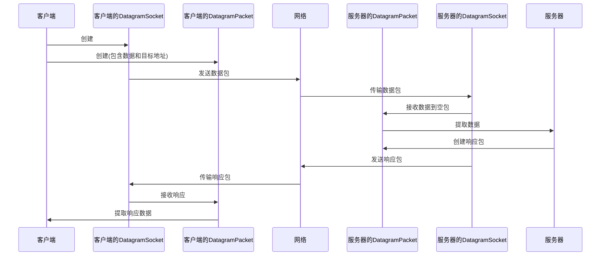

# Java DatagramPacket

在 Java 网络编程中，`DatagramPacket` 类是 UDP (用户数据报协议) 通信的基础构建块。当你需要通过网络发送或接收独立的数据包而不建立持久连接时，了解这个类是必不可少的。

## DatagramPacket 简介

`DatagramPacket` 类位于 `java.net` 包中，它代表一个数据报包，用于在网络上通过 UDP 协议传输数据。与 TCP 不同，UDP 是一种无连接的协议，意味着发送方不会等待确认，也不保证数据包的送达或顺序。

:::note
UDP 通常用于对实时性要求较高但对可靠性要求较低的应用，如视频流、在线游戏或广播消息。
:::

## DatagramPacket 的基本属性

每个 `DatagramPacket` 对象包含以下基本信息：

1. **数据缓冲区**：存储要发送或接收的实际数据
2. **数据长度**：缓冲区中有效数据的长度
3. **网络地址**：接收方或发送方的 IP 地址
4. **端口号**：接收方或发送方的端口号

## 创建 DatagramPacket 对象

### 用于发送数据的 DatagramPacket

```java
byte[] data = "Hello, UDP!".getBytes();
InetAddress address = InetAddress.getByName("localhost");
int port = 9876;

// 创建数据包，指定数据、数据长度、目标地址和端口
DatagramPacket packet = new DatagramPacket(data, data.length, address, port);
```

### 用于接收数据的 DatagramPacket

```java
byte[] buffer = new byte[1024]; // 创建一个缓冲区
DatagramPacket packet = new DatagramPacket(buffer, buffer.length);
// 此数据包准备好接收数据，最大长度为 buffer.length
```

## DatagramPacket 的主要方法

使用 `DatagramPacket` 时，你会经常用到以下几个方法：

| 方法 | 说明 |
|------|------|
| `getData()` | 返回数据缓冲区 |
| `getLength()` | 返回要发送或接收到的数据的长度 |
| `getAddress()` | 返回发送方或接收方的 IP 地址 |
| `getPort()` | 返回发送方或接收方的端口号 |
| `setData(byte[] buf)` | 设置数据缓冲区 |
| `setLength(int length)` | 设置数据长度 |
| `setAddress(InetAddress addr)` | 设置 IP 地址 |
| `setPort(int port)` | 设置端口号 |

## 完整 UDP 通信实例

让我们通过一个完整的例子来演示如何使用 `DatagramPacket` 进行 UDP 通信。这个例子包含一个 UDP 服务器和一个 UDP 客户端。

### UDP 服务器

```java
import java.net.*;

public class UDPServer {
    public static void main(String[] args) {
        try {
            // 创建一个 DatagramSocket，绑定到端口 9876
            DatagramSocket serverSocket = new DatagramSocket(9876);
            System.out.println("UDP 服务器启动，等待数据...");
            
            byte[] receiveData = new byte[1024];
            
            while (true) {
                // 创建接收数据包
                DatagramPacket receivePacket = new DatagramPacket(receiveData, receiveData.length);
                
                // 接收数据包
                serverSocket.receive(receivePacket);
                
                // 处理接收到的数据
                String sentence = new String(receivePacket.getData(), 0, receivePacket.getLength());
                System.out.println("收到来自客户端的消息: " + sentence);
                
                // 获取客户端地址和端口
                InetAddress IPAddress = receivePacket.getAddress();
                int port = receivePacket.getPort();
                
                // 准备要发送的数据
                String capitalizedSentence = sentence.toUpperCase();
                byte[] sendData = capitalizedSentence.getBytes();
                
                // 创建发送数据包，指向客户端
                DatagramPacket sendPacket = new DatagramPacket(sendData, sendData.length, IPAddress, port);
                
                // 发送数据包
                serverSocket.send(sendPacket);
            }
        } catch (Exception e) {
            e.printStackTrace();
        }
    }
}
```

### UDP 客户端

```java
import java.net.*;
import java.util.Scanner;

public class UDPClient {
    public static void main(String[] args) {
        try {
            // 创建客户端 DatagramSocket
            DatagramSocket clientSocket = new DatagramSocket();
            
            // 获取服务器的 IP 地址
            InetAddress IPAddress = InetAddress.getByName("localhost");
            
            // 设置缓冲区
            byte[] sendData = new byte[1024];
            byte[] receiveData = new byte[1024];
            
            // 从用户获取输入
            Scanner scanner = new Scanner(System.in);
            System.out.print("输入一条消息: ");
            String sentence = scanner.nextLine();
            sendData = sentence.getBytes();
            
            // 创建发送数据包
            DatagramPacket sendPacket = new DatagramPacket(sendData, sendData.length, IPAddress, 9876);
            
            // 发送数据包
            clientSocket.send(sendPacket);
            
            // 创建接收数据包
            DatagramPacket receivePacket = new DatagramPacket(receiveData, receiveData.length);
            
            // 接收服务器响应
            clientSocket.receive(receivePacket);
            
            // 处理响应
            String modifiedSentence = new String(receivePacket.getData(), 0, receivePacket.getLength());
            System.out.println("从服务器收到的响应: " + modifiedSentence);
            
            // 关闭资源
            clientSocket.close();
            scanner.close();
        } catch (Exception e) {
            e.printStackTrace();
        }
    }
}
```

### 运行效果

服务器端输出:
```
UDP 服务器启动，等待数据...
收到来自客户端的消息: hello world
```

客户端输出:
```
输入一条消息: hello world
从服务器收到的响应: HELLO WORLD
```

## DatagramPacket 的工作流程

下面的图表展示了 `DatagramPacket` 在 UDP 通信中的工作流程：



## DatagramPacket 与 DatagramSocket 的关系

理解 `DatagramPacket` 和 `DatagramSocket` 之间的关系很重要：

- **DatagramPacket**: 代表要发送或接收的数据包本身，包含数据和地址信息。
- **DatagramSocket**: 是实际发送和接收 `DatagramPacket` 的机制，类似于邮局。

:::tip
你可以将 `DatagramPacket` 想象为一个邮件，而 `DatagramSocket` 则是邮局。你准备邮件(数据包)并指定目的地，然后交给邮局(套接字)发送。
:::

## DatagramPacket 的优缺点

### 优点

1. **轻量级**：UDP 协议开销小，数据包小且处理速度快
2. **无连接**：不需要建立连接，减少了延迟
3. **简单**：实现简单，代码量少
4. **广播支持**：UDP 支持广播和多播

### 缺点

1. **不可靠**：不保证数据包的送达或顺序
2. **数据大小限制**：UDP 数据包通常限制在 64KB 以下
3. **无拥塞控制**：可能在网络拥堵时造成数据丢失

## 实际应用场景

`DatagramPacket` 和 UDP 通信在以下场景中特别有用：

1. **DNS 查询**：域名系统主要使用 UDP 进行查询
2. **视频/音频流**：实时流媒体应用
3. **在线游戏**：需要快速更新玩家状态
4. **IoT 设备通信**：物联网设备的轻量级通信
5. **网络时间协议(NTP)**：时间同步
6. **DHCP**：动态主机配置协议使用 UDP

## 进阶：处理 DatagramPacket 的大小限制

UDP 数据包大小有限制，通常是 65,507 字节。如果你需要发送更大的数据，则需要自己实现分块传输：

```java
public class FragmentedUDPSender {
    public static void sendLargeData(byte[] data, DatagramSocket socket, InetAddress address, int port) throws IOException {
        int maxSize = 1024; // 每个数据包的最大大小
        int totalPackets = (int) Math.ceil((double) data.length / maxSize);
        
        // 发送每个分片
        for (int i = 0; i < totalPackets; i++) {
            int start = i * maxSize;
            int size = Math.min(maxSize, data.length - start);
            
            // 创建一个包含分片索引的头部
            byte[] header = ByteBuffer.allocate(8)
                    .putInt(i)               // 分片索引
                    .putInt(totalPackets)    // 总分片数
                    .array();
            
            // 组合头部和数据
            byte[] packetData = new byte[header.length + size];
            System.arraycopy(header, 0, packetData, 0, header.length);
            System.arraycopy(data, start, packetData, header.length, size);
            
            // 发送数据包
            DatagramPacket packet = new DatagramPacket(packetData, packetData.length, address, port);
            socket.send(packet);
            
            // 简单的流控制
            Thread.sleep(10);
        }
    }
}
```

:::caution
上述代码仅作为示例，实际应用中可能需要添加更健壮的错误处理、重传机制和流控制。
:::

## 总结

`DatagramPacket` 是 Java UDP 网络编程的核心类，它代表要通过网络发送或接收的数据包。在需要快速、轻量级通信且能容忍一定数据丢失的应用中，UDP 和 `DatagramPacket` 是理想的选择。

通过本教程，你已经学会了：
- `DatagramPacket` 的基本概念和作用
- 如何创建用于发送和接收的数据包
- 如何使用 `DatagramPacket` 搭建完整的 UDP 客户端-服务器应用
- DatagramPacket 在实际场景中的应用
- 处理大数据传输的基本技巧

## 练习题

1. 创建一个简单的 UDP 聊天程序，允许两个客户端互相发送消息。
2. 修改上面的示例代码，实现一个文件传输程序，将一个文件分片通过 UDP 发送。
3. 实现一个简单的 UDP 基于心跳机制的服务状态检测器。

## 进阶阅读

如果你想深入了解 UDP 和网络编程，可以参考以下资源：
- Java 官方文档：[DatagramPacket](https://docs.oracle.com/en/java/javase/11/docs/api/java.base/java/net/DatagramPacket.html)
- Java 网络编程相关书籍
- UDP 协议规范 (RFC 768)

记住，虽然 UDP 简单高效，但在需要可靠通信的场景中，TCP 可能是更好的选择。网络编程的关键在于根据应用需求选择合适的协议和工具。