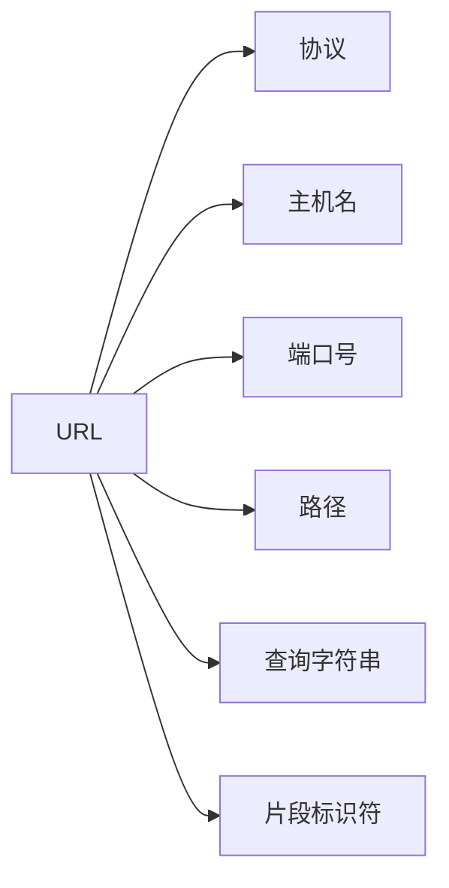

# Java URL类

## 引言

在Java网络编程中，URL类是一个非常基础且重要的组件。URL（Uniform Resource Locator，统一资源定位符）是互联网上资源的地址，如网页、图片、视频等。Java中的`java.net.URL`类提供了一种简单方便的方式来处理URL，使我们能够轻松地定位和访问互联网资源。

本文将全面介绍Java URL类的基本概念、构造方法、主要方法以及实际应用场景，帮助你掌握如何在Java程序中有效地处理网络资源。

## URL基础

### 什么是URL？

URL代表统一资源定位符，是用于标识互联网上资源的字符串。一个完整的URL通常包含以下部分：



例如，在URL `https://www.example.com:443/path/to/resource?param=value#section`中：
- 协议：`https`
- 主机名：`www.example.com`
- 端口号：`443`
- 路径：`/path/to/resource`
- 查询字符串：`param=value`
- 片段标识符：`section`

### Java URL类的位置

`URL`类位于`java.net`包中，使用前需要导入：

```java
import java.net.URL;
```

## 创建URL对象

Java URL类提供了多种构造方法来创建URL对象。

### 基本构造方法

```java
// 完整URL字符串
URL url1 = new URL("https://www.example.com/index.html");

// 协议、主机、文件
URL url2 = new URL("https", "www.example.com", "/index.html");

// 协议、主机、端口、文件
URL url3 = new URL("https", "www.example.com", 8080, "/index.html");
```

### 相对URL构造

你也可以基于一个已存在的URL创建相对URL：

```java
URL baseURL = new URL("https://www.example.com/");
URL relativeURL = new URL(baseURL, "products/item.html");
// relativeURL将是: https://www.example.com/products/item.html
```

:::caution 注意
URL构造函数可能会抛出`MalformedURLException`异常，需要进行适当的异常处理。
:::

## URL类的主要方法

一旦创建了URL对象，你可以使用以下方法获取URL的各个组成部分或进行操作：

### 获取URL组成部分

```java
URL url = new URL("https://www.example.com:443/path/to/resource?param=value#section");

String protocol = url.getProtocol();  // 返回: "https"
String host = url.getHost();          // 返回: "www.example.com"
int port = url.getPort();             // 返回: 443
String path = url.getPath();          // 返回: "/path/to/resource"
String query = url.getQuery();        // 返回: "param=value"
String ref = url.getRef();            // 返回: "section"
String file = url.getFile();          // 返回: "/path/to/resource?param=value"
String authority = url.getAuthority();// 返回: "www.example.com:443"
```

### 打开连接

URL类提供了打开连接的方法，使你能够与URL指定的资源进行交互：

```java
URL url = new URL("https://www.example.com");

// 获取URLConnection对象
URLConnection connection = url.openConnection();

// 如果是HTTP连接，可以转换为HttpURLConnection以获取更多HTTP特定功能
if (connection instanceof HttpURLConnection) {
    HttpURLConnection httpConnection = (HttpURLConnection) connection;
    // 使用HttpURLConnection...
}
```

### 读取URL内容

URL类还提供了直接读取URL内容的方法：

```java
URL url = new URL("https://www.example.com");
InputStream in = url.openStream();
// 现在你可以从输入流中读取数据
```

## 完整代码示例

下面是一个完整的示例，展示了如何创建URL对象，分析其组成部分，并读取URL的内容：

```java
import java.io.BufferedReader;
import java.io.IOException;
import java.io.InputStreamReader;
import java.net.MalformedURLException;
import java.net.URL;

public class URLDemo {
    public static void main(String[] args) {
        try {
            // 创建URL对象
            URL url = new URL("https://www.example.com:443/index.html?param=value#section");
            
            // 分析URL
            System.out.println("协议：" + url.getProtocol());
            System.out.println("主机名：" + url.getHost());
            System.out.println("端口号：" + url.getPort());
            System.out.println("路径：" + url.getPath());
            System.out.println("查询字符串：" + url.getQuery());
            System.out.println("片段标识符：" + url.getRef());
            
            // 读取URL内容
            System.out.println("\nURL内容：");
            try (BufferedReader reader = new BufferedReader(new InputStreamReader(url.openStream()))) {
                String line;
                while ((line = reader.readLine()) != null) {
                    System.out.println(line);
                }
            }
            
        } catch (MalformedURLException e) {
            System.err.println("URL格式不正确: " + e.getMessage());
        } catch (IOException e) {
            System.err.println("I/O错误: " + e.getMessage());
        }
    }
}
```

**输出示例：**
```
协议：https
主机名：www.example.com
端口号：443
路径：/index.html
查询字符串：param=value
片段标识符：section

URL内容：
<!doctype html>
<html>
<head>
    <title>Example Domain</title>
    ...
</html>
```

:::note
实际输出将会是完整的HTML内容，这里为了简洁只显示了部分内容。
:::

## 实际应用场景

### 1. 网页内容爬取

URL类可用于创建简单的网页爬虫，读取和分析网页内容：

```java
public static void crawlWebpage(String urlString) {
    try {
        URL url = new URL(urlString);
        try (BufferedReader reader = new BufferedReader(new InputStreamReader(url.openStream()))) {
            String line;
            while ((line = reader.readLine()) != null) {
                // 处理每一行数据
                if (line.contains("<a href=")) {
                    // 提取链接并进一步处理
                }
            }
        }
    } catch (IOException e) {
        e.printStackTrace();
    }
}
```

### 2. 下载文件

URL类可以方便地用于下载文件：

```java
public static void downloadFile(String fileUrl, String savePath) {
    try {
        URL url = new URL(fileUrl);
        try (InputStream in = url.openStream();
             FileOutputStream out = new FileOutputStream(savePath)) {
            
            byte[] buffer = new byte[1024];
            int bytesRead;
            while ((bytesRead = in.read(buffer)) != -1) {
                out.write(buffer, 0, bytesRead);
            }
        }
        System.out.println("文件成功下载到: " + savePath);
    } catch (IOException e) {
        e.printStackTrace();
    }
}
```

### 3. 调用Web API

URL类可以用于调用REST API并获取JSON或XML响应：

```java
public static String callWebAPI(String apiUrl) {
    StringBuilder result = new StringBuilder();
    try {
        URL url = new URL(apiUrl);
        HttpURLConnection conn = (HttpURLConnection) url.openConnection();
        conn.setRequestMethod("GET");
        
        try (BufferedReader reader = new BufferedReader(
                new InputStreamReader(conn.getInputStream()))) {
            String line;
            while ((line = reader.readLine()) != null) {
                result.append(line);
            }
        }
    } catch (IOException e) {
        e.printStackTrace();
    }
    return result.toString();
}
```

## URL编码

当URL中包含空格或特殊字符时，需要进行URL编码。Java提供了`URLEncoder`和`URLDecoder`类来处理这种情况：

```java
import java.net.URLEncoder;
import java.net.URLDecoder;
import java.nio.charset.StandardCharsets;

// 编码
String original = "Hello World!";
String encoded = URLEncoder.encode(original, StandardCharsets.UTF_8.toString());
System.out.println(encoded);  // 输出: Hello+World%21

// 解码
String decoded = URLDecoder.decode(encoded, StandardCharsets.UTF_8.toString());
System.out.println(decoded);  // 输出: Hello World!
```

## 总结

Java URL类是处理互联网资源的强大工具，它允许我们：

1. 创建URL对象并解析URL的各个部分
2. 打开与URL资源的连接
3. 读取URL内容
4. 在实际应用中下载文件、爬取网页和调用API

掌握URL类的使用对于开发网络应用、Web服务客户端或任何需要与互联网资源交互的Java程序都是至关重要的基础知识。

## 练习

1. 编写一个程序，使用URL类获取某个网站的首页，并统计HTML标签的数量。
2. 创建一个简单的文件下载器，允许用户输入URL，然后将文件下载到指定位置。
3. 编写一个程序，使用URL类调用天气API（如OpenWeatherMap），获取并显示指定城市的当前天气。
4. 实现一个基本的链接检查器，检查网页上的链接是否有效。

## 附加资源

- Java官方文档: [URL Class](https://docs.oracle.com/javase/8/docs/api/java/net/URL.html)
- Java官方教程: [Working with URLs](https://docs.oracle.com/javase/tutorial/networking/urls/index.html)
- 更多关于HTTP连接的内容请参考: [HttpURLConnection Class](https://docs.oracle.com/javase/8/docs/api/java/net/HttpURLConnection.html)