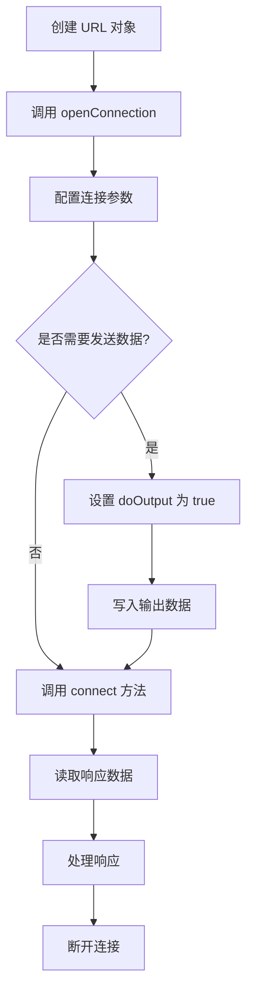

# Java URLConnection

在我们日益互联的数字世界中，网络编程已成为每位开发者必备的技能。Java 作为一种功能强大且跨平台的编程语言，提供了丰富的网络编程 API。其中，`URLConnection` 类是进行网络通信的基础组件之一，它允许我们与互联网上的资源进行交互。

## 什么是 URLConnection?

`URLConnection` 是 Java 标准库中的一个抽象类，位于 `java.net` 包中。它代表应用程序和 URL 之间的通信链接，可用于读取和写入网络资源（如网页、文件等）。

简单来说，`URLConnection` 使我们能够：
- 连接到网络资源
- 读取网页内容
- 发送数据到服务器
- 获取 HTTP 响应头信息
- 控制连接参数（如超时、缓存等）

:::note
`URLConnection` 是一个抽象类，其最常用的具体实现是 `HttpURLConnection`，专门用于 HTTP 协议的通信。
:::

## URLConnection 的基本用法

### 创建连接

使用 `URLConnection` 的第一步是创建一个连接对象：

```java
import java.net.URL;
import java.net.URLConnection;
import java.io.IOException;

public class BasicURLConnectionExample {
    public static void main(String[] args) {
        try {
            // 创建 URL 对象
            URL url = new URL("https://www.example.com");
            
            // 打开连接
            URLConnection connection = url.openConnection();
            
            System.out.println("连接已成功建立!");
            
        } catch (IOException e) {
            System.out.println("连接过程中发生错误: " + e.getMessage());
        }
    }
}
```

### 读取内容

一旦建立了连接，我们可以读取网页的内容：

```java
import java.net.URL;
import java.net.URLConnection;
import java.io.BufferedReader;
import java.io.InputStreamReader;
import java.io.IOException;

public class ReadWebpageExample {
    public static void main(String[] args) {
        try {
            // 创建 URL 对象并打开连接
            URL url = new URL("https://www.example.com");
            URLConnection connection = url.openConnection();
            
            // 获取输入流
            BufferedReader reader = new BufferedReader(
                new InputStreamReader(connection.getInputStream())
            );
            
            // 读取内容
            String line;
            StringBuilder content = new StringBuilder();
            while ((line = reader.readLine()) != null) {
                content.append(line).append("\n");
            }
            reader.close();
            
            // 显示结果
            System.out.println("网页内容:");
            System.out.println(content.toString());
            
        } catch (IOException e) {
            System.out.println("操作过程中发生错误: " + e.getMessage());
        }
    }
}
```

运行输出（示例）：
```
网页内容:
<!doctype html>
<html>
<head>
    <title>Example Domain</title>
    ...
</head>
<body>
    <div>
        <h1>Example Domain</h1>
        <p>This domain is for use in illustrative examples in documents...</p>
        ...
    </div>
</body>
</html>
```

## 设置连接参数

`URLConnection` 允许我们设置多种连接参数，如超时时间、头信息等：

```java
import java.net.URL;
import java.net.URLConnection;
import java.io.IOException;

public class ConnectionParametersExample {
    public static void main(String[] args) {
        try {
            URL url = new URL("https://www.example.com");
            URLConnection connection = url.openConnection();
            
            // 设置连接超时（毫秒）
            connection.setConnectTimeout(5000);
            
            // 设置读取超时（毫秒）
            connection.setReadTimeout(5000);
            
            // 设置请求属性（HTTP 头）
            connection.setRequestProperty("User-Agent", "Mozilla/5.0");
            connection.setRequestProperty("Accept-Language", "zh-CN,zh;q=0.9");
            
            // 建立连接
            connection.connect();
            
            System.out.println("连接已成功建立，并设置了自定义参数!");
            
        } catch (IOException e) {
            System.out.println("连接过程中发生错误: " + e.getMessage());
        }
    }
}
```

## HttpURLConnection：HTTP 专用连接

`HttpURLConnection` 是 `URLConnection` 的子类，专门用于处理 HTTP 请求：

```java
import java.net.URL;
import java.net.HttpURLConnection;
import java.io.BufferedReader;
import java.io.InputStreamReader;
import java.io.IOException;

public class HttpURLConnectionExample {
    public static void main(String[] args) {
        HttpURLConnection connection = null;
        try {
            URL url = new URL("https://www.example.com");
            connection = (HttpURLConnection) url.openConnection();
            
            // 设置请求方法
            connection.setRequestMethod("GET");
            
            // 获取响应码
            int responseCode = connection.getResponseCode();
            System.out.println("响应代码: " + responseCode);
            
            // 读取响应内容
            BufferedReader reader = new BufferedReader(
                new InputStreamReader(connection.getInputStream())
            );
            
            String line;
            StringBuilder response = new StringBuilder();
            while ((line = reader.readLine()) != null) {
                response.append(line);
            }
            reader.close();
            
            // 显示结果
            System.out.println("响应内容长度: " + response.length() + " 字符");
            
        } catch (IOException e) {
            System.out.println("连接过程中发生错误: " + e.getMessage());
        } finally {
            // 断开连接
            if (connection != null) {
                connection.disconnect();
            }
        }
    }
}
```

运行输出（示例）：
```
响应代码: 200
响应内容长度: 1256 字符
```

## 发送 POST 请求

使用 `HttpURLConnection` 发送 POST 请求需要设置输出流：

```java
import java.net.URL;
import java.net.HttpURLConnection;
import java.io.*;
import java.nio.charset.StandardCharsets;

public class PostRequestExample {
    public static void main(String[] args) {
        HttpURLConnection connection = null;
        try {
            URL url = new URL("https://httpbin.org/post");
            connection = (HttpURLConnection) url.openConnection();
            
            // 设置为 POST 方法
            connection.setRequestMethod("POST");
            
            // 允许输出
            connection.setDoOutput(true);
            
            // 设置内容类型
            connection.setRequestProperty("Content-Type", "application/x-www-form-urlencoded");
            
            // 准备发送的数据
            String postData = "name=张三&age=25&city=北京";
            
            // 获取输出流并写入数据
            try (OutputStream os = connection.getOutputStream();
                 OutputStreamWriter writer = new OutputStreamWriter(os, StandardCharsets.UTF_8)) {
                writer.write(postData);
                writer.flush();
            }
            
            // 获取响应码
            int responseCode = connection.getResponseCode();
            System.out.println("POST 请求响应码: " + responseCode);
            
            // 读取响应内容
            try (BufferedReader reader = new BufferedReader(
                    new InputStreamReader(connection.getInputStream()))) {
                String line;
                StringBuilder response = new StringBuilder();
                while ((line = reader.readLine()) != null) {
                    response.append(line);
                }
                
                // 显示响应内容
                System.out.println("服务器响应:\n" + response.toString());
            }
            
        } catch (IOException e) {
            System.out.println("发送 POST 请求时发生错误: " + e.getMessage());
        } finally {
            if (connection != null) {
                connection.disconnect();
            }
        }
    }
}
```

运行输出（示例）：
```
POST 请求响应码: 200
服务器响应:
{
  "args": {}, 
  "data": "", 
  "files": {}, 
  "form": {
    "age": "25", 
    "city": "北京", 
    "name": "张三"
  }, 
  "headers": {
    "Content-Length": "28", 
    "Content-Type": "application/x-www-form-urlencoded", 
    "Host": "httpbin.org", 
    "User-Agent": "Java/11"
  }, 
  "json": null, 
  "origin": "203.0.113.1", 
  "url": "https://httpbin.org/post"
}
```

## 下载文件示例

`URLConnection` 也可以用来下载文件：

```java
import java.io.*;
import java.net.URL;
import java.net.URLConnection;

public class FileDownloadExample {
    public static void main(String[] args) {
        try {
            // 要下载的文件 URL
            URL url = new URL("https://example.com/sample.pdf");
            
            // 打开连接
            URLConnection connection = url.openConnection();
            
            // 获取文件大小（如果服务器提供）
            int fileSize = connection.getContentLength();
            if (fileSize > 0) {
                System.out.println("文件大小: " + fileSize + " 字节");
            } else {
                System.out.println("文件大小未知");
            }
            
            // 设置下载路径
            String fileName = "downloaded_sample.pdf";
            
            // 创建输入流读取网络数据
            try (InputStream in = connection.getInputStream();
                 FileOutputStream out = new FileOutputStream(fileName)) {
                
                byte[] buffer = new byte[1024];
                int bytesRead;
                int totalBytesRead = 0;
                
                System.out.println("开始下载...");
                
                // 读取数据并写入文件
                while ((bytesRead = in.read(buffer)) != -1) {
                    out.write(buffer, 0, bytesRead);
                    totalBytesRead += bytesRead;
                    
                    // 显示下载进度
                    if (fileSize > 0) {
                        double progress = (double) totalBytesRead / fileSize * 100;
                        System.out.printf("已下载: %.2f%%\r", progress);
                    } else {
                        System.out.printf("已下载: %d 字节\r", totalBytesRead);
                    }
                }
                
                System.out.println("\n下载完成! 文件已保存为: " + fileName);
            }
            
        } catch (IOException e) {
            System.out.println("下载过程中发生错误: " + e.getMessage());
        }
    }
}
```

## 读取响应头

`URLConnection` 可以获取服务器返回的响应头信息：

```java
import java.net.URL;
import java.net.URLConnection;
import java.io.IOException;
import java.util.Date;
import java.util.List;
import java.util.Map;

public class ResponseHeadersExample {
    public static void main(String[] args) {
        try {
            URL url = new URL("https://www.example.com");
            URLConnection connection = url.openConnection();
            
            // 建立连接
            connection.connect();
            
            // 获取所有响应头
            Map<String, List<String>> headers = connection.getHeaderFields();
            System.out.println("响应头信息:");
            
            for (Map.Entry<String, List<String>> entry : headers.entrySet()) {
                String key = entry.getKey();
                List<String> values = entry.getValue();
                
                if (key == null) {
                    System.out.println("状态: " + values);
                } else {
                    System.out.println(key + ": " + values);
                }
            }
            
            // 获取特定的头信息
            System.out.println("\n特定头信息:");
            System.out.println("内容类型: " + connection.getContentType());
            System.out.println("内容长度: " + connection.getContentLength() + " 字节");
            System.out.println("最后修改时间: " + new Date(connection.getLastModified()));
            
        } catch (IOException e) {
            System.out.println("连接过程中发生错误: " + e.getMessage());
        }
    }
}
```

## 实际应用案例：简单天气 API 客户端

下面是一个实际应用案例，使用 `HttpURLConnection` 从公共 API 获取天气数据：

```java
import java.net.URL;
import java.net.HttpURLConnection;
import java.io.BufferedReader;
import java.io.InputStreamReader;
import java.io.IOException;

public class WeatherAPIExample {
    // 这里使用的是示例 API，实际使用时需要替换为有效的 API 和密钥
    private static final String API_URL = "https://api.openweathermap.org/data/2.5/weather";
    private static final String API_KEY = "your_api_key_here";
    
    public static void main(String[] args) {
        String city = "Beijing";
        try {
            // 构建 URL，注意 URL 编码
            String urlString = API_URL + "?q=" + city + "&appid=" + API_KEY + "&units=metric";
            URL url = new URL(urlString);
            
            // 打开连接
            HttpURLConnection connection = (HttpURLConnection) url.openConnection();
            connection.setRequestMethod("GET");
            
            // 获取响应码
            int responseCode = connection.getResponseCode();
            System.out.println("API 响应码: " + responseCode);
            
            if (responseCode == 200) {  // HTTP OK
                // 读取响应内容
                BufferedReader reader = new BufferedReader(
                    new InputStreamReader(connection.getInputStream())
                );
                
                String line;
                StringBuilder response = new StringBuilder();
                while ((line = reader.readLine()) != null) {
                    response.append(line);
                }
                reader.close();
                
                // 处理 JSON 响应（在实际应用中应使用 JSON 库解析）
                String jsonResponse = response.toString();
                System.out.println("天气数据 (JSON): " + jsonResponse);
                
                // 简单提取温度信息（仅用于演示，实际应用中应使用 JSON 库）
                if (jsonResponse.contains("\"temp\":")) {
                    int tempIndex = jsonResponse.indexOf("\"temp\":");
                    int commaIndex = jsonResponse.indexOf(",", tempIndex);
                    String tempStr = jsonResponse.substring(tempIndex + 7, commaIndex);
                    System.out.println("\n" + city + " 当前温度: " + tempStr + "°C");
                }
            } else {
                System.out.println("无法获取天气数据，响应码: " + responseCode);
            }
            
            // 断开连接
            connection.disconnect();
            
        } catch (IOException e) {
            System.out.println("获取天气数据时发生错误: " + e.getMessage());
        }
    }
}
```

:::caution
上述示例使用了 OpenWeatherMap API，实际使用时需要注册并获取有效的 API 密钥。出于安全考虑，API 密钥不应硬编码在源代码中，最好使用环境变量或配置文件存储。
:::

## 连接工作流程图

以下是 `URLConnection` 的典型工作流程：



## 小结

`URLConnection` 是 Java 网络编程的基础类，为我们提供了与网络资源交互的能力。通过本文，我们学习了：

1. 如何创建并配置 URLConnection
2. 如何读取网页内容
3. 如何发送 GET 和 POST 请求
4. 如何处理响应头和响应体
5. 如何下载文件
6. 实际应用中如何使用 URLConnection

虽然 `URLConnection` 是较早期的 API，但它简单易用，适合基础网络请求。对于更复杂的网络编程需求，可以考虑使用 `HttpClient`（Java 11+）或第三方库如 Apache HttpClient、OkHttp 等。

## 练习

1. 创建一个程序，从维基百科获取某个主题的页面，并提取页面的标题。
2. 编写一个程序，使用 POST 请求将表单数据发送到某个测试服务器（如 httpbin.org），并打印响应。
3. 开发一个简单的图片下载器，可以指定 URL 和本地保存路径。
4. 创建一个程序，检查多个网站是否可访问，并记录它们的响应时间。

## 更多资源

- [Java Documentation for URLConnection](https://docs.oracle.com/en/java/javase/11/docs/api/java.base/java/net/URLConnection.html)
- [Java Documentation for HttpURLConnection](https://docs.oracle.com/en/java/javase/11/docs/api/java.base/java/net/HttpURLConnection.html)
- [Java 11 HttpClient](https://openjdk.java.net/groups/net/httpclient/intro.html) - 现代化的 HTTP 客户端 API
- [MDN Web Docs: HTTP](https://developer.mozilla.org/en-US/docs/Web/HTTP) - HTTP 协议的详细文档

:::tip
虽然 `URLConnection` 对于学习网络编程基础很有用，但在实际生产环境中，考虑使用更现代的 API 如 Java 11 的 `HttpClient`，它提供了更好的性能和更多的功能。
:::