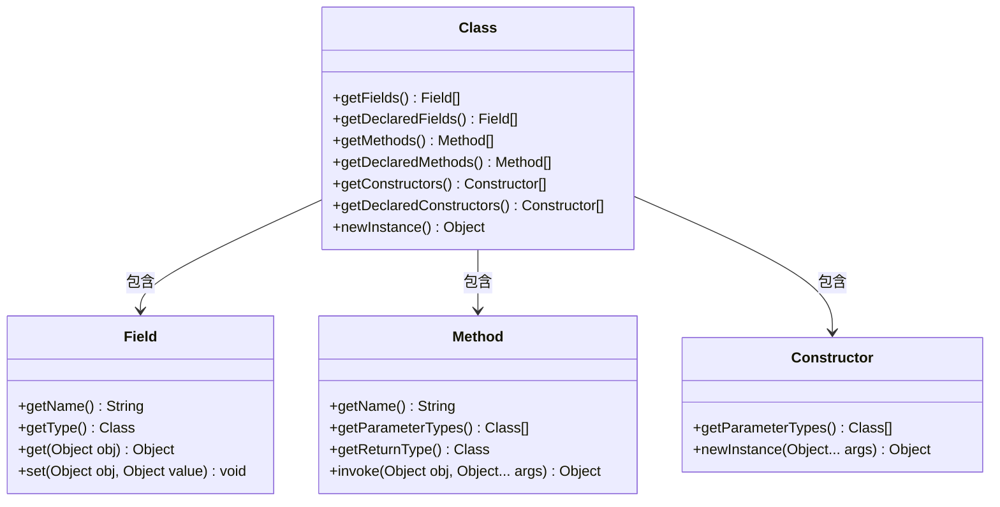

# Java 反射概述

## 什么是Java反射

在Java编程中，反射(Reflection)是一种强大的机制，它允许程序在运行时检查和操作类、接口、字段和方法。通过反射，你可以在运行时获取类的信息，创建对象，调用方法，以及访问和修改字段，而无需在编译时知道这些类的名称和结构。

简单来说，Java反射提供了一种"自省"能力，让程序能够"观察"并操作自身的结构和行为。

:::tip
反射是Java的高级特性之一，它赋予了Java程序极大的灵活性，但也需要谨慎使用，因为它可能会降低程序的性能并增加复杂性。
:::

## 反射的核心类

Java反射API主要位于`java.lang.reflect`包中，核心类包括：

1. `Class<?>` - 代表类和接口
2. `Field` - 代表类的成员变量
3. `Method` - 代表类的方法
4. `Constructor` - 代表类的构造方法
5. `Array` - 提供动态创建和访问数组的静态方法
6. `Modifier` - 提供访问修饰符信息的静态方法



## 获取Class对象的方式

在Java中，获取Class对象有三种主要方式：

```java
// 方式一：使用类名.class
Class<?> clazz1 = String.class;

// 方式二：使用对象.getClass()
String str = "Hello";
Class<?> clazz2 = str.getClass();

// 方式三：使用Class.forName(类的全限定名)
try {
    Class<?> clazz3 = Class.forName("java.lang.String");
} catch (ClassNotFoundException e) {
    e.printStackTrace();
}
```

:::caution
使用`Class.forName()`方法获取Class对象时可能会抛出`ClassNotFoundException`异常，需要进行异常处理。
:::

## 反射的基本操作

### 1. 创建对象

使用反射可以动态创建对象，有两种主要方式：

```java
try {
    // 方式一：使用Class对象的newInstance()方法（要求类有无参构造器）
    Class<?> clazz = Class.forName("java.util.ArrayList");
    ArrayList list1 = (ArrayList) clazz.newInstance(); // 已过时
    
    // 方式二：使用Constructor对象的newInstance()方法
    Constructor<?> constructor = clazz.getConstructor();
    ArrayList list2 = (ArrayList) constructor.newInstance();
    
    // 使用带参数的构造器
    Constructor<?> intConstructor = clazz.getConstructor(int.class);
    ArrayList list3 = (ArrayList) intConstructor.newInstance(20);
    
    System.out.println("list3的初始容量为20，当前大小：" + list3.size());
} catch (Exception e) {
    e.printStackTrace();
}
```

输出：
```
list3的初始容量为20，当前大小：0
```

### 2. 获取和调用方法

反射可以获取类的方法并调用它们：

```java
try {
    // 获取String类的Class对象
    Class<?> clazz = Class.forName("java.lang.String");
    
    // 创建String对象
    String str = "Hello World";
    
    // 获取toUpperCase方法
    Method toUpperCaseMethod = clazz.getMethod("toUpperCase");
    
    // 调用方法
    Object result = toUpperCaseMethod.invoke(str);
    System.out.println("原始字符串: " + str);
    System.out.println("转换结果: " + result);
    
    // 获取substring方法(带参数)
    Method substringMethod = clazz.getMethod("substring", int.class, int.class);
    
    // 调用带参数的方法
    Object subResult = substringMethod.invoke(str, 6, 11);
    System.out.println("截取结果: " + subResult);
} catch (Exception e) {
    e.printStackTrace();
}
```

输出：
```
原始字符串: Hello World
转换结果: HELLO WORLD
截取结果: World
```

### 3. 访问和修改字段

反射可以访问甚至修改类的字段，包括私有字段：

```java
class Person {
    private String name = "Default";
    private int age = 0;
    
    @Override
    public String toString() {
        return "Person [name=" + name + ", age=" + age + "]";
    }
}

// 在主方法中
try {
    // 创建Person对象
    Person person = new Person();
    System.out.println("修改前: " + person);
    
    // 获取Person类的Class对象
    Class<?> clazz = person.getClass();
    
    // 获取私有字段
    Field nameField = clazz.getDeclaredField("name");
    Field ageField = clazz.getDeclaredField("age");
    
    // 设置为可访问
    nameField.setAccessible(true);
    ageField.setAccessible(true);
    
    // 修改字段值
    nameField.set(person, "张三");
    ageField.set(person, 25);
    
    System.out.println("修改后: " + person);
} catch (Exception e) {
    e.printStackTrace();
}
```

输出：
```
修改前: Person [name=Default, age=0]
修改后: Person [name=张三, age=25]
```

:::warning
使用反射访问或修改私有字段，需要先调用`setAccessible(true)`来破除访问限制。这在某种程度上破坏了封装性，应当谨慎使用。
:::

## 反射的实际应用场景

### 1. 框架开发

Java反射是许多框架的核心机制，例如：

- **Spring框架**：通过反射实现依赖注入
- **Hibernate**：通过反射将数据库记录映射到Java对象
- **JUnit**：通过反射发现和运行测试方法

### 2. 动态代理

反射可以用来实现动态代理，为已有类动态创建代理对象：

```java
import java.lang.reflect.InvocationHandler;
import java.lang.reflect.Method;
import java.lang.reflect.Proxy;

// 定义接口
interface Calculator {
    int add(int a, int b);
    int subtract(int a, int b);
}

// 实现类
class CalculatorImpl implements Calculator {
    @Override
    public int add(int a, int b) {
        return a + b;
    }
    
    @Override
    public int subtract(int a, int b) {
        return a - b;
    }
}

// 调用处理器
class LogHandler implements InvocationHandler {
    private Object target;
    
    public LogHandler(Object target) {
        this.target = target;
    }
    
    @Override
    public Object invoke(Object proxy, Method method, Object[] args) throws Throwable {
        System.out.println("开始执行" + method.getName() + "方法");
        
        // 调用原方法
        Object result = method.invoke(target, args);
        
        System.out.println(method.getName() + "方法执行完毕，结果为：" + result);
        return result;
    }
}

// 在主方法中
Calculator calculator = new CalculatorImpl();
InvocationHandler handler = new LogHandler(calculator);

Calculator proxy = (Calculator) Proxy.newProxyInstance(
    calculator.getClass().getClassLoader(),
    calculator.getClass().getInterfaces(),
    handler
);

// 使用代理对象调用方法
int result1 = proxy.add(1, 2);
int result2 = proxy.subtract(5, 3);
```

输出：
```
开始执行add方法
add方法执行完毕，结果为：3
开始执行subtract方法
subtract方法执行完毕，结果为：2
```

### 3. 插件和扩展系统

反射可以用来实现插件系统，允许在运行时动态加载和执行插件代码：

```java
// 定义插件接口
interface Plugin {
    void execute();
}

// 在主程序中动态加载插件
try {
    // 假设插件类名存储在配置文件中
    String pluginClassName = "com.example.MyPlugin";
    
    // 使用反射加载插件类
    Class<?> pluginClass = Class.forName(pluginClassName);
    
    // 检查是否实现了插件接口
    if (Plugin.class.isAssignableFrom(pluginClass)) {
        Plugin plugin = (Plugin) pluginClass.newInstance();
        plugin.execute();
    }
} catch (Exception e) {
    e.printStackTrace();
}
```

### 4. 单元测试

JUnit等测试框架使用反射来发现和执行测试方法：

```java
// 一个简单的测试框架示例
class SimpleTestFramework {
    public void runTests(Class<?> testClass) {
        try {
            Object testInstance = testClass.newInstance();
            
            // 获取所有方法
            Method[] methods = testClass.getDeclaredMethods();
            
            for (Method method : methods) {
                // 检查方法是否有@Test注解
                if (method.isAnnotationPresent(Test.class)) {
                    try {
                        method.invoke(testInstance);
                        System.out.println(method.getName() + " - 测试通过");
                    } catch (Exception e) {
                        System.out.println(method.getName() + " - 测试失败: " + e.getCause().getMessage());
                    }
                }
            }
        } catch (Exception e) {
            e.printStackTrace();
        }
    }
}
```

## 反射的优缺点

### 优点

1. **灵活性**：能够在运行时动态检查、创建和操作对象
2. **可扩展性**：适用于需要动态加载组件的系统
3. **框架支持**：适合构建通用框架和库

### 缺点

1. **性能损失**：反射操作比直接代码调用要慢
2. **安全限制**：可能绕过访问控制检查，破坏封装性
3. **代码可读性**：反射代码通常比直接代码更难理解
4. **编译时类型检查**：失去了编译时类型检查，可能导致运行时异常

## 总结

Java反射是一种强大而灵活的机制，允许程序在运行时检查和操作类、接口、方法和字段。它是许多Java框架和库的基础，使得我们可以构建更加灵活和可扩展的应用程序。

反射主要通过`Class`、`Method`、`Field`和`Constructor`等类来操作，可以用来动态创建对象、调用方法和修改字段值，甚至能够访问私有成员。

尽管反射提供了极大的灵活性，但它也有一些缺点，如性能损失和安全风险。因此，在使用反射时，应当遵循"必要时使用"的原则，而不是将其作为常规编程的替代品。

## 练习题

1. 使用反射创建一个`ArrayList<String>`对象，并通过反射调用`add`方法添加三个字符串元素。
2. 编写一个方法，接受一个对象作为参数，打印出该对象所属类的所有公共方法名称。
3. 使用反射实现一个简单的序列化工具，将对象的属性值转换为JSON字符串。
4. 创建一个动态代理，为任何实现了`Comparable`接口的对象添加日志功能。

## 进一步学习资源

- Java官方文档：[The Reflection API](https://docs.oracle.com/javase/tutorial/reflect/index.html)
- 深入理解：《Thinking in Java》第19章 - 反射
- 实践应用：研究Spring框架中的反射使用方式

记住，反射是一把双刃剑，掌握好它可以让你的Java编程能力更上一层楼，但也请谨慎使用，避免不必要的性能损失和复杂性增加。