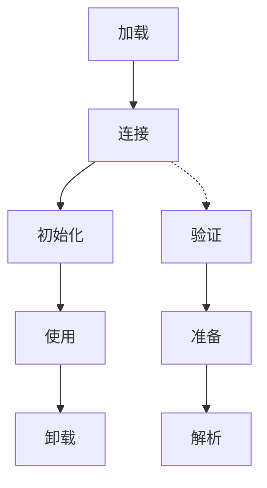

# Java Class类

## 什么是Class类

在Java中，`Class`类是反射机制的基础和入口点。每当我们定义一个新的类，Java虚拟机(JVM)就会创建一个`Class`对象来描述这个类的各种信息，包括类名、包名、构造方法、成员变量、成员方法等。`Class`类位于`java.lang`包中，是Java反射API的核心。

简单来说，`Class`类是用来描述Java类的元数据的类，也就是"类的类"。

:::tip
`Class`类的实例表示正在运行的Java应用程序中的类和接口。枚举类型是一种类，注解是一种接口。
:::

## 获取Class对象的方式

在Java中，有三种主要方法可以获取一个类的`Class`对象：

### 1. 使用类的全限定名

通过`Class.forName()`静态方法获取：

```java
try {
    Class<?> clazz = Class.forName("java.lang.String");
    System.out.println("类名: " + clazz.getName());
} catch (ClassNotFoundException e) {
    e.printStackTrace();
}
```

输出结果：
```
类名: java.lang.String
```

### 2. 通过类的实例获取

使用对象的`getClass()`方法：

```java
String str = "Hello";
Class<?> clazz = str.getClass();
System.out.println("类名: " + clazz.getName());
```

输出结果：
```
类名: java.lang.String
```

### 3. 通过类字面常量获取

使用`.class`语法（最简单、最安全）：

```java
Class<?> clazz = String.class;
System.out.println("类名: " + clazz.getName());
```

输出结果：
```
类名: java.lang.String
```

:::note
使用`.class`方式获取`Class`对象不会初始化该类，而`Class.forName()`会触发类的初始化。
:::

## Class类的常用方法

`Class`类提供了许多方法来获取类的信息：

### 获取类的基本信息

```java
Class<?> clazz = Student.class;

// 获取完整类名
System.out.println("完整类名: " + clazz.getName());

// 获取简单类名
System.out.println("简单类名: " + clazz.getSimpleName());

// 获取包名
System.out.println("包名: " + clazz.getPackage().getName());

// 判断是否为接口
System.out.println("是否为接口: " + clazz.isInterface());

// 判断是否为枚举
System.out.println("是否为枚举: " + clazz.isEnum());

// 获取父类
System.out.println("父类: " + clazz.getSuperclass().getName());
```

假设有一个`Student`类，输出结果可能是：
```
完整类名: com.example.Student
简单类名: Student
包名: com.example
是否为接口: false
是否为枚举: false
父类: java.lang.Object
```

### 获取构造方法

```java
Class<?> clazz = Student.class;
Constructor<?>[] constructors = clazz.getConstructors();

System.out.println("Student类的公有构造方法:");
for (Constructor<?> constructor : constructors) {
    System.out.println(constructor);
}

// 获取指定参数类型的构造方法
try {
    Constructor<?> constructor = clazz.getConstructor(String.class, int.class);
    System.out.println("获取到的构造方法: " + constructor);
} catch (NoSuchMethodException e) {
    e.printStackTrace();
}
```

### 获取成员变量

```java
Class<?> clazz = Student.class;

// 获取所有公有字段
Field[] publicFields = clazz.getFields();
System.out.println("公有字段个数: " + publicFields.length);

// 获取所有字段(包括私有、保护、默认和公有)
Field[] allFields = clazz.getDeclaredFields();
System.out.println("所有字段个数: " + allFields.length);

for (Field field : allFields) {
    System.out.println("字段名: " + field.getName() + ", 类型: " + field.getType().getSimpleName());
}
```

### 获取成员方法

```java
Class<?> clazz = Student.class;

// 获取所有公有方法(包括从父类继承的方法)
Method[] publicMethods = clazz.getMethods();
System.out.println("公有方法个数: " + publicMethods.length);

// 获取本类声明的所有方法(不包括继承的方法)
Method[] declaredMethods = clazz.getDeclaredMethods();
System.out.println("本类声明的方法个数: " + declaredMethods.length);

for (Method method : declaredMethods) {
    System.out.println("方法名: " + method.getName() + 
                      ", 返回类型: " + method.getReturnType().getSimpleName());
}
```

## 使用Class类创建对象

通过`Class`类，我们可以动态创建类的实例：

```java
try {
    Class<?> clazz = Class.forName("com.example.Student");
    
    // 使用无参构造方法创建对象
    Object obj1 = clazz.newInstance(); // 已过时
    
    // 推荐的方式:
    Object obj2 = clazz.getDeclaredConstructor().newInstance();
    
    // 使用带参构造方法创建对象
    Constructor<?> constructor = clazz.getConstructor(String.class, int.class);
    Object obj3 = constructor.newInstance("张三", 20);
    
    System.out.println(obj3);
} catch (Exception e) {
    e.printStackTrace();
}
```

:::caution
`Class.newInstance()`方法在Java 9中已被标记为过时，建议使用`getDeclaredConstructor().newInstance()`代替。
:::

## Class类在泛型中的应用

在Java泛型编程中，`Class`类经常用作类型令牌(Type Token)：

```java
public class GenericFactory<T> {
    private Class<T> type;
    
    public GenericFactory(Class<T> type) {
        this.type = type;
    }
    
    public T create() throws Exception {
        return type.getDeclaredConstructor().newInstance();
    }
}

// 使用示例
GenericFactory<String> factory = new GenericFactory<>(String.class);
String str = factory.create();
```

## 实际应用案例

### 案例一：简单的插件加载系统

假设我们正在开发一个应用，需要支持插件扩展。通过`Class`类，我们可以动态加载插件类：

```java
public interface Plugin {
    void execute();
}

// 实现类
public class LogPlugin implements Plugin {
    @Override
    public void execute() {
        System.out.println("执行日志插件");
    }
}

// 插件加载器
public class PluginLoader {
    public static Plugin loadPlugin(String className) {
        try {
            Class<?> clazz = Class.forName(className);
            
            // 检查是否实现了Plugin接口
            if (Plugin.class.isAssignableFrom(clazz)) {
                return (Plugin) clazz.getDeclaredConstructor().newInstance();
            } else {
                throw new IllegalArgumentException(className + " 不是一个有效的插件");
            }
        } catch (Exception e) {
            throw new RuntimeException("加载插件失败", e);
        }
    }
}

// 使用示例
Plugin plugin = PluginLoader.loadPlugin("com.example.LogPlugin");
plugin.execute(); // 输出: 执行日志插件
```

### 案例二：简易ORM框架实现

对象关系映射(ORM)框架大量依赖反射机制，下面是一个简化的例子：

```java
// 自定义表名注解
@Retention(RetentionPolicy.RUNTIME)
@interface Table {
    String name();
}

// 自定义字段注解
@Retention(RetentionPolicy.RUNTIME)
@interface Column {
    String name();
}

// 实体类示例
@Table(name="students")
public class Student {
    @Column(name="id")
    private Long id;
    
    @Column(name="name")
    private String name;
    
    @Column(name="age")
    private Integer age;
    
    // getters, setters...
}

// 简易ORM实现
public class SimpleORM {
    public String generateSelectSQL(Class<?> entityClass) {
        StringBuilder sql = new StringBuilder("SELECT ");
        
        // 获取表名
        String tableName;
        if (entityClass.isAnnotationPresent(Table.class)) {
            Table table = entityClass.getAnnotation(Table.class);
            tableName = table.name();
        } else {
            tableName = entityClass.getSimpleName().toLowerCase();
        }
        
        // 处理字段
        Field[] fields = entityClass.getDeclaredFields();
        for (int i = 0; i < fields.length; i++) {
            String columnName;
            
            if (fields[i].isAnnotationPresent(Column.class)) {
                Column column = fields[i].getAnnotation(Column.class);
                columnName = column.name();
            } else {
                columnName = fields[i].getName();
            }
            
            sql.append(columnName);
            if (i < fields.length - 1) {
                sql.append(", ");
            }
        }
        
        sql.append(" FROM ").append(tableName);
        return sql.toString();
    }
}

// 使用示例
SimpleORM orm = new SimpleORM();
String sql = orm.generateSelectSQL(Student.class);
System.out.println(sql);
// 输出: SELECT id, name, age FROM students
```

## Class类与类加载器的关系

`Class`对象是由类加载器创建的。Java的类加载过程如下：



在加载阶段，类加载器负责查找类的二进制数据，并创建表示该类的`Class`对象。不同的类加载器可以加载同名但不同的类：

```java
// 获取当前类的类加载器
ClassLoader loader = Student.class.getClassLoader();
System.out.println("类加载器: " + loader.getName());

// 获取类加载器的层级结构
ClassLoader parent = loader.getParent();
System.out.println("父加载器: " + (parent != null ? parent.getName() : "null"));
```

## 总结

`Class`类是Java反射API的基础，它允许我们在运行时检查和操作类的信息。通过`Class`类，我们可以：

1. 获取类的元数据信息（类名、包名、父类、实现的接口等）
2. 检查类的成员（字段、方法、构造函数）
3. 创建类的实例
4. 调用类的方法
5. 访问和修改字段的值

掌握`Class`类是学习Java反射机制的关键第一步，也是使用各种高级Java框架和库的基础。

## 练习

1. 编写一个程序，使用三种不同的方法获取`java.util.ArrayList`的`Class`对象，并打印其完整类名和简单类名。

2. 创建一个`Person`类，包含私有字段`name`和`age`，然后编写一个方法，通过反射创建`Person`对象并设置其字段值。

3. 编写一个方法，接收一个对象，然后使用反射打印这个对象所有字段的名称和值。

4. 实现一个简单的依赖注入容器，可以根据配置文件中指定的类名创建对象并自动注入依赖。

## 进一步学习资源

- Java官方文档: [Class](https://docs.oracle.com/en/java/javase/17/docs/api/java.base/java/lang/Class.html)
- 深入理解《Java虚拟机规范》中关于类加载的章节
- 研究Spring框架的源代码，了解它如何使用反射实现依赖注入
- 探索ORM框架如Hibernate, MyBatis是如何利用反射映射对象和数据库表的

通过深入学习`Class`类及其API，你将能够更好地理解Java反射机制，并在日常编程中灵活运用这一强大特性。