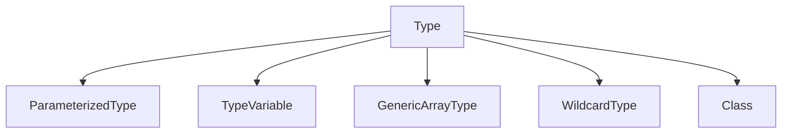

# Java 泛型反射

## 什么是泛型反射？

泛型反射是Java反射机制与泛型系统结合的高级特性。它允许我们在运行时检查和操作类、方法和字段的泛型类型信息。尽管Java泛型在编译后会被类型擦除，但泛型的类型信息仍然以元数据的形式保留在类文件中，可以通过反射API获取。

:::note
**类型擦除**：Java的泛型是通过类型擦除实现的，这意味着在运行时泛型类型会被替换为它们的边界（通常是Object）。这对反射操作带来了一定的挑战。
:::

## 泛型类型的表示

在Java反射API中，泛型类型通过`Type`接口及其扩展接口来表示：



- **`Type`接口**：所有类型的公共父接口
- **`ParameterizedType`**：表示参数化类型，如`List<String>`
- **`TypeVariable`**：表示类型变量，如`T`在`class MyClass<T>{}`中
- **`GenericArrayType`**：表示泛型数组类型，如`T[]`
- **`WildcardType`**：表示通配符类型，如`?`、`? extends Number`
- **`Class`**：表示普通类或原始类型

## 获取泛型信息的基本方法

### 1. 获取泛型类信息

```java
public class GenericExample<T, V extends Number> {
    private T t;
    private V v;
    private List<String> list;
    
    public static void main(String[] args) {
        // 获取类的泛型参数
        TypeVariable<?>[] typeParameters = GenericExample.class.getTypeParameters();
        for (TypeVariable<?> param : typeParameters) {
            System.out.println("参数名: " + param.getName());
            
            // 获取类型变量的边界（上界）
            Type[] bounds = param.getBounds();
            for (Type bound : bounds) {
                System.out.println("  边界: " + bound);
            }
        }
    }
}
```

输出：
```
参数名: T
  边界: class java.lang.Object
参数名: V
  边界: class java.lang.Number
```

### 2. 获取泛型字段信息

```java
public class GenericFieldExample {
    public static void main(String[] args) throws NoSuchFieldException {
        Field listField = GenericExample.class.getDeclaredField("list");
        Type fieldType = listField.getGenericType();
        
        if (fieldType instanceof ParameterizedType) {
            ParameterizedType paramType = (ParameterizedType) fieldType;
            System.out.println("原始类型: " + paramType.getRawType());
            
            Type[] arguments = paramType.getActualTypeArguments();
            for (Type arg : arguments) {
                System.out.println("类型参数: " + arg);
            }
        }
    }
}
```

输出：
```
原始类型: interface java.util.List
类型参数: class java.lang.String
```

### 3. 获取泛型方法信息

```java
public class GenericMethodExample {
    public <E extends Comparable<E>> E findMax(List<E> list) {
        // 方法实现
        return null;
    }
    
    public static void main(String[] args) throws NoSuchMethodException {
        Method method = GenericMethodExample.class.getMethod("findMax", List.class);
        
        // 获取方法的类型参数
        TypeVariable<?>[] typeParameters = method.getTypeParameters();
        for (TypeVariable<?> param : typeParameters) {
            System.out.println("方法类型参数: " + param.getName());
            
            // 获取类型变量的边界
            Type[] bounds = param.getBounds();
            for (Type bound : bounds) {
                System.out.println("  边界: " + bound);
            }
        }
        
        // 获取方法的返回类型
        Type returnType = method.getGenericReturnType();
        System.out.println("返回类型: " + returnType);
        
        // 获取方法的参数类型
        Type[] paramTypes = method.getGenericParameterTypes();
        for (Type paramType : paramTypes) {
            System.out.println("参数类型: " + paramType);
        }
    }
}
```

输出：
```
方法类型参数: E
  边界: interface java.lang.Comparable
返回类型: E
参数类型: java.util.List<E>
```

## 处理类型擦除问题

由于类型擦除，在运行时无法直接确定泛型实例的确切类型。但我们可以通过创建泛型类的子类或使用TypeToken技术保留泛型信息：

### 保留完整泛型信息的技巧

```java
public class TypeReferenceExample {
    // 创建匿名子类来捕获泛型类型
    static class TypeReference<T> {
        private final Type type;
        
        protected TypeReference() {
            // 获取当前匿名子类的父类泛型参数
            Type superClass = getClass().getGenericSuperclass();
            type = ((ParameterizedType) superClass).getActualTypeArguments()[0];
        }
        
        public Type getType() {
            return type;
        }
    }
    
    public static void main(String[] args) {
        // 使用匿名内部类捕获完整的泛型类型信息
        TypeReference<List<String>> typeRef = new TypeReference<List<String>>() {};
        Type type = typeRef.getType();
        
        System.out.println("捕获的泛型类型: " + type);
        
        if (type instanceof ParameterizedType) {
            ParameterizedType paramType = (ParameterizedType) type;
            System.out.println("原始类型: " + paramType.getRawType());
            System.out.println("类型参数: " + paramType.getActualTypeArguments()[0]);
        }
    }
}
```

输出：
```
捕获的泛型类型: java.util.List<java.lang.String>
原始类型: interface java.util.List
类型参数: class java.lang.String
```

## 实际应用案例

### 案例1：通用JSON序列化/反序列化

这个例子展示如何使用泛型反射创建一个通用的JSON转换器：

```java
public class JsonConverter {
    public <T> T fromJson(String json, TypeReference<T> typeRef) {
        Type type = typeRef.getType();
        // 根据完整泛型类型信息反序列化JSON
        // 实际实现会使用Jackson或Gson等库
        System.out.println("反序列化JSON为类型: " + type);
        return null; // 这里应当返回反序列化的对象
    }
    
    public static void main(String[] args) {
        JsonConverter converter = new JsonConverter();
        List<User> users = converter.fromJson("[{\"name\":\"Alice\"}]", 
                new TypeReference<List<User>>() {});
        
        // 使用Map<String, List<Integer>>等复杂泛型类型也可以正确处理
        Map<String, List<Integer>> complexData = converter.fromJson("{\"scores\":[90,85,92]}", 
                new TypeReference<Map<String, List<Integer>>>() {});
    }
    
    static class User {
        private String name;
        // getters, setters等省略
    }
}
```

### 案例2：泛型类型安全的工厂

使用泛型反射创建类型安全的对象工厂：

```java
public class GenericFactory {
    public <T> T createInstance(Class<T> clazz) throws Exception {
        return clazz.getDeclaredConstructor().newInstance();
    }
    
    public <T> List<T> createList(Class<T> elementType, int size) {
        List<T> result = new ArrayList<>(size);
        try {
            for (int i = 0; i < size; i++) {
                result.add(createInstance(elementType));
            }
        } catch (Exception e) {
            throw new RuntimeException("无法创建实例", e);
        }
        return result;
    }
    
    public static void main(String[] args) {
        GenericFactory factory = new GenericFactory();
        
        // 创建单个实例
        try {
            User user = factory.createInstance(User.class);
            System.out.println("创建了User实例");
        } catch (Exception e) {
            e.printStackTrace();
        }
        
        // 创建类型安全的列表
        List<User> users = factory.createList(User.class, 3);
        System.out.println("创建了包含" + users.size() + "个User的列表");
    }
    
    static class User {
        // 假设有无参构造函数
    }
}
```

### 案例3：实现依赖注入容器

一个简化版的依赖注入容器，利用泛型反射自动处理依赖关系：

```java
public class DIContainer {
    private Map<Class<?>, Object> instances = new HashMap<>();
    
    public <T> void register(Class<T> type, T instance) {
        instances.put(type, instance);
    }
    
    @SuppressWarnings("unchecked")
    public <T> T get(Class<T> type) throws Exception {
        // 如果已注册实例，直接返回
        if (instances.containsKey(type)) {
            return (T) instances.get(type);
        }
        
        // 否则创建新实例
        Constructor<T> constructor = type.getDeclaredConstructor();
        T instance = constructor.newInstance();
        
        // 查找标记了@Inject的字段
        for (Field field : type.getDeclaredFields()) {
            if (field.isAnnotationPresent(Inject.class)) {
                field.setAccessible(true);
                
                // 获取字段的泛型类型
                Type genericType = field.getGenericType();
                if (genericType instanceof ParameterizedType) {
                    // 处理泛型依赖，如List<User>
                    // 简化实现，实际容器会更复杂
                    System.out.println("注入泛型依赖: " + genericType);
                } else {
                    // 简单类型依赖
                    Class<?> fieldType = field.getType();
                    field.set(instance, get(fieldType)); // 递归解析依赖
                }
            }
        }
        
        instances.put(type, instance);
        return instance;
    }
    
    // 简单的注入注解
    @Retention(RetentionPolicy.RUNTIME)
    public @interface Inject {}
    
    public static void main(String[] args) throws Exception {
        DIContainer container = new DIContainer();
        container.register(MessageService.class, new MessageService());
        
        UserService userService = container.get(UserService.class);
        userService.sendMessage("Hello DI!");
    }
    
    static class MessageService {
        public void send(String message) {
            System.out.println("Sending: " + message);
        }
    }
    
    static class UserService {
        @Inject
        private MessageService messageService;
        
        public void sendMessage(String msg) {
            messageService.send(msg);
        }
    }
}
```

## 使用泛型反射时的注意事项

:::caution
1. **性能考虑**：反射操作比直接方法调用慢，特别是在高性能应用中应谨慎使用。
2. **泛型擦除**：记住Java的泛型是通过类型擦除实现的，因此在运行时无法直接获知某个对象的确切泛型类型。
3. **异常处理**：反射调用可能抛出多种异常，确保适当处理。
4. **可访问性**：可能需要使用`setAccessible(true)`来访问私有成员。
5. **兼容性**：在不同JDK版本中反射API可能有差异。
:::

## 总结

泛型反射是Java中一个强大但相对复杂的特性，它让我们能够在运行时检查和操作泛型类型信息。通过合理使用泛型反射，我们可以：

1. 获取和分析类、方法和字段的泛型类型信息
2. 创建通用且类型安全的框架和库
3. 实现高级功能如自动序列化、依赖注入等

尽管Java的类型擦除机制带来了一些限制，但通过本文介绍的技巧和模式，我们可以在很大程度上绕过这些限制，充分利用泛型和反射的强大能力。

## 练习

1. 创建一个泛型类`Container<T>`，并编写程序通过反射获取其泛型参数信息。
2. 实现一个简单的ORM框架，通过泛型反射将结果集映射到Java对象。
3. 尝试实现一个类似于Gson的`TypeToken`，用于捕获复杂嵌套泛型类型。
4. 创建一个泛型方法，接受`Class<T>`参数并返回`T`类型的实例，验证运行时类型安全。
5. 实现一个简单的依赖注入容器，支持注入泛型类型的依赖。

## 进阶阅读资源

- Java官方文档中的反射API和泛型部分
- 《Effective Java》中关于泛型和反射的章节
- Google Gson库的源代码，特别是`TypeToken`的实现
- Spring框架中的`ResolvableType`类，用于处理复杂泛型类型

通过深入学习泛型反射，你将能够更好地理解和利用Java高级特性，构建更灵活、更强大的应用程序。