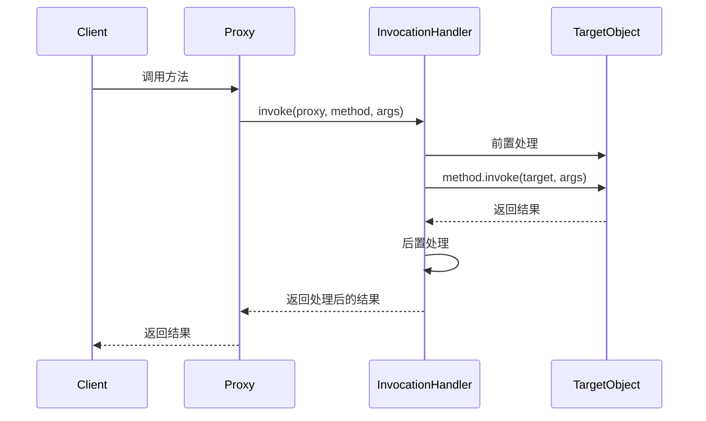

# Java 动态代理

## 什么是Java动态代理？

Java动态代理是反射机制的一个重要应用，它允许我们在运行时创建一个实现了指定接口的代理实例，而无需编写该类的具体实现代码。动态代理可以在方法调用前后添加额外的处理逻辑，使得我们能够以一种非常灵活的方式扩展或修改原有代码的行为。

:::tip
动态代理与静态代理的主要区别在于：静态代理在编译时就已经确定了代理类，而动态代理是在运行时动态生成的。
:::

## 动态代理的核心组件

Java动态代理主要涉及两个核心类/接口：

1. `java.lang.reflect.InvocationHandler`：调用处理器接口
2. `java.lang.reflect.Proxy`：代理类

### InvocationHandler接口

`InvocationHandler`是一个函数式接口，只定义了一个方法：

```java
public Object invoke(Object proxy, Method method, Object[] args) throws Throwable;
```

这个方法的参数说明：
- `proxy`: 生成的代理对象
- `method`: 被调用的方法
- `args`: 方法的参数数组

当我们通过代理对象调用任何方法时，这个调用都会被转发到`InvocationHandler`实现类的`invoke`方法中。

### Proxy类

`Proxy`类提供了创建动态代理实例的静态方法：

```java
public static Object newProxyInstance(ClassLoader loader, 
                                     Class<?>[] interfaces,
                                     InvocationHandler handler) 
```

参数说明：
- `loader`: 类加载器，用于加载代理类
- `interfaces`: 代理类需要实现的接口数组
- `handler`: 调用处理器，处理代理对象的方法调用

## 动态代理的基本使用

下面我们通过一个简单的例子来展示如何使用Java动态代理：

### 步骤1：定义接口

```java
public interface Calculator {
    int add(int a, int b);
    int subtract(int a, int b);
    int multiply(int a, int b);
    int divide(int a, int b);
}
```

### 步骤2：实现接口

```java
public class CalculatorImpl implements Calculator {
    @Override
    public int add(int a, int b) {
        return a + b;
    }

    @Override
    public int subtract(int a, int b) {
        return a - b;
    }

    @Override
    public int multiply(int a, int b) {
        return a * b;
    }

    @Override
    public int divide(int a, int b) {
        if (b == 0) {
            throw new ArithmeticException("除数不能为零");
        }
        return a / b;
    }
}
```

### 步骤3：创建调用处理器

```java
import java.lang.reflect.InvocationHandler;
import java.lang.reflect.Method;

public class CalculatorInvocationHandler implements InvocationHandler {
    // 被代理的对象
    private final Object target;

    public CalculatorInvocationHandler(Object target) {
        this.target = target;
    }

    @Override
    public Object invoke(Object proxy, Method method, Object[] args) throws Throwable {
        System.out.println("方法执行前: " + method.getName() + ", 参数: " + Arrays.toString(args));
        
        // 执行实际方法
        Object result = method.invoke(target, args);
        
        System.out.println("方法执行后: " + method.getName() + ", 结果: " + result);
        
        return result;
    }
}
```

### 步骤4：创建并使用代理

```java
import java.lang.reflect.Proxy;

public class ProxyDemo {
    public static void main(String[] args) {
        // 创建被代理对象
        Calculator calculator = new CalculatorImpl();
        
        // 创建调用处理器
        CalculatorInvocationHandler handler = new CalculatorInvocationHandler(calculator);
        
        // 创建代理对象
        Calculator proxy = (Calculator) Proxy.newProxyInstance(
            calculator.getClass().getClassLoader(),
            calculator.getClass().getInterfaces(),
            handler
        );
        
        // 通过代理对象调用方法
        int addResult = proxy.add(1, 2);
        System.out.println("最终结果: " + addResult);
        
        int divideResult = proxy.divide(10, 2);
        System.out.println("最终结果: " + divideResult);
    }
}
```

### 运行结果

```
方法执行前: add, 参数: [1, 2]
方法执行后: add, 结果: 3
最终结果: 3
方法执行前: divide, 参数: [10, 2]
方法执行后: divide, 结果: 5
最终结果: 5
```

## 动态代理的工作原理

动态代理的工作流程可以通过下面的图表来理解：



:::note
Java动态代理只能代理实现了接口的类，对于没有实现接口的类，需要使用CGLIB等其他库来实现动态代理。
:::

## 动态代理的应用场景

动态代理在Java中有很多实际应用：

1. **AOP（面向切面编程）**：Spring框架中大量使用动态代理实现AOP功能，如事务管理、安全控制等。
2. **远程方法调用（RMI）**：简化远程对象的访问流程。
3. **数据库连接池**：监控连接的使用情况并自动管理。
4. **日志记录**：自动为方法调用添加日志，而无需修改原始代码。
5. **性能监控**：统计方法执行时间，识别性能瓶颈。
6. **权限验证**：在方法执行前进行权限检查。

## 实际案例：实现简单的方法执行时间统计

以下是一个使用动态代理实现方法执行时间统计的实例：

### 定义接口和实现类

```java
// 服务接口
public interface UserService {
    void createUser(String name);
    String findUser(int id);
    void updateUser(int id, String name);
    boolean deleteUser(int id);
}

// 实现类
public class UserServiceImpl implements UserService {
    @Override
    public void createUser(String name) {
        System.out.println("创建用户: " + name);
        try {
            Thread.sleep(100); // 模拟操作耗时
        } catch (InterruptedException e) {
            e.printStackTrace();
        }
    }

    @Override
    public String findUser(int id) {
        System.out.println("查找用户，ID: " + id);
        try {
            Thread.sleep(150); // 模拟操作耗时
        } catch (InterruptedException e) {
            e.printStackTrace();
        }
        return "User_" + id;
    }

    @Override
    public void updateUser(int id, String name) {
        System.out.println("更新用户，ID: " + id + ", 新名称: " + name);
        try {
            Thread.sleep(200); // 模拟操作耗时
        } catch (InterruptedException e) {
            e.printStackTrace();
        }
    }

    @Override
    public boolean deleteUser(int id) {
        System.out.println("删除用户，ID: " + id);
        try {
            Thread.sleep(50); // 模拟操作耗时
        } catch (InterruptedException e) {
            e.printStackTrace();
        }
        return true;
    }
}
```

### 创建性能统计处理器

```java
import java.lang.reflect.InvocationHandler;
import java.lang.reflect.Method;
import java.util.HashMap;
import java.util.Map;

public class PerformanceHandler implements InvocationHandler {
    private final Object target;
    private final Map<String, Long> methodTimes = new HashMap<>();
    
    public PerformanceHandler(Object target) {
        this.target = target;
    }
    
    @Override
    public Object invoke(Object proxy, Method method, Object[] args) throws Throwable {
        String methodName = method.getName();
        long startTime = System.currentTimeMillis();
        
        Object result = method.invoke(target, args);
        
        long endTime = System.currentTimeMillis();
        long executionTime = endTime - startTime;
        
        // 累计统计方法执行时间
        methodTimes.put(methodName, 
            methodTimes.getOrDefault(methodName, 0L) + executionTime);
            
        System.out.printf("方法 %s 执行时间: %d ms%n", methodName, executionTime);
        
        return result;
    }
    
    // 打印所有方法的累计执行时间
    public void printStatistics() {
        System.out.println("\n===== 方法执行统计 =====");
        methodTimes.forEach((method, time) -> 
            System.out.printf("方法 %s 总执行时间: %d ms%n", method, time));
    }
}
```

### 使用代理进行性能监控

```java
import java.lang.reflect.Proxy;

public class PerformanceMonitorDemo {
    public static void main(String[] args) {
        // 创建目标对象
        UserService userService = new UserServiceImpl();
        
        // 创建处理器
        PerformanceHandler handler = new PerformanceHandler(userService);
        
        // 创建代理
        UserService proxy = (UserService) Proxy.newProxyInstance(
            userService.getClass().getClassLoader(),
            userService.getClass().getInterfaces(),
            handler
        );
        
        // 通过代理调用方法
        proxy.createUser("张三");
        proxy.findUser(101);
        proxy.updateUser(101, "张三丰");
        proxy.deleteUser(102);
        
        // 重复调用某些方法
        proxy.findUser(103);
        proxy.findUser(104);
        
        // 打印统计信息
        handler.printStatistics();
    }
}
```

### 运行结果

```
创建用户: 张三
方法 createUser 执行时间: 103 ms
查找用户，ID: 101
方法 findUser 执行时间: 152 ms
更新用户，ID: 101, 新名称: 张三丰
方法 updateUser 执行时间: 201 ms
删除用户，ID: 102
方法 deleteUser 执行时间: 51 ms
查找用户，ID: 103
方法 findUser 执行时间: 151 ms
查找用户，ID: 104
方法 findUser 执行时间: 150 ms

===== 方法执行统计 =====
方法 deleteUser 总执行时间: 51 ms
方法 createUser 总执行时间: 103 ms
方法 findUser 总执行时间: 453 ms
方法 updateUser 总执行时间: 201 ms
```

## 动态代理的局限性

虽然动态代理非常强大，但也存在一些局限性：

1. **只能代理接口**：Java的动态代理机制只能代理实现了接口的类，无法直接代理一个普通类。
2. **性能开销**：相比直接方法调用，动态代理会有一定的性能开销。
3. **复杂性**：在某些场景下，动态代理的引入可能会增加代码的复杂性。

:::warning
对于没有实现接口的类，Java的动态代理机制无法使用。此时可以考虑使用CGLIB库，它可以通过继承来实现代理。
:::

## 动态代理与CGLIB的比较

| 特性 | JDK动态代理 | CGLIB |
| --- | --- | --- |
| 代理目标 | 只能代理接口 | 可以代理普通类 |
| 实现原理 | 基于接口的代理 | 基于子类的代理（继承） |
| 速度 | 相对较快（JDK 8之后优化明显） | 首次生成代理类较慢，后续调用快 |
| 使用限制 | 目标类必须实现接口 | 不能代理final类和final方法 |
| 依赖 | JDK内置，无需额外依赖 | 需要导入CGLIB库 |

## 总结

Java动态代理是反射机制的一个强大应用，它允许我们在运行时动态创建代理对象，而无需事先编写代理类的代码。通过动态代理，我们可以在不修改原有代码的情况下，对方法的调用进行拦截并添加额外的逻辑，如日志记录、性能监控、事务控制等。

动态代理的关键组成部分是`InvocationHandler`接口和`Proxy`类。前者定义了代理对象的行为，后者负责创建代理实例。Java的动态代理仅适用于基于接口的代理，而对于没有实现接口的类，需要使用CGLIB等第三方库来实现。

动态代理在很多Java框架中都有广泛应用，了解和掌握动态代理对于深入理解Spring AOP、Hibernate等框架的工作原理非常有帮助。

## 练习题

1. 实现一个基于动态代理的简单缓存系统，对特定方法的调用结果进行缓存。
2. 使用动态代理实现方法调用的重试机制，当方法抛出特定异常时，自动重试一定次数。
3. 编写一个权限检查的动态代理，在执行方法前验证用户是否有权限。

## 进一步学习资源

- Java官方文档: [Dynamic Proxy Classes](https://docs.oracle.com/javase/8/docs/technotes/guides/reflection/proxy.html)
- Spring框架中AOP的实现原理
- CGLIB库的使用和原理
- 字节码操作技术，如ASM、Javassist等

通过对Java动态代理的学习，你已经迈向了Java高级开发的道路，这些知识将帮助你更好地理解和应用Java的反射机制，为构建灵活、可扩展的应用程序奠定基础。