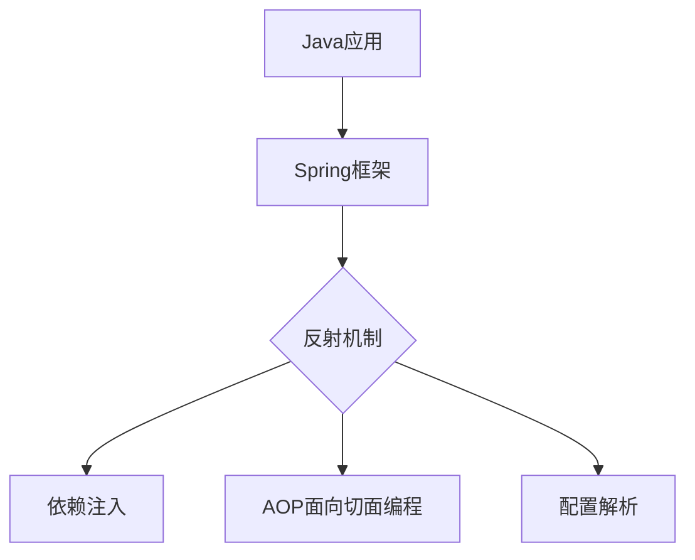

# Java 反射应用

## 反射机制概述

Java反射（Reflection）是Java语言的一个强大特性，它允许程序在运行时检查、操作类、接口、字段和方法，而无需在编译时知道它们的具体信息。通过反射，我们可以在运行时获取类的所有信息，并且可以操作这些信息，比如创建对象、调用方法、访问字段等。

:::tip 反射的核心能力
反射使Java具备了"自省"能力，让程序能够在运行时观察并修改自身的行为。
:::

## 反射API的主要组成部分

Java反射API主要包含在`java.lang.reflect`包中，其核心类有：

1. `Class<T>`：代表类和接口的类型信息
2. `Field`：代表类的字段
3. `Method`：代表类的方法
4. `Constructor`：代表类的构造方法
5. `Modifier`：提供静态方法和常量，用于解码类和成员访问修饰符

## 获取Class对象的方法

在使用反射前，首先需要获取`Class`对象，有三种主要方式：

```java
// 方法1：通过对象的getClass()方法
String str = "Hello";
Class<?> cls1 = str.getClass();

// 方法2：通过类的class属性
Class<?> cls2 = String.class;

// 方法3：通过Class.forName()方法
try {
    Class<?> cls3 = Class.forName("java.lang.String");
} catch (ClassNotFoundException e) {
    e.printStackTrace();
}
```

## 反射的基本应用

### 1. 检查类的信息

```java
public class ReflectionClassInfo {
    public static void main(String[] args) {
        try {
            Class<?> cls = Class.forName("java.util.ArrayList");
            
            // 获取完全限定类名
            System.out.println("类名: " + cls.getName());
            
            // 获取简单类名
            System.out.println("简单类名: " + cls.getSimpleName());
            
            // 获取包名
            System.out.println("包名: " + cls.getPackageName());
            
            // 获取父类
            System.out.println("父类: " + cls.getSuperclass().getName());
            
            // 获取实现的接口
            Class<?>[] interfaces = cls.getInterfaces();
            System.out.println("实现的接口:");
            for (Class<?> i : interfaces) {
                System.out.println("- " + i.getName());
            }
            
            // 获取修饰符
            int modifiers = cls.getModifiers();
            System.out.println("类修饰符: " + Modifier.toString(modifiers));
            
        } catch (ClassNotFoundException e) {
            e.printStackTrace();
        }
    }
}
```

输出结果：
```
类名: java.util.ArrayList
简单类名: ArrayList
包名: java.util
父类: java.util.AbstractList
实现的接口:
- java.util.List
- java.util.RandomAccess
- java.lang.Cloneable
- java.io.Serializable
类修饰符: public
```

### 2. 创建对象实例

反射提供了动态创建对象的能力，无需在编译时知道具体的类：

```java
public class ReflectionCreateInstance {
    public static void main(String[] args) {
        try {
            // 获取Class对象
            Class<?> cls = Class.forName("java.util.ArrayList");
            
            // 使用默认构造函数创建实例
            Object list1 = cls.getDeclaredConstructor().newInstance();
            System.out.println("创建的对象: " + list1);
            
            // 使用带参数的构造函数
            Class<?> clsWithCapacity = Class.forName("java.util.ArrayList");
            // 创建初始容量为20的ArrayList
            Object list2 = clsWithCapacity.getDeclaredConstructor(int.class).newInstance(20);
            System.out.println("带参数创建的对象: " + list2);
            
        } catch (Exception e) {
            e.printStackTrace();
        }
    }
}
```

输出结果：
```
创建的对象: []
带参数创建的对象: []
```

### 3. 访问和修改字段

通过反射可以访问类的所有字段，包括私有字段：

```java
public class ReflectionFieldAccess {
    public static void main(String[] args) {
        try {
            // 定义一个测试类
            class Person {
                public String name = "默认名字";
                private int age = 20;
                
                @Override
                public String toString() {
                    return "Person{name='" + name + "', age=" + age + "}";
                }
            }
            
            Person person = new Person();
            Class<?> cls = person.getClass();
            
            // 获取并修改公共字段
            Field nameField = cls.getDeclaredField("name");
            nameField.set(person, "张三");
            
            // 获取并修改私有字段
            Field ageField = cls.getDeclaredField("age");
            ageField.setAccessible(true);  // 重要！使私有字段可访问
            ageField.set(person, 25);
            
            System.out.println("修改后的对象: " + person);
            
        } catch (Exception e) {
            e.printStackTrace();
        }
    }
}
```

输出结果：
```
修改后的对象: Person{name='张三', age=25}
```

:::caution 访问私有成员
当访问私有成员时，必须调用`setAccessible(true)`方法来绕过Java的访问控制检查。
:::

### 4. 调用方法

反射最常见的应用之一就是动态调用方法：

```java
public class ReflectionMethodInvoke {
    public static void main(String[] args) {
        try {
            // 获取String类的Class对象
            Class<?> cls = String.class;
            
            // 创建一个String实例
            String str = "Hello, Reflection!";
            
            // 获取并调用不带参数的方法
            Method lengthMethod = cls.getMethod("length");
            Object result1 = lengthMethod.invoke(str);
            System.out.println("字符串长度: " + result1);
            
            // 获取并调用带参数的方法
            Method substringMethod = cls.getMethod("substring", int.class, int.class);
            Object result2 = substringMethod.invoke(str, 7, 17);
            System.out.println("子字符串: " + result2);
            
            // 获取并调用私有方法
            class PrivateMethodDemo {
                private String secretMethod(String input) {
                    return "Secret: " + input;
                }
            }
            
            PrivateMethodDemo demo = new PrivateMethodDemo();
            Method secretMethod = demo.getClass().getDeclaredMethod("secretMethod", String.class);
            secretMethod.setAccessible(true);  // 使私有方法可访问
            Object result3 = secretMethod.invoke(demo, "测试私有方法");
            System.out.println("私有方法结果: " + result3);
            
        } catch (Exception e) {
            e.printStackTrace();
        }
    }
}
```

输出结果：
```
字符串长度: 18
子字符串: Reflection
私有方法结果: Secret: 测试私有方法
```

## 反射的高级应用

### 1. 注解处理

反射可以用来在运行时获取和处理注解：

```java
import java.lang.annotation.*;
import java.lang.reflect.*;

public class ReflectionAnnotationExample {
    // 创建一个自定义注解
    @Retention(RetentionPolicy.RUNTIME)
    @Target({ElementType.TYPE, ElementType.METHOD})
    public @interface MyAnnotation {
        String value() default "默认值";
        int count() default 0;
    }
    
    // 在类和方法上使用注解
    @MyAnnotation(value = "类注解", count = 10)
    public static class AnnotatedClass {
        
        @MyAnnotation(value = "方法注解", count = 5)
        public void annotatedMethod() {
            System.out.println("这是一个带注解的方法");
        }
    }
    
    public static void main(String[] args) {
        try {
            // 获取类上的注解
            Class<?> cls = AnnotatedClass.class;
            if (cls.isAnnotationPresent(MyAnnotation.class)) {
                MyAnnotation annotation = cls.getAnnotation(MyAnnotation.class);
                System.out.println("类上的注解值: " + annotation.value());
                System.out.println("类上的注解计数: " + annotation.count());
            }
            
            // 获取方法上的注解
            Method method = cls.getMethod("annotatedMethod");
            if (method.isAnnotationPresent(MyAnnotation.class)) {
                MyAnnotation annotation = method.getAnnotation(MyAnnotation.class);
                System.out.println("方法上的注解值: " + annotation.value());
                System.out.println("方法上的注解计数: " + annotation.count());
            }
            
        } catch (Exception e) {
            e.printStackTrace();
        }
    }
}
```

输出结果：
```
类上的注解值: 类注解
类上的注解计数: 10
方法上的注解值: 方法注解
方法上的注解计数: 5
```

### 2. 动态代理

Java反射API提供了`Proxy`类用于创建动态代理，这是实现面向切面编程(AOP)的基础：

```java
import java.lang.reflect.InvocationHandler;
import java.lang.reflect.Method;
import java.lang.reflect.Proxy;

public class ReflectionDynamicProxy {
    
    // 定义接口
    interface UserService {
        void addUser(String name);
        String getUserInfo(int id);
    }
    
    // 实现类
    static class UserServiceImpl implements UserService {
        @Override
        public void addUser(String name) {
            System.out.println("添加用户: " + name);
        }
        
        @Override
        public String getUserInfo(int id) {
            return "用户ID: " + id + ", 姓名: User" + id;
        }
    }
    
    // 创建InvocationHandler
    static class LoggingHandler implements InvocationHandler {
        private final Object target;
        
        public LoggingHandler(Object target) {
            this.target = target;
        }
        
        @Override
        public Object invoke(Object proxy, Method method, Object[] args) throws Throwable {
            System.out.println("开始调用方法: " + method.getName());
            long startTime = System.currentTimeMillis();
            
            // 调用实际方法
            Object result = method.invoke(target, args);
            
            long endTime = System.currentTimeMillis();
            System.out.println("方法: " + method.getName() + " 执行完成，耗时: " + (endTime - startTime) + "ms");
            
            return result;
        }
    }
    
    public static void main(String[] args) {
        // 创建实际服务对象
        UserService userService = new UserServiceImpl();
        
        // 创建代理
        UserService proxy = (UserService) Proxy.newProxyInstance(
            userService.getClass().getClassLoader(),
            userService.getClass().getInterfaces(),
            new LoggingHandler(userService)
        );
        
        // 通过代理调用方法
        proxy.addUser("张三");
        System.out.println("-----------------");
        String info = proxy.getUserInfo(123);
        System.out.println("获取的信息: " + info);
    }
}
```

输出结果：
```
开始调用方法: addUser
添加用户: 张三
方法: addUser 执行完成，耗时: 0ms
-----------------
开始调用方法: getUserInfo
方法: getUserInfo 执行完成，耗时: 0ms
获取的信息: 用户ID: 123, 姓名: User123
```

### 3. 编写通用型对象序列化工具

这是一个展示反射实际应用的例子，可以将任意对象序列化为简单的文本格式：

```java
import java.lang.reflect.Field;
import java.util.HashMap;
import java.util.Map;

public class ReflectionSerializer {
    
    public static void main(String[] args) {
        try {
            // 测试类
            class Person {
                public String name = "李四";
                private int age = 30;
                public boolean active = true;
            }
            
            Person person = new Person();
            
            // 序列化对象
            String serialized = serialize(person);
            System.out.println("序列化结果: " + serialized);
            
        } catch (Exception e) {
            e.printStackTrace();
        }
    }
    
    // 通用对象序列化方法
    public static String serialize(Object obj) throws IllegalAccessException {
        if (obj == null) return "null";
        
        Class<?> cls = obj.getClass();
        Map<String, String> fieldMap = new HashMap<>();
        
        // 获取所有字段（包括私有字段）
        for (Field field : cls.getDeclaredFields()) {
            field.setAccessible(true);
            String name = field.getName();
            Object value = field.get(obj);
            fieldMap.put(name, value == null ? "null" : value.toString());
        }
        
        // 构建序列化字符串
        StringBuilder sb = new StringBuilder();
        sb.append(cls.getName()).append("{");
        
        boolean first = true;
        for (Map.Entry<String, String> entry : fieldMap.entrySet()) {
            if (!first) {
                sb.append(",");
            }
            sb.append(entry.getKey()).append("=").append(entry.getValue());
            first = false;
        }
        
        sb.append("}");
        return sb.toString();
    }
}
```

输出结果：
```
序列化结果: ReflectionSerializer$1Person{name=李四,age=30,active=true}
```

## 反射在实际开发中的应用场景

### 1. 框架开发

许多Java框架如Spring、Hibernate等大量使用反射来实现其功能：



Spring框架通过反射来实现Bean的创建、依赖注入、AOP等核心功能。比如，当你用`@Autowired`注解一个字段时，Spring会通过反射查找并注入对应的Bean。

### 2. IDE开发工具

IDE如IntelliJ IDEA、Eclipse等在自动完成、代码分析、重构等功能中也使用反射来分析代码结构。

### 3. 单元测试框架

JUnit等测试框架使用反射来发现和执行测试方法：

```java
@Test
public void testSomething() {
    // 测试代码
}
```

JUnit通过反射找到所有带`@Test`注解的方法并执行它们。

### 4. ORM框架

对象关系映射框架如Hibernate、MyBatis等使用反射将数据库记录映射到Java对象。

### 5. 序列化与反序列化

JSON处理库如Jackson、Gson等使用反射来自动序列化和反序列化Java对象。

## 反射的性能考虑

尽管反射非常强大，但它也有性能开销：

1. **性能损失**：反射调用通常比直接方法调用慢，因为需要进行额外的类型检查和间接调用。
2. **安全检查**：反射可以绕过访问控制，需要额外的安全检查。
3. **编译时类型检查**：使用反射会失去Java的编译时类型检查。

:::warning 性能考量
反射应该在必要时使用，不应该成为常规编程的替代品。对于性能敏感的应用，应该谨慎使用反射。
:::

## 总结

Java反射是一种强大的语言特性，它允许程序在运行时获取类型信息并操作类、方法和字段。通过反射，我们可以实现：

1. 在运行时检查类、接口、方法和字段
2. 实例化对象和调用方法
3. 访问和修改字段（即使是私有的）
4. 处理注解
5. 实现动态代理

虽然反射有一定的性能开销，但它在框架开发、ORM工具、依赖注入容器和测试工具中的应用是不可或缺的。理解反射不仅能让你更好地使用这些框架，还能让你在需要时编写更加灵活、动态的代码。

## 练习与挑战

为了加深对反射的理解，尝试完成以下练习：

1. 编写一个方法，通过反射打印出任意对象的所有字段名和值。
2. 使用反射实现一个简单的依赖注入容器，能够自动为类注入所需的依赖。
3. 创建一个动态代理，为任何接口添加性能监控功能。
4. 实现一个简单的ORM框架，能够将数据库记录映射到Java对象。

## 附加资源

- Oracle官方文档：[Trail: The Reflection API](https://docs.oracle.com/javase/tutorial/reflect/)
- Java核心技术卷I
- 《Effective Java》(Joshua Bloch著)的第65条：谨慎使用反射

通过深入学习和实践Java反射，你将能够更加灵活地解决各种编程问题，同时也能更好地理解许多Java框架的内部工作原理。