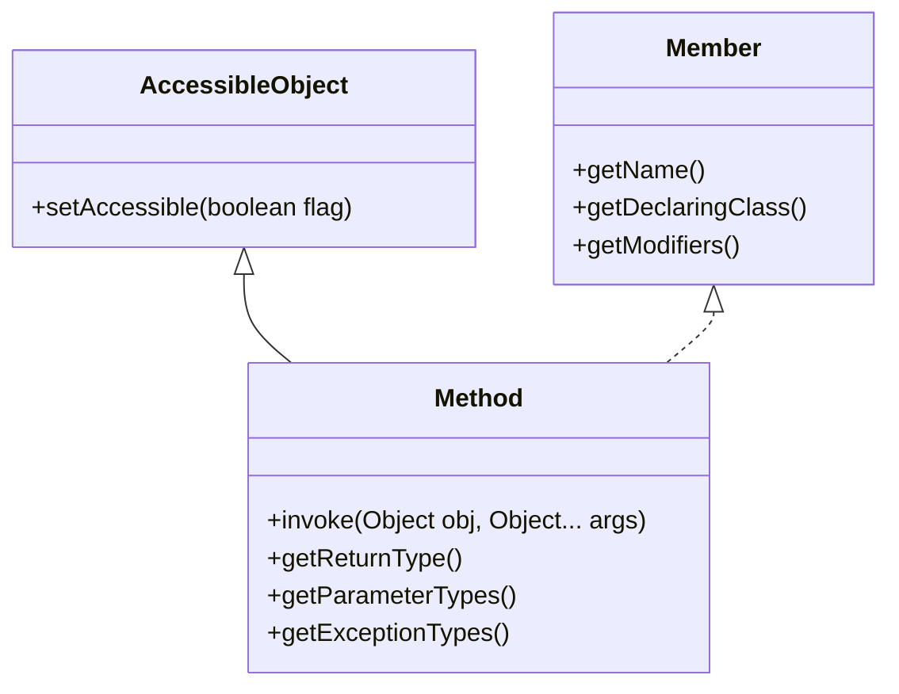

# Java Method类

## 什么是Method类

在Java反射机制中，`Method`类是`java.lang.reflect`包中的一个核心类，它提供了访问类或接口中方法的能力。通过`Method`对象，我们可以获取方法的各种信息（如方法名、返回类型、参数类型等），甚至可以在运行时动态调用这些方法。

`Method`类允许我们在不知道类具体实现的情况下，通过反射机制获取并调用类的方法，为Java程序提供了极大的灵活性。

## Method类的基本特性

`Method`类是`AccessibleObject`类的子类，同时实现了`Member`接口。这意味着`Method`对象不仅可以调整访问权限，还可以获取有关所表示方法的元数据信息。



## 获取Method对象

获取`Method`对象主要有以下几种方式：

### 1. 通过Class对象获取

```java
// 获取指定名称和参数类型的方法
Method method = clazz.getMethod(String name, Class<?>... parameterTypes);

// 获取声明的指定名称和参数类型的方法（包括私有方法）
Method method = clazz.getDeclaredMethod(String name, Class<?>... parameterTypes);

// 获取类中的所有公共方法（包括从超类继承的方法）
Method[] methods = clazz.getMethods();

// 获取类中声明的所有方法（不包括继承的方法）
Method[] declaredMethods = clazz.getDeclaredMethods();
```

### 示例

```java
public class MethodDemo {
    public static void main(String[] args) throws Exception {
        // 获取String类的Class对象
        Class<?> stringClass = String.class;
        
        // 获取charAt方法
        Method charAtMethod = stringClass.getMethod("charAt", int.class);
        System.out.println("方法名: " + charAtMethod.getName());
        System.out.println("返回类型: " + charAtMethod.getReturnType());
        
        // 获取String类的所有公共方法
        Method[] methods = stringClass.getMethods();
        System.out.println("String类的公共方法数量: " + methods.length);
    }
}
```

**输出：**
```
方法名: charAt
返回类型: char
String类的公共方法数量: 67
```

## Method类的常用方法

`Method`类提供了许多有用的方法，以下是一些常用的：

### 1. 基本信息获取

```java
// 获取方法名
String getName()

// 获取方法的修饰符（如public, private等）
int getModifiers()

// 获取方法的返回类型
Class<?> getReturnType()

// 获取方法的参数类型
Class<?>[] getParameterTypes()

// 获取方法可能抛出的异常类型
Class<?>[] getExceptionTypes()

// 获取声明此方法的类
Class<?> getDeclaringClass()
```

### 2. 方法调用

```java
// 调用方法
Object invoke(Object obj, Object... args)
```

### 示例：获取方法信息

```java
public class MethodInfoDemo {
    public static void main(String[] args) throws Exception {
        Class<?> clazz = String.class;
        Method method = clazz.getMethod("substring", int.class, int.class);
        
        System.out.println("方法名: " + method.getName());
        System.out.println("修饰符: " + Modifier.toString(method.getModifiers()));
        System.out.println("返回类型: " + method.getReturnType().getName());
        
        System.out.println("参数类型:");
        Class<?>[] paramTypes = method.getParameterTypes();
        for (Class<?> paramType : paramTypes) {
            System.out.println("  " + paramType.getName());
        }
        
        System.out.println("所属类: " + method.getDeclaringClass().getName());
    }
}
```

**输出：**
```
方法名: substring
修饰符: public
返回类型: java.lang.String
参数类型:
  int
  int
所属类: java.lang.String
```

## 使用Method.invoke()调用方法

`invoke()`方法是`Method`类最强大的特性之一，它允许我们动态调用方法。

### 语法

```java
Object result = method.invoke(objectInstance, arg1, arg2, ...);
```

- `objectInstance`：调用方法的对象实例（如果是静态方法则为null）
- `arg1, arg2, ...`：方法的参数

### 示例：调用实例方法

```java
public class InvokeDemo {
    public static void main(String[] args) throws Exception {
        // 创建String对象
        String str = "Hello Java Reflection";
        
        // 获取String类的substring方法
        Method substringMethod = String.class.getMethod("substring", int.class, int.class);
        
        // 调用substring方法
        Object result = substringMethod.invoke(str, 6, 10);
        
        System.out.println("Substring结果: " + result);
    }
}
```

**输出：**
```
Substring结果: Java
```

### 示例：调用静态方法

```java
public class StaticInvokeDemo {
    public static void main(String[] args) throws Exception {
        // 获取Math类的max方法
        Method maxMethod = Math.class.getMethod("max", int.class, int.class);
        
        // 调用静态方法max (注意第一个参数为null)
        Object result = maxMethod.invoke(null, 10, 20);
        
        System.out.println("Max值: " + result);
    }
}
```

**输出：**
```
Max值: 20
```

## 访问私有方法

默认情况下，反射不能访问私有方法，但我们可以通过`setAccessible(true)`来覆盖访问控制检查：

```java
public class PrivateMethodDemo {
    public static void main(String[] args) throws Exception {
        class PrivateExample {
            private String secretMethod(String input) {
                return "Secret: " + input;
            }
        }
        
        PrivateExample example = new PrivateExample();
        
        // 获取私有方法
        Method secretMethod = PrivateExample.class.getDeclaredMethod("secretMethod", String.class);
        
        // 设置可访问
        secretMethod.setAccessible(true);
        
        // 调用私有方法
        Object result = secretMethod.invoke(example, "Reflection is powerful");
        
        System.out.println(result);
    }
}
```

**输出：**
```
Secret: Reflection is powerful
```

:::caution
虽然可以通过反射访问私有方法，但这种做法可能会破坏封装性，使用时应当谨慎。
:::

## 实际应用场景

### 1. 插件和扩展系统

在插件架构中，可以使用反射动态加载和调用插件提供的方法，而无需在编译时知道具体的实现类。

```java
public class PluginSystem {
    public static void main(String[] args) throws Exception {
        // 假设我们动态加载了一个插件类
        Class<?> pluginClass = Class.forName("com.example.SomePlugin");
        
        // 创建插件实例
        Object pluginInstance = pluginClass.getDeclaredConstructor().newInstance();
        
        // 查找插件中的初始化方法
        Method initMethod = pluginClass.getMethod("initialize", String.class);
        
        // 调用初始化方法
        initMethod.invoke(pluginInstance, "插件配置数据");
    }
}
```

### 2. 框架开发

许多Java框架（如Spring、Hibernate等）大量使用反射来实现依赖注入、ORM映射等功能。

```java
public class SimpleInjector {
    public void injectDependencies(Object instance) throws Exception {
        Class<?> clazz = instance.getClass();
        
        // 查找所有标记为 @Autowired 的方法
        for (Method method : clazz.getDeclaredMethods()) {
            if (method.isAnnotationPresent(Autowired.class)) {
                // 确定需要注入的依赖类型
                Class<?>[] paramTypes = method.getParameterTypes();
                if (paramTypes.length == 1) {
                    // 创建依赖实例
                    Object dependency = createInstance(paramTypes[0]);
                    // 调用setter方法注入依赖
                    method.invoke(instance, dependency);
                }
            }
        }
    }
    
    private Object createInstance(Class<?> clazz) throws Exception {
        // 简化：这里只是创建一个新实例
        return clazz.getDeclaredConstructor().newInstance();
    }
}

@interface Autowired {}
```

### 3. 单元测试

在单元测试中，可以使用反射调用私有方法以便进行隔离测试。

```java
public class TestPrivateMethods {
    @Test
    public void testPrivateCalculation() throws Exception {
        Calculator calculator = new Calculator();
        
        // 获取私有方法
        Method privateCalc = Calculator.class.getDeclaredMethod("internalCalculate", 
                                                               double.class, double.class);
        privateCalc.setAccessible(true);
        
        // 调用私有方法进行测试
        double result = (double) privateCalc.invoke(calculator, 10.5, 20.3);
        
        assertEquals(30.8, result, 0.001);
    }
}
```

## 性能考虑

反射调用比直接方法调用慢，主要原因有：

1. 需要进行类型检查和转换
2. 可能需要进行访问权限检查
3. 无法被JIT编译器内联优化

如果性能是关键考虑因素，应避免在频繁执行的代码路径中使用反射调用。

## 总结

`Method`类是Java反射机制中的一个核心组件，它提供了运行时操作类方法的能力：

- 可以获取方法的各种元数据信息（名称、返回类型、参数等）
- 允许动态调用任何方法，包括私有方法（通过`setAccessible(true)`）
- 在框架开发、插件系统、测试等场景中有广泛应用

虽然反射提供了极大的灵活性，但也带来了性能开销和类型安全的风险，使用时需要权衡利弊。

## 练习

1. 编写一个程序，使用反射找出`String`类中所有以"to"开头的公共方法并打印它们的名称和参数类型。
2. 创建一个简单的命令行工具，它可以接受一个类名和方法名作为输入，然后打印出该方法的详细信息。
3. 实现一个简单的依赖注入容器，能够通过反射自动注入对象依赖。

## 进一步学习资源

- Java官方文档: [java.lang.reflect.Method](https://docs.oracle.com/javase/8/docs/api/java/lang/reflect/Method.html)
- 《Effective Java》第65条: 接口优于反射
- 《Java核心技术》卷I中关于反射的章节

通过熟练掌握`Method`类，你将能够编写更加灵活和动态的Java程序，特别是在框架和工具开发方面。