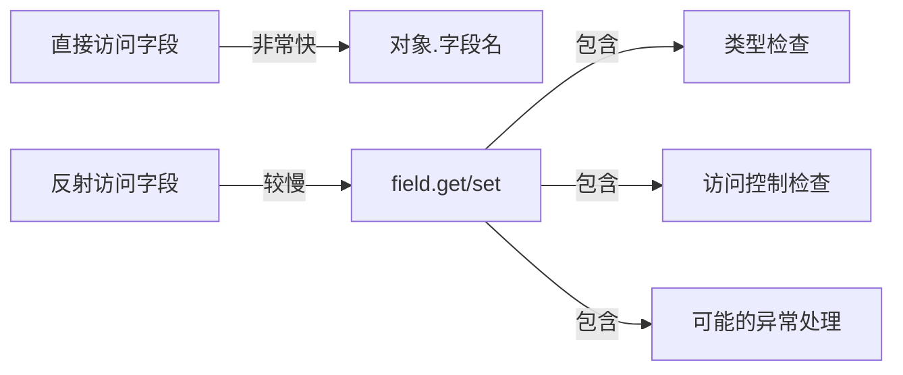

# Java 访问字段

在Java编程中，反射提供了一种强大的机制，允许我们在运行时检查和操作类、接口、字段和方法。本文将聚焦于如何通过Java反射API访问类的字段（成员变量），这是反射机制中的重要组成部分。

## 字段基础知识

在深入反射访问字段之前，让我们先了解Java中字段的基本概念：

- **字段**：类中定义的变量，用于存储对象状态
- **实例字段**：属于对象实例的字段，每个实例都有自己的副本
- **静态字段**：属于类本身的字段，所有实例共享一个副本

## 获取字段对象

在Java反射中，`Field`类表示类或接口的字段。要访问字段，我们首先需要获取它的`Field`对象。

### 获取公有字段

```java
public class FieldAccessExample {
    public static void main(String[] args) throws Exception {
        // 获取类对象
        Class<?> personClass = Person.class;
        
        // 获取公有字段
        Field nameField = personClass.getField("name");
        System.out.println("获取到公有字段: " + nameField.getName());
    }
}

class Person {
    public String name;
    private int age;
    protected boolean active;
    String address;
    
    public Person(String name, int age) {
        this.name = name;
        this.age = age;
    }
}
```

输出：
```
获取到公有字段: name
```

:::note
`getField(String name)`方法只能获取公有(public)字段，包括从父类继承的公有字段。
:::

### 获取任何字段

如果要获取私有字段、保护字段或默认访问权限的字段，需要使用`getDeclaredField(String name)`：

```java
// 获取声明的任何字段（无论访问修饰符）
Field ageField = personClass.getDeclaredField("age");
System.out.println("获取到私有字段: " + ageField.getName());
```

输出：
```
获取到私有字段: age
```

### 获取多个字段

```java
// 获取所有公有字段
Field[] publicFields = personClass.getFields();
System.out.println("公有字段列表:");
for (Field field : publicFields) {
    System.out.println("  " + field.getName());
}

// 获取所有声明的字段
Field[] declaredFields = personClass.getDeclaredFields();
System.out.println("所有声明的字段列表:");
for (Field field : declaredFields) {
    System.out.println("  " + field.getName() + " - 类型: " + field.getType());
}
```

输出：
```
公有字段列表:
  name
所有声明的字段列表:
  name - 类型: class java.lang.String
  age - 类型: int
  active - 类型: boolean
  address - 类型: class java.lang.String
```

## 访问字段值

获取到`Field`对象后，我们可以读取和修改字段的值。

### 读取字段值

```java
public class FieldValueExample {
    public static void main(String[] args) throws Exception {
        Person person = new Person("张三", 25);
        Class<?> personClass = person.getClass();
        
        // 读取公有字段值
        Field nameField = personClass.getField("name");
        Object nameValue = nameField.get(person);
        System.out.println("name字段值: " + nameValue);
        
        // 读取私有字段值
        Field ageField = personClass.getDeclaredField("age");
        ageField.setAccessible(true); // 重要!设置可访问
        Object ageValue = ageField.get(person);
        System.out.println("age字段值: " + ageValue);
    }
}
```

输出：
```
name字段值: 张三
age字段值: 25
```

:::caution
访问私有字段时，需要调用`setAccessible(true)`方法绕过Java语言的访问检查，否则会抛出`IllegalAccessException`异常。
:::

### 修改字段值

```java
// 修改字段值
nameField.set(person, "李四");
System.out.println("修改后的name: " + person.name);

ageField.setAccessible(true);
ageField.set(person, 30);
// 通过反射获取修改后的值
System.out.println("修改后的age: " + ageField.get(person));
```

输出：
```
修改后的name: 李四
修改后的age: 30
```

### 访问静态字段

对于静态字段，访问和修改方式略有不同：

```java
public class StaticFieldExample {
    public static void main(String[] args) throws Exception {
        Class<?> configClass = Config.class;
        
        // 获取静态字段
        Field maxUsersField = configClass.getField("MAX_USERS");
        
        // 读取静态字段值 - 注意参数为null
        Object maxUsers = maxUsersField.get(null);
        System.out.println("MAX_USERS静态字段值: " + maxUsers);
        
        // 修改静态字段值
        maxUsersField.set(null, 200);
        System.out.println("修改后的MAX_USERS: " + Config.MAX_USERS);
    }
}

class Config {
    public static int MAX_USERS = 100;
    private static String DB_URL = "jdbc:mysql://localhost:3306/mydb";
}
```

输出：
```
MAX_USERS静态字段值: 100
修改后的MAX_USERS: 200
```

:::tip
访问静态字段时，`get()`和`set()`方法的第一个参数可以传`null`，因为静态字段与类相关联，而不是与特定实例相关联。
:::

## 操作final字段

Java允许通过反射修改`final`字段，但这是违反语言规范的行为，应当谨慎使用：

```java
public class FinalFieldExample {
    public static void main(String[] args) throws Exception {
        Settings settings = new Settings();
        Class<?> settingsClass = settings.getClass();
        
        // 获取final字段
        Field timeoutField = settingsClass.getDeclaredField("TIMEOUT");
        timeoutField.setAccessible(true);
        
        // 读取final字段值
        System.out.println("初始TIMEOUT值: " + timeoutField.get(settings));
        
        // 修改final字段值 (不推荐这样做!)
        timeoutField.set(settings, 60);
        System.out.println("修改后的TIMEOUT值: " + timeoutField.get(settings));
    }
}

class Settings {
    public final int TIMEOUT = 30;
}
```

输出：
```
初始TIMEOUT值: 30
修改后的TIMEOUT值: 60
```

:::warning
虽然技术上可行，但修改`final`字段可能导致程序行为不可预测，一般情况下应当避免。
:::

## 获取字段的元数据

`Field`类不仅允许访问字段值，还提供了丰富的API来获取字段的元数据：

```java
public class FieldMetadataExample {
    public static void main(String[] args) throws Exception {
        Class<?> personClass = Person.class;
        Field ageField = personClass.getDeclaredField("age");
        
        // 获取字段名称
        String fieldName = ageField.getName();
        
        // 获取字段类型
        Class<?> fieldType = ageField.getType();
        
        // 获取字段的修饰符
        int modifiers = ageField.getModifiers();
        boolean isPrivate = Modifier.isPrivate(modifiers);
        boolean isFinal = Modifier.isFinal(modifiers);
        
        System.out.println("字段名称: " + fieldName);
        System.out.println("字段类型: " + fieldType.getName());
        System.out.println("是否私有: " + isPrivate);
        System.out.println("是否final: " + isFinal);
        
        // 获取字段上的注解
        boolean hasAnnotation = ageField.isAnnotationPresent(Deprecated.class);
        System.out.println("是否有@Deprecated注解: " + hasAnnotation);
    }
}
```

输出：
```
字段名称: age
字段类型: int
是否私有: true
是否final: false
是否有@Deprecated注解: false
```

## 实际应用案例

### 案例1：配置框架

许多配置框架使用反射来自动将配置文件的值映射到Java对象的字段中：

```java
public class ConfigLoader {
    public static void loadConfig(Object configObject, Properties props) throws Exception {
        Class<?> clazz = configObject.getClass();
        
        for (Field field : clazz.getDeclaredFields()) {
            String fieldName = field.getName();
            if (props.containsKey(fieldName)) {
                field.setAccessible(true);
                
                // 根据字段类型转换值
                Object value = convertValue(props.getProperty(fieldName), field.getType());
                field.set(configObject, value);
            }
        }
    }
    
    private static Object convertValue(String value, Class<?> targetType) {
        if (targetType == int.class || targetType == Integer.class) {
            return Integer.parseInt(value);
        } else if (targetType == boolean.class || targetType == Boolean.class) {
            return Boolean.parseBoolean(value);
        } else {
            return value; // 默认为字符串
        }
    }
    
    public static void main(String[] args) throws Exception {
        DatabaseConfig config = new DatabaseConfig();
        
        Properties props = new Properties();
        props.setProperty("url", "jdbc:mysql://localhost:3306/db");
        props.setProperty("username", "admin");
        props.setProperty("maxConnections", "50");
        
        loadConfig(config, props);
        
        System.out.println("加载后的配置:");
        System.out.println("URL: " + config.url);
        System.out.println("用户名: " + config.username);
        System.out.println("最大连接数: " + config.maxConnections);
    }
}

class DatabaseConfig {
    private String url;
    private String username;
    private int maxConnections;
    
    // 构造函数、getter和setter省略
}
```

输出：
```
加载后的配置:
URL: jdbc:mysql://localhost:3306/db
用户名: admin
最大连接数: 50
```

### 案例2：ORM框架

对象关系映射（ORM）框架如Hibernate使用反射将数据库记录映射到Java对象：

```java
public class SimpleORM {
    public static <T> T mapResultSetToObject(ResultSet rs, Class<T> clazz) throws Exception {
        // 创建对象实例
        T instance = clazz.getDeclaredConstructor().newInstance();
        
        // 获取ResultSet的元数据
        ResultSetMetaData metaData = rs.getMetaData();
        int columnCount = metaData.getColumnCount();
        
        // 遍历所有列
        for (int i = 1; i <= columnCount; i++) {
            String columnName = metaData.getColumnName(i);
            Object columnValue = rs.getObject(i);
            
            // 尝试找到匹配的字段
            try {
                Field field = clazz.getDeclaredField(columnName);
                field.setAccessible(true);
                
                // 设置字段值
                field.set(instance, columnValue);
            } catch (NoSuchFieldException e) {
                // 字段不存在，跳过
                continue;
            }
        }
        
        return instance;
    }
}

// 使用示例（伪代码，此处没有实际连接数据库）
// ResultSet rs = statement.executeQuery("SELECT id, name, age FROM users");
// if (rs.next()) {
//     User user = SimpleORM.mapResultSetToObject(rs, User.class);
// }
```

## 性能考虑

反射操作比直接的字段访问要慢，主要有以下几个原因：

1. 类型检查和转换发生在运行时
2. JVM不能对反射调用进行某些优化
3. 访问检查需要额外的处理时间



如果性能是关键因素，应限制反射使用于真正需要动态功能的地方。

## 最佳实践

使用反射访问字段时，请考虑以下最佳实践：

1. **缓存Field对象**：如果需要重复访问同一个字段，应该缓存Field对象而不是重复获取
2. **谨慎使用setAccessible**：仅在必要时打破封装
3. **处理异常**：反射操作可能抛出多种异常，确保适当处理
4. **尊重设计意图**：仅在适当的情况下访问私有字段
5. **考虑性能影响**：反射操作比直接访问慢，用于需要动态行为的场景

## 总结

通过Java反射API访问字段是一项强大的技术，让我们能够在运行时检查和修改对象的状态，即使它们的字段是私有的。这使得开发各种通用框架和工具成为可能，比如序列化库、ORM框架和依赖注入容器。

本文介绍了如何获取字段对象、访问和修改字段值、处理不同类型的字段（实例字段、静态字段、final字段）以及获取字段的元数据。我们还探讨了实际应用案例，并提供了一些最佳实践建议。

虽然反射功能强大，但也应谨慎使用，特别是在访问私有成员时，应尊重类的封装原则。

## 练习

1. 创建一个简单的类，包含不同访问修饰符的字段，并使用反射API打印所有字段的名称和类型。
2. 编写一个方法，使用反射复制一个对象的所有字段值到另一个同类型的对象。
3. 实现一个简单的JSON序列化器，使用反射将Java对象转换为JSON字符串。
4. 创建一个注解和处理器，允许通过字段注解自动验证字段值。

## 扩展资源

- Java官方文档：[java.lang.reflect包](https://docs.oracle.com/javase/8/docs/api/java/lang/reflect/package-summary.html)
- Java官方教程：[反射API](https://docs.oracle.com/javase/tutorial/reflect/index.html)
- 深入学习：《Java反射与注解编程》
- 在线工具：[Java反射可视化工具](https://www.cs.usfca.edu/~parrt/course/601/lectures/java.reflection.html)

通过掌握Java反射API访问字段的技术，你将能够开发更加灵活和强大的Java应用程序，并能理解许多现代Java框架的工作原理。