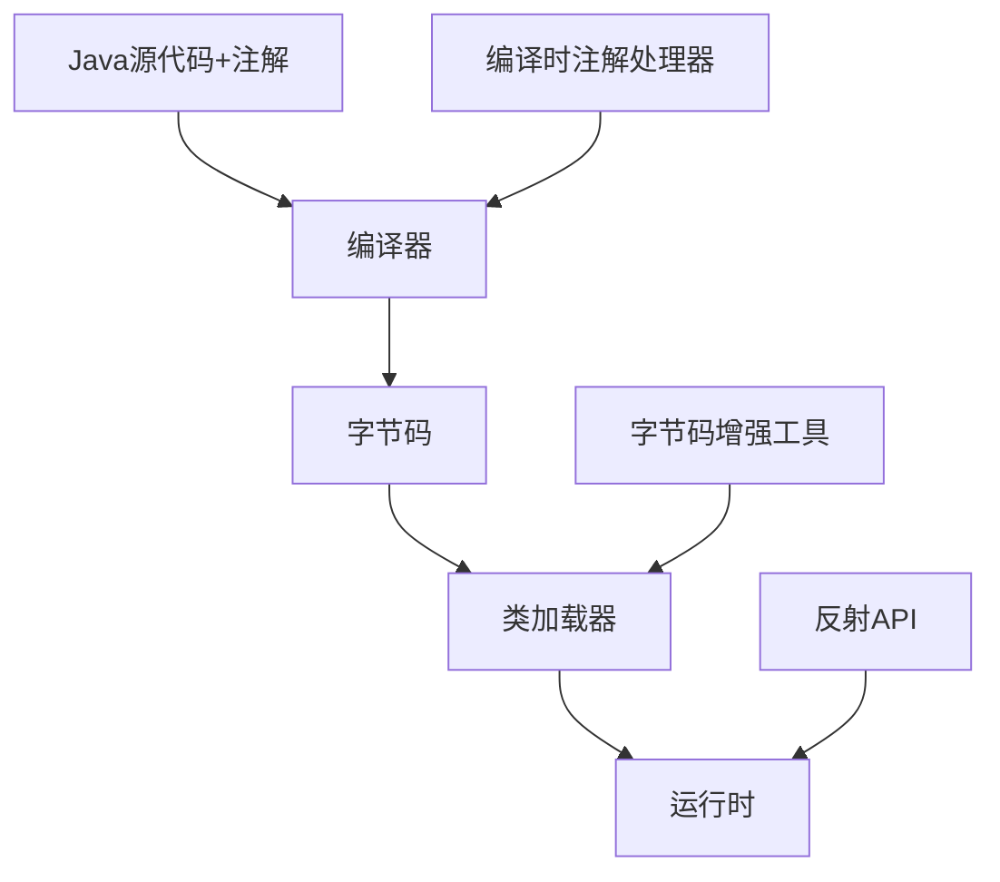

# Java 注解应用场景

## 什么是Java注解？

Java注解（Annotation）是JDK 5.0引入的一种特殊的"标记"，它可以被应用于包、类、方法、字段等多种程序元素上。注解本身不会改变程序的行为，但可以被其他程序（如编译器、开发工具或运行时环境）读取并处理，从而实现特定的功能。

注解的本质是一种特殊的接口，用 `@interface` 关键字定义。在Java中，注解是元数据（描述数据的数据）的一种形式，为我们提供了一种强大而灵活的方式来添加代码信息。

## Java 注解的基本应用场景

Java注解的应用范围非常广泛，以下是一些最常见的应用场景：

### 1. 编译检查

注解可以帮助编译器检测错误或抑制警告。

#### @Override 示例

```java
public class Animal {
    public void makeSound() {
        System.out.println("动物发出声音");
    }
}

public class Dog extends Animal {
    @Override
    public void makeSound() {
        System.out.println("汪汪汪");
    }
}
```

在这个例子中，`@Override` 注解告诉编译器 `makeSound()` 方法是重写父类的方法。如果方法签名不匹配（比如拼写错误），编译器会报错，从而避免了潜在的错误。

#### @SuppressWarnings 示例

```java
public class WarningExample {
    @SuppressWarnings("unchecked")
    public void suppressWarningMethod() {
        // 使用可能产生未检查转换警告的代码
        List list = new ArrayList();
        list.add("示例");
    }
}
```

`@SuppressWarnings` 注解用于抑制编译器产生的警告，使代码更加整洁。

### 2. 代码文档

Java注解可以为代码提供更丰富的文档信息。

#### @Deprecated 示例

```java
public class OldUtility {
    @Deprecated
    public static void oldMethod() {
        System.out.println("这是一个过时的方法");
    }
    
    public static void newMethod() {
        System.out.println("请使用这个新方法代替");
    }
}
```

`@Deprecated` 注解标记了不推荐使用的方法，IDE会以删除线标识过时的方法，提醒开发者使用替代方案。

### 3. 依赖注入

注解可以用于实现依赖注入，简化对象创建和管理。

#### Spring框架中的@Autowired示例

```java
@Service
public class UserService {
    private final UserRepository userRepository;
    
    @Autowired
    public UserService(UserRepository userRepository) {
        this.userRepository = userRepository;
    }
    
    public User findUser(Long id) {
        return userRepository.findById(id).orElse(null);
    }
}
```

在这个例子中，Spring框架通过`@Service`和`@Autowired`注解来创建和注入`UserService`和`UserRepository`对象，无需手动实例化。

### 4. 配置信息

注解可以用于提供配置信息，替代XML配置文件。

#### Spring Boot中的@Configuration示例

```java
@Configuration
public class DatabaseConfig {
    
    @Bean
    public DataSource dataSource() {
        BasicDataSource dataSource = new BasicDataSource();
        dataSource.setDriverClassName("com.mysql.cj.jdbc.Driver");
        dataSource.setUrl("jdbc:mysql://localhost:3306/mydb");
        dataSource.setUsername("root");
        dataSource.setPassword("password");
        return dataSource;
    }
    
    @Bean
    public JdbcTemplate jdbcTemplate(DataSource dataSource) {
        return new JdbcTemplate(dataSource);
    }
}
```

这个例子展示了如何使用`@Configuration`和`@Bean`注解配置数据源和JdbcTemplate，替代传统的XML配置方式。

## 高级应用场景

### 1. 自定义注解处理

我们可以创建自己的注解，并通过反射API在运行时处理它们。

#### 自定义日志注解示例

首先，定义注解：

```java
import java.lang.annotation.*;

@Retention(RetentionPolicy.RUNTIME)
@Target(ElementType.METHOD)
public @interface LogExecutionTime {
}
```

然后，创建处理这个注解的代码：

```java
import java.lang.reflect.Method;

public class LoggingAspect {
    public static void logMethodExecutionTime(Object object, String methodName, Object... args) throws Exception {
        Method method = object.getClass().getMethod(methodName, getParameterTypes(args));
        
        if (method.isAnnotationPresent(LogExecutionTime.class)) {
            long startTime = System.currentTimeMillis();
            
            // 执行方法
            method.invoke(object, args);
            
            long endTime = System.currentTimeMillis();
            System.out.println("方法 " + methodName + " 执行时间: " + (endTime - startTime) + " ms");
        } else {
            method.invoke(object, args);
        }
    }
    
    private static Class<?>[] getParameterTypes(Object[] args) {
        Class<?>[] types = new Class<?>[args.length];
        for (int i = 0; i < args.length; i++) {
            types[i] = args[i].getClass();
        }
        return types;
    }
}
```

使用这个注解：

```java
public class Calculator {
    @LogExecutionTime
    public int slowCalculation(int n) {
        try {
            Thread.sleep(1000); // 模拟耗时操作
        } catch (InterruptedException e) {
            e.printStackTrace();
        }
        return n * n;
    }
}

public class Main {
    public static void main(String[] args) throws Exception {
        Calculator calculator = new Calculator();
        LoggingAspect.logMethodExecutionTime(calculator, "slowCalculation", 5);
    }
}
```

运行结果：
```
方法 slowCalculation 执行时间: 1003 ms
```

这个例子展示了如何使用自定义注解来测量方法的执行时间，这在性能分析和调试中非常有用。

### 2. ORM框架中的应用

对象关系映射(ORM)框架如Hibernate和JPA大量使用注解来定义数据库映射关系。

#### JPA实体映射示例

```java
import javax.persistence.*;

@Entity
@Table(name = "users")
public class User {
    @Id
    @GeneratedValue(strategy = GenerationType.IDENTITY)
    private Long id;
    
    @Column(name = "username", nullable = false, unique = true)
    private String username;
    
    @Column(name = "email")
    private String email;
    
    @OneToMany(mappedBy = "user", cascade = CascadeType.ALL)
    private List<Order> orders;
    
    // Getters and setters
}
```

在这个例子中，JPA注解定义了类和数据库表之间的映射关系，简化了数据库操作代码。

### 3. 参数校验

Java Bean Validation API使用注解来声明校验规则。

#### 参数校验示例

```java
import javax.validation.constraints.*;

public class RegistrationForm {
    @NotBlank(message = "用户名不能为空")
    @Size(min = 3, max = 20, message = "用户名长度必须在3到20个字符之间")
    private String username;
    
    @NotBlank(message = "密码不能为空")
    @Size(min = 6, message = "密码长度不能少于6个字符")
    private String password;
    
    @Email(message = "邮箱格式不正确")
    @NotBlank(message = "邮箱不能为空")
    private String email;
    
    @Min(value = 18, message = "年龄必须大于或等于18")
    private int age;
    
    // Getters and setters
}
```

在Spring框架中，可以配合`@Valid`注解使用：

```java
@RestController
public class UserController {
    
    @PostMapping("/register")
    public ResponseEntity<String> register(@Valid @RequestBody RegistrationForm form) {
        // 如果参数校验失败，Spring会自动抛出异常，不会执行此方法
        // 处理注册逻辑
        return ResponseEntity.ok("注册成功");
    }
}
```

参数校验注解大大简化了输入验证逻辑，提高了代码的可读性和维护性。

### 4. 切面编程（AOP）

注解常用于定义切面编程中的切点，实现横切关注点的模块化。

#### Spring AOP示例

```java
import org.aspectj.lang.annotation.*;
import org.springframework.stereotype.Component;

@Aspect
@Component
public class LoggingAspect {
    
    @Before("@annotation(LogOperation)")
    public void logBefore(JoinPoint joinPoint) {
        String methodName = joinPoint.getSignature().getName();
        System.out.println("执行方法 " + methodName + " 之前的日志记录");
    }
    
    @AfterReturning(pointcut = "@annotation(LogOperation)", returning = "result")
    public void logAfterReturning(JoinPoint joinPoint, Object result) {
        String methodName = joinPoint.getSignature().getName();
        System.out.println("方法 " + methodName + " 执行完毕，返回结果: " + result);
    }
}

// 自定义注解
import java.lang.annotation.*;

@Retention(RetentionPolicy.RUNTIME)
@Target(ElementType.METHOD)
public @interface LogOperation {
    String description() default "";
}
```

使用这个注解：

```java
@Service
public class UserService {
    
    @LogOperation(description = "查询用户信息")
    public User getUserById(Long id) {
        // 查询用户逻辑
        return userRepository.findById(id).orElse(null);
    }
}
```

这个例子展示了如何使用注解定义AOP切点，实现日志记录等横切关注点的模块化处理。

## 实际应用案例分析

### 案例1：Spring Boot Web应用

Spring Boot大量使用注解来简化Web应用开发：

```java
@RestController
@RequestMapping("/api/users")
public class UserController {
    
    private final UserService userService;
    
    @Autowired
    public UserController(UserService userService) {
        this.userService = userService;
    }
    
    @GetMapping("/{id}")
    public ResponseEntity<User> getUserById(@PathVariable Long id) {
        User user = userService.getUserById(id);
        if (user != null) {
            return ResponseEntity.ok(user);
        } else {
            return ResponseEntity.notFound().build();
        }
    }
    
    @PostMapping
    public ResponseEntity<User> createUser(@Valid @RequestBody User user) {
        User createdUser = userService.createUser(user);
        return ResponseEntity.status(HttpStatus.CREATED).body(createdUser);
    }
}
```

在这个例子中，`@RestController`、`@RequestMapping`、`@GetMapping`、`@PostMapping`、`@PathVariable`、`@RequestBody`等注解共同构建了一个RESTful API，大大简化了传统的Spring MVC配置。

### 案例2：自定义权限控制框架

我们可以创建自定义注解来实现简单的权限控制系统：

首先，定义权限注解：

```java
import java.lang.annotation.*;

@Retention(RetentionPolicy.RUNTIME)
@Target(ElementType.METHOD)
public @interface RequirePermission {
    String value();
}
```

然后，实现权限检查的拦截器：

```java
@Component
@Aspect
public class PermissionAspect {
    
    @Autowired
    private SecurityService securityService;
    
    @Before("@annotation(requirePermission)")
    public void checkPermission(JoinPoint joinPoint, RequirePermission requirePermission) {
        String permission = requirePermission.value();
        
        if (!securityService.hasPermission(permission)) {
            throw new AccessDeniedException("用户没有 " + permission + " 权限");
        }
    }
}
```

使用这个注解：

```java
@Service
public class DocumentService {
    
    @RequirePermission("document:read")
    public Document getDocument(Long id) {
        // 获取文档的逻辑
        return documentRepository.findById(id).orElse(null);
    }
    
    @RequirePermission("document:write")
    public Document createDocument(Document document) {
        // 创建文档的逻辑
        return documentRepository.save(document);
    }
}
```

这个自定义权限控制系统通过注解声明式地定义了方法的权限要求，使权限检查与业务逻辑分离，提高了代码的可维护性。

## 注解处理的原理

Java注解的处理主要有三种方式：

### 1. 编译时处理

通过实现`javax.annotation.processing.AbstractProcessor`接口，创建注解处理器，在编译阶段处理注解。这种方式常用于代码生成、编译检查等场景。

```java
@SupportedAnnotationTypes("com.example.MyAnnotation")
@SupportedSourceVersion(SourceVersion.RELEASE_8)
public class MyAnnotationProcessor extends AbstractProcessor {
    
    @Override
    public boolean process(Set<? extends TypeElement> annotations, RoundEnvironment roundEnv) {
        for (TypeElement annotation : annotations) {
            Set<? extends Element> annotatedElements = roundEnv.getElementsAnnotatedWith(annotation);
            // 处理注解
        }
        return true;
    }
}
```

### 2. 运行时处理

通过Java反射API，在运行时读取和处理注解，这是最常见的注解处理方式。

```java
Method method = obj.getClass().getMethod("someMethod");
if (method.isAnnotationPresent(MyAnnotation.class)) {
    MyAnnotation annotation = method.getAnnotation(MyAnnotation.class);
    // 处理注解
}
```

### 3. 字节码增强

一些框架如Spring AOP、AspectJ使用字节码增强技术在类加载时修改类的行为，这通常与注解处理结合使用。



## 注意事项与最佳实践

在使用Java注解时，有几点需要注意：

:::caution
1. **性能考虑**：反射操作可能影响性能，在性能关键场景要慎重使用运行时注解处理。
2. **过度使用**：避免使用过多注解导致"魔法代码"，使代码难以理解和调试。
3. **文档完备**：自定义注解应提供清晰的文档，说明其用途和使用方式。
:::

最佳实践：

:::tip
1. 为自定义注解指定适当的`@Retention`和`@Target`，限制注解的使用范围。
2. 注解应该是描述性的，命名应清晰表达其功能。
3. 考虑使用编译时注解处理而非运行时处理，以提高性能。
4. 注解处理逻辑应当与业务逻辑分离，遵循单一职责原则。
:::

## 总结

Java注解是现代Java开发中不可或缺的一部分，它提供了一种声明式的编程方式，使代码更加简洁、易于理解和维护。注解的主要应用场景包括：

1. 编译检查（如`@Override`、`@SuppressWarnings`）
2. 代码文档（如`@Deprecated`、`@Author`）
3. 依赖注入（如Spring框架中的`@Autowired`）
4. 配置信息（如Spring Boot中的各种配置注解）
5. ORM框架中的数据库映射（如JPA的`@Entity`、`@Column`）
6. 参数校验（如Bean Validation中的`@NotNull`、`@Size`）
7. 切面编程（如Spring AOP中使用注解定义切点）

通过掌握Java注解的各种应用场景，开发者可以更好地利用这一强大特性，提高代码质量和开发效率。

## 练习与进阶学习

为了巩固所学知识，请尝试完成以下练习：

1. 创建一个自定义注解`@LogMethod`，并实现一个处理器，打印被注解方法的执行时间和参数。
2. 使用Spring Boot构建一个简单的REST API，充分利用Spring框架提供的各种注解。
3. 实现一个基于注解的简单缓存系统，使用`@Cacheable`注解标记需要缓存结果的方法。

进阶学习资源：

- [Java官方文档-注解](https://docs.oracle.com/javase/tutorial/java/annotations/)
- [Spring框架文档](https://spring.io/projects/spring-framework)
- [Java注解处理器API](https://docs.oracle.com/en/java/javase/11/docs/api/java.compiler/javax/annotation/processing/package-summary.html)

通过这些资源和练习，你将能够更全面地掌握Java注解的应用，并在实际项目中灵活运用这一强大功能。