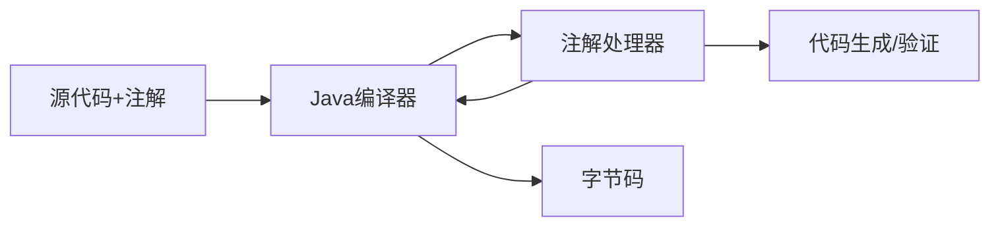

# Java 注解处理器

注解处理器是Java提供的一种强大工具，它允许我们在编译期对代码中的注解进行检查和处理。通过掌握注解处理器，你可以在编译时生成代码、验证代码规范，甚至可以实现一些类似于"编译时代码注入"的高级功能。本文将带你全面了解Java注解处理器的原理和实践。

## 什么是注解处理器？

注解处理器是一种在编译期间处理Java注解的工具。它运行在编译期而非运行时，这意味着它能在源代码被转换为字节码之前进行操作，可以用于：

- 代码生成：根据注解生成新的源文件
- 编译时验证：检查代码中的约束条件
- 文档生成：根据注解生成文档
- 构建元数据：为框架创建配置文件或其他元数据



## 注解处理器的工作流程

编译器编译包含注解的Java源文件时，会执行以下步骤：

1. 编译源代码，找到其中的注解
2. 查找对应的注解处理器
3. 运行注解处理器
4. 如果注解处理器生成了新的源文件，编译器会重新开始编译过程
5. 当没有新源文件生成时，编译过程结束

这种循环处理的方式使得注解处理器能够递归地生成和处理源代码。

## 创建自定义的注解处理器

创建一个注解处理器需要两个主要部分：

1. 定义注解
2. 实现注解处理器

### 第一步：定义注解

首先，我们需要定义一个注解。以下是一个简单的例子，该注解用于生成简单的工厂方法：

```java
package com.example.annotation;

import java.lang.annotation.ElementType;
import java.lang.annotation.Retention;
import java.lang.annotation.RetentionPolicy;
import java.lang.annotation.Target;

@Retention(RetentionPolicy.SOURCE) // 编译时注解
@Target(ElementType.TYPE) // 可以应用于类、接口等
public @interface Factory {
    String factoryName();
    Class<?> type();
}
```

这个`@Factory`注解可以应用于类，指定工厂名称和工厂创建的对象类型。

### 第二步：实现注解处理器

接下来，我们需要实现一个处理器来处理这个注解。注解处理器需要继承`javax.annotation.processing.AbstractProcessor`类：

```java
package com.example.processor;

import com.example.annotation.Factory;
import com.google.auto.service.AutoService;

import javax.annotation.processing.*;
import javax.lang.model.SourceVersion;
import javax.lang.model.element.Element;
import javax.lang.model.element.ElementKind;
import javax.lang.model.element.TypeElement;
import javax.tools.JavaFileObject;
import java.io.IOException;
import java.io.PrintWriter;
import java.util.*;

@SupportedAnnotationTypes("com.example.annotation.Factory")
@SupportedSourceVersion(SourceVersion.RELEASE_8)
@AutoService(Processor.class)
public class FactoryProcessor extends AbstractProcessor {

    @Override
    public boolean process(Set<? extends TypeElement> annotations, RoundEnvironment roundEnv) {
        // 遍历所有被@Factory注解的元素
        for (Element element : roundEnv.getElementsAnnotatedWith(Factory.class)) {
            // 检查元素类型是否为类
            if (element.getKind() != ElementKind.CLASS) {
                processingEnv.getMessager().printMessage(
                    javax.tools.Diagnostic.Kind.ERROR, 
                    "@Factory can only be applied to classes", 
                    element
                );
                return true;
            }

            // 获取注解信息
            TypeElement typeElement = (TypeElement) element;
            Factory factory = typeElement.getAnnotation(Factory.class);
            String factoryName = factory.factoryName();
            String qualifiedName = typeElement.getQualifiedName().toString();
            String packageName = qualifiedName.substring(0, qualifiedName.lastIndexOf('.'));
            String className = typeElement.getSimpleName().toString();
            
            // 生成工厂类
            try {
                generateFactoryClass(packageName, factoryName, className, qualifiedName, factory.type());
            } catch (IOException e) {
                processingEnv.getMessager().printMessage(
                    javax.tools.Diagnostic.Kind.ERROR, 
                    "Failed to generate factory class: " + e.getMessage(), 
                    element
                );
            }
        }
        return true;
    }

    private void generateFactoryClass(
            String packageName, 
            String factoryName, 
            String className,
            String qualifiedName, 
            Class<?> type) throws IOException {
        
        String factoryClassName = factoryName + "Factory";
        JavaFileObject builderFile = processingEnv.getFiler().createSourceFile(packageName + "." + factoryClassName);
        
        try (PrintWriter out = new PrintWriter(builderFile.openWriter())) {
            // 生成工厂类的代码
            out.println("package " + packageName + ";");
            out.println();
            out.println("public class " + factoryClassName + " {");
            out.println("    public static " + type.getName() + " create() {");
            out.println("        return new " + qualifiedName + "();");
            out.println("    }");
            out.println("}");
        }
    }
}
```

:::note
上述实现使用了Google的`AutoService`库，它通过注解处理器自动生成服务提供者配置文件，简化了注解处理器的注册过程。实际使用时，需要在项目中添加此依赖。
:::

### 使用示例

一旦我们定义了注解和实现了处理器，我们就可以在项目中使用它：

```java
package com.example.product;

import com.example.annotation.Factory;

@Factory(factoryName = "Coffee", type = Drink.class)
public class CoffeeImpl implements Drink {
    @Override
    public String getName() {
        return "Coffee";
    }
}
```

当编译这段代码时，注解处理器会生成一个新的类`CoffeeFactory`：

```java
package com.example.product;

public class CoffeeFactory {
    public static Drink create() {
        return new com.example.product.CoffeeImpl();
    }
}
```

然后我们可以在代码中使用这个生成的工厂类：

```java
Drink coffee = CoffeeFactory.create();
System.out.println(coffee.getName()); // 输出: Coffee
```

## 配置注解处理器

要使注解处理器在编译时生效，有以下几种方式：

### 方式一：使用服务提供者配置文件

1. 在`META-INF/services`目录下创建一个名为`javax.annotation.processing.Processor`的文件
2. 在文件中列出你的处理器类的全限定名

### 方式二：使用Google AutoService

使用`@AutoService(Processor.class)`注解你的处理器类（如上面的例子），再添加Google AutoService依赖：

```xml
<dependency>
    <groupId>com.google.auto.service</groupId>
    <artifactId>auto-service</artifactId>
    <version>1.0</version>
    <scope>provided</scope>
</dependency>
```

### 方式三：在编译时指定处理器

在命令行编译时使用`-processor`选项：

```bash
javac -processor com.example.processor.FactoryProcessor *.java
```

## 实际应用场景

注解处理器在现代Java开发中有广泛的应用，下面是几个常见案例：

### 1. Lombok

Lombok使用注解处理器在编译时生成getter、setter、构造函数等代码，减少了样板代码。

```java
import lombok.Data;

@Data
public class User {
    private String name;
    private int age;
    // 不需要手动编写getter、setter、equals、hashCode等方法
}
```

### 2. Dagger/Dagger2

这些依赖注入框架使用注解处理器在编译时生成依赖图，而不是在运行时使用反射，提高了性能。

```java
@Component(modules = AppModule.class)
public interface AppComponent {
    App app();
}
```

### 3. Room数据库

Android的Room持久化库使用注解处理器生成数据库访问代码：

```java
@Entity
public class User {
    @PrimaryKey
    public int id;
    
    public String name;
}

@Dao
public interface UserDao {
    @Query("SELECT * FROM user")
    List<User> getAll();
}
```

### 4. MapStruct

用于对象映射的库，它使用注解处理器生成不同对象之间的转换代码：

```java
@Mapper
public interface CarMapper {
    CarMapper INSTANCE = Mappers.getMapper(CarMapper.class);
    
    @Mapping(source = "numberOfSeats", target = "seatCount")
    CarDto carToCarDto(Car car);
}
```

## 注解处理器的限制

虽然注解处理器非常强大，但也有一些限制：

1. 它们不能修改现有的代码，只能生成新的文件
2. 它们在编译时运行，因此不能访问运行时信息
3. 调试注解处理器比调试普通代码更复杂
4. 学习曲线相对陡峭，需要理解Java编译器API

## 调试注解处理器

调试注解处理器可以使用以下方法：

1. 使用日志输出：通过`processingEnv.getMessager().printMessage()`打印调试信息
2. 在IDE中设置断点：大多数现代IDE支持对注解处理器进行调试
3. 输出生成的源文件：可以保存中间结果以便检查

## 总结

Java注解处理器是一个强大的元编程工具，它允许在编译时执行代码分析和代码生成。通过注解处理器，我们可以：

- 减少样板代码
- 在编译时进行代码验证
- 自动生成代码，提高开发效率
- 实现编译时的"依赖注入"和其他高级功能

虽然学习曲线较陡，但掌握注解处理器将极大地提升你的Java开发能力，特别是在开发框架和库时。

## 进一步学习资源

- [Java Annotation Processing API文档](https://docs.oracle.com/javase/8/docs/api/javax/annotation/processing/package-summary.html)
- Google的[auto](https://github.com/google/auto)项目，包含许多有用的注解处理器
- [Lombok项目](https://projectlombok.org/)，学习其如何使用注解处理器
- [JavaPoet库](https://github.com/square/javapoet)，简化Java代码生成

## 练习

1. 创建一个简单的`@ToString`注解处理器，为类自动生成toString方法
2. 实现一个`@Builder`注解处理器，为类生成构建器模式代码
3. 编写一个`@Validator`注解处理器，在编译时验证字段约束

通过这些练习，你将能够更深入地理解和应用Java注解处理器技术。

:::tip
注解处理器是高级Java特性，不要急于掌握所有细节。先理解基本概念，然后尝试简单的实例，逐步提高你的技能水平。
:::