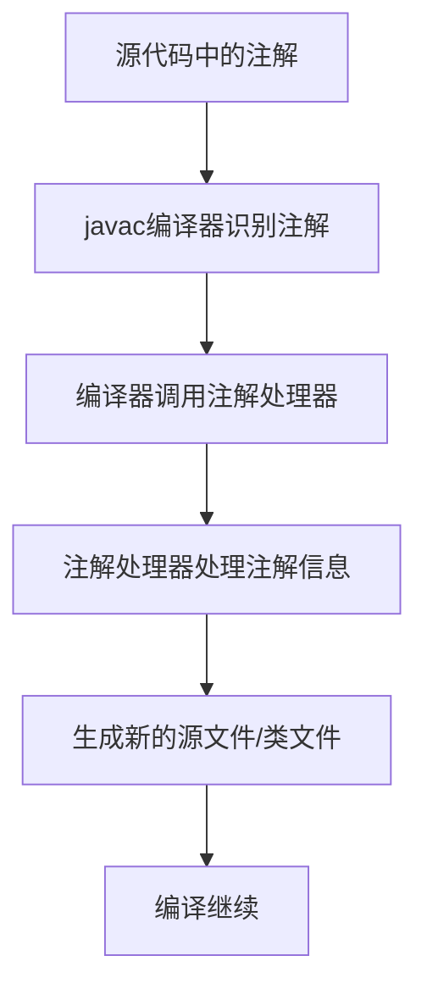

# Java 编译时注解

## 什么是编译时注解？

编译时注解是Java注解机制中的一种重要类型，它们在源代码编译阶段被处理，而不是在运行时。与运行时注解不同，编译时注解能够影响编译过程，生成新的源文件、修改已有的类文件，甚至可以报告编译错误和警告，从而在程序实际运行前就可以发现潜在问题。

:::note
Java注解处理主要分为三个阶段：源码阶段（SOURCE）、编译阶段（CLASS）和运行阶段（RUNTIME）。编译时注解对应的是CLASS阶段。
:::

## 编译时注解的基本原理

编译时注解的工作原理基于Java的注解处理器（Annotation Processor）机制。整个处理流程如下：



## 创建编译时注解

让我们通过一个简单的例子来学习如何创建和使用编译时注解：

### 步骤1：定义注解类型

```java
import java.lang.annotation.ElementType;
import java.lang.annotation.Retention;
import java.lang.annotation.RetentionPolicy;
import java.lang.annotation.Target;

@Retention(RetentionPolicy.CLASS) // 指定为编译时注解
@Target(ElementType.TYPE)         // 指定作用目标为类、接口、枚举
public @interface Generator {
    String className();
    String packageName();
}
```

在这个例子中，我们创建了一个名为`Generator`的编译时注解，它有两个属性：`className`和`packageName`。

:::tip
注意`@Retention(RetentionPolicy.CLASS)`的使用，这表明该注解信息会保留到编译后的类文件中，但不会在运行时被JVM读取。
:::

### 步骤2：创建注解处理器

```java
import javax.annotation.processing.*;
import javax.lang.model.SourceVersion;
import javax.lang.model.element.*;
import javax.lang.model.util.Elements;
import javax.tools.Diagnostic;
import javax.tools.JavaFileObject;
import java.io.IOException;
import java.io.PrintWriter;
import java.util.Set;

@SupportedAnnotationTypes("Generator")
@SupportedSourceVersion(SourceVersion.RELEASE_8)
public class GeneratorProcessor extends AbstractProcessor {
    
    @Override
    public boolean process(Set<? extends TypeElement> annotations, RoundEnvironment roundEnv) {
        // 获取所有被@Generator注解标记的元素
        for (Element element : roundEnv.getElementsAnnotatedWith(Generator.class)) {
            // 获取注解信息
            Generator generator = element.getAnnotation(Generator.class);
            String className = generator.className();
            String packageName = generator.packageName();
            
            try {
                // 创建新的Java文件
                JavaFileObject sourceFile = processingEnv.getFiler()
                    .createSourceFile(packageName + "." + className);
                
                try (PrintWriter writer = new PrintWriter(sourceFile.openWriter())) {
                    // 写入Java代码
                    writer.println("package " + packageName + ";");
                    writer.println("\npublic class " + className + " {");
                    writer.println("    public void greet() {");
                    writer.println("        System.out.println(\"Hello from generated class!\");");
                    writer.println("    }");
                    writer.println("}");
                }
                
                processingEnv.getMessager().printMessage(
                    Diagnostic.Kind.NOTE, 
                    "Generated " + className + " in package " + packageName
                );
                
            } catch (IOException e) {
                processingEnv.getMessager().printMessage(
                    Diagnostic.Kind.ERROR, 
                    "Error generating file: " + e.getMessage()
                );
            }
        }
        return true; // 表示这些注解已被处理，不应再传递给其他处理器
    }
}
```

这个处理器会扫描所有带有`@Generator`注解的类，并根据注解中提供的信息生成新的Java类文件。

### 步骤3：注册处理器

要让Java编译器能找到并使用你的注解处理器，需要创建一个特殊文件：

1. 在项目的`src/main/resources/META-INF/services`目录下创建一个名为`javax.annotation.processing.Processor`的文件
2. 在文件中写入你的处理器全限定名，如：`com.example.GeneratorProcessor`

### 步骤4：使用注解

现在，我们可以在代码中使用这个注解了：

```java
@Generator(className = "GreetingHelper", packageName = "com.example.generated")
public class MyClass {
    public static void main(String[] args) {
        // 在编译时，注解处理器会生成GreetingHelper类
        // 可以通过反射或直接导入使用
        try {
            Class<?> helperClass = Class.forName("com.example.generated.GreetingHelper");
            Object instance = helperClass.newInstance();
            helperClass.getMethod("greet").invoke(instance);
        } catch (Exception e) {
            e.printStackTrace();
        }
    }
}
```

当这段代码编译时，`GeneratorProcessor`会生成一个新的类`com.example.generated.GreetingHelper`。

## 编译时注解的实际应用

编译时注解在实际开发中有许多强大的应用场景：

### 1. 代码生成

像我们上面的例子一样，可以自动生成重复性代码，减少手动编码工作。

### 2. Lombok项目

Lombok是编译时注解最著名的应用之一，它可以通过简单的注解生成getter、setter、构造函数等模板代码。

```java
import lombok.Data;

@Data  // 这个注解在编译时会生成getter、setter、equals、hashCode和toString方法
public class User {
    private String name;
    private int age;
    private String email;
}
```

### 3. 依赖注入框架

像Dagger这样的依赖注入框架使用编译时注解来生成依赖图，避免反射带来的性能开销。

```java
@Module
public class AppModule {
    @Provides
    @Singleton
    SharedPreferences provideSharedPreferences(Application application) {
        return PreferenceManager.getDefaultSharedPreferences(application);
    }
}
```

### 4. JSON序列化/反序列化

编译时注解可以用于生成高效的序列化和反序列化代码：

```java
@JsonSerializable
public class Person {
    @JsonField("full_name")
    private String name;
    
    @JsonField
    private int age;
    
    // 编译时会生成序列化相关的代码
}
```

### 5. 编译时检查

可以创建自定义规则，在编译时检查代码是否符合特定要求：

```java
@Immutable // 这个注解会使处理器检查该类是否满足不可变条件
public class Configuration {
    private final String host;
    private final int port;
    
    public Configuration(String host, int port) {
        this.host = host;
        this.port = port;
    }
    
    // getters但没有setters
}
```

## 编译时注解与运行时注解的区别

编译时注解和运行时注解有一些关键差异：

| 特性 | 编译时注解 | 运行时注解 |
|------|------------|------------|
| 保留策略 | `RetentionPolicy.CLASS` | `RetentionPolicy.RUNTIME` |
| 处理时机 | 编译期间 | 程序运行时 |
| 访问机制 | 注解处理器API | 反射API |
| 性能影响 | 只在编译时产生开销 | 运行时会有反射开销 |
| 常见用途 | 代码生成、编译检查 | 配置、依赖注入、AOP |

## 实践案例：属性验证器生成器

让我们来看一个更实际的例子，使用编译时注解来生成字段验证器代码：

### 注解定义

```java
@Retention(RetentionPolicy.CLASS)
@Target(ElementType.FIELD)
public @interface Validate {
    boolean notNull() default false;
    int minLength() default 0;
    int maxLength() default Integer.MAX_VALUE;
}
```

### 被注解的类

```java
public class RegisterForm {
    @Validate(notNull = true, minLength = 3, maxLength = 30)
    private String username;
    
    @Validate(notNull = true, minLength = 6)
    private String password;
    
    @Validate(notNull = true)
    private String email;
    
    // getters and setters
}
```

### 处理器实现

注解处理器会为每个带有`@Validate`注解的类生成一个对应的验证器类：

```java
@SupportedAnnotationTypes("com.example.Validate")
public class ValidatorProcessor extends AbstractProcessor {
    
    @Override
    public boolean process(Set<? extends TypeElement> annotations, RoundEnvironment roundEnv) {
        // 收集所有包含@Validate注解字段的类
        Map<TypeElement, List<VariableElement>> annotatedFields = new HashMap<>();
        
        for (Element element : roundEnv.getElementsAnnotatedWith(Validate.class)) {
            if (element.getKind() == ElementKind.FIELD) {
                VariableElement field = (VariableElement) element;
                TypeElement classElement = (TypeElement) field.getEnclosingElement();
                
                List<VariableElement> fields = annotatedFields.getOrDefault(
                    classElement, new ArrayList<>());
                fields.add(field);
                annotatedFields.put(classElement, fields);
            }
        }
        
        // 为每个类生成验证器
        for (Map.Entry<TypeElement, List<VariableElement>> entry : annotatedFields.entrySet()) {
            TypeElement classElement = entry.getKey();
            List<VariableElement> fields = entry.getValue();
            generateValidator(classElement, fields);
        }
        
        return true;
    }
    
    private void generateValidator(TypeElement classElement, List<VariableElement> fields) {
        String packageName = processingEnv.getElementUtils().getPackageOf(classElement).toString();
        String className = classElement.getSimpleName().toString();
        String validatorName = className + "Validator";
        
        try {
            JavaFileObject sourceFile = processingEnv.getFiler()
                .createSourceFile(packageName + "." + validatorName);
            
            try (PrintWriter writer = new PrintWriter(sourceFile.openWriter())) {
                // 生成验证器类代码
                writer.println("package " + packageName + ";");
                writer.println("\nimport java.util.ArrayList;");
                writer.println("import java.util.List;");
                writer.println("\npublic class " + validatorName + " {");
                writer.println("    public List<String> validate(" + className + " form) {");
                writer.println("        List<String> errors = new ArrayList<>();");
                
                // 为每个字段生成验证代码
                for (VariableElement field : fields) {
                    String fieldName = field.getSimpleName().toString();
                    Validate annotation = field.getAnnotation(Validate.class);
                    
                    // Getter方法名
                    String getterPrefix = field.asType().toString().equals("boolean") ? "is" : "get";
                    String capitalizedName = fieldName.substring(0, 1).toUpperCase() 
                        + fieldName.substring(1);
                    String getter = getterPrefix + capitalizedName + "()";
                    
                    // 非空检查
                    if (annotation.notNull()) {
                        writer.println("        if (form." + getter + " == null) {");
                        writer.println("            errors.add(\"" + fieldName + " cannot be null\");");
                        writer.println("        }");
                    }
                    
                    // 长度检查
                    writer.println("        if (form." + getter + " != null) {");
                    if (annotation.minLength() > 0) {
                        writer.println("            if (form." + getter + ".length() < " 
                            + annotation.minLength() + ") {");
                        writer.println("                errors.add(\"" + fieldName + " must be at least " 
                            + annotation.minLength() + " characters\");");
                        writer.println("            }");
                    }
                    if (annotation.maxLength() < Integer.MAX_VALUE) {
                        writer.println("            if (form." + getter + ".length() > " 
                            + annotation.maxLength() + ") {");
                        writer.println("                errors.add(\"" + fieldName + " must be at most " 
                            + annotation.maxLength() + " characters\");");
                        writer.println("            }");
                    }
                    writer.println("        }");
                }
                
                writer.println("        return errors;");
                writer.println("    }");
                writer.println("}");
            }
            
        } catch (IOException e) {
            processingEnv.getMessager().printMessage(
                Diagnostic.Kind.ERROR, 
                "Error generating validator: " + e.getMessage()
            );
        }
    }
}
```

### 使用生成的验证器

```java
public class RegistrationService {
    public void register(RegisterForm form) {
        // 使用生成的验证器类
        RegisterFormValidator validator = new RegisterFormValidator();
        List<String> errors = validator.validate(form);
        
        if (!errors.isEmpty()) {
            throw new ValidationException(String.join(", ", errors));
        }
        
        // 继续注册流程...
    }
}
```

这个例子展示了编译时注解如何帮助我们自动生成样板代码，使开发者可以专注于业务逻辑而不是重复编写验证代码。

## 性能考量

编译时注解相比运行时注解有一个显著优势：**它们不会影响应用运行时性能**。因为所有处理都发生在编译阶段，生成的代码已经是优化过的Java代码，不需要运行时反射来读取注解信息。

这使得编译时注解特别适合：
- 移动应用开发（例如Android）
- 对性能敏感的应用
- 需要大量生成代码的场景

## 编译时注解开发的最佳实践

1. **清晰的文档**：明确注解的用途和使用方法
2. **良好的错误处理**：当注解使用不当时，提供有意义的错误消息
3. **增量编译支持**：确保处理器能够正确处理增量编译
4. **单一职责**：每个注解专注于一个特定功能
5. **测试注解处理器**：为处理器编写单元测试，确保生成的代码符合预期

## 总结

编译时注解是Java注解系统中强大而高效的机制，它在编译阶段处理注解，可以进行代码生成、验证和优化，而不会影响运行时性能。通过本文的学习，我们了解了：

- 编译时注解的基本原理和工作流程
- 如何创建和处理编译时注解
- 与运行时注解的区别
- 实际应用场景和最佳实践

编译时注解虽然有一定的学习曲线，但它为开发者提供了强大的工具，可以减少样板代码，提高代码质量和开发效率。随着框架如Lombok、Dagger、Room等的广泛应用，编译时注解已成为现代Java开发的重要部分。

## 练习与进阶学习

1. 创建一个简单的注解处理器，用于生成Java Bean类的`toString()`方法
2. 探索如何在Android项目中使用编译时注解来生成DAO层代码
3. 研究开源项目如Dagger、Butterknife或Room的源码，了解它们如何使用注解处理器

:::tip 扩展阅读
- [Java官方文档：注解处理](https://docs.oracle.com/javase/8/docs/api/javax/annotation/processing/package-summary.html)
- [JSR 269: Pluggable Annotation Processing API](https://jcp.org/en/jsr/detail?id=269)
- [Understanding Java Annotation Processing](https://www.baeldung.com/java-annotation-processing)
:::

祝你在Java编译时注解的世界中探索愉快！