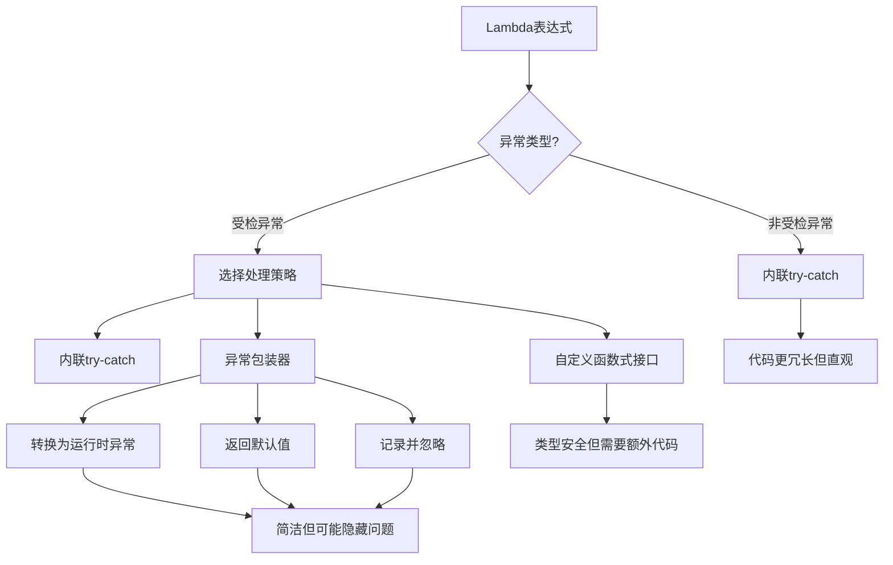

# Java Lambda异常处理

在使用Java Lambda表达式的过程中，异常处理是一个非常重要但容易被忽视的话题。Lambda表达式作为Java 8引入的函数式编程特性，改变了我们编写代码的方式，但同时也带来了一些关于异常处理的挑战。本文将全面介绍如何在Lambda表达式中优雅地处理异常。

## 为什么Lambda异常处理很重要？

Lambda表达式简化了代码，但不正确的异常处理可能导致：
- 程序运行时崩溃
- 难以追踪的错误
- 代码可维护性降低
- 性能问题

## Lambda表达式中的异常类型

在Java中，异常分为两大类：

1. **非受检异常（Unchecked Exceptions）**：继承自`RuntimeException`，如`NullPointerException`
2. **受检异常（Checked Exceptions）**：其它继承自`Exception`的异常，编译器要求必须处理

Lambda表达式处理这两种异常的方式存在明显差异。

## 处理非受检异常

非受检异常在Lambda表达式中相对容易处理，因为函数式接口不需要声明它们。

### 基本处理方法

```java
List<Integer> numbers = Arrays.asList(1, 2, 0, 3);

// 可能产生ArithmeticException的Lambda表达式
numbers.forEach(n -> {
    try {
        System.out.println(10 / n);
    } catch (ArithmeticException e) {
        System.out.println("除零错误: " + n);
    }
});

// 输出:
// 10
// 5
// 除零错误: 0
// 3.3333333333333335
```

## 处理受检异常

Lambda表达式对受检异常的处理比较棘手，因为大多数标准函数式接口（如`Consumer`、`Function`等）都不声明抛出受检异常。

### 直接在Lambda中使用try-catch

这是最简单但可能导致代码冗长的方法：

```java
List<String> files = Arrays.asList("file1.txt", "file2.txt");

files.forEach(file -> {
    try {
        // readFile方法声明抛出IOException
        String content = readFile(file);
        System.out.println(content);
    } catch (IOException e) {
        System.err.println("无法读取文件: " + file);
    }
});
```

### 使用包装器处理受检异常

为了让代码更简洁，我们可以创建工具方法来包装可能抛出异常的Lambda表达式：

```java
@FunctionalInterface
public interface ThrowingConsumer<T, E extends Exception> {
    void accept(T t) throws E;
    
    static <T> Consumer<T> unchecked(ThrowingConsumer<T, Exception> consumer) {
        return t -> {
            try {
                consumer.accept(t);
            } catch (Exception e) {
                throw new RuntimeException(e);
            }
        };
    }
}

// 使用示例
List<String> files = Arrays.asList("file1.txt", "file2.txt");

files.forEach(ThrowingConsumer.unchecked(file -> {
    String content = readFile(file); // 可能抛出IOException
    System.out.println(content);
}));
```

:::tip
上面的方法将受检异常转换为非受检异常，使得Lambda表达式能够在标准函数式接口中使用。
:::

## 自定义函数式接口处理异常

如果你经常需要处理特定类型的异常，可以创建自定义函数式接口：

```java
@FunctionalInterface
public interface IOFunction<T, R> {
    R apply(T t) throws IOException;
}

// 使用示例
public static <T, R> Function<T, R> wrap(IOFunction<T, R> function) {
    return t -> {
        try {
            return function.apply(t);
        } catch (IOException e) {
            throw new RuntimeException(e);
        }
    };
}

// 应用
List<String> files = Arrays.asList("file1.txt", "file2.txt");
List<String> contents = files.stream()
    .map(wrap(file -> readFile(file)))
    .collect(Collectors.toList());
```

## 实际案例：文件处理系统

下面是一个处理多个文件的实际案例，展示了如何在Lambda表达式中处理异常：

```java
import java.io.IOException;
import java.nio.file.Files;
import java.nio.file.Paths;
import java.util.Arrays;
import java.util.List;
import java.util.stream.Collectors;

public class FileProcessor {
    
    public static void main(String[] args) {
        List<String> filePaths = Arrays.asList(
            "data.csv", 
            "config.json", 
            "nonexistent.txt"
        );
        
        // 方法1：直接在Lambda中处理异常
        System.out.println("方法1结果：");
        filePaths.forEach(path -> {
            try {
                long lineCount = Files.lines(Paths.get(path)).count();
                System.out.println(path + " 包含 " + lineCount + " 行");
            } catch (IOException e) {
                System.err.println("处理文件时出错 " + path + ": " + e.getMessage());
            }
        });
        
        // 方法2：使用异常处理包装器
        System.out.println("\n方法2结果：");
        List<FileStats> fileStats = filePaths.stream()
            .map(wrap(path -> new FileStats(
                path, 
                Files.lines(Paths.get(path)).count()
            )))
            .collect(Collectors.toList());
        
        fileStats.forEach(System.out::println);
    }
    
    // 包装函数
    private static <T, R> Function<T, R> wrap(IOFunction<T, R> function) {
        return t -> {
            try {
                return function.apply(t);
            } catch (IOException e) {
                System.err.println("错误: " + e.getMessage());
                return null;
            }
        };
    }
    
    // 自定义函数式接口
    @FunctionalInterface
    interface IOFunction<T, R> {
        R apply(T t) throws IOException;
    }
    
    // 文件统计类
    static class FileStats {
        private final String filePath;
        private final long lineCount;
        
        public FileStats(String filePath, long lineCount) {
            this.filePath = filePath;
            this.lineCount = lineCount;
        }
        
        @Override
        public String toString() {
            return filePath + " 包含 " + lineCount + " 行";
        }
    }
}
```

### 输出示例

```
方法1结果：
data.csv 包含 100 行
config.json 包含 24 行
处理文件时出错 nonexistent.txt: 系统找不到指定的文件。

方法2结果：
错误: 系统找不到指定的文件。
data.csv 包含 100 行
config.json 包含 24 行
null
```

## Lambda异常处理最佳实践

1. **优先使用现有的接口**：尽量使用Java提供的标准函数式接口。

2. **谨慎包装异常**：将受检异常转换为非受检异常时，确保保留原始异常信息。

3. **避免吞噬异常**：不要在Lambda中捕获异常后不做任何处理。

4. **集中处理相似异常**：对于相似的操作，考虑创建通用的异常处理方法。

5. **保持Lambda表达式的简洁性**：如果异常处理使Lambda变得复杂，考虑使用方法引用或提取方法。

```java
// 不好的做法：复杂的内联异常处理
list.forEach(item -> {
    try {
        // 复杂处理...
    } catch (Exception e) {
        // 复杂异常处理...
    }
});

// 好的做法：提取方法
list.forEach(this::processItemSafely);

private void processItemSafely(Item item) {
    try {
        // 处理逻辑
    } catch (Exception e) {
        // 异常处理
    }
}
```

## 异常处理模式可视化

下面是Lambda异常处理的常见模式图：



## 总结

在Lambda表达式中处理异常可能具有挑战性，但通过合适的技术，我们可以编写既简洁又健壮的代码。关键要点：

1. 非受检异常可直接在Lambda中使用try-catch处理
2. 受检异常需要特殊技术，如异常包装或自定义函数式接口
3. 根据项目需求和团队规范选择合适的异常处理策略
4. 不要为了简洁而牺牲代码的可维护性和错误处理能力

## 练习

1. 创建一个函数式接口`ThrowingSupplier<T, E extends Exception>`，它允许在`get()`方法中抛出受检异常。
2. 实现一个工具方法，将包含IOException的Lambda表达式转换为返回Optional的表达式。
3. 修改本文提供的文件处理示例，使其能并行处理文件并正确处理异常。

## 延伸阅读

- Java 8函数式接口设计
- 函数式编程中的错误处理策略
- Optional与异常处理结合的模式

:::caution
记住，虽然Lambda表达式让代码更简洁，但良好的异常处理仍是构建健壮应用的关键。不要让简洁性影响代码的可靠性。
:::