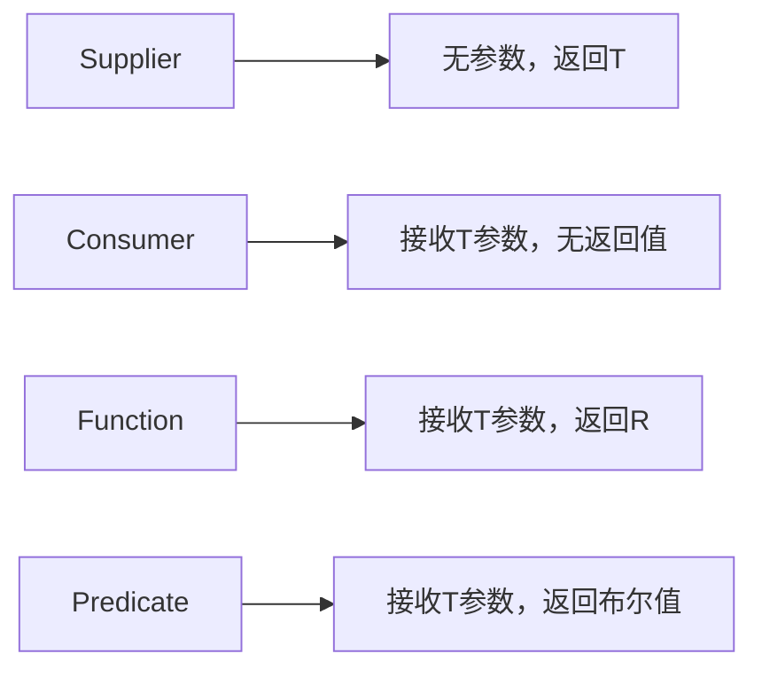

# Java Supplier接口

## 什么是Supplier接口？

Supplier接口是Java 8引入的函数式接口之一，它位于`java.util.function`包中。Supplier接口是一个不接受任何参数但返回一个结果的函数式接口。这个接口特别适合于延迟计算、懒加载等场景。

简单来说，Supplier就是一个"提供者"，它不需要输入，只负责提供（返回）一个值。

## Supplier接口的基本定义

Supplier接口只有一个抽象方法：`get()`。它的定义如下：

```java
@FunctionalInterface
public interface Supplier<T> {
    T get();
}
```

这个接口是泛型的，类型参数`T`表示返回值的类型。

## 如何使用Supplier接口

### 基本用法

使用Supplier接口的最简单方式是通过Lambda表达式：

```java
import java.util.function.Supplier;

public class SupplierExample {
    public static void main(String[] args) {
        // 创建一个返回字符串的Supplier
        Supplier<String> helloSupplier = () -> "Hello, World!";
        
        // 调用get()方法获取结果
        String result = helloSupplier.get();
        System.out.println(result);  // 输出: Hello, World!
    }
}
```

输出：
```
Hello, World!
```

### 使用方法引用

除了Lambda表达式，我们也可以使用方法引用来创建Supplier实例：

```java
import java.util.function.Supplier;
import java.time.LocalDateTime;

public class MethodReferenceExample {
    public static void main(String[] args) {
        // 使用方法引用，引用LocalDateTime::now静态方法
        Supplier<LocalDateTime> dateTimeSupplier = LocalDateTime::now;
        
        System.out.println("当前时间是：" + dateTimeSupplier.get());
        
        // 短暂延迟后再次调用
        try {
            Thread.sleep(1000);
        } catch (InterruptedException e) {
            e.printStackTrace();
        }
        
        System.out.println("1秒后的时间是：" + dateTimeSupplier.get());
    }
}
```

输出（具体时间会有所不同）：
```
当前时间是：2023-07-21T14:30:45.123
1秒后的时间是：2023-07-21T14:30:46.124
```

### 创建对象实例

Supplier接口常用于创建对象实例：

```java
import java.util.function.Supplier;
import java.util.ArrayList;
import java.util.List;

public class ObjectCreationExample {
    public static void main(String[] args) {
        // 使用构造器引用创建ArrayList的Supplier
        Supplier<List<String>> listSupplier = ArrayList::new;
        
        // 获取新的ArrayList实例
        List<String> list = listSupplier.get();
        list.add("Java");
        list.add("Python");
        System.out.println("列表内容：" + list);
        
        // 再次调用，获取另一个新的实例
        List<String> anotherList = listSupplier.get();
        System.out.println("新列表是空的吗？" + anotherList.isEmpty());  // 输出: true
    }
}
```

输出：
```
列表内容：[Java, Python]
新列表是空的吗？true
```

## Supplier的特殊应用

### 延迟计算（Lazy Evaluation）

Supplier的一个重要用途是支持延迟计算，只有在需要结果时才执行计算：

```java
import java.util.function.Supplier;

public class LazyEvaluationExample {
    public static void main(String[] args) {
        // 创建一个代表复杂计算的Supplier
        Supplier<Double> complexCalculation = () -> {
            System.out.println("执行复杂计算...");
            // 模拟一些计算密集型操作
            try {
                Thread.sleep(1000);
            } catch (InterruptedException e) {
                e.printStackTrace();
            }
            return Math.random() * 100;
        };
        
        System.out.println("准备开始...");
        
        // 只有在我们调用get()时，计算才会执行
        if (Math.random() > 0.5) {
            System.out.println("需要计算结果：" + complexCalculation.get());
        } else {
            System.out.println("不需要计算，跳过");
        }
        
        System.out.println("程序结束");
    }
}
```

这个例子中，复杂计算只会在随机条件满足时才执行，这是延迟计算的一个好处。

### 实现Factory模式

Supplier接口很适合用来实现简单的工厂模式：

```java
import java.util.function.Supplier;
import java.util.HashMap;
import java.util.Map;

// 产品接口
interface Product {
    String getName();
}

// 具体产品类
class ConcreteProductA implements Product {
    @Override
    public String getName() {
        return "Product A";
    }
}

class ConcreteProductB implements Product {
    @Override
    public String getName() {
        return "Product B";
    }
}

// 使用Supplier的工厂
public class FactoryExample {
    // 产品注册表
    private static final Map<String, Supplier<Product>> PRODUCT_REGISTRY = new HashMap<>();
    
    static {
        // 注册产品创建方式
        PRODUCT_REGISTRY.put("A", ConcreteProductA::new);
        PRODUCT_REGISTRY.put("B", ConcreteProductB::new);
    }
    
    // 工厂方法
    public static Product createProduct(String productType) {
        Supplier<Product> productSupplier = PRODUCT_REGISTRY.get(productType);
        if (productSupplier == null) {
            throw new IllegalArgumentException("未知产品类型: " + productType);
        }
        return productSupplier.get();
    }
    
    public static void main(String[] args) {
        Product productA = createProduct("A");
        Product productB = createProduct("B");
        
        System.out.println(productA.getName());  // 输出: Product A
        System.out.println(productB.getName());  // 输出: Product B
    }
}
```

### 实现缓存和默认值

Supplier可以用于实现简单的缓存或提供默认值：

```java
import java.util.function.Supplier;

public class CachingExample {
    public static void main(String[] args) {
        String value = null;  // 可能是null的值
        
        // 创建提供默认值的Supplier
        Supplier<String> defaultValueSupplier = () -> {
            System.out.println("生成默认值");
            return "Default Value";
        };
        
        // 使用orElseGet获取值或默认值
        String result = (value != null) ? value : defaultValueSupplier.get();
        System.out.println("结果: " + result);
        
        // 在Java 8+ 中，可以使用Optional
        import java.util.Optional;
        String optionalResult = Optional.ofNullable(value).orElseGet(defaultValueSupplier);
        System.out.println("Optional结果: " + optionalResult);
    }
}
```

:::tip 提示
Java 的 `Optional` 类中的 `orElseGet` 方法就接受一个 Supplier 参数，用于在值不存在时提供默认值。这比直接使用 `orElse` 更高效，因为只有在需要时才会计算默认值。
:::

## 何时使用Supplier接口

Supplier接口适合以下场景：

1. **延迟初始化**：只有在需要时才创建或加载资源
2. **工厂方法**：创建对象的标准方式
3. **默认值提供**：在值不存在时提供备选值
4. **缓存计算结果**：计算复杂但结果可复用的场景
5. **测试代码**：提供模拟数据或测试值

## 与其他函数式接口的区别

Supplier与其他常见的函数式接口有以下区别：



## 实际应用示例

### 示例1：懒加载配置

```java
import java.util.function.Supplier;
import java.util.Properties;
import java.io.FileInputStream;
import java.io.IOException;

public class LazyConfigExample {
    private Supplier<Properties> configSupplier;
    
    public LazyConfigExample(String configPath) {
        // 定义一个Supplier，但不立即加载配置
        configSupplier = () -> {
            Properties props = new Properties();
            try (FileInputStream fis = new FileInputStream(configPath)) {
                props.load(fis);
                System.out.println("配置已加载");
            } catch (IOException e) {
                System.err.println("无法加载配置: " + e.getMessage());
            }
            // 加载后替换Supplier以实现缓存
            Properties loadedProps = props;
            configSupplier = () -> loadedProps;
            return props;
        };
    }
    
    public String getProperty(String key) {
        // 只有在需要时才加载配置
        return configSupplier.get().getProperty(key);
    }
    
    public static void main(String[] args) {
        LazyConfigExample config = new LazyConfigExample("config.properties");
        
        System.out.println("程序启动");
        
        // 配置直到这里才会加载
        System.out.println("App名称: " + config.getProperty("app.name"));
        
        // 第二次获取属性不会重新加载配置
        System.out.println("App版本: " + config.getProperty("app.version"));
    }
}
```

### 示例2：随机数据生成器

```java
import java.util.function.Supplier;
import java.util.List;
import java.util.ArrayList;
import java.util.Random;

public class DataGeneratorExample {
    private static final Random RANDOM = new Random();
    
    // 随机姓名生成器
    private static final Supplier<String> NAME_GENERATOR = () -> {
        String[] firstNames = {"张", "李", "王", "赵", "刘", "陈", "杨"};
        String[] lastNames = {"伟", "芳", "娜", "秀英", "敏", "静", "丽", "强", "磊", "军"};
        return firstNames[RANDOM.nextInt(firstNames.length)] + 
               lastNames[RANDOM.nextInt(lastNames.length)];
    };
    
    // 随机年龄生成器
    private static final Supplier<Integer> AGE_GENERATOR = () -> 
        RANDOM.nextInt(50) + 18;  // 18-67岁
    
    // 随机薪资生成器
    private static final Supplier<Double> SALARY_GENERATOR = () -> 
        (RANDOM.nextDouble() * 15000) + 5000;  // 5000-20000
    
    // 员工数据类
    static class Employee {
        private String name;
        private int age;
        private double salary;
        
        public Employee(String name, int age, double salary) {
            this.name = name;
            this.age = age;
            this.salary = salary;
        }
        
        @Override
        public String toString() {
            return String.format("员工[姓名=%s, 年龄=%d, 薪资=%.2f]", 
                                name, age, salary);
        }
    }
    
    // 随机员工生成器
    private static final Supplier<Employee> EMPLOYEE_GENERATOR = () -> 
        new Employee(
            NAME_GENERATOR.get(),
            AGE_GENERATOR.get(),
            SALARY_GENERATOR.get()
        );
    
    public static void main(String[] args) {
        System.out.println("生成随机员工数据...");
        
        // 生成10个随机员工
        List<Employee> employees = new ArrayList<>();
        for (int i = 0; i < 10; i++) {
            employees.add(EMPLOYEE_GENERATOR.get());
        }
        
        // 打印生成的员工数据
        employees.forEach(System.out::println);
    }
}
```

## 总结

Supplier接口是Java函数式编程中的一个重要组件，具有以下特点：
- 不接受参数，但提供一个值（T类型）
- 提供一个单一的抽象方法：`T get()`
- 特别适合实现延迟计算、工厂模式和默认值提供
- 可以通过Lambda表达式或方法引用轻松实现

与其他函数式接口（如Consumer、Function、Predicate）相比，Supplier的独特之处在于它只负责"提供"而不消费任何输入。这使得它在需要值生成而无需外部输入的场景中非常有用。

## 练习

1. 创建一个Supplier，返回当前系统的内存使用情况
2. 实现一个带缓存的Supplier，确保复杂计算只执行一次
3. 使用Supplier实现一个简单的日志记录器，只在特定日志级别启用时才构建日志消息
4. 结合Stream API和Supplier创建一个无限随机数流，并取其中的前10个数

## 附加资源

- [Java官方文档 - Supplier接口](https://docs.oracle.com/javase/8/docs/api/java/util/function/Supplier.html)
- [Oracle教程 - Lambda表达式](https://docs.oracle.com/javase/tutorial/java/javaOO/lambdaexpressions.html)

通过掌握Supplier接口，你将能够更有效地实现延迟计算、提供默认值以及创建更灵活的工厂方法，这是Java函数式编程的重要组成部分。