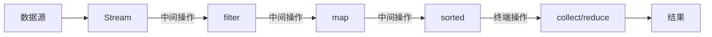

# Java Stream概述

## 什么是Java Stream API?

Java Stream API 是 Java 8 引入的一个革命性特性，它允许以声明性方式处理集合数据。Stream API 旨在简化集合操作，实现函数式编程风格，使开发者能够编写更清晰、更简洁的代码。

Stream 不是数据结构，而是从集合、数组或I/O通道等数据源产生的元素序列。Stream 提供了一种在数据集上进行函数式操作的高级抽象。

:::note
Stream API 是 Java 8 为支持函数式编程而引入的核心特性之一，与 Lambda 表达式、方法引用和函数式接口一同构成了 Java 8 的函数式编程能力。
:::

## Stream API的基本特点

1. **不存储数据**：Stream不是数据结构，它只是对数据源的一个视图。
2. **函数式风格**：支持函数式编程操作，如filter、map、reduce等。
3. **延迟执行**：Stream操作是延迟执行的，只有在需要结果时才会执行。
4. **可消费性**：Stream只能被消费一次，一旦执行了终端操作，Stream就会关闭。
5. **内部迭代**：Stream API使用内部迭代，使开发者专注于要做什么，而不是怎么做。

## Stream操作分类

Stream操作可分为两大类：

1. **中间操作**（Intermediate Operations）：返回一个新Stream，可以链式调用。中间操作是延迟执行的。
2. **终端操作**（Terminal Operations）：返回一个结果或副作用，执行后Stream会关闭。



## 创建Stream

有多种方式可以创建Stream：

### 1. 从Collection集合创建

```java
List<String> list = Arrays.asList("Java", "Python", "C++");
Stream<String> stream = list.stream();
```

### 2. 从数组创建

```java
String[] array = {"Java", "Python", "C++"};
Stream<String> stream = Arrays.stream(array);
```

### 3. 使用Stream的静态方法创建

```java
// 使用Stream.of()
Stream<String> stream = Stream.of("Java", "Python", "C++");

// 创建无限流
Stream<Integer> infiniteStream = Stream.iterate(0, n -> n + 1);
Stream<Double> randomStream = Stream.generate(Math::random);
```

## Stream的常用操作

### 中间操作示例

1. **filter**：过滤元素

```java
List<String> languages = Arrays.asList("Java", "Python", "JavaScript", "C++", "C#", "Go");

// 过滤出长度大于3的编程语言
languages.stream()
         .filter(lang -> lang.length() > 3)
         .forEach(System.out::println);

// 输出:
// Java
// Python
// JavaScript
// C++
```

2. **map**：转换元素

```java
List<String> languages = Arrays.asList("Java", "Python", "JavaScript");

// 将所有语言转换为大写
languages.stream()
         .map(String::toUpperCase)
         .forEach(System.out::println);

// 输出:
// JAVA
// PYTHON
// JAVASCRIPT
```

3. **sorted**：排序

```java
List<String> languages = Arrays.asList("Java", "Python", "JavaScript", "C++");

// 按字母顺序排序
languages.stream()
         .sorted()
         .forEach(System.out::println);

// 输出:
// C++
// Java
// JavaScript
// Python
```

4. **distinct**：去重

```java
List<Integer> numbers = Arrays.asList(1, 2, 3, 2, 1, 4, 5);

// 去除重复元素
numbers.stream()
       .distinct()
       .forEach(System.out::print);

// 输出: 12345
```

### 终端操作示例

1. **collect**：将Stream转换为集合

```java
List<String> languages = Arrays.asList("Java", "Python", "JavaScript", "C++", "C#");

// 过滤并收集结果到新列表
List<String> filteredList = languages.stream()
                                    .filter(lang -> lang.startsWith("J"))
                                    .collect(Collectors.toList());

System.out.println(filteredList);
// 输出: [Java, JavaScript]
```

2. **forEach**：遍历元素

```java
List<String> languages = Arrays.asList("Java", "Python", "JavaScript");

languages.stream()
         .forEach(lang -> System.out.println("I love " + lang));

// 输出:
// I love Java
// I love Python
// I love JavaScript
```

3. **reduce**：归约操作

```java
List<Integer> numbers = Arrays.asList(1, 2, 3, 4, 5);

// 计算总和
int sum = numbers.stream()
                .reduce(0, (a, b) -> a + b);

System.out.println("Sum: " + sum);
// 输出: Sum: 15

// 使用方法引用
int sumMethodRef = numbers.stream()
                         .reduce(0, Integer::sum);

System.out.println("Sum (method reference): " + sumMethodRef);
// 输出: Sum (method reference): 15
```

4. **count**、**min**、**max**：统计操作

```java
List<Integer> numbers = Arrays.asList(1, 2, 3, 4, 5);

long count = numbers.stream().count();
int min = numbers.stream().min(Integer::compare).orElse(0);
int max = numbers.stream().max(Integer::compare).orElse(0);

System.out.println("Count: " + count);
System.out.println("Min: " + min);
System.out.println("Max: " + max);

// 输出:
// Count: 5
// Min: 1
// Max: 5
```

## 实际应用案例

### 案例1：处理学生数据

假设我们有一个学生列表，需要找出所有计算机科学专业且GPA大于3.5的学生：

```java
class Student {
    private String name;
    private String major;
    private double gpa;
    
    public Student(String name, String major, double gpa) {
        this.name = name;
        this.major = major;
        this.gpa = gpa;
    }
    
    // Getters and setters
    public String getName() { return name; }
    public String getMajor() { return major; }
    public double getGpa() { return gpa; }
}

public class StudentExample {
    public static void main(String[] args) {
        List<Student> students = Arrays.asList(
            new Student("Alice", "Computer Science", 3.8),
            new Student("Bob", "Mathematics", 3.7),
            new Student("Charlie", "Computer Science", 3.2),
            new Student("Dave", "Physics", 3.9),
            new Student("Eve", "Computer Science", 3.6)
        );
        
        // 找出计算机专业且GPA > 3.5的学生
        List<String> highGpaCSStudents = students.stream()
            .filter(s -> "Computer Science".equals(s.getMajor()))
            .filter(s -> s.getGpa() > 3.5)
            .map(Student::getName)
            .collect(Collectors.toList());
            
        System.out.println("优秀计算机专业学生: " + highGpaCSStudents);
        // 输出: 优秀计算机专业学生: [Alice, Eve]
    }
}
```

### 案例2：数据统计和分析

使用Stream API对产品数据进行分组和统计：

```java
class Product {
    private String name;
    private String category;
    private double price;
    
    public Product(String name, String category, double price) {
        this.name = name;
        this.category = category;
        this.price = price;
    }
    
    // Getters
    public String getName() { return name; }
    public String getCategory() { return category; }
    public double getPrice() { return price; }
}

public class ProductAnalysis {
    public static void main(String[] args) {
        List<Product> products = Arrays.asList(
            new Product("iPhone", "Electronics", 999.99),
            new Product("Samsung TV", "Electronics", 1499.99),
            new Product("Java Book", "Books", 49.99),
            new Product("Python Book", "Books", 39.99),
            new Product("Headphones", "Electronics", 199.99)
        );
        
        // 按类别分组
        Map<String, List<Product>> productsByCategory = products.stream()
            .collect(Collectors.groupingBy(Product::getCategory));
            
        // 计算每个类别的平均价格
        Map<String, Double> avgPriceByCategory = products.stream()
            .collect(Collectors.groupingBy(
                Product::getCategory,
                Collectors.averagingDouble(Product::getPrice)
            ));
            
        System.out.println("按类别分组的产品: " + productsByCategory.keySet());
        System.out.println("每个类别的平均价格: " + avgPriceByCategory);
        
        // 找出最贵的产品
        Product mostExpensiveProduct = products.stream()
            .max(Comparator.comparing(Product::getPrice))
            .orElse(null);
            
        System.out.println("最贵的产品: " + mostExpensiveProduct.getName() + 
                          " - $" + mostExpensiveProduct.getPrice());
                          
        // 输出:
        // 按类别分组的产品: [Electronics, Books]
        // 每个类别的平均价格: {Electronics=899.99, Books=44.99}
        // 最贵的产品: Samsung TV - $1499.99
    }
}
```

## 并行Stream

Stream API一个重要的特性是能够轻松地实现并行处理。只需将`.stream()`替换为`.parallelStream()`，或在现有的stream上调用`.parallel()`方法：

```java
List<Integer> numbers = Arrays.asList(1, 2, 3, 4, 5, 6, 7, 8, 9, 10);

// 串行处理
long startTime1 = System.currentTimeMillis();
int serialSum = numbers.stream()
                      .map(n -> computeExpensiveValue(n))
                      .reduce(0, Integer::sum);
long endTime1 = System.currentTimeMillis();

// 并行处理
long startTime2 = System.currentTimeMillis();
int parallelSum = numbers.parallelStream()
                        .map(n -> computeExpensiveValue(n))
                        .reduce(0, Integer::sum);
long endTime2 = System.currentTimeMillis();

System.out.println("串行处理时间: " + (endTime1 - startTime1) + "ms");
System.out.println("并行处理时间: " + (endTime2 - startTime2) + "ms");

// 模拟昂贵的计算
private static int computeExpensiveValue(int n) {
    try {
        Thread.sleep(100); // 模拟耗时操作
    } catch (InterruptedException e) {
        e.printStackTrace();
    }
    return n * 2;
}
```

:::caution
并行流使用的是ForkJoinPool.commonPool()。在处理简单任务或数据量不大时，并行流可能比串行流慢，因为线程管理开销可能超过并行处理带来的好处。
:::

## Stream API的优点

1. **代码清晰简洁**：使用函数式风格编写代码，更加直观易读。
2. **便于并行处理**：轻松转换为并行流，利用多核处理能力。
3. **延迟执行**：只有在需要结果时才执行操作，提高效率。
4. **函数式编程范式**：支持无副作用的函数式编程风格。
5. **丰富的API**：提供大量内置函数，简化集合处理。

## 注意事项

1. **Stream只能消费一次**：Stream执行终端操作后会关闭，不能重复使用。
2. **避免副作用**：遵循函数式编程原则，避免在Stream操作中修改外部变量。
3. **谨慎使用并行流**：并行流不总是比串行流快，要根据实际情况选择。
4. **关注性能**：某些Stream操作（如sorted）可能较耗资源，了解性能影响很重要。

## 总结

Java Stream API 是Java 8引入的强大功能，它简化了集合数据的处理，使代码更简洁、更富有表达力。Stream API 基于函数式编程理念，提供了一种新的数据处理模型，特别适合处理大量数据或复杂操作。

通过掌握Stream的创建、中间操作和终端操作，开发者可以编写出更高效、更易于维护的代码。结合Lambda表达式和方法引用，Stream API已成为现代Java编程不可或缺的一部分。

## 练习建议

1. 创建一个简单的项目，使用Stream API处理不同类型的集合。
2. 尝试链式调用不同的中间操作和终端操作。
3. 比较使用Stream API和传统循环方法处理相同数据集的代码差异。
4. 尝试使用并行流处理大型数据集，并比较与串行流的性能差异。
5. 使用Collectors类的各种收集器方法，例如groupingBy、partitioningBy等。

## 额外资源

- [Java官方文档 - Stream](https://docs.oracle.com/en/java/javase/17/docs/api/java.base/java/util/stream/package-summary.html)
- [Java 8 Stream API教程](https://www.baeldung.com/java-8-streams-introduction)
- [Java 8实战](https://www.manning.com/books/java-8-in-action)（推荐书籍）

学习Stream API是迈向现代Java编程的重要一步。通过实践和应用，你将能够充分发挥Java函数式编程的强大能力！