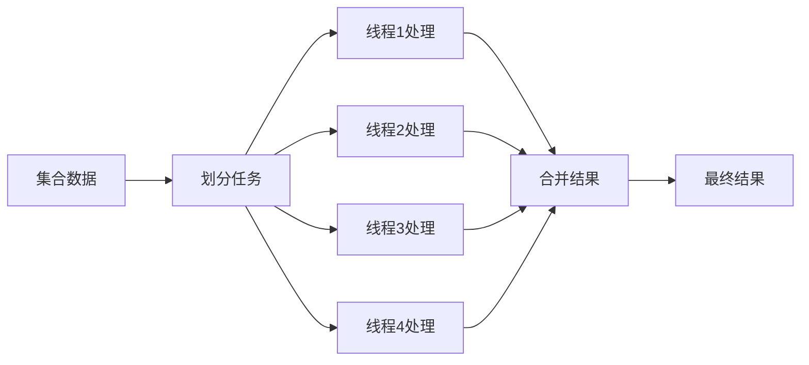

# Java Stream并行

在处理大量数据时，充分利用现代计算机的多核处理能力可以显著提高程序性能。Java 8引入的Stream API不仅提供了函数式编程风格处理集合的能力，还可以通过并行流(Parallel Streams)轻松实现并行计算，无需手动管理线程。

## 什么是并行流

并行流是Stream API的一个特性，允许将操作自动分割为多个子任务，分配给多个处理器核心并发执行，最后将结果合并。

从顺序流转换为并行流只需一个方法调用：
- 调用`parallel()`方法
- 或使用`parallelStream()`方法创建



## 创建并行流

有两种主要方法创建并行流：

### 方法一：从现有流转换

```java
List<Integer> numbers = Arrays.asList(1, 2, 3, 4, 5, 6, 7, 8, 9, 10);

// 顺序流转换为并行流
int sum = numbers.stream().parallel().reduce(0, Integer::sum);
System.out.println("Sum: " + sum);  // 输出: Sum: 55
```

### 方法二：直接从集合创建

```java
List<Integer> numbers = Arrays.asList(1, 2, 3, 4, 5, 6, 7, 8, 9, 10);

// 直接创建并行流
int sum = numbers.parallelStream().reduce(0, Integer::sum);
System.out.println("Sum: " + sum);  // 输出: Sum: 55
```

## 并行流与顺序流比较

让我们通过一个简单的性能比较示例来了解并行流的优势：

```java
import java.util.stream.LongStream;
import java.time.LocalTime;
import java.time.temporal.ChronoUnit;

public class ParallelStreamDemo {
    public static void main(String[] args) {
        long size = 100_000_000;
        
        // 测量顺序流执行时间
        LocalTime start = LocalTime.now();
        long sequentialSum = LongStream.rangeClosed(1, size).sum();
        LocalTime finish = LocalTime.now();
        long sequentialTime = ChronoUnit.MILLIS.between(start, finish);
        
        System.out.println("Sequential Sum: " + sequentialSum);
        System.out.println("Sequential Time: " + sequentialTime + " ms");
        
        // 测量并行流执行时间
        start = LocalTime.now();
        long parallelSum = LongStream.rangeClosed(1, size).parallel().sum();
        finish = LocalTime.now();
        long parallelTime = ChronoUnit.MILLIS.between(start, finish);
        
        System.out.println("Parallel Sum: " + parallelSum);
        System.out.println("Parallel Time: " + parallelTime + " ms");
    }
}
```

在大多数现代多核计算机上运行此代码，您可能会看到类似以下的输出：

```
Sequential Sum: 5000000050000000
Sequential Time: 79 ms
Parallel Sum: 5000000050000000
Parallel Time: 22 ms
```

可以看到，并行流处理在大数据量计算时通常会快很多。

:::caution
实际性能提升取决于数据量大小、处理器核心数量以及具体执行的操作类型。过小的数据量使用并行流可能因线程调度开销导致性能下降。
:::

## 并行流内部工作原理

并行流基于Java的Fork/Join框架，这是一个自Java 7引入的框架，专为支持将一个任务拆分成多个"小任务"，并发执行后合并结果。

工作流程：
1. 将数据源划分为多个部分
2. 在多个线程上并行执行操作
3. 将各个部分的结果合并

默认情况下，并行流使用`ForkJoinPool.commonPool()`线程池，其线程数量默认等于CPU核心数。

## 使用并行流的注意事项

### 1. 线程安全问题

并行操作中使用的状态（变量）应该是线程安全的，避免数据竞争。

```java
// 不安全的并行流用法
List<Integer> numbers = Arrays.asList(1, 2, 3, 4, 5, 6, 7, 8, 9, 10);
int sum = 0;
numbers.parallelStream().forEach(n -> sum += n); // 线程不安全!
System.out.println("Sum: " + sum); // 结果不可预测
```

正确做法是使用归约操作：

```java
// 安全的并行流用法
List<Integer> numbers = Arrays.asList(1, 2, 3, 4, 5, 6, 7, 8, 9, 10);
int sum = numbers.parallelStream().reduce(0, Integer::sum);
System.out.println("Sum: " + sum); // 输出: 55
```

### 2. 操作顺序问题

并行流不保证元素的处理顺序。对于依赖顺序的操作，要谨慎使用并行流：

```java
// 顺序流会按顺序输出
System.out.println("Sequential:");
Arrays.asList(1, 2, 3, 4, 5).stream()
      .forEach(n -> System.out.print(n + " "));
// 输出: 1 2 3 4 5

// 并行流的输出顺序不确定
System.out.println("\nParallel:");
Arrays.asList(1, 2, 3, 4, 5).parallelStream()
      .forEach(n -> System.out.print(n + " "));
// 输出可能是: 3 5 2 1 4 (顺序不定)
```

如果需要保持顺序，可以使用`forEachOrdered()`：

```java
System.out.println("\nParallel with forEachOrdered:");
Arrays.asList(1, 2, 3, 4, 5).parallelStream()
      .forEachOrdered(n -> System.out.print(n + " "));
// 输出: 1 2 3 4 5
```

:::tip
`forEachOrdered()`会按照原始顺序执行操作，但可能会降低并行性能。
:::

### 3. 非关联操作

某些操作使用并行流时可能会产生不同的结果：

```java
// 顺序计算: (((1 - 2) - 3) - 4) - 5 = -13
int sequentialResult = Arrays.asList(1, 2, 3, 4, 5).stream()
                            .reduce(0, (a, b) -> a - b);

// 并行计算可能被分为: (1-2) + (3-4) + (0-5) = -7
int parallelResult = Arrays.asList(1, 2, 3, 4, 5).parallelStream()
                            .reduce(0, (a, b) -> a - b);
```

对于并行流，使用满足结合律的操作（如加法、乘法）更安全。

### 4. 性能考虑

并行流并不总是更快。以下情况可能导致并行流性能不佳：
- 数据量小
- 操作简单，线程调度开销大于收益
- 操作依赖共享状态
- 数据结构不易拆分（如LinkedList）

## 实际应用案例

### 案例1: 大文件数据处理

假设我们需要处理一个包含数百万行的日志文件，计算每个IP地址出现的次数：

```java
import java.io.IOException;
import java.nio.file.Files;
import java.nio.file.Paths;
import java.util.Map;
import java.util.stream.Collectors;
import java.util.regex.Pattern;

public class LogAnalyzer {
    public static void main(String[] args) {
        String filePath = "large_access_log.txt";
        
        try {
            // 提取IP地址（假设IP是每行的第一个字段）
            Pattern ipPattern = Pattern.compile("\\d+\\.\\d+\\.\\d+\\.\\d+");
            
            long startTime = System.currentTimeMillis();
            
            Map<String, Long> ipCounts = Files.lines(Paths.get(filePath))
                .parallel() // 使用并行流提高处理速度
                .map(line -> {
                    java.util.regex.Matcher matcher = ipPattern.matcher(line);
                    return matcher.find() ? matcher.group() : "unknown";
                })
                .collect(Collectors.groupingBy(
                    ip -> ip, 
                    Collectors.counting()
                ));
            
            long endTime = System.currentTimeMillis();
            
            System.out.println("Top 5 IPs by request count:");
            ipCounts.entrySet().stream()
                .sorted(Map.Entry.<String, Long>comparingByValue().reversed())
                .limit(5)
                .forEach(e -> System.out.println(e.getKey() + ": " + e.getValue()));
            
            System.out.println("Processing time: " + (endTime - startTime) + " ms");
            
        } catch (IOException e) {
            System.err.println("Error reading file: " + e.getMessage());
        }
    }
}
```

### 案例2: 图像处理

并行流在图像处理等计算密集型任务中也非常有用：

```java
import java.awt.image.BufferedImage;
import java.io.File;
import java.io.IOException;
import javax.imageio.ImageIO;
import java.util.stream.IntStream;

public class ImageProcessor {
    public static void main(String[] args) {
        try {
            // 加载图像
            BufferedImage originalImage = ImageIO.read(new File("large_image.jpg"));
            
            int width = originalImage.getWidth();
            int height = originalImage.getHeight();
            
            BufferedImage processedImage = new BufferedImage(
                width, height, BufferedImage.TYPE_INT_RGB);
            
            long startTime = System.currentTimeMillis();
            
            // 并行处理每个像素（应用灰度转换）
            IntStream.range(0, height)
                .parallel()
                .forEach(y -> {
                    for (int x = 0; x < width; x++) {
                        int rgb = originalImage.getRGB(x, y);
                        
                        int r = (rgb >> 16) & 0xFF;
                        int g = (rgb >> 8) & 0xFF;
                        int b = rgb & 0xFF;
                        
                        // 转换为灰度
                        int gray = (int)(0.299 * r + 0.587 * g + 0.114 * b);
                        int newPixel = (gray << 16) | (gray << 8) | gray;
                        
                        processedImage.setRGB(x, y, newPixel);
                    }
                });
            
            long endTime = System.currentTimeMillis();
            
            // 保存处理后的图像
            ImageIO.write(processedImage, "jpg", new File("grayscale_image.jpg"));
            
            System.out.println("Image processing completed in " + 
                (endTime - startTime) + " ms");
            
        } catch (IOException e) {
            System.err.println("Error processing image: " + e.getMessage());
        }
    }
}
```

## 调整并行度

虽然默认情况下，并行流使用的线程数等于可用处理器核心数，但在某些情况下，您可能希望调整线程池大小。

可以通过设置系统属性来更改默认线程池大小：
```java
// 设置Fork/Join共享池的并行度（线程数）
System.setProperty("java.util.concurrent.ForkJoinPool.common.parallelism", "8");
```

:::caution
更改默认并行度会影响整个应用程序。更好的做法是为特定任务创建自定义的ForkJoinPool。
:::

例如，使用自定义线程池：

```java
import java.util.concurrent.ForkJoinPool;
import java.util.Arrays;
import java.util.List;

public class CustomPoolExample {
    public static void main(String[] args) {
        List<Integer> numbers = Arrays.asList(1, 2, 3, 4, 5, 6, 7, 8, 9, 10);
        
        // 创建拥有4个线程的自定义线程池
        ForkJoinPool customPool = new ForkJoinPool(4);
        
        try {
            // 在自定义线程池中执行并行计算
            long sum = customPool.submit(
                () -> numbers.parallelStream().reduce(0, Integer::sum)
            ).get();
            
            System.out.println("Sum: " + sum);
        } catch (Exception e) {
            e.printStackTrace();
        } finally {
            customPool.shutdown();
        }
    }
}
```

## 总结

Java Stream API的并行功能为多核处理提供了简单而强大的抽象，使开发者能够轻松利用现代处理器的并行计算能力。

关键点回顾：
- 并行流通过`parallel()`或`parallelStream()`方法创建
- 基于Fork/Join框架实现，自动在多个CPU核心间分配任务
- 适合计算密集型、数据量大且可独立处理的任务
- 使用时需注意线程安全性、操作顺序和性能平衡

虽然并行流提供了便利，但不是万能的解决方案。在使用时需要：
- 测量性能收益
- 保持线程安全
- 理解底层原理
- 适当选择使用场景

## 练习题

1. 创建一个程序，使用并行流和顺序流分别计算1到10亿的和，比较它们的执行时间。
2. 使用并行流处理一个包含100万个随机整数的列表，找出最大值、最小值和平均值。
3. 编写一个程序，使用并行流处理一个文本文件，统计不同单词出现的次数。
4. 实现一个矩阵乘法计算器，使用并行流处理行或列的计算。
5. 创建一个图像处理应用，使用并行流应用不同的滤镜效果。

## 进一步学习资源

- Java官方文档：[Stream API](https://docs.oracle.com/javase/8/docs/api/java/util/stream/package-summary.html)
- 深入了解Fork/Join框架：[Java Fork/Join Framework](https://docs.oracle.com/javase/tutorial/essential/concurrency/forkjoin.html)
- 《Java并发编程实战》(Java Concurrency in Practice) - Brian Goetz等
- 《Java 8实战》(Java 8 in Action) - Lambda表达式、Stream和并行流章节

通过掌握并行流，您可以充分利用现代多核处理器的能力，提高数据密集型应用程序的性能，同时保持代码的简洁性和可维护性。