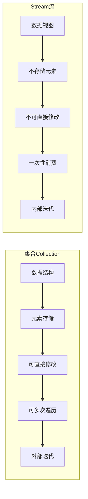

# Java Stream与集合

Java中的集合框架（如List、Set和Map）与Stream API是紧密相关但概念截然不同的两个部分。本文将帮助你理解二者的关系，区别以及如何有效地结合使用它们。

## 集合与Stream的基本概念

### 什么是集合？

集合是Java中用于存储、操作和管理对象组的容器。Java提供了丰富的集合类，如ArrayList、HashSet和HashMap等。

### 什么是Stream？

Stream是Java 8引入的处理数据序列的API，它允许以声明式方式处理集合数据，使开发者能够编写更简洁、更具表现力的代码。

:::note 关键区别
集合是一种**数据结构**，专注于数据的存储和访问，而Stream是一种**视图**，专注于对数据的计算和转换操作。
:::

## 集合与Stream的主要区别

让我们通过一个比较图来了解集合与Stream的核心区别：



### 详细比较

| 特性 | 集合 | Stream |
|------|------|--------|
| 数据存储 | 存储元素 | 不存储元素 |
| 操作方式 | 可直接修改 | 生成新的Stream |
| 迭代方式 | 外部迭代(由开发者控制) | 内部迭代(API控制) |
| 执行模式 | 立即执行 | 延迟执行(惰性求值) |
| 遍历次数 | 可多次遍历 | 只能遍历一次 |
| 并行处理 | 需手动实现 | 内置parallel()支持 |

## 从集合到Stream的转换

将集合转换为Stream非常简单，几乎所有集合都提供了`stream()`方法：

```java
// 从List创建Stream
List<String> names = Arrays.asList("Alice", "Bob", "Charlie", "David");
Stream<String> nameStream = names.stream();

// 从Set创建Stream
Set<Integer> numbers = new HashSet<>(Arrays.asList(1, 2, 3, 4, 5));
Stream<Integer> numberStream = numbers.stream();

// 从Map创建Stream
Map<String, Integer> ages = new HashMap<>();
ages.put("Alice", 25);
ages.put("Bob", 30);
ages.put("Charlie", 35);

// 获取键的Stream
Stream<String> keyStream = ages.keySet().stream();

// 获取值的Stream
Stream<Integer> valueStream = ages.values().stream();

// 获取键值对的Stream
Stream<Map.Entry<String, Integer>> entryStream = ages.entrySet().stream();
```

## 从Stream到集合的转换

Stream提供了多种终端操作，可以将流转换回集合：

```java
// 流转换为List
List<String> names = Arrays.asList("Alice", "Bob", "Charlie", "David");
List<String> filteredNames = names.stream()
                                  .filter(name -> name.startsWith("A"))
                                  .collect(Collectors.toList());
System.out.println("Filtered names: " + filteredNames); // 输出: Filtered names: [Alice]

// 流转换为Set
Set<String> nameSet = names.stream()
                          .collect(Collectors.toSet());
System.out.println("Name set: " + nameSet); // 输出: Name set: [David, Bob, Alice, Charlie]

// 流转换为Map
Map<String, Integer> nameMap = names.stream()
                                   .collect(Collectors.toMap(
                                        name -> name,           // 键映射函数
                                        name -> name.length()   // 值映射函数
                                   ));
System.out.println("Name map: " + nameMap); // 输出: Name map: {Bob=3, Alice=5, Charlie=7, David=5}

// 流转换为自定义集合
LinkedList<String> linkedList = names.stream()
                                    .collect(Collectors.toCollection(LinkedList::new));
System.out.println("Linked list: " + linkedList); // 输出: Linked list: [Alice, Bob, Charlie, David]
```

## Stream操作与集合操作的对比

让我们通过一个实际例子来对比传统集合操作和Stream操作的差异：

**需求**：从一个人员列表中筛选出年龄大于30的人，按姓名排序，并获取前3个人的姓名。

### 传统集合操作：

```java
// 定义Person类
class Person {
    private String name;
    private int age;
    
    public Person(String name, int age) {
        this.name = name;
        this.age = age;
    }
    
    public String getName() { return name; }
    public int getAge() { return age; }
}

// 使用传统集合操作
List<Person> persons = Arrays.asList(
    new Person("Tom", 25),
    new Person("Alex", 35),
    new Person("Bob", 45), 
    new Person("John", 30),
    new Person("Zack", 33)
);

// 筛选年龄大于30的人
List<Person> filteredList = new ArrayList<>();
for (Person person : persons) {
    if (person.getAge() > 30) {
        filteredList.add(person);
    }
}

// 按姓名排序
Collections.sort(filteredList, new Comparator<Person>() {
    @Override
    public int compare(Person p1, Person p2) {
        return p1.getName().compareTo(p2.getName());
    }
});

// 获取前3个人的姓名
List<String> result = new ArrayList<>();
int count = 0;
for (Person person : filteredList) {
    if (count < 3) {
        result.add(person.getName());
        count++;
    } else {
        break;
    }
}

System.out.println(result); // 输出: [Alex, Bob, Zack]
```

### Stream操作：

```java
List<Person> persons = Arrays.asList(
    new Person("Tom", 25),
    new Person("Alex", 35),
    new Person("Bob", 45), 
    new Person("John", 30),
    new Person("Zack", 33)
);

List<String> result = persons.stream()
    .filter(person -> person.getAge() > 30)
    .sorted(Comparator.comparing(Person::getName))
    .limit(3)
    .map(Person::getName)
    .collect(Collectors.toList());

System.out.println(result); // 输出: [Alex, Bob, Zack]
```

:::tip 比较
Stream操作明显更简洁、更具可读性，并且流水线式的操作链更符合人类的思维方式。
:::

## 案例分析：电子商务系统中的订单处理

假设我们有一个电子商务系统，需要处理订单数据，分析各种统计信息。

```java
class Order {
    private int id;
    private String customerName;
    private double amount;
    private String status;
    private LocalDate orderDate;
    
    // 构造函数和getter方法略
    
    public Order(int id, String customerName, double amount, String status, LocalDate orderDate) {
        this.id = id;
        this.customerName = customerName;
        this.amount = amount;
        this.status = status;
        this.orderDate = orderDate;
    }
    
    public int getId() { return id; }
    public String getCustomerName() { return customerName; }
    public double getAmount() { return amount; }
    public String getStatus() { return status; }
    public LocalDate getOrderDate() { return orderDate; }
}

// 创建订单列表
List<Order> orders = Arrays.asList(
    new Order(1, "Alice", 150.5, "COMPLETED", LocalDate.of(2023, 1, 15)),
    new Order(2, "Bob", 99.99, "PENDING", LocalDate.of(2023, 1, 16)),
    new Order(3, "Charlie", 249.95, "COMPLETED", LocalDate.of(2023, 1, 16)),
    new Order(4, "Alice", 58.75, "CANCELLED", LocalDate.of(2023, 1, 17)),
    new Order(5, "David", 399.50, "COMPLETED", LocalDate.of(2023, 1, 18)),
    new Order(6, "Bob", 129.99, "COMPLETED", LocalDate.of(2023, 1, 19))
);

// 需求1：计算所有已完成订单的总金额
double totalCompletedAmount = orders.stream()
    .filter(order -> "COMPLETED".equals(order.getStatus()))
    .mapToDouble(Order::getAmount)
    .sum();
System.out.println("已完成订单总金额: " + totalCompletedAmount); // 输出: 已完成订单总金额: 929.94

// 需求2：按客户名分组，统计每个客户的订单数量
Map<String, Long> orderCountByCustomer = orders.stream()
    .collect(Collectors.groupingBy(
        Order::getCustomerName,
        Collectors.counting()
    ));
System.out.println("客户订单数量: " + orderCountByCustomer); 
// 输出: 客户订单数量: {Bob=2, Alice=2, Charlie=1, David=1}

// 需求3：找出订单金额最高的客户
Optional<String> customerWithMaxOrder = orders.stream()
    .max(Comparator.comparing(Order::getAmount))
    .map(Order::getCustomerName);
System.out.println("订单金额最高的客户: " + customerWithMaxOrder.orElse("无")); 
// 输出: 订单金额最高的客户: David

// 需求4：按日期分组，计算每天的订单总金额
Map<LocalDate, Double> amountByDate = orders.stream()
    .collect(Collectors.groupingBy(
        Order::getOrderDate,
        Collectors.summingDouble(Order::getAmount)
    ));
System.out.println("每日订单金额: " + amountByDate);
// 输出: 每日订单金额: {2023-01-16=349.94, 2023-01-17=58.75, 2023-01-18=399.5, 2023-01-19=129.99, 2023-01-15=150.5}
```

在这个电子商务系统示例中，我们可以看到Stream API如何轻松地完成复杂的数据分析任务，包括过滤、映射、分组和聚合操作。

## 性能考量

在选择使用集合操作还是Stream操作时，需要考虑性能因素：

1. **内存使用**：集合存储所有元素，而Stream可能只在需要时处理元素，可能更节省内存。

2. **并行处理**：Stream的并行操作(`parallelStream()`)可以在多核CPU上带来明显的性能提升。

3. **延迟执行**：Stream的惰性求值特性可以避免不必要的计算。

4. **元素访问频率**：如果需要多次遍历或随机访问元素，集合通常更合适。

:::caution 注意事项
- 不要将所有代码都盲目转换为Stream操作
- 短小的循环使用传统集合操作可能更清晰
- 并行Stream并不总是比顺序执行快，需要根据数据规模和操作复杂性评估
:::

## 集合与Stream协同工作的最佳实践

为了最大化Java集合和Stream API的优势，可以采用以下实践：

1. **存储使用集合，处理使用Stream**：利用集合的存储能力和Stream的处理能力。

2. **避免不必要的转换**：如果只需要一次性处理数据，可以直接使用Stream而不必先存储为集合。

3. **使用适当的终端操作**：根据需要选择合适的终端操作将Stream结果转换为所需的形式。

4. **利用方法引用**：使用方法引用（如`Person::getName`）代替lambda表达式使代码更简洁。

5. **考虑使用Collectors工具类**：它提供了丰富的收集器，满足各种复杂的收集需求。

## 总结

Java集合和Stream API代表了数据处理的两种不同范式 - 一个关注数据存储，一个关注数据处理。理解它们的区别和联系，可以帮助我们编写更高效、更简洁的Java代码。

- **集合**是存储元素的容器，可以直接访问和修改其中的元素，适合需要频繁访问和修改的场景。
- **Stream**是对数据的视图，提供了强大的处理能力，适合复杂的数据处理场景，尤其是那些可以表达为连续操作的任务。

正确地结合使用这两种API，能够显著提高代码质量和开发效率。

## 练习

1. 创建一个包含10个整数的List，使用Stream API找出其中的偶数，并按降序排列。

2. 编写程序，使用Stream API从给定的字符串列表中找出长度大于5的字符串，并将它们转换为大写形式。

3. 给定一个Person对象的List，使用Stream API将它们按照年龄分组，得到一个Map，键为年龄段（`<18、18-65、>65`），值为对应年龄段的人员列表。

4. 尝试使用并行Stream处理一个大型集合（如包含上百万元素的List），观察与顺序处理的性能差异。

## 扩展阅读

- [Java 官方文档：Stream API](https://docs.oracle.com/javase/8/docs/api/java/util/stream/package-summary.html)
- [Java 官方文档：Collection 框架](https://docs.oracle.com/javase/tutorial/collections/index.html)
- 《Java 8 in Action》- 一本详细介绍函数式编程和Stream API的优秀书籍

通过掌握集合和Stream的协同使用，你将能够更有效地处理数据，编写更加简洁、可读和高性能的Java代码。