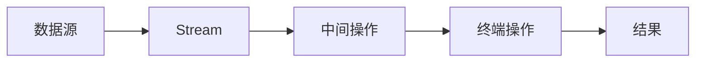

# Java Stream最佳实践

## 引言

Java 8引入的Stream API为集合处理提供了一种全新的、函数式编程风格的方法。虽然Stream API功能强大，但要高效地使用它，需要了解一些最佳实践和常见陷阱。本文将介绍Java Stream API的最佳实践，帮助你写出更加简洁、高效且易于维护的代码。

## 什么是Stream API?

在深入最佳实践之前，我们先简单回顾Stream API的核心概念：

Stream是Java 8引入的一种处理数据集合的抽象概念，它允许以声明式方式处理集合数据，通过一系列中间操作（如过滤、映射等）和终端操作（如归约、收集等）来完成数据处理。



## Stream API最佳实践

### 1. 优先使用方法引用而非Lambda表达式

当Lambda表达式仅调用一个已有方法时，使用方法引用更加简洁。

```java
// 不推荐
List<String> names = persons.stream()
    .map(person -> person.getName())
    .collect(Collectors.toList());

// 推荐
List<String> names = persons.stream()
    .map(Person::getName)
    .collect(Collectors.toList());
```

方法引用不仅使代码更简洁，而且通常更易读。

### 2. 使用适当的收集器

`Collectors`类提供了多种收集器，为不同的场景选择合适的收集器可以使代码更加简洁高效。

```java
// 收集到List
List<String> list = stream.collect(Collectors.toList());

// 收集到Set
Set<String> set = stream.collect(Collectors.toSet());

// 收集到Map
Map<Integer, String> map = persons.stream()
    .collect(Collectors.toMap(Person::getId, Person::getName));

// 分组
Map<Department, List<Employee>> byDept = employees.stream()
    .collect(Collectors.groupingBy(Employee::getDepartment));

// 字符串连接
String joined = stream.collect(Collectors.joining(", "));
```

### 3. 善用Stream的链式操作

Stream允许多个操作链式调用，但过长的链式调用可能降低代码可读性。在复杂操作中，考虑适当拆分步骤。

```java
// 较复杂的链式调用
List<String> result = persons.stream()
    .filter(p -> p.getAge() > 18)
    .map(Person::getName)
    .filter(name -> name.startsWith("A"))
    .sorted()
    .limit(10)
    .collect(Collectors.toList());

// 可以考虑拆分为多个步骤，提高可读性
Stream<Person> adultStream = persons.stream()
    .filter(p -> p.getAge() > 18);
    
Stream<String> nameStream = adultStream
    .map(Person::getName)
    .filter(name -> name.startsWith("A"));
    
List<String> result = nameStream
    .sorted()
    .limit(10)
    .collect(Collectors.toList());
```

### 4. 避免在Stream操作中修改外部变量

Stream操作应该是纯函数式的，避免在Stream操作中修改外部状态，这可能导致不可预测的行为和并发问题。

```java
// 不推荐
List<Integer> numbers = Arrays.asList(1, 2, 3, 4, 5);
int sum = 0;
numbers.stream().forEach(num -> sum += num); // 修改外部变量，不推荐

// 推荐
int sum = numbers.stream().mapToInt(Integer::intValue).sum();
```

### 5. 合理使用并行流

并行流可以提高性能，但不是所有情况都适合使用并行流。

```java
// 适合并行处理的场景：数据量大，处理每个元素的计算开销大
List<BigInteger> result = numbers.parallelStream()
    .map(this::complexCalculation)
    .collect(Collectors.toList());

// 不适合并行处理的场景：数据量小，顺序重要，或处理每个元素的开销小
List<String> result = names.stream() // 使用普通stream而非parallelStream
    .filter(name -> name.length() > 3)
    .collect(Collectors.toList());
```

:::warning
使用并行流时要注意：
1. 确保处理逻辑是线程安全的
2. 避免在并行流中使用有状态操作
3. 对于小数据集，并行处理可能因为线程调度开销而更慢
:::

### 6. 避免过度使用Stream API

虽然Stream API强大，但不是所有场景都适合使用。简单的循环操作有时反而更清晰。

```java
// 简单循环，直接使用传统for循环可能更清晰
for (Person person : persons) {
    System.out.println(person.getName());
}

// 复杂的数据处理，使用Stream更合适
Map<Department, Double> avgSalaryByDept = employees.stream()
    .collect(Collectors.groupingBy(
        Employee::getDepartment,
        Collectors.averagingDouble(Employee::getSalary)
    ));
```

### 7. 利用短路操作提高效率

Stream API中的一些操作如`findFirst()`、`anyMatch()`、`allMatch()`、`noneMatch()`以及`limit()`都是短路操作，可以在满足条件时提前结束处理。

```java
// 使用短路操作查找第一个匹配的元素
Optional<Person> result = persons.stream()
    .filter(p -> p.getAge() > 30)
    .findFirst();

// 判断是否有任何元素匹配条件
boolean hasAdult = persons.stream()
    .anyMatch(p -> p.getAge() >= 18);

// 限制处理元素数量
List<Person> firstFiveAdults = persons.stream()
    .filter(p -> p.getAge() >= 18)
    .limit(5)
    .collect(Collectors.toList());
```

### 8. 使用适当的基本类型特化Stream

对于基本类型（int, long, double），使用对应的特化Stream（IntStream, LongStream, DoubleStream）可以避免装箱/拆箱操作，提高性能。

```java
// 不推荐
int sum = numbers.stream()
    .map(Integer::intValue)
    .reduce(0, Integer::sum);

// 推荐
int sum = numbers.stream()
    .mapToInt(Integer::intValue)
    .sum();
```

### 9. 慎用Peek调试Stream

`peek()`操作可以用于调试，但不应该在生产代码中用于修改数据。

```java
// 调试时使用peek查看中间结果
List<String> result = persons.stream()
    .filter(p -> p.getAge() > 20)
    .peek(p -> System.out.println("Filtered: " + p))
    .map(Person::getName)
    .peek(name -> System.out.println("Mapped: " + name))
    .collect(Collectors.toList());
```

:::tip
在生产环境中移除或注释掉peek调用，以避免不必要的性能开销。
:::

## 实际案例：员工数据分析

现在，让我们通过一个实际案例来综合运用上述最佳实践。假设我们有一个员工列表，需要进行各种数据分析操作。

```java
class Employee {
    private String name;
    private int age;
    private String department;
    private double salary;
    
    // 构造函数、getter和setter省略
}

public class EmployeeAnalysis {
    public static void main(String[] args) {
        List<Employee> employees = Arrays.asList(
            new Employee("Alice", 30, "Engineering", 75000),
            new Employee("Bob", 45, "Engineering", 85000),
            new Employee("Charlie", 28, "Marketing", 60000),
            new Employee("Diana", 35, "Marketing", 70000),
            new Employee("Edward", 50, "HR", 65000),
            new Employee("Fiona", 25, "HR", 55000)
        );
        
        // 1. 按部门分组并计算平均薪资
        Map<String, Double> avgSalaryByDept = employees.stream()
            .collect(Collectors.groupingBy(
                Employee::getDepartment,
                Collectors.averagingDouble(Employee::getSalary)
            ));
        
        avgSalaryByDept.forEach((dept, avgSalary) -> 
            System.out.println(dept + ": $" + avgSalary));
        
        // 输出:
        // Engineering: $80000.0
        // Marketing: $65000.0
        // HR: $60000.0
        
        // 2. 找出每个部门薪资最高的员工
        Map<String, Optional<Employee>> topEarnerByDept = employees.stream()
            .collect(Collectors.groupingBy(
                Employee::getDepartment,
                Collectors.maxBy(Comparator.comparing(Employee::getSalary))
            ));
        
        topEarnerByDept.forEach((dept, empOpt) -> 
            empOpt.ifPresent(emp -> 
                System.out.println(dept + " top earner: " + emp.getName() + " ($" + emp.getSalary() + ")")
            ));
        
        // 输出:
        // Engineering top earner: Bob ($85000.0)
        // Marketing top earner: Diana ($70000.0)
        // HR top earner: Edward ($65000.0)
        
        // 3. 计算所有35岁以下员工的薪资总和
        double totalSalaryUnder35 = employees.stream()
            .filter(emp -> emp.getAge() < 35)
            .mapToDouble(Employee::getSalary)
            .sum();
        
        System.out.println("Total salary for employees under 35: $" + totalSalaryUnder35);
        // 输出: Total salary for employees under 35: $175000.0
        
        // 4. 按薪资范围统计员工数量
        Map<String, Long> employeeCountBySalaryRange = employees.stream()
            .collect(Collectors.groupingBy(
                emp -> {
                    double salary = emp.getSalary();
                    if (salary < 60000) return "Low";
                    else if (salary < 80000) return "Medium";
                    else return "High";
                },
                Collectors.counting()
            ));
        
        System.out.println("Employee count by salary range: " + employeeCountBySalaryRange);
        // 输出: Employee count by salary range: {Low=1, Medium=3, High=2}
    }
}
```

这个案例演示了如何使用Stream API进行高效的数据分析，包括分组、统计、过滤和转换等操作。注意我们遵循了前面提到的最佳实践：使用适当的收集器、避免外部状态修改、使用基本类型特化Stream等。

## 总结

Java Stream API是一个强大的工具，可以让数据处理代码更加简洁和声明式。通过遵循本文介绍的最佳实践，你可以写出更高效、更易维护的Stream处理代码。关键点回顾：

1. 优先使用方法引用而非Lambda表达式
2. 选择适当的收集器
3. 合理使用链式操作，避免过长的链
4. 避免在Stream操作中修改外部变量
5. 谨慎使用并行流，并确保线程安全
6. 对简单场景考虑使用传统循环
7. 利用短路操作提高效率
8. 使用基本类型特化Stream避免装箱/拆箱
9. 只在调试时使用peek

## 练习与资源

为了巩固所学知识，建议尝试以下练习：

1. 将一个复杂的循环重构为使用Stream API
2. 分析你现有的使用Stream的代码，看是否遵循了最佳实践
3. 尝试使用并行流处理大数据集，并比较与普通Stream的性能差异

### 更多学习资源

- [Java Stream API官方文档](https://docs.oracle.com/javase/8/docs/api/java/util/stream/package-summary.html)
- 《Java 8实战》(Java 8 in Action) - Raoul-Gabriel Urma等著
- 《Effective Java》(第三版) - Joshua Bloch著，特别是关于Lambda和Stream的章节

:::tip
学习Stream API的最好方式是实践。从简单的例子开始，逐渐尝试更复杂的数据转换和处理操作。
:::

记住，Stream API是一个工具，目标是使代码更清晰、更易于理解和维护。如果使用Stream反而让代码变得复杂难懂，那可能需要重新考虑是否适合使用Stream或如何更好地组织代码。