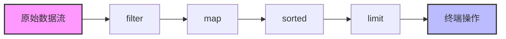

# Java Stream 中间操作

在 Java 8 中引入的 Stream API 是处理集合的强大工具，它允许以函数式编程的方式对数据进行操作。Stream API 的操作分为两类：**中间操作**和**终端操作**。本文将详细介绍 Stream 中的各种中间操作。

## 什么是中间操作？

中间操作是指返回新 Stream 的操作，这使得我们可以将多个中间操作链接起来形成一个处理管道。中间操作的一个重要特点是**惰性求值**，也就是说，在遇到终端操作之前，中间操作不会被执行。

:::note
中间操作与终端操作的主要区别：中间操作返回一个新的 Stream，而终端操作会产生一个结果或副作用。
:::

## 常用的中间操作

### 1. filter - 过滤元素

`filter` 操作接受一个谓词（返回布尔值的函数）作为参数，并返回一个只包含满足该谓词的元素的新 Stream。

```java
List<Integer> numbers = Arrays.asList(1, 2, 3, 4, 5, 6);
List<Integer> evenNumbers = numbers.stream()
                                  .filter(n -> n % 2 == 0)
                                  .collect(Collectors.toList());
System.out.println(evenNumbers); // 输出: [2, 4, 6]
```

### 2. map - 映射元素

`map` 操作将每个元素转换成另一个对象，通过提供的函数应用于每个元素，生成新的元素。

```java
List<String> names = Arrays.asList("Alice", "Bob", "Charlie");
List<Integer> nameLengths = names.stream()
                               .map(String::length)
                               .collect(Collectors.toList());
System.out.println(nameLengths); // 输出: [5, 3, 7]
```

### 3. flatMap - 扁平化嵌套集合

`flatMap` 操作用于处理嵌套集合，它将每个元素映射到一个 Stream，然后将这些 Stream 合并为一个 Stream。

```java
List<List<Integer>> nestedList = Arrays.asList(
    Arrays.asList(1, 2, 3),
    Arrays.asList(4, 5, 6),
    Arrays.asList(7, 8, 9)
);

List<Integer> flattenedList = nestedList.stream()
                                     .flatMap(Collection::stream)
                                     .collect(Collectors.toList());
System.out.println(flattenedList); // 输出: [1, 2, 3, 4, 5, 6, 7, 8, 9]
```

### 4. distinct - 去除重复元素

`distinct` 操作返回一个由不同元素（根据 `equals()` 方法）组成的 Stream。

```java
List<Integer> numbers = Arrays.asList(1, 2, 2, 3, 4, 4, 5);
List<Integer> distinctNumbers = numbers.stream()
                                    .distinct()
                                    .collect(Collectors.toList());
System.out.println(distinctNumbers); // 输出: [1, 2, 3, 4, 5]
```

### 5. sorted - 排序元素

`sorted` 操作按照自然顺序（使用 Comparable）或指定的 Comparator 对元素进行排序。

```java
// 使用自然顺序排序
List<Integer> numbers = Arrays.asList(5, 3, 8, 1, 2);
List<Integer> sortedNumbers = numbers.stream()
                                  .sorted()
                                  .collect(Collectors.toList());
System.out.println(sortedNumbers); // 输出: [1, 2, 3, 5, 8]

// 使用自定义Comparator排序
List<String> names = Arrays.asList("Alice", "Bob", "Charlie", "David");
List<String> sortedByLength = names.stream()
                                 .sorted(Comparator.comparingInt(String::length))
                                 .collect(Collectors.toList());
System.out.println(sortedByLength); // 输出: [Bob, Alice, David, Charlie]
```

### 6. limit - 限制元素数量

`limit` 操作截取 Stream 前 n 个元素，返回一个大小不超过 n 的新 Stream。

```java
List<Integer> numbers = Arrays.asList(1, 2, 3, 4, 5, 6, 7, 8, 9, 10);
List<Integer> firstFive = numbers.stream()
                              .limit(5)
                              .collect(Collectors.toList());
System.out.println(firstFive); // 输出: [1, 2, 3, 4, 5]
```

### 7. skip - 跳过元素

`skip` 操作跳过前 n 个元素，返回由剩余元素组成的 Stream。

```java
List<Integer> numbers = Arrays.asList(1, 2, 3, 4, 5, 6, 7, 8, 9, 10);
List<Integer> afterFive = numbers.stream()
                              .skip(5)
                              .collect(Collectors.toList());
System.out.println(afterFive); // 输出: [6, 7, 8, 9, 10]
```

### 8. peek - 查看元素

`peek` 操作用于在不修改 Stream 的情况下，查看或调试 Stream 中的元素。

```java
List<Integer> numbers = Arrays.asList(1, 2, 3, 4, 5);
List<Integer> result = numbers.stream()
                           .peek(n -> System.out.println("Processing: " + n))
                           .map(n -> n * 2)
                           .collect(Collectors.toList());
System.out.println(result); 
// 输出:
// Processing: 1
// Processing: 2
// Processing: 3
// Processing: 4
// Processing: 5
// [2, 4, 6, 8, 10]
```

## 中间操作的组合使用

中间操作的真正威力在于它们可以被链接使用，形成一个处理管道。每个操作都会生成一个新的 Stream，可以在此基础上继续添加其他操作。

```java
List<String> words = Arrays.asList("Java", "Stream", "API", "is", "powerful", "and", "efficient");

List<String> processedWords = words.stream()
                                .filter(word -> word.length() > 3)
                                .map(String::toUpperCase)
                                .sorted()
                                .limit(3)
                                .collect(Collectors.toList());

System.out.println(processedWords); // 输出: [EFFICIENT, JAVA, POWERFUL]
```

## 惰性求值特性

Stream 中间操作的一个关键特性是惰性求值（lazy evaluation）。这意味着中间操作不会立即执行，而是在遇到终端操作时才会一次性执行所有的中间操作。

这种设计带来了性能优势，因为 Stream 可以优化整个处理管道，而不是单独执行每个操作。

```java
List<Integer> numbers = Arrays.asList(1, 2, 3, 4, 5, 6, 7, 8, 9, 10);

// 只有在调用终端操作 findFirst() 时，才会执行过滤和映射操作
Optional<Integer> firstEvenSquare = numbers.stream()
                                      .filter(n -> {
                                          System.out.println("Filtering: " + n);
                                          return n % 2 == 0;
                                      })
                                      .map(n -> {
                                          System.out.println("Mapping: " + n);
                                          return n * n;
                                      })
                                      .findFirst();

System.out.println("First even square: " + firstEvenSquare.orElse(0));
// 输出:
// Filtering: 1
// Filtering: 2
// Mapping: 2
// First even square: 4
```

注意在上面的例子中，尽管集合中有10个元素，但实际上只处理了前两个元素就找到了结果，这就是短路求值的优势。

## 实际应用场景

### 场景1：处理电商平台商品数据

假设我们有一个电商平台的商品列表，需要找出价格在100-500元之间的电子产品，按价格从低到高排序，并取前5个商品。

```java
class Product {
    private String name;
    private String category;
    private double price;

    public Product(String name, String category, double price) {
        this.name = name;
        this.category = category;
        this.price = price;
    }

    // Getters
    public String getName() { return name; }
    public String getCategory() { return category; }
    public double getPrice() { return price; }

    @Override
    public String toString() {
        return name + " (" + category + "): " + price + "元";
    }
}

// 商品列表
List<Product> products = Arrays.asList(
    new Product("iPhone 13", "electronics", 5999),
    new Product("USB线", "electronics", 49),
    new Product("无线鼠标", "electronics", 199),
    new Product("机械键盘", "electronics", 349),
    new Product("笔记本电脑", "electronics", 4999),
    new Product("床垫", "home", 999),
    new Product("衬衫", "clothing", 299),
    new Product("蓝牙耳机", "electronics", 499),
    new Product("显示器", "electronics", 1299),
    new Product("充电宝", "electronics", 199)
);

// 应用Stream中间操作
List<Product> filteredProducts = products.stream()
    .filter(p -> "electronics".equals(p.getCategory()))
    .filter(p -> p.getPrice() >= 100 && p.getPrice() <= 500)
    .sorted(Comparator.comparing(Product::getPrice))
    .limit(5)
    .collect(Collectors.toList());

filteredProducts.forEach(System.out::println);
// 输出:
// 无线鼠标 (electronics): 199.0元
// 充电宝 (electronics): 199.0元
// 机械键盘 (electronics): 349.0元
// 蓝牙耳机 (electronics): 499.0元
```

### 场景2：处理日志数据

假设我们有一组日志记录，需要提取所有ERROR级别的日志，并格式化显示最近的5条记录：

```java
class LogEntry {
    private String level;
    private String message;
    private LocalDateTime timestamp;

    public LogEntry(String level, String message, LocalDateTime timestamp) {
        this.level = level;
        this.message = message;
        this.timestamp = timestamp;
    }

    // Getters
    public String getLevel() { return level; }
    public String getMessage() { return message; }
    public LocalDateTime getTimestamp() { return timestamp; }
}

// 创建日志列表
List<LogEntry> logs = new ArrayList<>();
// ... 假设日志列表已经填充 ...

// 处理日志
List<String> recentErrors = logs.stream()
    .filter(log -> "ERROR".equals(log.getLevel()))
    .sorted(Comparator.comparing(LogEntry::getTimestamp).reversed())
    .limit(5)
    .map(log -> log.getTimestamp() + ": " + log.getMessage())
    .collect(Collectors.toList());
```

## 性能考量与最佳实践

在使用 Stream 中间操作时，需要注意以下几点：

1. **操作顺序很重要**：先执行能减少元素数量的操作（如 `filter`）可以提高性能。
2. **避免过度使用 `peek`**：在生产环境中，`peek` 主要用于调试目的。
3. **注意无限流**：使用 `limit` 等操作限制从无限流中生成的元素数量。
4. **留意有状态操作**：如 `sorted`、`distinct` 等可能会消耗更多内存和计算资源。



## 总结

Stream 中间操作是 Java Stream API 的核心功能之一，它们允许我们以流水线的方式处理数据，使代码更加简洁和可读。通过组合不同的中间操作，我们可以创建强大的数据处理管道，实现复杂的数据转换和过滤逻辑。

关键要点：

- 中间操作返回一个新的 Stream，可以链式调用
- 中间操作具有惰性求值特性
- 常用的中间操作包括 `filter`、`map`、`flatMap`、`distinct`、`sorted`、`limit`、`skip` 和 `peek`
- 操作的顺序对性能有显著影响

## 练习

1. 创建一个字符串列表，使用 Stream 找出所有以字母"a"开头的字符串，将它们转换为大写，并按字母顺序排序。
2. 给定一个整数列表，找出所有的偶数，将它们的平方值去重，然后按降序排序。
3. 给定一个由多个句子组成的字符串列表，使用 `flatMap` 将所有句子分割成单词，然后计算单词总数。

## 进一步学习资源

- Java 官方文档: [Stream API](https://docs.oracle.com/javase/8/docs/api/java/util/stream/package-summary.html)
- 《Java 8 in Action》书籍
- 《Effective Java》(第三版) 中关于 Streams 的章节

通过掌握 Stream 中间操作，你将能够编写更加简洁、高效且易于维护的 Java 代码，特别是在处理集合数据时。继续练习，将这些概念应用到实际项目中，你会发现 Java Stream API 是一个非常强大的工具。