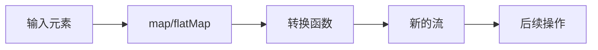

# Java Stream映射

在Java Stream API中，映射（Mapping）是一种常用的转换操作，它允许我们将流中的元素从一种形式转换为另一种形式。映射操作通过应用一个函数到流的每个元素上，生成一个包含转换结果的新流。这种转换能力使得数据处理变得异常灵活和强大。

## 映射操作的基础

Stream API提供了多种映射方法，最基础的是`map()`方法。让我们先了解什么是映射操作：

:::note 映射定义
映射是一种将流中的每个元素转换为另一种形式的操作，转换后的元素会形成一个新的流。
:::

## map方法

`map()`方法接收一个函数作为参数，该函数会被应用到流中的每个元素上，然后返回一个包含转换结果的新流。

### 基本语法

```java
<R> Stream<R> map(Function<? super T, ? extends R> mapper)
```

### 简单示例

```java
List<String> names = Arrays.asList("Alice", "Bob", "Charlie");

// 将每个名字转换为大写
List<String> uppercaseNames = names.stream()
                                  .map(name -> name.toUpperCase())
                                  .collect(Collectors.toList());

System.out.println("原始名字: " + names);
System.out.println("转换后的名字: " + uppercaseNames);
```

输出：
```
原始名字: [Alice, Bob, Charlie]
转换后的名字: [ALICE, BOB, CHARLIE]
```

## 特殊映射方法

除了基本的`map()`方法外，Stream API还提供了几种特殊的映射方法，用于处理原始类型（primitive types）或者更复杂的映射场景。

### 1. mapToInt、mapToLong和mapToDouble

这些方法用于将对象流映射为原始类型流，避免了自动装箱/拆箱的性能开销。

```java
List<String> numbers = Arrays.asList("1", "2", "3", "4", "5");

// 将字符串转换为整数并计算总和
int sum = numbers.stream()
                .mapToInt(Integer::parseInt)
                .sum();

System.out.println("字符串数字之和: " + sum);
```

输出：
```
字符串数字之和: 15
```

### 2. flatMap方法

`flatMap()`方法用于处理嵌套结构，它将流中的每个元素映射为一个流，然后将所有生成的流连接成一个流。

:::tip
`flatMap()`非常适合处理嵌套集合或者需要将一对多映射扁平化的场景。
:::

#### 基本语法

```java
<R> Stream<R> flatMap(Function<? super T, ? extends Stream<? extends R>> mapper)
```

#### 示例：处理嵌套列表

```java
List<List<Integer>> nestedNumbers = Arrays.asList(
    Arrays.asList(1, 2, 3),
    Arrays.asList(4, 5, 6),
    Arrays.asList(7, 8, 9)
);

// 使用flatMap将嵌套列表扁平化为单个流
List<Integer> flattenedNumbers = nestedNumbers.stream()
                                            .flatMap(list -> list.stream())
                                            .collect(Collectors.toList());

System.out.println("嵌套列表: " + nestedNumbers);
System.out.println("扁平化后的列表: " + flattenedNumbers);
```

输出：
```
嵌套列表: [[1, 2, 3], [4, 5, 6], [7, 8, 9]]
扁平化后的列表: [1, 2, 3, 4, 5, 6, 7, 8, 9]
```

## 映射操作的实际应用场景

让我们看一些映射操作在实际应用中的例子：

### 场景1：处理对象列表

假设我们有一个`Person`类，现在需要从一个人员列表中提取所有人的名字。

```java
class Person {
    private String name;
    private int age;
    
    // 构造函数、getters和setters
    public Person(String name, int age) {
        this.name = name;
        this.age = age;
    }
    
    public String getName() {
        return name;
    }
    
    public int getAge() {
        return age;
    }
}

// 使用map从Person对象列表中提取名字
List<Person> persons = Arrays.asList(
    new Person("Alice", 25),
    new Person("Bob", 30),
    new Person("Charlie", 35)
);

List<String> names = persons.stream()
                          .map(Person::getName)
                          .collect(Collectors.toList());

System.out.println("人员名单: " + names);
```

输出：
```
人员名单: [Alice, Bob, Charlie]
```

### 场景2：文件处理

假设我们有一个文本文件，每行包含一个逗号分隔的单词列表，我们想要提取所有的唯一单词。

```java
// 假设我们已经有了文件的行列表
List<String> lines = Arrays.asList(
    "hello,world,java",
    "stream,map,flatMap",
    "hello,stream,example"
);

// 使用flatMap将每行拆分为单词，然后收集所有唯一单词
Set<String> uniqueWords = lines.stream()
                             .flatMap(line -> Arrays.stream(line.split(",")))
                             .collect(Collectors.toSet());

System.out.println("唯一单词: " + uniqueWords);
```

输出：
```
唯一单词: [world, example, flatMap, map, java, hello, stream]
```

### 场景3：转换与过滤组合

映射操作通常与其他Stream操作一起使用，比如过滤和排序。

```java
List<Person> persons = Arrays.asList(
    new Person("Alice", 25),
    new Person("Bob", 30),
    new Person("Charlie", 35),
    new Person("David", 20)
);

// 找出年龄大于25岁的人的名字，并按字母顺序排序
List<String> filteredNames = persons.stream()
                                  .filter(p -> p.getAge() > 25)
                                  .map(Person::getName)
                                  .sorted()
                                  .collect(Collectors.toList());

System.out.println("年龄大于25岁的人（按名字排序）: " + filteredNames);
```

输出：
```
年龄大于25岁的人（按名字排序）: [Bob, Charlie]
```

## 映射操作的执行流程

为了更好地理解映射操作如何工作，以下是一个流水线执行的图示：



## 性能考虑

使用映射操作时，有几点性能考虑：

1. 对于大量数据，使用适当的原始类型映射方法（`mapToInt`、`mapToLong`等）可以避免装箱/拆箱的性能开销。
2. `flatMap`操作在处理复杂的嵌套结构时很有用，但可能比简单的`map`操作消耗更多资源。
3. 对于简单的映射操作，可以考虑使用方法引用（如`Person::getName`）而不是lambda表达式，这样代码更简洁。

:::caution
对于非常大的数据集，可能需要考虑使用并行流（`parallelStream()`）来提高性能，但要注意并行处理可能引入的复杂性。
:::

## 总结

Java Stream API中的映射操作是处理和转换数据的强大工具：

- `map`方法用于一对一转换
- `mapToInt`、`mapToLong`和`mapToDouble`用于对象到原始类型的转换
- `flatMap`方法用于一对多转换和扁平化嵌套结构

映射操作通常与其他Stream操作（如过滤、排序和收集）结合使用，构成灵活的数据处理管道。掌握这些操作将大大提高你处理集合数据的能力。

## 练习

1. 使用`map`方法将一个字符串列表中的所有字符串转换为它们的长度。
2. 使用`flatMap`将一个二维整数数组转换为一个包含所有元素的扁平列表。
3. 结合`filter`和`map`操作，从一个`Product`对象列表中提取所有价格高于100的产品名称。

## 延伸阅读

- Java官方文档中关于Stream API的部分
- 函数式编程和lambda表达式的进阶内容
- 关于原始类型流（IntStream、LongStream等）的更多信息

掌握Stream映射操作将帮助你以更声明式、更简洁的方式处理复杂的数据转换任务，这是现代Java编程中的一项重要技能。