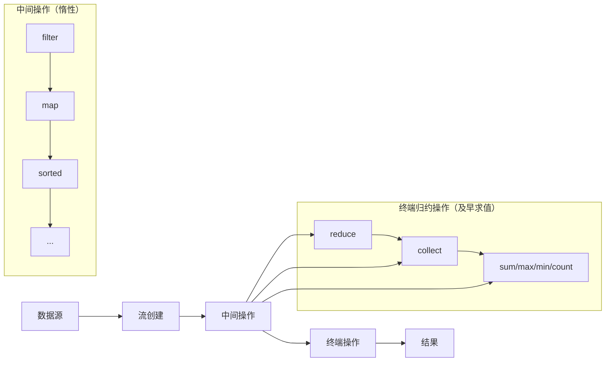

# Java Stream归约

Stream API 是 Java 8 引入的一个重要特性，而归约(reduction)操作是 Stream API 中的核心功能之一。归约操作能将流中的所有元素通过某种计算方式合并成一个结果。本文将详细介绍 Java Stream API 中的归约操作，帮助初学者掌握这一重要概念。

## 什么是归约操作？

归约操作是将一个数据集合（例如列表或数组）通过重复应用某个组合操作，最终将其简化为单个结果的过程。例如，计算一个整数列表的总和或找出最大值都是归约操作的例子。

在 Stream API 中，归约主要通过以下几种方式实现：
- `reduce()` 方法
- 特化的归约操作（如 `sum()`, `max()`, `min()`, `count()`）
- 使用 `collect()` 方法和收集器

## reduce() 方法详解

`reduce()` 方法是 Stream API 提供的通用归约操作。它有三种重载形式：

### 1. 带初始值的二元操作

```java
<T> T reduce(T identity, BinaryOperator<T> accumulator)
```

参数说明：
- `identity`: 初始值，也是当流为空时的默认结果
- `accumulator`: 累加器，一个二元操作，用于合并两个值

示例：计算整数列表的总和

```java
List<Integer> numbers = Arrays.asList(1, 2, 3, 4, 5);
int sum = numbers.stream()
                 .reduce(0, (a, b) -> a + b);
System.out.println("Sum: " + sum);  // 输出: Sum: 15
```

:::tip
上面的例子也可以使用方法引用简化为：
```java
int sum = numbers.stream().reduce(0, Integer::sum);
```
:::

执行过程：

1. 初始值为 0
2. 0 + 1 = 1
3. 1 + 2 = 3
4. 3 + 3 = 6
5. 6 + 4 = 10
6. 10 + 5 = 15

### 2. 无初始值的二元操作

```java
Optional<T> reduce(BinaryOperator<T> accumulator)
```

当流可能为空时，此方法返回 `Optional` 对象，避免空指针异常。

示例：找出最大值

```java
List<Integer> numbers = Arrays.asList(5, 3, 9, 1, 7);
Optional<Integer> max = numbers.stream()
                             .reduce(Integer::max);
max.ifPresent(value -> System.out.println("Max value: " + value));  // 输出: Max value: 9
```

### 3. 带组合器的归约

```java
<U> U reduce(U identity, BiFunction<U, ? super T, U> accumulator, BinaryOperator<U> combiner)
```

这种形式主要用于并行流处理，其中：
- `combiner`: 用于合并并行执行的结果

示例：并行计算字符串长度总和

```java
List<String> words = Arrays.asList("Hello", "World", "Java", "Stream", "API");
int totalLength = words.parallelStream()
                      .reduce(0,
                             (sum, word) -> sum + word.length(),
                             Integer::sum);
System.out.println("Total length: " + totalLength);  // 输出: Total length: 22
```

## 特化的归约操作

为了常见的归约操作，Stream API 提供了一些便捷方法：

### 数值流上的操作

对于 `IntStream`, `LongStream` 和 `DoubleStream`，有以下方法：

```java
List<Integer> numbers = Arrays.asList(1, 2, 3, 4, 5);

// 求和
int sum = numbers.stream()
               .mapToInt(Integer::intValue)
               .sum();
System.out.println("Sum: " + sum);  // 输出: Sum: 15

// 最大值
OptionalInt max = numbers.stream()
                      .mapToInt(Integer::intValue)
                      .max();
System.out.println("Max: " + max.orElse(0));  // 输出: Max: 5

// 最小值
OptionalInt min = numbers.stream()
                      .mapToInt(Integer::intValue)
                      .min();
System.out.println("Min: " + min.orElse(0));  // 输出: Min: 1

// 计数
long count = numbers.stream().count();
System.out.println("Count: " + count);  // 输出: Count: 5

// 平均值
OptionalDouble avg = numbers.stream()
                         .mapToInt(Integer::intValue)
                         .average();
System.out.println("Average: " + avg.orElse(0));  // 输出: Average: 3.0
```

## 使用 collect() 进行归约

`collect()` 方法是 Stream API 中另一种强大的归约操作，它使用 `Collector` 接口来指定归约逻辑。

### 基本收集操作

```java
List<String> fruits = Arrays.asList("Apple", "Banana", "Orange", "Mango", "Grapes");

// 收集到List
List<String> fruitList = fruits.stream()
                             .collect(Collectors.toList());

// 收集到Set
Set<String> fruitSet = fruits.stream()
                           .collect(Collectors.toSet());

// 收集到特定的集合
LinkedList<String> linkedList = fruits.stream()
                                   .collect(Collectors.toCollection(LinkedList::new));

// 连接字符串
String joinedString = fruits.stream()
                          .collect(Collectors.joining(", "));
System.out.println(joinedString);  // 输出: Apple, Banana, Orange, Mango, Grapes
```

### 分组和分区

```java
List<Employee> employees = Arrays.asList(
    new Employee("Alice", "IT", 75000),
    new Employee("Bob", "HR", 65000),
    new Employee("Charlie", "IT", 80000),
    new Employee("Diana", "Finance", 95000),
    new Employee("Eve", "HR", 70000)
);

// 按部门分组
Map<String, List<Employee>> byDepartment = employees.stream()
    .collect(Collectors.groupingBy(Employee::getDepartment));

// 按薪资水平分区（高于或低于80000）
Map<Boolean, List<Employee>> partitionedBySalary = employees.stream()
    .collect(Collectors.partitioningBy(e -> e.getSalary() > 80000));
```

### 统计信息

```java
// 计算统计信息
DoubleSummaryStatistics salaryStats = employees.stream()
    .collect(Collectors.summarizingDouble(Employee::getSalary));

System.out.println("Count: " + salaryStats.getCount());
System.out.println("Sum: " + salaryStats.getSum());
System.out.println("Min: " + salaryStats.getMin());
System.out.println("Average: " + salaryStats.getAverage());
System.out.println("Max: " + salaryStats.getMax());
```

## 实际应用案例

### 案例1：购物车总金额计算

假设我们有一个在线购物系统，需要计算购物车中所有商品的总价：

```java
class Product {
    private String name;
    private double price;
    private int quantity;
    
    // 构造器、getter和setter省略
    
    public Product(String name, double price, int quantity) {
        this.name = name;
        this.price = price;
        this.quantity = quantity;
    }
    
    public double getTotal() {
        return price * quantity;
    }
    
    public String getName() {
        return name;
    }
    
    public double getPrice() {
        return price;
    }
    
    public int getQuantity() {
        return quantity;
    }
}

public class ShoppingCart {
    public static void main(String[] args) {
        List<Product> cart = Arrays.asList(
            new Product("Laptop", 1299.99, 1),
            new Product("Phone", 699.99, 2),
            new Product("Headphones", 159.99, 1),
            new Product("Charger", 29.99, 3)
        );
        
        // 使用reduce计算总价
        double totalPrice = cart.stream()
                              .map(Product::getTotal)
                              .reduce(0.0, Double::sum);
        
        System.out.printf("Total price: $%.2f%n", totalPrice);  // 输出: Total price: $2649.94
        
        // 获取购物车摘要
        String summary = cart.stream()
                          .map(p -> String.format("%s x%d: $%.2f", 
                               p.getName(), p.getQuantity(), p.getTotal()))
                          .collect(Collectors.joining("\n"));
        
        System.out.println("Cart Summary:\n" + summary);
    }
}
```

### 案例2：文本词频统计

当我们需要分析一篇文章中各个单词出现的频率时：

```java
public class WordFrequencyCounter {
    public static void main(String[] args) {
        String text = "Stream API is a powerful feature of Java. " +
                    "Stream API enables functional-style operations on streams. " +
                    "A stream is a sequence of objects that supports various methods " +
                    "which can be pipelined to produce the desired result.";
        
        // 将文本分割为单词并统计频率
        Map<String, Long> wordFrequency = Arrays.stream(text.split("\\s+"))
            .map(word -> word.replaceAll("[^a-zA-Z]", "").toLowerCase())
            .filter(word -> !word.isEmpty())
            .collect(Collectors.groupingBy(
                word -> word, 
                Collectors.counting()
            ));
        
        // 找出出现频率最高的前5个单词
        wordFrequency.entrySet().stream()
            .sorted(Map.Entry.<String, Long>comparingByValue().reversed())
            .limit(5)
            .forEach(entry -> System.out.println(
                entry.getKey() + ": " + entry.getValue()
            ));
    }
}
```

## 归约操作的性能考虑

在使用归约操作时，有几个性能因素需要考虑：

1. **并行流**：对于大数据集，可以考虑使用`parallelStream()`来提高性能，但需要确保操作是无状态且线程安全的。

2. **短路操作**：使用`findFirst()`, `findAny()`, `anyMatch()`, `allMatch()`, `noneMatch()`等操作可以在满足条件时提前终止流处理。

3. **惰性求值与及早求值**：Stream API 使用惰性求值模式，只有在遇到及早求值操作（如 `collect()`, `reduce()`）时才会执行。合理安排操作顺序可以提高性能。

```java
// 高效方式：先过滤，再映射
List<String> longNames = persons.stream()
    .filter(p -> p.getAge() > 20)  // 先过滤减少数据量
    .map(Person::getName)          // 再映射，处理更少的元素
    .collect(Collectors.toList());

// 低效方式：先映射，再过滤
List<String> longNames = persons.stream()
    .map(Person::getName)          // 映射所有元素
    .filter(name -> name.length() > 5)  // 过滤后才减少
    .collect(Collectors.toList());
```

## 流操作中的归约流程图

下面是一个归约操作的流程图，展示数据如何通过 Stream API 的管道处理：



## 总结

Java Stream API 提供的归约操作是处理数据集合的强大工具，它们允许我们用声明式而非命令式的方式表达复杂的数据处理流程：

1. `reduce()` 方法提供了灵活的归约机制，可以从流中生成单个结果。
2. 特化的归约操作如 `sum()`, `max()`, `min()` 提供了更便捷的使用方式。
3. `collect()` 方法结合各种收集器，提供了丰富的聚合功能。

掌握这些归约操作，能帮助你编写更简洁、更可读、更高效的代码，特别是在处理大型数据集时。

## 练习

为了巩固所学知识，尝试完成以下练习：

1. 使用 `reduce()` 方法查找字符串列表中最长的字符串。
2. 使用流操作计算一个整数列表中所有偶数的平方和。
3. 创建一个程序，使用 `collect()` 方法按首字母将名称列表分组。
4. 实现一个函数，计算一组学生的平均分，并找出高于平均分的学生。

## 附加资源

要深入了解 Java Stream API 的归约操作，可以参考以下资源：

- [Java 官方文档 - Stream](https://docs.oracle.com/javase/8/docs/api/java/util/stream/Stream.html)
- [Java 官方文档 - Collectors](https://docs.oracle.com/javase/8/docs/api/java/util/stream/Collectors.html)

:::tip
归约操作是函数式编程的重要概念，掌握它将有助于你更好地理解和使用函数式编程范式。
:::