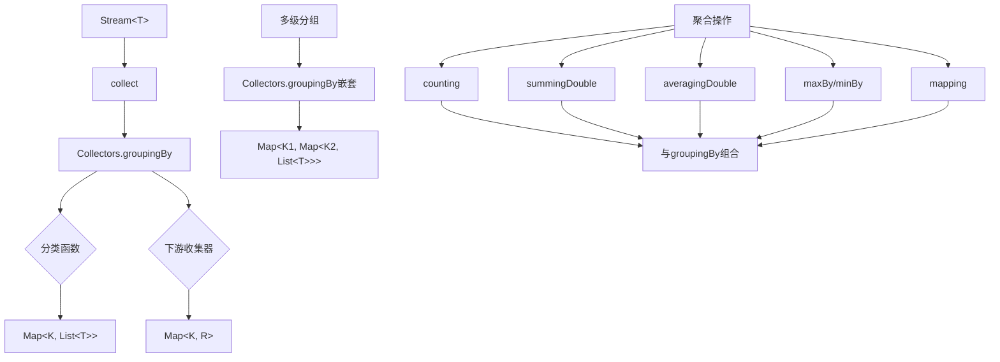

# Java Stream分组

在处理大量数据时，我们经常需要将数据按照某些特征进行分类或分组，以便进行后续的统计和分析。Java 8引入的Stream API提供了强大的`groupingBy`方法，让我们能够轻松地实现数据分组。本文将详细介绍Java Stream的分组操作，帮助你掌握这一实用技能。

## 什么是Stream分组？

Stream分组是指将流中的元素按照指定的特征或条件进行分类，将具有相同特征的元素归为一组。这类似于SQL中的`GROUP BY`语句。在Java Stream API中，分组主要通过`Collectors.groupingBy()`方法实现。

:::note
分组操作是Stream API中终端操作的一种，它会触发流的计算并返回结果。
:::

## 基本分组操作

让我们从一个简单的例子开始，假设我们有一个学生列表，需要按照学生的年级进行分组。

首先，定义一个学生类：

```java
public class Student {
    private String name;
    private int grade;
    private String major;
    private double score;
    
    // 构造函数、getter和setter方法
    public Student(String name, int grade, String major, double score) {
        this.name = name;
        this.grade = grade;
        this.major = major;
        this.score = score;
    }
    
    public String getName() { return name; }
    public int getGrade() { return grade; }
    public String getMajor() { return major; }
    public double getScore() { return score; }
    
    @Override
    public String toString() {
        return name + "(grade=" + grade + ", major=" + major + ", score=" + score + ")";
    }
}
```

现在，我们创建一个学生列表并按年级分组：

```java
import java.util.Arrays;
import java.util.List;
import java.util.Map;
import java.util.stream.Collectors;

public class StreamGroupingExample {
    public static void main(String[] args) {
        List<Student> students = Arrays.asList(
            new Student("Alice", 1, "Computer Science", 85.5),
            new Student("Bob", 2, "Physics", 76.0),
            new Student("Charlie", 1, "Mathematics", 92.5),
            new Student("David", 2, "Computer Science", 88.0),
            new Student("Eve", 3, "Mathematics", 90.5),
            new Student("Frank", 3, "Computer Science", 71.5)
        );
        
        // 按年级分组
        Map<Integer, List<Student>> studentsByGrade = students.stream()
            .collect(Collectors.groupingBy(Student::getGrade));
        
        // 输出结果
        studentsByGrade.forEach((grade, studentList) -> {
            System.out.println("Grade " + grade + " students:");
            studentList.forEach(student -> System.out.println("  " + student));
        });
    }
}
```

输出结果：

```
Grade 1 students:
  Alice(grade=1, major=Computer Science, score=85.5)
  Charlie(grade=1, major=Mathematics, score=92.5)
Grade 2 students:
  Bob(grade=2, major=Physics, score=76.0)
  David(grade=2, major=Computer Science, score=88.0)
Grade 3 students:
  Eve(grade=3, major=Mathematics, score=90.5)
  Frank(grade=3, major=Computer Science, score=71.5)
```

在这个例子中，`Collectors.groupingBy(Student::getGrade)`将学生按照年级分组，结果是一个Map，其中键是年级，值是该年级的学生列表。

## 多级分组

有时我们需要进行多级分组，例如先按年级分组，然后再按专业分组。Stream API允许我们通过嵌套`groupingBy`来实现多级分组：

```java
// 多级分组：先按年级，再按专业
Map<Integer, Map<String, List<Student>>> studentsByGradeAndMajor = students.stream()
    .collect(Collectors.groupingBy(
        Student::getGrade,
        Collectors.groupingBy(Student::getMajor)
    ));

// 输出结果
studentsByGradeAndMajor.forEach((grade, majorMap) -> {
    System.out.println("Grade " + grade + ":");
    majorMap.forEach((major, studentList) -> {
        System.out.println("  Major: " + major);
        studentList.forEach(student -> System.out.println("    " + student));
    });
});
```

输出结果：

```
Grade 1:
  Major: Computer Science
    Alice(grade=1, major=Computer Science, score=85.5)
  Major: Mathematics
    Charlie(grade=1, major=Mathematics, score=92.5)
Grade 2:
  Major: Physics
    Bob(grade=2, major=Physics, score=76.0)
  Major: Computer Science
    David(grade=2, major=Computer Science, score=88.0)
Grade 3:
  Major: Mathematics
    Eve(grade=3, major=Mathematics, score=90.5)
  Major: Computer Science
    Frank(grade=3, major=Computer Science, score=71.5)
```

## 分组并聚合

除了简单分组外，我们通常需要对分组后的数据进行一些聚合操作，如计数、求和、平均值等。`Collectors`类提供了丰富的聚合方法：

### 分组计数

```java
// 统计每个年级的学生人数
Map<Integer, Long> studentCountByGrade = students.stream()
    .collect(Collectors.groupingBy(
        Student::getGrade,
        Collectors.counting()
    ));

System.out.println("学生数量统计:");
studentCountByGrade.forEach((grade, count) -> {
    System.out.println("  Grade " + grade + ": " + count + " students");
});
```

输出：

```
学生数量统计:
  Grade 1: 2 students
  Grade 2: 2 students
  Grade 3: 2 students
```

### 求平均值

```java
// 计算每个年级学生的平均分数
Map<Integer, Double> averageScoreByGrade = students.stream()
    .collect(Collectors.groupingBy(
        Student::getGrade,
        Collectors.averagingDouble(Student::getScore)
    ));

System.out.println("平均分数统计:");
averageScoreByGrade.forEach((grade, avgScore) -> {
    System.out.println("  Grade " + grade + ": " + avgScore);
});
```

输出：

```
平均分数统计:
  Grade 1: 89.0
  Grade 2: 82.0
  Grade 3: 81.0
```

### 获取最高分

```java
// 找出每个年级分数最高的学生
Map<Integer, Student> topStudentByGrade = students.stream()
    .collect(Collectors.groupingBy(
        Student::getGrade,
        Collectors.collectingAndThen(
            Collectors.maxBy(
                Comparator.comparingDouble(Student::getScore)
            ),
            optional -> optional.orElse(null)
        )
    ));

System.out.println("各年级最高分:");
topStudentByGrade.forEach((grade, student) -> {
    if (student != null) {
        System.out.println("  Grade " + grade + ": " + student.getName() + " - " + student.getScore());
    }
});
```

输出：

```
各年级最高分:
  Grade 1: Charlie - 92.5
  Grade 2: David - 88.0
  Grade 3: Eve - 90.5
```

### 分组后收集属性

```java
// 收集每个年级所有学生的名字
Map<Integer, List<String>> studentNamesByGrade = students.stream()
    .collect(Collectors.groupingBy(
        Student::getGrade,
        Collectors.mapping(Student::getName, Collectors.toList())
    ));

System.out.println("学生名单:");
studentNamesByGrade.forEach((grade, names) -> {
    System.out.println("  Grade " + grade + ": " + String.join(", ", names));
});
```

输出：

```
学生名单:
  Grade 1: Alice, Charlie
  Grade 2: Bob, David
  Grade 3: Eve, Frank
```

## 自定义分组条件

有时我们需要按照自定义的条件进行分组，而不仅仅是对象的某个属性。我们可以通过lambda表达式实现：

```java
// 按照成绩区间分组：优秀(90-100)，良好(80-89)，及格(60-79)，不及格(0-59)
Map<String, List<Student>> studentsByPerformance = students.stream()
    .collect(Collectors.groupingBy(student -> {
        double score = student.getScore();
        if (score >= 90) return "优秀";
        else if (score >= 80) return "良好";
        else if (score >= 60) return "及格";
        else return "不及格";
    }));

System.out.println("按成绩等级分组:");
studentsByPerformance.forEach((performance, studentList) -> {
    System.out.println("  " + performance + ":");
    studentList.forEach(student -> System.out.println("    " + student.getName() + " - " + student.getScore()));
});
```

输出：

```
按成绩等级分组:
  优秀:
    Charlie - 92.5
    Eve - 90.5
  良好:
    Alice - 85.5
    David - 88.0
  及格:
    Bob - 76.0
    Frank - 71.5
```

## 分区（特殊的分组）

分区是分组的一种特殊情况，它根据条件将元素分为两组：满足条件的和不满足条件的。使用`Collectors.partitioningBy()`方法实现：

```java
// 将学生分为及格和不及格两组
Map<Boolean, List<Student>> passingStudents = students.stream()
    .collect(Collectors.partitioningBy(student -> student.getScore() >= 60));

System.out.println("及格学生:");
passingStudents.get(true).forEach(student -> 
    System.out.println("  " + student.getName() + " - " + student.getScore()));

System.out.println("不及格学生:");
passingStudents.get(false).forEach(student -> 
    System.out.println("  " + student.getName() + " - " + student.getScore()));
```

在我们的例子中，所有学生都及格了，所以输出是：

```
及格学生:
  Alice - 85.5
  Bob - 76.0
  Charlie - 92.5
  David - 88.0
  Eve - 90.5
  Frank - 71.5
不及格学生:
```

## 实际应用场景

### 数据分析

假设我们需要分析一个电子商务网站的订单数据，可以使用Stream分组来按照不同维度分析：

```java
// 按月份统计订单金额
Map<Month, Double> salesByMonth = orders.stream()
    .collect(Collectors.groupingBy(
        order -> order.getOrderDate().getMonth(),
        Collectors.summingDouble(Order::getAmount)
    ));

// 按产品类别分组并计算销售量
Map<String, Long> salesCountByCategory = orders.stream()
    .flatMap(order -> order.getItems().stream())
    .collect(Collectors.groupingBy(
        Item::getCategory,
        Collectors.counting()
    ));
```

### 用户管理

在用户管理系统中，我们可能需要按照用户角色或状态进行分组：

```java
// 按角色分组用户
Map<Role, List<User>> usersByRole = users.stream()
    .collect(Collectors.groupingBy(User::getRole));

// 按活跃状态分组并统计
Map<UserStatus, Long> usersCountByStatus = users.stream()
    .collect(Collectors.groupingBy(
        User::getStatus,
        Collectors.counting()
    ));
```

## 分组操作的流程图

下面是一个Stream分组操作的流程图：



## 总结

Java Stream的分组功能是一个非常强大的数据处理工具，它让我们能够：

1. **基本分组**：按照对象的某个属性进行简单分组
2. **多级分组**：进行嵌套的多层次分组
3. **分组聚合**：在分组的基础上进行计数、求和、求平均值等聚合操作
4. **自定义分组逻辑**：通过lambda表达式定义复杂的分组条件
5. **分区**：将元素分为满足条件和不满足条件的两组

掌握Stream分组操作，可以让你的代码更加简洁、高效，特别是在处理大量数据需要分类汇总时，这种声明式的编程方式比传统的命令式编程更容易理解和维护。

## 练习与进阶

为了巩固所学知识，你可以尝试以下练习：

1. 创建一个产品列表，按照价格区间分组（低价、中价、高价）
2. 对一组交易数据，先按日期（年月）分组，再按交易类型分组，最后计算每组的总金额
3. 使用分组和`Collectors.joining()`组合，按国家分组并将每个国家的城市名拼接成字符串

:::tip
记住，Stream分组操作始终遵循"按什么分组"和"分组后做什么"这两个核心步骤。熟练掌握这一思路，就能应对各种复杂的数据处理场景。
:::

## 更多学习资源

- Java官方文档中的[Stream](https://docs.oracle.com/javase/8/docs/api/java/util/stream/Stream.html)和[Collectors](https://docs.oracle.com/javase/8/docs/api/java/util/stream/Collectors.html)类
- 《Java 8实战》一书中有关Stream分组的章节
- 本网站的Java Stream API其他章节

通过本文的学习，你应该已经掌握了Java Stream分组的基础知识和常用技巧。在实际项目中多加练习，你会发现这是一个非常实用的功能，可以大大提高数据处理的效率和代码的可读性。