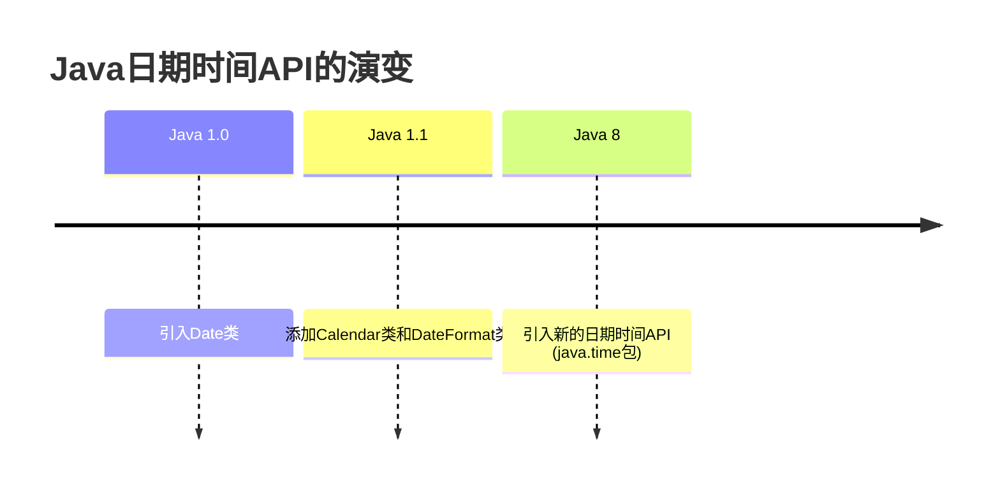

# Java 日期时间概述

在Java编程中，处理日期和时间是一项常见的需求。无论是记录事件发生的时间，计算时间间隔，还是格式化日期显示，Java都提供了丰富的API来支持这些操作。本文将全面介绍Java中的日期时间处理方式，帮助初学者掌握这一重要的编程技能。

## 为什么需要了解日期时间API

日期和时间处理在实际应用中非常普遍：

- 记录用户注册或登录时间
- 计算订单交付时长
- 安排定时任务
- 显示适合用户所在时区的时间
- 处理日历事件和提醒

## Java 中的日期时间API演变

Java的日期时间API经历了显著的演变：



### 传统日期时间API的问题

在Java 8之前，Java主要使用`java.util.Date`和`java.util.Calendar`类处理日期和时间。然而，这些API存在一些明显的问题：

:::caution 传统API的缺点
- 设计不一致（Date既包含日期也包含时间）
- 易变性（可修改）导致线程安全问题
- 格式化功能有限
- 处理时区困难
- 月份从0开始计数（1月表示为0）引起困惑
- API不直观且难以使用
:::

## Java 8日期时间API介绍

Java 8引入了全新的日期时间API（`java.time`包），这一API基于ISO日历系统设计，解决了旧API的诸多问题：

:::tip Java 8日期时间API的优势
- 不可变性（线程安全）
- 明确分离日期和时间概念
- 丰富的操作方法
- 更好的格式化支持
- 更直观的时区处理
- 基于ISO-8601日历系统
:::

### 核心类概览

Java 8日期时间API的核心类包括：

| 类名 | 描述 | 示例用途 |
|------|------|---------|
| `LocalDate` | 不包含时间的日期 | 生日、节假日 |
| `LocalTime` | 不包含日期的时间 | 每日闹钟时间、营业时间 |
| `LocalDateTime` | 包含日期和时间，但不带时区 | 本地事件时间记录 |
| `ZonedDateTime` | 包含时区的完整日期时间 | 跨时区的预约、航班时间 |
| `Instant` | 时间线上的一点 | 时间戳、系统事件记录 |
| `Duration` | 两个时刻之间的时间量 | 计算运行时间 |
| `Period` | 两个日期之间的时间量 | 计算年龄、服务期限 |

## 基本用法示例

### 获取当前日期和时间

```java
// 获取当前日期
LocalDate today = LocalDate.now();
System.out.println("今天的日期是: " + today);

// 获取当前时间
LocalTime now = LocalTime.now();
System.out.println("当前时间是: " + now);

// 获取当前日期和时间
LocalDateTime dateTimeNow = LocalDateTime.now();
System.out.println("当前日期和时间是: " + dateTimeNow);

// 带时区的日期和时间
ZonedDateTime zonedDateTime = ZonedDateTime.now();
System.out.println("带时区的当前日期和时间: " + zonedDateTime);
```

输出示例：
```
今天的日期是: 2023-05-15
当前时间是: 14:30:45.123
当前日期和时间是: 2023-05-15T14:30:45.123
带时区的当前日期和时间: 2023-05-15T14:30:45.123+08:00[Asia/Shanghai]
```

### 创建特定的日期和时间

```java
// 创建特定日期
LocalDate dateOfBirth = LocalDate.of(1990, 5, 15);
System.out.println("出生日期: " + dateOfBirth);

// 创建特定时间
LocalTime meetingTime = LocalTime.of(13, 30);
System.out.println("会议时间: " + meetingTime);

// 创建特定日期和时间
LocalDateTime flightDeparture = LocalDateTime.of(2023, 6, 10, 8, 30);
System.out.println("航班起飞时间: " + flightDeparture);
```

输出示例：
```
出生日期: 1990-05-15
会议时间: 13:30
航班起飞时间: 2023-06-10T08:30
```

### 日期时间操作

```java
LocalDate today = LocalDate.now();

// 日期加减
LocalDate nextWeek = today.plusDays(7);
LocalDate threeMonthsAgo = today.minusMonths(3);

System.out.println("今天: " + today);
System.out.println("一周后: " + nextWeek);
System.out.println("三个月前: " + threeMonthsAgo);

// 时间操作
LocalTime currentTime = LocalTime.now();
LocalTime twoHoursLater = currentTime.plusHours(2);
LocalTime thirtyMinutesBefore = currentTime.minusMinutes(30);

System.out.println("当前时间: " + currentTime);
System.out.println("两小时后: " + twoHoursLater);
System.out.println("30分钟前: " + thirtyMinutesBefore);
```

输出示例：
```
今天: 2023-05-15
一周后: 2023-05-22
三个月前: 2023-02-15
当前时间: 14:30:45.123
两小时后: 16:30:45.123
30分钟前: 14:00:45.123
```

### 日期时间比较

```java
LocalDate date1 = LocalDate.of(2023, 5, 15);
LocalDate date2 = LocalDate.of(2023, 6, 10);

// 比较日期
boolean isBefore = date1.isBefore(date2);  // true
boolean isAfter = date1.isAfter(date2);    // false
boolean isEqual = date1.isEqual(date2);    // false

System.out.println("date1在date2之前: " + isBefore);
System.out.println("date1在date2之后: " + isAfter);
System.out.println("date1等于date2: " + isEqual);

// 计算两个日期之间的差距
Period period = Period.between(date1, date2);
System.out.println("两个日期相差: " + 
    period.getYears() + "年 " + 
    period.getMonths() + "月 " + 
    period.getDays() + "天");
```

输出示例：
```
date1在date2之前: true
date1在date2之后: false
date1等于date2: false
两个日期相差: 0年 0月 26天
```

### 时间段计算

```java
LocalTime start = LocalTime.of(9, 0);
LocalTime end = LocalTime.of(17, 30);

// 计算两个时间之间的差距
Duration workDuration = Duration.between(start, end);
System.out.println("工作时长: " + 
    workDuration.toHours() + "小时 " + 
    workDuration.toMinutesPart() + "分钟");

// 带有时区的时间计算
ZonedDateTime nyDeparture = ZonedDateTime.of(
    LocalDateTime.of(2023, 5, 15, 22, 30),
    ZoneId.of("America/New_York")
);

ZonedDateTime tokyoArrival = ZonedDateTime.of(
    LocalDateTime.of(2023, 5, 17, 5, 30),
    ZoneId.of("Asia/Tokyo")
);

Duration flightDuration = Duration.between(nyDeparture, tokyoArrival);
System.out.println("飞行时长: " + flightDuration.toHours() + "小时");
```

输出示例：
```
工作时长: 8小时 30分钟
飞行时长: 21小时
```

## 日期时间格式化

Java 8引入的`DateTimeFormatter`提供了强大的格式化功能：

```java
LocalDateTime now = LocalDateTime.now();

// 使用预定义的格式
DateTimeFormatter isoFormatter = DateTimeFormatter.ISO_DATE_TIME;
System.out.println("ISO格式: " + now.format(isoFormatter));

// 自定义格式
DateTimeFormatter customFormatter = DateTimeFormatter.ofPattern("yyyy年MM月dd日 HH时mm分ss秒");
System.out.println("自定义格式: " + now.format(customFormatter));

// 使用地区特定的格式
DateTimeFormatter localizedFormatter = DateTimeFormatter.ofLocalizedDateTime(FormatStyle.MEDIUM)
                                                       .withLocale(Locale.CHINA);
System.out.println("本地化格式: " + now.format(localizedFormatter));
```

输出示例：
```
ISO格式: 2023-05-15T14:30:45.123
自定义格式: 2023年05月15日 14时30分45秒
本地化格式: 2023年5月15日 下午2:30:45
```

## 解析字符串为日期时间

```java
// 解析日期
String dateString = "2023-05-15";
LocalDate parsedDate = LocalDate.parse(dateString);
System.out.println("解析的日期: " + parsedDate);

// 使用自定义格式解析
String customDateString = "15/05/2023";
DateTimeFormatter formatter = DateTimeFormatter.ofPattern("dd/MM/yyyy");
LocalDate customParsedDate = LocalDate.parse(customDateString, formatter);
System.out.println("自定义格式解析的日期: " + customParsedDate);
```

输出示例：
```
解析的日期: 2023-05-15
自定义格式解析的日期: 2023-05-15
```

## 实际应用场景

### 场景1：计算年龄

```java
LocalDate birthDate = LocalDate.of(1990, 5, 15);
LocalDate currentDate = LocalDate.now();


Period age = Period.between(birthDate, currentDate);

System.out.println("年龄: " + age.getYears() + "岁 " + 
                   age.getMonths() + "个月 " + 
                   age.getDays() + "天");
```

输出示例（假设当前日期为2023-05-15）：
```
年龄: 33岁 0个月 0天
```

### 场景2：截止日期计算

```java
LocalDate orderDate = LocalDate.now();
LocalDate deliveryDueDate = orderDate.plusDays(3); // 假设3天后送达

System.out.println("订单日期: " + orderDate);
System.out.println("预计送达日期: " + deliveryDueDate);

// 检查是否超过截止日期
LocalDate currentDate = LocalDate.now();
boolean isOverdue = currentDate.isAfter(deliveryDueDate);
System.out.println("是否超过送达日期: " + isOverdue);
```

输出示例：
```
订单日期: 2023-05-15
预计送达日期: 2023-05-18
是否超过送达日期: false
```

### 场景3：跨时区会议安排

```java
// 创建一个纽约时间上午9点的会议
LocalDateTime meetingDateTime = LocalDateTime.of(2023, 5, 20, 9, 0);
ZonedDateTime nyMeeting = ZonedDateTime.of(meetingDateTime, ZoneId.of("America/New_York"));
System.out.println("纽约会议时间: " + nyMeeting);

// 转换为上海时间
ZonedDateTime shanghaiMeeting = nyMeeting.withZoneSameInstant(ZoneId.of("Asia/Shanghai"));
System.out.println("上海对应时间: " + shanghaiMeeting);

// 转换为伦敦时间
ZonedDateTime londonMeeting = nyMeeting.withZoneSameInstant(ZoneId.of("Europe/London"));
System.out.println("伦敦对应时间: " + londonMeeting);
```

输出示例：
```
纽约会议时间: 2023-05-20T09:00-04:00[America/New_York]
上海对应时间: 2023-05-20T21:00+08:00[Asia/Shanghai]
伦敦对应时间: 2023-05-20T14:00+01:00[Europe/London]
```

## 传统API与新API的转换

有时候，你可能需要与使用传统API的代码进行交互：

```java
// 从旧API转换到新API
Date legacyDate = new Date();
Instant instant = legacyDate.toInstant();
LocalDateTime dateTime = LocalDateTime.ofInstant(instant, ZoneId.systemDefault());
System.out.println("从Date转换: " + dateTime);

// 从新API转换到旧API
LocalDateTime currentDateTime = LocalDateTime.now();
ZonedDateTime zonedDateTime = currentDateTime.atZone(ZoneId.systemDefault());
Date convertedDate = Date.from(zonedDateTime.toInstant());
System.out.println("转换到Date: " + convertedDate);
```

## 最佳实践

:::tip 使用Java日期时间API的建议
1. 优先使用Java 8的日期时间API，避免使用旧API
2. 根据需要选择合适的类：
   - 仅日期 → `LocalDate`
   - 仅时间 → `LocalTime`
   - 日期时间 → `LocalDateTime`
   - 带时区的日期时间 → `ZonedDateTime`
   - 时间戳 → `Instant`
3. 使用`Duration`和`Period`计算时间差
4. 使用`DateTimeFormatter`进行格式化和解析
5. 注意对象的不可变性（每次操作都会返回新对象）
:::

## 总结

Java 8的日期时间API提供了一套全面、直观且强大的工具来处理日期和时间：

- 核心类设计清晰，职责明确
- 不可变对象确保线程安全
- 丰富的操作方法使日期时间计算变得简单
- 强大的格式化功能满足各种显示需求
- 良好的时区支持方便处理国际化应用

通过掌握这些API，你可以更加高效地处理Java应用中的各种日期时间需求，无论是简单的日期显示，还是复杂的跨时区计算。

## 练习

1. 创建一个程序，计算从你出生到现在一共过了多少天。
2. 编写代码将当前日期格式化为"yyyy年MM月dd日 星期几"的格式。
3. 创建两个不同时区的`ZonedDateTime`对象，并计算它们之间的时差。
4. 解析字符串"2023-06-15T08:30:00"为`LocalDateTime`对象。
5. 计算一个项目的截止日期：从当前日期开始，工作日（周一至周五）计算，完成需要15个工作日。

## 延伸资源

- [Java官方文档 - java.time包](https://docs.oracle.com/en/java/javase/17/docs/api/java.base/java/time/package-summary.html)
- [Java 8日期时间API教程](https://www.baeldung.com/java-8-date-time-intro)
- 《Java实战》(Manning Publications)中的日期时间章节
- [Oracle Java教程 - 日期和时间API](https://docs.oracle.com/javase/tutorial/datetime/index.html)

通过这些资源和练习，你将能够全面掌握Java的日期时间处理能力，并在实际项目中灵活应用这些知识。