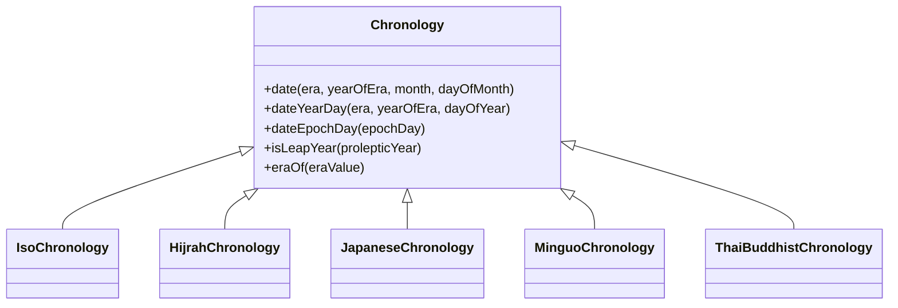

# Java 日历系统

## 什么是日历系统

日历系统是人类用来组织、计算和表示时间的方法。在Java编程中，日历系统是日期时间API的核心概念之一，它提供了一种方式来解释和处理不同文化和地区的日期时间表示方法。

:::note 日历系统的作用
日历系统决定了如何将时间分割为年、月、日等单位，以及如何处理特殊情况如闰年、闰月等。
:::

## Java 中的日历系统实现

Java日期时间API (java.time包) 提供了多种日历系统的实现，主要基于`Chronology`接口。



### ISO-8601日历系统

ISO日历是Java默认的日历系统，基于公历（格里高利历）。

```java
// 获取ISO日历系统
Chronology iso = IsoChronology.INSTANCE;
System.out.println("默认日历系统: " + iso);

// 使用ISO日历创建日期
ChronoLocalDate date = iso.dateNow();
System.out.println("当前日期: " + date);
```

输出：
```
默认日历系统: ISO
当前日期: 2023-11-01
```

### 其他常见日历系统

Java还支持其他几种主要的日历系统：

1. **伊斯兰历 (Hijrah Calendar)**：基于月亮周期
2. **日本历 (Japanese Calendar)**：基于天皇纪年
3. **中华民国历 (Minguo Calendar)**：台湾使用的历法
4. **泰国佛历 (Thai Buddhist Calendar)**：泰国的官方历法

## 使用不同的日历系统

### 创建特定日历系统的日期

```java
// 获取不同的日历系统
Chronology hijrah = HijrahChronology.INSTANCE;
Chronology japanese = JapaneseChronology.INSTANCE;
Chronology minguo = MinguoChronology.INSTANCE;
Chronology thai = ThaiBuddhistChronology.INSTANCE;

// 获取当前日期在不同日历系统中的表示
ChronoLocalDate hijrahDate = hijrah.dateNow();
ChronoLocalDate japaneseDate = japanese.dateNow();
ChronoLocalDate minguoDate = minguo.dateNow();
ChronoLocalDate thaiDate = thai.dateNow();

System.out.println("伊斯兰历日期: " + hijrahDate);
System.out.println("日本历日期: " + japaneseDate);
System.out.println("民国历日期: " + minguoDate);
System.out.println("泰国佛历日期: " + thaiDate);
```

输出示例：
```
伊斯兰历日期: Hijrah-umalqura AH 1445-04-17
日本历日期: Japanese Reiwa 5-11-01
民国历日期: Minguo ROC 112-11-01
泰国佛历日期: ThaiBuddhist BE 2566-11-01
```

### 在日历系统之间转换日期

```java
// 创建一个ISO日期
LocalDate isoDate = LocalDate.of(2023, 11, 1);
System.out.println("ISO日期: " + isoDate);

// 转换到日本历
JapaneseDate japaneseDate = JapaneseDate.from(isoDate);
System.out.println("转换为日本历: " + japaneseDate);

// 转换到民国历
MinguoDate minguoDate = MinguoDate.from(isoDate);
System.out.println("转换为民国历: " + minguoDate);

// 从民国历转回ISO日期
LocalDate convertedBack = LocalDate.from(minguoDate);
System.out.println("转换回ISO日期: " + convertedBack);
```

输出：
```
ISO日期: 2023-11-01
转换为日本历: Japanese Reiwa 5-11-01
转换为民国历: Minguo ROC 112-11-01
转换回ISO日期: 2023-11-01
```

## 处理闰年和日历规则

各个日历系统对闰年的定义和处理方式不同。Java日期时间API提供了统一的接口来处理这些差异。

```java
// 检查不同日历系统中的闰年
Chronology iso = IsoChronology.INSTANCE;
Chronology hijrah = HijrahChronology.INSTANCE;

// 检查2020年是否为闰年（ISO历）
boolean isoLeap = iso.isLeapYear(2020);
System.out.println("2020年在ISO历中是闰年: " + isoLeap);

// 检查伊斯兰历1441年是否为闰年
boolean hijrahLeap = hijrah.isLeapYear(1441);
System.out.println("1441年在伊斯兰历中是闰年: " + hijrahLeap);
```

输出示例：
```
2020年在ISO历中是闰年: true
1441年在伊斯兰历中是闰年: false
```

## 日历系统中的时代（Era）

不同的日历系统可能有不同的时代或纪元概念。例如，日本历根据天皇的统治年代分为不同的时代。

```java
// 获取日本历的所有时代
JapaneseChronology japaneseChro = JapaneseChronology.INSTANCE;
List<Era> japaneseEras = japaneseChro.eras();

System.out.println("日本历的时代:");
for (Era era : japaneseEras) {
    System.out.println(" - " + era);
}

// 创建特定时代的日期
JapaneseDate heiseiDate = JapaneseDate.of(JapaneseEra.HEISEI, 1, 1, 1);
System.out.println("平成元年元旦: " + heiseiDate);
```

输出示例：
```
日本历的时代:
 - Meiji
 - Taisho
 - Showa
 - Heisei
 - Reiwa
平成元年元旦: Japanese Heisei 1-01-01
```

## 本地化日期显示

日历系统与本地化密切相关，可以根据不同的区域设置格式化日期显示。

```java
// 创建一个日期
LocalDate date = LocalDate.of(2023, 11, 1);

// 使用不同的区域设置格式化日期
DateTimeFormatter usFormatter = DateTimeFormatter.ofLocalizedDate(FormatStyle.FULL)
                                               .withLocale(Locale.US);
DateTimeFormatter japanFormatter = DateTimeFormatter.ofLocalizedDate(FormatStyle.FULL)
                                                  .withLocale(Locale.JAPAN);
DateTimeFormatter chinaFormatter = DateTimeFormatter.ofLocalizedDate(FormatStyle.FULL)
                                                  .withLocale(Locale.CHINA);

System.out.println("美国格式: " + date.format(usFormatter));
System.out.println("日本格式: " + date.format(japanFormatter));
System.out.println("中国格式: " + date.format(chinaFormatter));
```

输出示例：
```
美国格式: Wednesday, November 1, 2023
日本格式: 2023年11月1日水曜日
中国格式: 2023年11月1日星期三
```

## 实际应用案例

### 跨文化日历应用

假设你正在开发一个国际化的活动管理应用，需要支持不同国家和地区的用户：

```java
public class EventScheduler {
    public static void scheduleEvent(LocalDate eventDate, Locale userLocale) {
        // 获取用户所在地区的日历系统
        Chronology chronology = Chronology.ofLocale(userLocale);
        ChronoLocalDate localDate = chronology.date(eventDate);
        
        // 格式化显示给用户的日期
        DateTimeFormatter formatter = DateTimeFormatter.ofLocalizedDate(FormatStyle.FULL)
                                                      .withLocale(userLocale);
        String formattedDate = localDate.format(formatter);
        
        System.out.println("活动已安排在: " + formattedDate);
        System.out.println("使用日历系统: " + chronology.getId());
    }
    
    public static void main(String[] args) {
        LocalDate eventDate = LocalDate.of(2023, 12, 25);
        
        // 为不同地区的用户安排同一个活动
        scheduleEvent(eventDate, Locale.US);
        scheduleEvent(eventDate, Locale.JAPAN);
        scheduleEvent(eventDate, new Locale("th", "TH")); // 泰国
    }
}
```

输出示例：
```
活动已安排在: Monday, December 25, 2023
使用日历系统: ISO
活动已安排在: 2023年12月25日月曜日
使用日历系统: ISO
活动已安排在: วันจันทร์ที่ 25 ธันวาคม พ.ศ. 2566
使用日历系统: ThaiBuddhist
```

### 处理历史日期

如果你正在开发一个历史研究应用，可能需要处理不同日历系统中的历史日期：

```java
public class HistoricalDateConverter {
    public static void showHistoricalDate(int year, int month, int day, String calendarSystem) {
        LocalDate isoDate;
        
        switch (calendarSystem.toLowerCase()) {
            case "japanese":
                // 假设这是昭和时代的日期
                JapaneseDate japaneseDate = JapaneseDate.of(JapaneseEra.SHOWA, year, month, day);
                isoDate = LocalDate.from(japaneseDate);
                System.out.println("日本昭和" + year + "年转换为公历: " + isoDate);
                break;
                
            case "minguo":
                // 民国历日期
                MinguoDate minguoDate = MinguoDate.of(year, month, day);
                isoDate = LocalDate.from(minguoDate);
                System.out.println("民国" + year + "年转换为公历: " + isoDate);
                break;
                
            default:
                System.out.println("不支持的日历系统");
        }
    }
    
    public static void main(String[] args) {
        // 昭和元年七月七日
        showHistoricalDate(1, 7, 7, "japanese");
        
        // 民国38年10月1日
        showHistoricalDate(38, 10, 1, "minguo");
    }
}
```

输出示例：
```
日本昭和1年转换为公历: 1926-07-07
民国38年转换为公历: 1949-10-01
```

## 总结

Java日历系统是Java日期时间API中的重要组成部分，它允许我们以一种统一而灵活的方式处理不同文化和地区的日期表示方法：

1. Java默认使用ISO-8601日历系统（基于格里高利历）
2. 通过`Chronology`接口，Java支持多种日历系统（伊斯兰历、日本历、民国历、泰国佛历等）
3. 可以在不同日历系统之间转换日期
4. 各日历系统有自己对闰年等特殊情况的处理规则
5. 日历系统与本地化密切相关，可用于国际化应用开发

在实际开发中，了解和正确使用日历系统对于创建真正国际化的应用至关重要，尤其是在处理不同文化背景用户的时间相关功能时。

## 练习

1. 编写一个程序，将当前日期转换为所有Java支持的日历系统并显示。
2. 创建一个方法，判断给定年份在不同日历系统中是否为闰年。
3. 实现一个日期计算器，能够在指定的日历系统中进行日期加减操作。
4. 编写一个程序，展示同一个日期在不同国家/地区的格式化显示方式。

## 延伸阅读

- [Java SE官方文档 - Chronology接口](https://docs.oracle.com/javase/8/docs/api/java/time/chrono/Chronology.html)
- [Java SE官方文档 - 时间相关的类](https://docs.oracle.com/javase/tutorial/datetime/iso/index.html)
- 《Java 8实战》（Manning Publications，2014）中关于日期时间API的章节