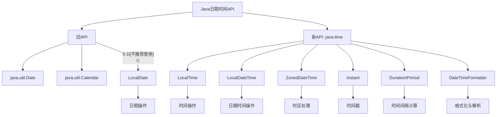

# Java 日期时间最佳实践

## 引言

在 Java 开发中，正确处理日期和时间是一个常见但又容易出错的任务。无论是记录用户操作的时间戳、计算业务逻辑中的时间差，还是处理跨时区的日期显示，都需要我们掌握日期时间 API 的最佳实践。本文将引导初学者了解 Java 中处理日期和时间的推荐方法，避免常见陷阱，提高代码质量。

## 选择正确的日期时间 API

### 避免使用旧 API

:::caution
Java 8 之前的日期时间 API（如 `java.util.Date` 和 `java.util.Calendar`）设计存在诸多问题，包括可变性、线程不安全、月份从 0 开始计数等。
:::

不推荐的做法：

```java
// 不推荐使用的旧 API
Date date = new Date();  // 可变对象，线程不安全
Calendar calendar = Calendar.getInstance();
calendar.set(2023, 10, 15);  // 注意：这里的月份是 11 月而不是 10 月！
```

### 使用 Java 8+ 日期时间 API

推荐使用 Java 8 引入的 `java.time` 包中的类：

```java
// 推荐的现代 API
LocalDate date = LocalDate.of(2023, 11, 15);  // 月份直观，11 表示 11 月
LocalDateTime dateTime = LocalDateTime.now();
ZonedDateTime zonedDateTime = ZonedDateTime.now();
```

## 日期时间的创建和操作

### 创建特定日期时间

```java
// 创建特定日期
LocalDate date = LocalDate.of(2023, Month.NOVEMBER, 15);

// 创建特定时间
LocalTime time = LocalTime.of(13, 45, 20);

// 创建日期和时间
LocalDateTime dateTime = LocalDateTime.of(2023, Month.NOVEMBER, 15, 13, 45, 20);

// 带时区的日期时间
ZonedDateTime zonedDateTime = ZonedDateTime.of(dateTime, ZoneId.of("Europe/Paris"));
```

### 获取当前日期时间

```java
// 获取当前日期
LocalDate today = LocalDate.now();

// 获取当前时间
LocalTime now = LocalTime.now();

// 获取当前日期和时间
LocalDateTime currentDateTime = LocalDateTime.now();

// 获取当前带时区的日期和时间
ZonedDateTime currentZonedDateTime = ZonedDateTime.now();
```

输出结果示例：
```
今天是: 2023-11-15
现在时间是: 13:45:20.123456789
当前日期时间是: 2023-11-15T13:45:20.123456789
带时区的当前时间是: 2023-11-15T13:45:20.123456789+01:00[Europe/Paris]
```

### 日期时间操作

Java 8+ 的日期时间 API 提供了丰富的操作方法，且这些操作都会返回新的对象而不是修改原对象：

```java
LocalDate date = LocalDate.of(2023, 11, 15);

// 增加天数
LocalDate futureDate = date.plusDays(7);  // 2023-11-22

// 减少月份
LocalDate pastDate = date.minusMonths(2);  // 2023-09-15

// 使用 TemporalAdjusters 获取下个月的第一天
LocalDate firstDayOfNextMonth = date.with(TemporalAdjusters.firstDayOfNextMonth());  // 2023-12-01
```

## 日期时间的格式化和解析

### 使用 DateTimeFormatter 进行格式化

```java
LocalDateTime dateTime = LocalDateTime.of(2023, 11, 15, 13, 45, 20);

// 使用预定义格式
String iso = dateTime.format(DateTimeFormatter.ISO_DATE_TIME);  // 2023-11-15T13:45:20

// 使用自定义模式
DateTimeFormatter formatter = DateTimeFormatter.ofPattern("yyyy年MM月dd日 HH时mm分ss秒");
String formatted = dateTime.format(formatter);  // 2023年11月15日 13时45分20秒
```

### 解析字符串为日期时间

```java
String dateStr = "2023-11-15";
LocalDate parsedDate = LocalDate.parse(dateStr);

String dateTimeStr = "2023-11-15T13:45:20";
LocalDateTime parsedDateTime = LocalDateTime.parse(dateTimeStr);

// 使用自定义格式解析
String customFormat = "2023年11月15日 13时45分20秒";
DateTimeFormatter customFormatter = DateTimeFormatter.ofPattern("yyyy年MM月dd日 HH时mm分ss秒");
LocalDateTime customParsed = LocalDateTime.parse(customFormat, customFormatter);
```

## 处理时区和夏令时

### 时区操作

```java
// 创建带时区的日期时间
ZonedDateTime tokyoTime = ZonedDateTime.now(ZoneId.of("Asia/Tokyo"));

// 转换时区
ZonedDateTime parisTime = tokyoTime.withZoneSameInstant(ZoneId.of("Europe/Paris"));

// 输出不同时区的同一时刻
System.out.println("东京时间: " + tokyoTime);
System.out.println("巴黎时间: " + parisTime);
```

输出示例：
```
东京时间: 2023-11-15T21:45:20.123456789+09:00[Asia/Tokyo]
巴黎时间: 2023-11-15T13:45:20.123456789+01:00[Europe/Paris]
```

### 处理夏令时

```java
// 创建两个可能受夏令时影响的日期
ZoneId zoneId = ZoneId.of("America/New_York");
ZonedDateTime winterDate = ZonedDateTime.of(2023, 1, 15, 10, 0, 0, 0, zoneId);
ZonedDateTime summerDate = ZonedDateTime.of(2023, 7, 15, 10, 0, 0, 0, zoneId);

// 输出各自的时区偏移
System.out.println("冬季时区偏移: " + winterDate.getOffset());
System.out.println("夏季时区偏移: " + summerDate.getOffset());
```

输出示例：
```
冬季时区偏移: -05:00
夏季时区偏移: -04:00
```

## 处理日期时间间隔

### 计算两个日期之间的差异

```java
LocalDate startDate = LocalDate.of(2023, 1, 1);
LocalDate endDate = LocalDate.of(2023, 12, 31);

// 计算天数差异
long daysBetween = ChronoUnit.DAYS.between(startDate, endDate);  // 364

// 计算月份差异
long monthsBetween = ChronoUnit.MONTHS.between(startDate, endDate);  // 11

// 使用 Period 计算更复杂的差异
Period period = Period.between(startDate, endDate);
System.out.println("相差: " + period.getYears() + "年 " + 
                  period.getMonths() + "月 " + 
                  period.getDays() + "天");  // 相差: 0年 11月 30天
```

### 使用 Duration 计算时间间隔

```java
LocalDateTime start = LocalDateTime.of(2023, 11, 15, 10, 0, 0);
LocalDateTime end = LocalDateTime.of(2023, 11, 15, 11, 30, 45);

Duration duration = Duration.between(start, end);
System.out.println("总秒数: " + duration.getSeconds());  // 5445秒
System.out.println("小时:分钟:秒 = " + duration.toHours() + ":" + 
                  (duration.toMinutes() % 60) + ":" + 
                  (duration.getSeconds() % 60));  // 1:30:45
```

## 实际应用场景

### 场景一：记录用户活动日志

```java
// 记录用户活动并存储时间戳
public void logUserActivity(String userId, String activity) {
    LocalDateTime now = LocalDateTime.now();
    // 使用系统默认时区存储时间
    String timestamp = now.format(DateTimeFormatter.ISO_DATE_TIME);
    
    // 在实际应用中，这里会将信息存储到数据库
    System.out.println("用户 " + userId + " 在 " + timestamp + " 执行了 " + activity);
}

// 使用示例
logUserActivity("user123", "登录系统");
```

### 场景二：计算订单的交付日期

```java
// 计算预期送达日期（工作日）
public LocalDate calculateDeliveryDate(LocalDate orderDate, int deliveryDays) {
    LocalDate result = orderDate;
    int addedDays = 0;
    
    while (addedDays < deliveryDays) {
        result = result.plusDays(1);
        // 跳过周末
        if (!(result.getDayOfWeek() == DayOfWeek.SATURDAY || 
              result.getDayOfWeek() == DayOfWeek.SUNDAY)) {
            addedDays++;
        }
    }
    
    return result;
}

// 使用示例
LocalDate orderDate = LocalDate.of(2023, 11, 15);  // 周三
LocalDate deliveryDate = calculateDeliveryDate(orderDate, 3);  // 应该是周一：2023-11-20
System.out.println("订单日期: " + orderDate);
System.out.println("预计送达: " + deliveryDate);
```

### 场景三：处理不同时区的会议安排

```java
// 安排不同时区的会议
public void scheduleMeeting(String meetingName, ZonedDateTime startTimeUTC) {
    // 获取各地办公室的本地时间
    ZonedDateTime newYorkTime = startTimeUTC.withZoneSameInstant(ZoneId.of("America/New_York"));
    ZonedDateTime londonTime = startTimeUTC.withZoneSameInstant(ZoneId.of("Europe/London"));
    ZonedDateTime tokyoTime = startTimeUTC.withZoneSameInstant(ZoneId.of("Asia/Tokyo"));
    
    // 创建格式化对象
    DateTimeFormatter formatter = DateTimeFormatter.ofPattern("yyyy-MM-dd HH:mm (z)");
    
    // 输出各地的会议时间
    System.out.println("会议: " + meetingName);
    System.out.println("纽约时间: " + newYorkTime.format(formatter));
    System.out.println("伦敦时间: " + londonTime.format(formatter));
    System.out.println("东京时间: " + tokyoTime.format(formatter));
}

// 使用示例
ZonedDateTime meetingTimeUTC = ZonedDateTime.of(
    LocalDateTime.of(2023, 11, 15, 14, 0), 
    ZoneId.of("UTC")
);
scheduleMeeting("季度回顾", meetingTimeUTC);
```

输出示例：
```
会议: 季度回顾
纽约时间: 2023-11-15 09:00 (EST)
伦敦时间: 2023-11-15 14:00 (GMT)
东京时间: 2023-11-15 23:00 (JST)
```

## 日期时间最佳实践总结

1. **使用正确的 API**：
   - 使用 Java 8+ 的 `java.time` 包
   - 避免旧的 `Date` 和 `Calendar` 类

2. **选择正确的类型**：
   - 仅日期：`LocalDate`
   - 仅时间：`LocalTime`
   - 日期和时间：`LocalDateTime`
   - 带时区的日期和时间：`ZonedDateTime`
   - 时刻点：`Instant`（用于时间戳）

3. **格式化和解析**：
   - 使用 `DateTimeFormatter` 而非硬编码格式字符串
   - 对于国际化应用，考虑使用 `DateTimeFormatter.ofLocalizedDate(FormatStyle)`

4. **时区处理**：
   - 在服务器上存储 UTC 时间或带时区信息的时间
   - 仅在用户界面显示时转换为本地时区
   - 使用 `ZonedDateTime` 处理时区转换

5. **日期时间计算**：
   - 使用内置方法如 `plus`, `minus` 进行日期计算
   - 使用 `Period` 和 `Duration` 计算时间间隔
   - 使用 `TemporalAdjusters` 进行复杂的日期操作

:::tip
将日期时间信息存储在数据库中时，建议使用 ISO 标准格式或时间戳，并明确标注所使用的时区（最好是 UTC）。
:::

## 练习与进阶学习

### 练习：

1. 创建一个方法，计算两个日期之间的工作日数量（排除周末和节假日）。
2. 实现一个年龄计算器，根据出生日期精确计算某人的年龄（考虑闰年）。
3. 创建一个方法，将用户输入的各种格式的日期字符串（如 "2023/11/15"、"15-11-2023"、"Nov 15, 2023"）统一解析为 `LocalDate` 对象。

### 进阶资源：

- [Oracle Java Time API 文档](https://docs.oracle.com/javase/8/docs/api/java/time/package-summary.html)
- [Java 8 日期时间 API 教程](https://www.baeldung.com/java-8-date-time-intro)
- 《Java 编程思想》和《Effective Java》中关于日期时间处理的章节

掌握这些日期时间最佳实践，将帮助你写出更可靠、更易维护的 Java 代码。记住，在处理日期时间时，一致性和明确性是关键！



祝你在 Java 日期时间 API 的学习之旅中取得进步！