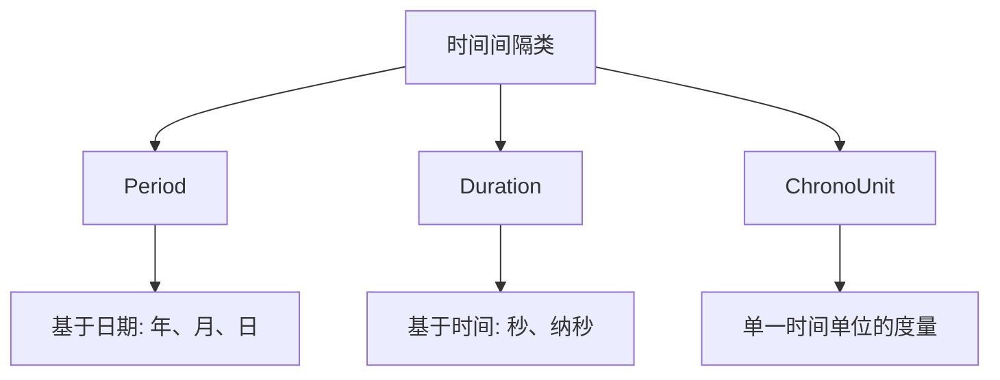

# Java Period

## 简介

`Period`是Java 8引入的日期时间API中的一个重要类，位于`java.time`包下。它专门用于表示**以年、月、日为单位的时间段**，比如"2年3个月4天"。

与其他时间相关类不同，`Period`主要关注**日期间隔**而非时间间隔，这使得它特别适合处理生日、周年纪念日等基于日期的计算。

:::note
`Period`只处理日期部分(年、月、日)，不处理时间部分(时、分、秒)。如果你需要处理包含时间的间隔，应该使用`Duration`类。
:::

## Period的基本用法

### 创建Period对象

`Period`类提供了多种创建实例的方法：

```java
// 1. 使用of方法指定年、月、日
Period period1 = Period.of(1, 2, 3); // 1年2月3日

// 2. 使用特定单位的工厂方法
Period period2 = Period.ofYears(2);   // 2年
Period period3 = Period.ofMonths(3);  // 3个月
Period period4 = Period.ofWeeks(4);   // 4周(28天)
Period period5 = Period.ofDays(5);    // 5天

// 3. 从字符串解析
Period period6 = Period.parse("P1Y2M3D"); // 1年2月3日

// 4. 计算两个LocalDate之间的间隔
LocalDate startDate = LocalDate.of(2020, 1, 1);
LocalDate endDate = LocalDate.of(2022, 3, 15);
Period period7 = Period.between(startDate, endDate);
```

### 访问Period的组成部分

```java
Period period = Period.of(1, 2, 3); // 1年2月3日

int years = period.getYears();    // 1
int months = period.getMonths();  // 2
int days = period.getDays();      // 3

// 获取总量(注意：这不会将年月转换为天)
long totalMonths = period.toTotalMonths(); // 14 (1年2个月 = 14个月)
```

:::caution
`Period`不会自动将年、月转换为天数。例如，`Period.of(1, 2, 3)`中的`getDays()`方法只返回3，而不是"1年2月3天"对应的总天数。
:::

### Period的操作

```java
Period period = Period.of(1, 2, 3); // 1年2月3日

// 加减操作
Period period1 = period.plusYears(2);        // 3年2月3日
Period period2 = period.minusMonths(1);      // 1年1月3日
Period period3 = period.withDays(10);        // 1年2月10日

// 乘法操作
Period period4 = period.multipliedBy(2);     // 2年4月6日

// 取反
Period period5 = period.negated();           // -1年-2月-3日

// 标准化(只对天和月进行标准化，使月<12,不处理天数)
Period period6 = Period.of(1, 14, 32).normalized();  // 2年2月32日
```

## 使用Period进行日期计算

Period对象可以与`LocalDate`、`LocalDateTime`等日期类型配合使用：

```java
LocalDate today = LocalDate.now();
Period twoMonthsAndThreeDays = Period.of(0, 2, 3);

// 计算未来日期
LocalDate futureDate = today.plus(twoMonthsAndThreeDays);
System.out.println("今天: " + today);
System.out.println("两个月零三天后: " + futureDate);

// 输出示例:
// 今天: 2023-11-28
// 两个月零三天后: 2024-01-31
```

## Period与其他时间间隔类的比较

Java 8日期时间API提供了几种不同的类来表示时间间隔，理解它们的区别很重要：



- **Period**: 表示**基于日期的时间量**(年、月、日)
- **Duration**: 表示**基于时间的时间量**(秒和纳秒)
- **ChronoUnit**: 用于**测量单一时间单位**的时间量

## 实际应用场景

### 场景1：计算年龄

```java
public static int calculateAge(LocalDate birthDate) {
    Period period = Period.between(birthDate, LocalDate.now());
    return period.getYears();
}

// 使用示例
LocalDate birthDate = LocalDate.of(1990, 5, 15);
int age = calculateAge(birthDate);
System.out.println("年龄: " + age + "岁");

// 输出示例:
// 年龄: 33岁
```

### 场景2：试用期计算

```java
public static LocalDate calculateProbationEndDate(LocalDate joinDate, Period probationPeriod) {
    return joinDate.plus(probationPeriod);
}

// 使用示例
LocalDate joinDate = LocalDate.of(2023, 10, 1);
Period probationPeriod = Period.ofMonths(3);
LocalDate probationEndDate = calculateProbationEndDate(joinDate, probationPeriod);
System.out.println("入职日期: " + joinDate);
System.out.println("试用期结束日期: " + probationEndDate);

// 输出示例:
// 入职日期: 2023-10-01
// 试用期结束日期: 2024-01-01
```

### 场景3：账单周期

```java
public static void generateBillingDates(LocalDate startDate, int cycles) {
    Period monthly = Period.ofMonths(1);
    LocalDate billingDate = startDate;
    
    System.out.println("账单周期开始日期: " + startDate);
    for (int i = 1; i <= cycles; i++) {
        billingDate = billingDate.plus(monthly);
        System.out.println("第" + i + "个账单日期: " + billingDate);
    }
}

// 使用示例
LocalDate subscriptionStart = LocalDate.of(2023, 11, 15);
generateBillingDates(subscriptionStart, 3);

// 输出示例:
// 账单周期开始日期: 2023-11-15
// 第1个账单日期: 2023-12-15
// 第2个账单日期: 2024-01-15
// 第3个账单日期: 2024-02-15
```

## 注意事项

1. **月份处理**: 当加减月份时，如果结果日期不存在(如1月31日加一个月)，Java会自动调整到该月的最后一天。

```java
LocalDate jan31 = LocalDate.of(2023, 1, 31);
LocalDate feb28 = jan31.plus(Period.ofMonths(1));
System.out.println(feb28); // 输出: 2023-02-28
```

2. **标准化限制**: `normalized()`方法只会标准化月份(使月份`<12`)，不会标准化天数。

```java
Period p = Period.of(0, 0, 35).normalized();
System.out.println(p); // 输出: P35D (天数不会转换为月)

Period p2 = Period.of(0, 13, 5).normalized();
System.out.println(p2); // 输出: P1Y1M5D (13个月转换为1年1个月)
```

3. **不可变性**: `Period`对象是不可变的，所有修改操作都会返回新实例。

## 总结

Java `Period`类是处理基于日期的时间间隔的理想选择，特别适合处理年、月、日的计算。它提供了丰富的API来创建、操作和比较时间段，使得日期相关的计算变得简单直观。

区别于`Duration`(处理基于时间的间隔)，`Period`专注于处理人类可理解的日历概念，如年、月、日，而不关注确切的时间单位。

## 练习

1. 编写一个方法，计算从当前日期到下一个生日还有多少天、月、年。
2. 创建一个应用程序，计算两个日期之间的工作日数量(不包括周末)。
3. 实现一个贷款期限计算器，它可以显示每月还款日期和剩余贷款期限。

## 扩展资源

- [Java官方文档 - Period](https://docs.oracle.com/en/java/javase/11/docs/api/java.base/java/time/Period.html)
- [Java日期时间API完整指南](https://www.baeldung.com/java-8-date-time-intro)

通过掌握`Period`类，你将能够更有效地处理Java应用程序中的日期间隔计算，实现各种与日期相关的业务逻辑。