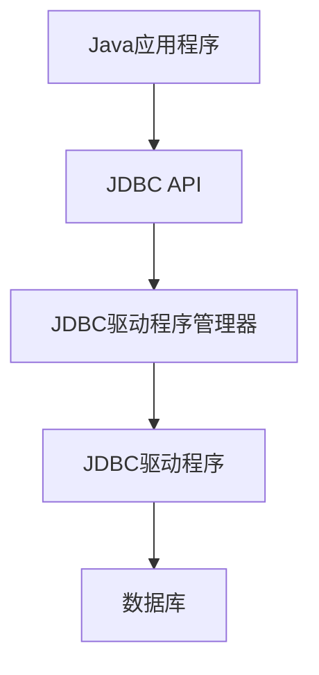

# Java JDBC概述

## 什么是JDBC？

JDBC（Java Database Connectivity）是Java语言中用于执行SQL语句的标准API，它提供了一套与数据库交互的接口和类。通过JDBC，Java应用程序可以连接到关系型数据库（如MySQL、Oracle、SQL Server等），执行SQL查询，并处理查询结果。

:::note
JDBC是Java SE（标准版）的一部分，因此无需额外下载JDBC API，但需要为特定数据库下载对应的JDBC驱动程序。
:::

## JDBC的体系结构

JDBC API主要由以下几个组件组成：



1. **JDBC API**: 提供程序访问数据库的接口和类
2. **JDBC驱动程序管理器**: 负责管理一系列数据库驱动程序
3. **JDBC驱动程序**: 特定数据库的实现，将JDBC调用转换为数据库能理解的格式
4. **数据库**: 实际存储数据的地方

## JDBC核心接口

JDBC API中最重要的几个接口包括：

- `Driver`: 数据库驱动接口
- `Connection`: 表示与数据库的连接
- `Statement`: 用于执行SQL语句
- `PreparedStatement`: 预编译SQL语句的对象，可防止SQL注入
- `CallableStatement`: 用于调用数据库存储过程
- `ResultSet`: 表示SQL查询的结果集

## 使用JDBC的基本步骤

使用JDBC连接数据库并执行SQL操作通常遵循以下步骤：

1. **注册JDBC驱动程序**
2. **建立数据库连接**
3. **创建Statement对象**
4. **执行SQL查询**
5. **处理查询结果**
6. **关闭资源**

下面是一个完整的JDBC使用示例：

```java
import java.sql.*;

public class JDBCDemo {
    public static void main(String[] args) {
        Connection conn = null;
        Statement stmt = null;
        ResultSet rs = null;
        
        try {
            // 1. 注册JDBC驱动
            Class.forName("com.mysql.cj.jdbc.Driver");
            
            // 2. 建立数据库连接
            String url = "jdbc:mysql://localhost:3306/testdb";
            String user = "username";
            String password = "password";
            conn = DriverManager.getConnection(url, user, password);
            
            // 3. 创建Statement对象
            stmt = conn.createStatement();
            
            // 4. 执行SQL查询
            String sql = "SELECT id, name, age FROM users";
            rs = stmt.executeQuery(sql);
            
            // 5. 处理查询结果
            while(rs.next()) {
                // 通过字段索引获取
                int id = rs.getInt(1);
                // 通过字段名获取
                String name = rs.getString("name");
                int age = rs.getInt("age");
                
                System.out.println("ID: " + id + ", 姓名: " + name + ", 年龄: " + age);
            }
        } catch(SQLException se) {
            // 处理JDBC错误
            se.printStackTrace();
        } catch(Exception e) {
            // 处理Class.forName错误
            e.printStackTrace();
        } finally {
            // 6. 关闭资源
            try {
                if(rs != null) rs.close();
                if(stmt != null) stmt.close();
                if(conn != null) conn.close();
            } catch(SQLException se) {
                se.printStackTrace();
            }
        }
    }
}
```

输出示例（根据数据库内容而变）：
```
ID: 1, 姓名: 张三, 年龄: 25
ID: 2, 姓名: 李四, 年龄: 30
ID: 3, 姓名: 王五, 年龄: 28
```

## PreparedStatement的使用

`PreparedStatement`是`Statement`的子接口，它代表预编译的SQL语句，具有以下优势：
- 可以防止SQL注入攻击
- 提高执行效率，特别是重复执行同一SQL语句时
- 便于处理特殊字符和二进制数据

```java
// 使用PreparedStatement的示例
String sql = "INSERT INTO users (name, age) VALUES (?, ?)";
PreparedStatement pstmt = conn.prepareStatement(sql);

// 设置参数
pstmt.setString(1, "赵六");
pstmt.setInt(2, 32);

// 执行
int rowsAffected = pstmt.executeUpdate();
System.out.println("添加了 " + rowsAffected + " 条记录");
```

## 事务处理

JDBC提供了事务处理机制，确保数据库操作的原子性、一致性、隔离性和持久性（ACID）：

```java
try {
    // 默认情况下，连接是自动提交的，设置为false以开启事务
    conn.setAutoCommit(false);
    
    // 执行多个SQL操作
    stmt.executeUpdate("INSERT INTO accounts VALUES (100, 1000)");
    stmt.executeUpdate("INSERT INTO accounts VALUES (200, 2000)");
    
    // 提交事务
    conn.commit();
} catch(SQLException se) {
    // 发生错误时回滚事务
    try {
        conn.rollback();
    } catch(SQLException e) {
        e.printStackTrace();
    }
    se.printStackTrace();
} finally {
    // 恢复自动提交
    try {
        conn.setAutoCommit(true);
    } catch(SQLException e) {
        e.printStackTrace();
    }
}
```

## 批处理操作

当需要执行多条SQL语句时，可以使用批处理提高效率：

```java
try {
    // 关闭自动提交
    conn.setAutoCommit(false);
    
    PreparedStatement pstmt = conn.prepareStatement(
        "INSERT INTO users (name, age) VALUES (?, ?)");
    
    // 添加第一条记录
    pstmt.setString(1, "A");
    pstmt.setInt(2, 20);
    pstmt.addBatch();
    
    // 添加第二条记录
    pstmt.setString(1, "B");
    pstmt.setInt(2, 21);
    pstmt.addBatch();
    
    // 添加第三条记录
    pstmt.setString(1, "C");
    pstmt.setInt(2, 22);
    pstmt.addBatch();
    
    // 执行批处理
    int[] updateCounts = pstmt.executeBatch();
    
    // 提交事务
    conn.commit();
    
    System.out.println("批处理完成，总共更新: " + updateCounts.length + " 条记录");
} catch(SQLException se) {
    // 回滚事务
    conn.rollback();
    se.printStackTrace();
}
```

## 实际应用案例：学生管理系统

下面是一个学生管理系统中使用JDBC进行数据操作的示例：

```java
import java.sql.*;
import java.util.Scanner;

public class StudentManagementSystem {
    // 数据库连接信息
    private static final String JDBC_URL = "jdbc:mysql://localhost:3306/school";
    private static final String USERNAME = "root";
    private static final String PASSWORD = "password";
    
    // 获取数据库连接
    private static Connection getConnection() throws SQLException {
        return DriverManager.getConnection(JDBC_URL, USERNAME, PASSWORD);
    }
    
    // 添加学生信息
    public static void addStudent(String name, int age, String grade) {
        try (Connection conn = getConnection();
             PreparedStatement pstmt = conn.prepareStatement(
                 "INSERT INTO students (name, age, grade) VALUES (?, ?, ?)")) {
                 
            pstmt.setString(1, name);
            pstmt.setInt(2, age);
            pstmt.setString(3, grade);
            
            int result = pstmt.executeUpdate();
            if (result > 0) {
                System.out.println("成功添加学生信息！");
            }
        } catch (SQLException e) {
            System.out.println("添加学生信息失败: " + e.getMessage());
        }
    }
    
    // 查询所有学生信息
    public static void getAllStudents() {
        try (Connection conn = getConnection();
             Statement stmt = conn.createStatement();
             ResultSet rs = stmt.executeQuery("SELECT * FROM students")) {
             
            System.out.println("学生ID\t姓名\t年龄\t年级");
            System.out.println("------------------------------");
            
            while (rs.next()) {
                int id = rs.getInt("id");
                String name = rs.getString("name");
                int age = rs.getInt("age");
                String grade = rs.getString("grade");
                
                System.out.println(id + "\t" + name + "\t" + age + "\t" + grade);
            }
        } catch (SQLException e) {
            System.out.println("查询学生信息失败: " + e.getMessage());
        }
    }
    
    // 更新学生信息
    public static void updateStudent(int id, String name, int age, String grade) {
        try (Connection conn = getConnection();
             PreparedStatement pstmt = conn.prepareStatement(
                 "UPDATE students SET name=?, age=?, grade=? WHERE id=?")) {
                 
            pstmt.setString(1, name);
            pstmt.setInt(2, age);
            pstmt.setString(3, grade);
            pstmt.setInt(4, id);
            
            int result = pstmt.executeUpdate();
            if (result > 0) {
                System.out.println("成功更新学生信息！");
            } else {
                System.out.println("未找到ID为 " + id + " 的学生记录");
            }
        } catch (SQLException e) {
            System.out.println("更新学生信息失败: " + e.getMessage());
        }
    }
    
    // 删除学生信息
    public static void deleteStudent(int id) {
        try (Connection conn = getConnection();
             PreparedStatement pstmt = conn.prepareStatement(
                 "DELETE FROM students WHERE id=?")) {
                 
            pstmt.setInt(1, id);
            
            int result = pstmt.executeUpdate();
            if (result > 0) {
                System.out.println("成功删除学生信息！");
            } else {
                System.out.println("未找到ID为 " + id + " 的学生记录");
            }
        } catch (SQLException e) {
            System.out.println("删除学生信息失败: " + e.getMessage());
        }
    }
    
    public static void main(String[] args) {
        // 注册JDBC驱动
        try {
            Class.forName("com.mysql.cj.jdbc.Driver");
        } catch (ClassNotFoundException e) {
            System.out.println("找不到MySQL JDBC驱动: " + e.getMessage());
            return;
        }
        
        Scanner scanner = new Scanner(System.in);
        int choice;
        
        do {
            System.out.println("\n==== 学生管理系统 ====");
            System.out.println("1. 添加学生");
            System.out.println("2. 查询所有学生");
            System.out.println("3. 更新学生信息");
            System.out.println("4. 删除学生");
            System.out.println("0. 退出");
            System.out.print("请选择操作: ");
            
            choice = scanner.nextInt();
            scanner.nextLine(); // 消费换行符
            
            switch (choice) {
                case 1:
                    System.out.print("输入学生姓名: ");
                    String name = scanner.nextLine();
                    System.out.print("输入学生年龄: ");
                    int age = scanner.nextInt();
                    scanner.nextLine(); // 消费换行符
                    System.out.print("输入学生年级: ");
                    String grade = scanner.nextLine();
                    addStudent(name, age, grade);
                    break;
                    
                case 2:
                    getAllStudents();
                    break;
                    
                case 3:
                    System.out.print("输入要更新的学生ID: ");
                    int updateId = scanner.nextInt();
                    scanner.nextLine(); // 消费换行符
                    System.out.print("输入新的姓名: ");
                    String updateName = scanner.nextLine();
                    System.out.print("输入新的年龄: ");
                    int updateAge = scanner.nextInt();
                    scanner.nextLine(); // 消费换行符
                    System.out.print("输入新的年级: ");
                    String updateGrade = scanner.nextLine();
                    updateStudent(updateId, updateName, updateAge, updateGrade);
                    break;
                    
                case 4:
                    System.out.print("输入要删除的学生ID: ");
                    int deleteId = scanner.nextInt();
                    deleteStudent(deleteId);
                    break;
                    
                case 0:
                    System.out.println("感谢使用学生管理系统，再见！");
                    break;
                    
                default:
                    System.out.println("无效的选择，请重新输入！");
            }
        } while (choice != 0);
        
        scanner.close();
    }
}
```

:::tip
上述示例需要在数据库中先创建`school`数据库和`students`表：

```sql
CREATE DATABASE school;
USE school;
CREATE TABLE students (
    id INT AUTO_INCREMENT PRIMARY KEY,
    name VARCHAR(50) NOT NULL,
    age INT,
    grade VARCHAR(20)
);
```
:::

## 常见JDBC问题与解决方案

### 1. 连接数据库失败

常见原因：
- JDBC URL格式错误
- 数据库用户名或密码错误
- 数据库服务未启动
- 网络连接问题
- 防火墙阻止

解决方案：
- 检查JDBC URL格式是否正确
- 验证用户名和密码
- 确认数据库服务是否正常运行
- 检查网络连接
- 调整防火墙设置

### 2. SQL语句执行异常

常见原因：
- SQL语法错误
- 表或列不存在
- 数据类型不匹配

解决方案：
- 使用PreparedStatement避免SQL语法错误
- 在执行前检查表和列是否存在
- 确保数据类型匹配

### 3. 资源未正确关闭

问题：如果不关闭JDBC资源，可能导致内存泄漏和数据库连接耗尽

解决方案：使用try-with-resources语法自动关闭资源

```java
try (
    Connection conn = DriverManager.getConnection(url, user, password);
    Statement stmt = conn.createStatement();
    ResultSet rs = stmt.executeQuery(sql)
) {
    // 处理结果集
    while (rs.next()) {
        // ...
    }
} catch (SQLException e) {
    e.printStackTrace();
}
```

## 总结

JDBC（Java Database Connectivity）是Java应用程序连接关系型数据库的标准API。本文介绍了JDBC的基本概念、核心组件、使用步骤，并通过代码示例展示了如何使用JDBC执行基本的数据库操作。

JDBC的主要优势包括：
- 提供标准API，使Java应用程序能与不同类型的数据库交互
- 支持多种数据库操作，包括SQL查询、更新、事务处理和批处理
- 通过PreparedStatement防止SQL注入

在实际应用中，尽管现在有许多ORM框架（如Hibernate、MyBatis）可以简化数据库操作，但理解JDBC的基础知识仍然非常重要，因为这些框架本质上都是对JDBC的封装。

## 练习题

1. 编写一个Java程序，使用JDBC连接MySQL数据库，创建一个名为"products"的表，包含id、name、price和quantity字段。

2. 在第1题的基础上，编写代码插入5条产品记录，然后查询并显示所有价格高于100的产品。

3. 编写一个完整的数据库事务示例，实现从账户A向账户B转账的功能，确保转账操作的原子性。

## 附加资源

- [Oracle官方JDBC文档](https://docs.oracle.com/javase/tutorial/jdbc/basics/index.html)
- [MySQL Connector/J官方文档](https://dev.mysql.com/doc/connector-j/en/)
- [PostgreSQL JDBC驱动文档](https://jdbc.postgresql.org/documentation/head/index.html)

:::caution
使用JDBC时，务必注意以下几点：
1. 始终使用参数化查询（PreparedStatement）防止SQL注入
2. 正确关闭所有数据库资源，避免资源泄漏
3. 适当处理SQL异常
4. 在生产环境中使用连接池提高性能
:::