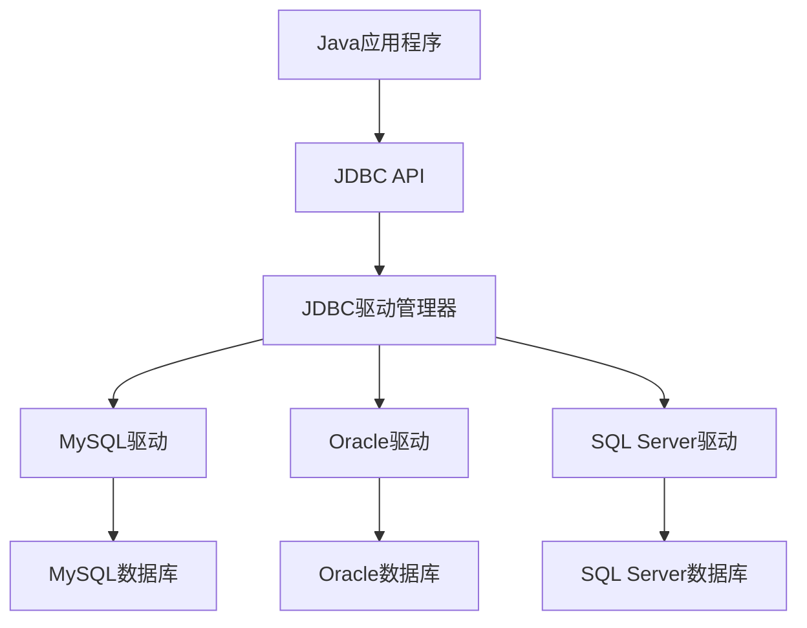

# Java 数据库连接（JDBC）

## 什么是JDBC？

JDBC (Java Database Connectivity) 是Java语言访问关系型数据库的标准API。通过JDBC，Java应用程序可以执行SQL语句，与各种关系型数据库系统（如MySQL、Oracle、SQL Server等）进行交互，实现数据的存储、查询、更新和管理。

JDBC作为中间层，使得Java开发者无需了解不同数据库系统的底层实现细节，就能够使用统一的接口进行数据库操作。



## JDBC的核心组件

JDBC API主要包含以下核心组件：

1. **DriverManager**：管理数据库驱动程序
2. **Connection**：代表与数据库的连接
3. **Statement**：用于执行SQL语句
4. **ResultSet**：存储查询结果
5. **PreparedStatement**：预编译SQL语句，提高性能并防止SQL注入
6. **CallableStatement**：执行存储过程

## JDBC连接数据库的基本步骤

### 1. 加载JDBC驱动程序

首先，需要将相应数据库的JDBC驱动程序加载到Java应用程序中：

```java
// MySQL驱动加载示例
Class.forName("com.mysql.cj.jdbc.Driver");

// Oracle驱动加载示例
// Class.forName("oracle.jdbc.driver.OracleDriver");
```

:::note
在JDBC 4.0之后（Java 6及更高版本），驱动程序会自动注册，通常可以省略这一步骤。但为了兼容性考虑，显式加载驱动程序仍是一个好习惯。
:::

### 2. 建立数据库连接

使用DriverManager类创建与数据库的连接：

```java
String url = "jdbc:mysql://localhost:3306/mydatabase";
String username = "root";
String password = "password";

Connection connection = DriverManager.getConnection(url, username, password);
```

URL格式通常为：`jdbc:子协议:子名称`，其中子协议指定数据库类型（如mysql），子名称包含主机名、端口和数据库名等信息。

### 3. 创建Statement对象

通过Connection对象创建Statement、PreparedStatement或CallableStatement：

```java
// 创建普通Statement
Statement statement = connection.createStatement();

// 创建PreparedStatement
String sql = "SELECT * FROM users WHERE user_id = ?";
PreparedStatement preparedStatement = connection.prepareStatement(sql);
```

### 4. 执行SQL语句

根据不同需求执行SQL语句：

```java
// 使用Statement执行查询
String query = "SELECT * FROM users";
ResultSet resultSet = statement.executeQuery(query);

// 使用Statement执行更新（插入、更新、删除）
String update = "UPDATE users SET name='John' WHERE id=1";
int rowsAffected = statement.executeUpdate(update);

// 使用PreparedStatement
preparedStatement.setInt(1, 100); // 设置参数
ResultSet resultSet = preparedStatement.executeQuery();
```

### 5. 处理结果集

对于查询操作，处理返回的ResultSet对象：

```java
while(resultSet.next()) {
    int id = resultSet.getInt("id");
    String name = resultSet.getString("name");
    String email = resultSet.getString("email");
    
    System.out.println("ID: " + id + ", Name: " + name + ", Email: " + email);
}
```

### 6. 关闭资源

操作完成后，按照创建的相反顺序关闭所有资源：

```java
if (resultSet != null) resultSet.close();
if (statement != null) statement.close();
if (connection != null) connection.close();
```

:::caution
务必在finally块中关闭资源，或使用try-with-resources语法（Java 7及更高版本）来确保资源被正确关闭，即使发生异常。
:::

## 使用PreparedStatement防止SQL注入

PreparedStatement是一个预编译的SQL语句，它可以提高执行效率并防止SQL注入攻击：

```java
// 不安全的方式（容易遭受SQL注入）
String userInput = "'; DROP TABLE users; --";
String unsafeQuery = "SELECT * FROM users WHERE username='" + userInput + "'";
// 潜在危险！

// 安全的方式（使用PreparedStatement）
String safeQuery = "SELECT * FROM users WHERE username=?";
PreparedStatement pstmt = connection.prepareStatement(safeQuery);
pstmt.setString(1, userInput);
ResultSet rs = pstmt.executeQuery();
```

## 事务管理

JDBC提供了事务管理功能，确保多个操作作为一个单元原子执行：

```java
try {
    // 默认情况下，连接处于自动提交模式
    connection.setAutoCommit(false); // 关闭自动提交
    
    // 执行多个数据库操作
    statement.executeUpdate("UPDATE accounts SET balance=balance-100 WHERE id=1");
    statement.executeUpdate("UPDATE accounts SET balance=balance+100 WHERE id=2");
    
    // 提交事务
    connection.commit();
} catch (SQLException e) {
    // 发生异常时回滚事务
    if (connection != null) {
        connection.rollback();
    }
    e.printStackTrace();
} finally {
    // 恢复自动提交模式
    if (connection != null) {
        connection.setAutoCommit(true);
    }
    // 关闭资源...
}
```

## 实际案例：学生管理系统

下面是一个简单的学生管理系统示例，展示了JDBC的实际应用：

```java
import java.sql.*;
import java.util.Scanner;

public class StudentManagementSystem {
    
    private static final String URL = "jdbc:mysql://localhost:3306/school";
    private static final String USER = "root";
    private static final String PASSWORD = "password";
    
    public static void main(String[] args) {
        try {
            Class.forName("com.mysql.cj.jdbc.Driver");
            
            try (Connection conn = DriverManager.getConnection(URL, USER, PASSWORD);
                 Scanner scanner = new Scanner(System.in)) {
                
                while (true) {
                    System.out.println("\n学生管理系统");
                    System.out.println("1. 添加学生");
                    System.out.println("2. 查看所有学生");
                    System.out.println("3. 按ID查找学生");
                    System.out.println("4. 更新学生信息");
                    System.out.println("5. 删除学生");
                    System.out.println("6. 退出");
                    System.out.print("请选择操作: ");
                    
                    int choice = scanner.nextInt();
                    scanner.nextLine(); // 消耗换行符
                    
                    switch (choice) {
                        case 1:
                            addStudent(conn, scanner);
                            break;
                        case 2:
                            viewAllStudents(conn);
                            break;
                        case 3:
                            findStudentById(conn, scanner);
                            break;
                        case 4:
                            updateStudent(conn, scanner);
                            break;
                        case 5:
                            deleteStudent(conn, scanner);
                            break;
                        case 6:
                            System.out.println("感谢使用学生管理系统！");
                            return;
                        default:
                            System.out.println("无效选择，请重试。");
                    }
                }
            }
        } catch (ClassNotFoundException | SQLException e) {
            e.printStackTrace();
        }
    }
    
    private static void addStudent(Connection conn, Scanner scanner) throws SQLException {
        System.out.print("输入学生姓名: ");
        String name = scanner.nextLine();
        
        System.out.print("输入学生年龄: ");
        int age = scanner.nextInt();
        scanner.nextLine(); // 消耗换行符
        
        System.out.print("输入学生成绩: ");
        double grade = scanner.nextDouble();
        scanner.nextLine(); // 消耗换行符
        
        String sql = "INSERT INTO students (name, age, grade) VALUES (?, ?, ?)";
        
        try (PreparedStatement pstmt = conn.prepareStatement(sql)) {
            pstmt.setString(1, name);
            pstmt.setInt(2, age);
            pstmt.setDouble(3, grade);
            
            int rowsInserted = pstmt.executeUpdate();
            if (rowsInserted > 0) {
                System.out.println("学生信息添加成功！");
            }
        }
    }
    
    private static void viewAllStudents(Connection conn) throws SQLException {
        String sql = "SELECT * FROM students";
        
        try (Statement stmt = conn.createStatement();
             ResultSet rs = stmt.executeQuery(sql)) {
            
            System.out.println("\n学生列表:");
            System.out.printf("%-5s %-20s %-5s %-10s\n", "ID", "姓名", "年龄", "成绩");
            System.out.println("----------------------------------------");
            
            while (rs.next()) {
                int id = rs.getInt("id");
                String name = rs.getString("name");
                int age = rs.getInt("age");
                double grade = rs.getDouble("grade");
                
                System.out.printf("%-5d %-20s %-5d %-10.2f\n", id, name, age, grade);
            }
        }
    }
    
    private static void findStudentById(Connection conn, Scanner scanner) throws SQLException {
        System.out.print("输入要查找的学生ID: ");
        int id = scanner.nextInt();
        scanner.nextLine(); // 消耗换行符
        
        String sql = "SELECT * FROM students WHERE id = ?";
        
        try (PreparedStatement pstmt = conn.prepareStatement(sql)) {
            pstmt.setInt(1, id);
            
            try (ResultSet rs = pstmt.executeQuery()) {
                if (rs.next()) {
                    String name = rs.getString("name");
                    int age = rs.getInt("age");
                    double grade = rs.getDouble("grade");
                    
                    System.out.println("\n学生信息:");
                    System.out.printf("ID: %d\n", id);
                    System.out.printf("姓名: %s\n", name);
                    System.out.printf("年龄: %d\n", age);
                    System.out.printf("成绩: %.2f\n", grade);
                } else {
                    System.out.println("未找到ID为 " + id + " 的学生。");
                }
            }
        }
    }
    
    private static void updateStudent(Connection conn, Scanner scanner) throws SQLException {
        System.out.print("输入要更新的学生ID: ");
        int id = scanner.nextInt();
        scanner.nextLine(); // 消耗换行符
        
        // 首先检查学生是否存在
        String checkSql = "SELECT * FROM students WHERE id = ?";
        try (PreparedStatement checkStmt = conn.prepareStatement(checkSql)) {
            checkStmt.setInt(1, id);
            try (ResultSet rs = checkStmt.executeQuery()) {
                if (!rs.next()) {
                    System.out.println("未找到ID为 " + id + " 的学生。");
                    return;
                }
            }
        }
        
        System.out.print("输入新的学生姓名: ");
        String name = scanner.nextLine();
        
        System.out.print("输入新的学生年龄: ");
        int age = scanner.nextInt();
        scanner.nextLine(); // 消耗换行符
        
        System.out.print("输入新的学生成绩: ");
        double grade = scanner.nextDouble();
        scanner.nextLine(); // 消耗换行符
        
        String sql = "UPDATE students SET name = ?, age = ?, grade = ? WHERE id = ?";
        
        try (PreparedStatement pstmt = conn.prepareStatement(sql)) {
            pstmt.setString(1, name);
            pstmt.setInt(2, age);
            pstmt.setDouble(3, grade);
            pstmt.setInt(4, id);
            
            int rowsUpdated = pstmt.executeUpdate();
            if (rowsUpdated > 0) {
                System.out.println("学生信息更新成功！");
            }
        }
    }
    
    private static void deleteStudent(Connection conn, Scanner scanner) throws SQLException {
        System.out.print("输入要删除的学生ID: ");
        int id = scanner.nextInt();
        scanner.nextLine(); // 消耗换行符
        
        String sql = "DELETE FROM students WHERE id = ?";
        
        try (PreparedStatement pstmt = conn.prepareStatement(sql)) {
            pstmt.setInt(1, id);
            
            int rowsDeleted = pstmt.executeUpdate();
            if (rowsDeleted > 0) {
                System.out.println("学生信息删除成功！");
            } else {
                System.out.println("未找到ID为 " + id + " 的学生。");
            }
        }
    }
}
```

:::tip
在实际应用中，您需要创建一个名为school的数据库，并创建包含id、name、age和grade字段的students表。
:::

## 数据库连接池

在实际应用中，频繁创建和关闭数据库连接会消耗大量资源。因此，生产环境中通常使用数据库连接池来管理连接。常用的连接池包括HikariCP、C3P0、DBCP等。

以下是使用HikariCP的简单示例：

```java
import com.zaxxer.hikari.HikariConfig;
import com.zaxxer.hikari.HikariDataSource;
import java.sql.Connection;
import java.sql.SQLException;

public class ConnectionPoolExample {
    
    private static HikariDataSource dataSource;
    
    static {
        HikariConfig config = new HikariConfig();
        config.setJdbcUrl("jdbc:mysql://localhost:3306/mydatabase");
        config.setUsername("username");
        config.setPassword("password");
        config.setMaximumPoolSize(10);
        config.setAutoCommit(false);
        config.addDataSourceProperty("cachePrepStmts", "true");
        config.addDataSourceProperty("prepStmtCacheSize", "250");
        config.addDataSourceProperty("prepStmtCacheSqlLimit", "2048");
        
        dataSource = new HikariDataSource(config);
    }
    
    public static Connection getConnection() throws SQLException {
        return dataSource.getConnection();
    }
    
    public static void closeDataSource() {
        if (dataSource != null) {
            dataSource.close();
        }
    }
}
```

## 总结

JDBC提供了Java应用程序与各种关系型数据库交互的标准API。掌握JDBC的基础知识，你可以：

- 连接各种关系型数据库
- 执行SQL查询和更新操作
- 处理查询结果
- 使用PreparedStatement防止SQL注入
- 管理数据库事务
- 通过连接池优化数据库连接

JDBC是Java后端开发的重要组成部分，也是学习更高级ORM框架（如Hibernate、MyBatis）的基础。

## 练习

1. 创建一个简单的地址簿应用，使用JDBC将联系人信息存储在数据库中。
2. 实现一个图书管理系统，支持添加、查询、更新和删除图书信息。
3. 尝试使用事务管理实现银行转账功能，确保转账过程中的数据一致性。
4. 将上述示例中的直接JDBC连接修改为使用连接池方式。

## 附加资源

- [Oracle官方JDBC教程](https://docs.oracle.com/javase/tutorial/jdbc/)
- [MySQL Connector/J 文档](https://dev.mysql.com/doc/connector-j/en/)
- [HikariCP连接池文档](https://github.com/brettwooldridge/HikariCP)

通过JDBC，你可以为Java应用程序添加强大的数据持久化能力，这是构建企业级应用程序的关键基础。