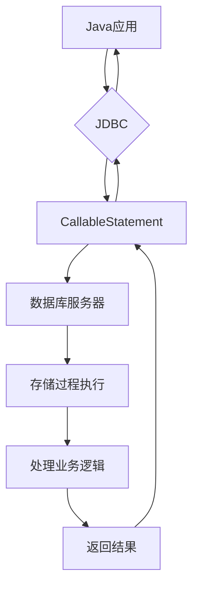

# Java 存储过程

在数据库编程中，存储过程是一种强大的工具，允许我们将一系列SQL语句封装在数据库服务器上执行。本文将详细介绍如何在Java应用程序中使用JDBC调用和管理数据库存储过程。

## 什么是存储过程？

存储过程是存储在数据库中的一组SQL语句集合，可以像调用函数一样被调用执行。它们通常用于封装复杂的业务逻辑，提高数据处理效率，并增强数据安全性。

:::tip
存储过程已经被预编译和优化，因此比客户端发送多个单独的SQL语句执行更高效。
:::

存储过程的主要优势：

1. **性能提升**：减少网络流量，一次调用执行多条SQL语句
2. **代码重用**：业务逻辑可以被多个应用程序共享
3. **安全性**：可以限制对底层表的直接访问
4. **维护简化**：逻辑集中在数据库，便于维护

## 在Java中使用存储过程

JDBC API提供了`CallableStatement`接口，专门用于执行存储过程。下面我们将一步步学习如何在Java中调用存储过程。

### 基本语法

```java
// 创建调用存储过程的CallableStatement对象
CallableStatement cstmt = connection.prepareCall("{call 过程名称(?, ?, ...)}");

// 设置输入参数
cstmt.setXXX(参数索引, 参数值);

// 注册输出参数
cstmt.registerOutParameter(参数索引, 参数类型);

// 执行存储过程
cstmt.execute();

// 获取输出参数值
返回值 = cstmt.getXXX(参数索引);
```

### 存储过程参数类型

在使用存储过程时，我们通常会遇到三种类型的参数：

1. **IN参数**：输入参数，用于向存储过程传递值
2. **OUT参数**：输出参数，用于从存储过程获取值
3. **INOUT参数**：既是输入又是输出的参数

## 实际示例

让我们通过几个实际例子来学习如何在Java中使用存储过程。

### 示例1：调用不带参数的存储过程

假设我们有一个简单的存储过程`get_employee_count`，它返回员工总数：

```sql
CREATE PROCEDURE get_employee_count()
BEGIN
    SELECT COUNT(*) FROM employees;
END
```

在Java中调用此存储过程：

```java
import java.sql.*;

public class SimpleStoredProcedure {
    public static void main(String[] args) {
        String url = "jdbc:mysql://localhost:3306/employees_db";
        String username = "root";
        String password = "password";
        
        try (Connection conn = DriverManager.getConnection(url, username, password);
             CallableStatement cstmt = conn.prepareCall("{call get_employee_count()}");
             ResultSet rs = cstmt.executeQuery()) {
            
            if (rs.next()) {
                System.out.println("员工总数: " + rs.getInt(1));
            }
            
        } catch (SQLException e) {
            e.printStackTrace();
        }
    }
}
```

输出示例：
```
员工总数: 42
```

### 示例2：使用IN参数

创建一个接收部门ID参数并返回该部门员工的存储过程：

```sql
CREATE PROCEDURE get_employees_by_dept(IN dept_id INT)
BEGIN
    SELECT employee_id, first_name, last_name, salary 
    FROM employees 
    WHERE department_id = dept_id;
END
```

在Java中调用此存储过程：

```java
import java.sql.*;

public class StoredProcedureWithINParam {
    public static void main(String[] args) {
        String url = "jdbc:mysql://localhost:3306/employees_db";
        String username = "root";
        String password = "password";
        
        try (Connection conn = DriverManager.getConnection(url, username, password);
             CallableStatement cstmt = conn.prepareCall("{call get_employees_by_dept(?)}")) {
            
            // 设置IN参数
            cstmt.setInt(1, 10); // 查询部门ID为10的员工
            
            try (ResultSet rs = cstmt.executeQuery()) {
                System.out.println("部门 10 的员工列表:");
                System.out.println("ID\t姓名\t\t薪资");
                System.out.println("---------------------------------");
                
                while (rs.next()) {
                    System.out.printf("%d\t%s %s\t%.2f\n", 
                        rs.getInt("employee_id"),
                        rs.getString("first_name"),
                        rs.getString("last_name"),
                        rs.getDouble("salary"));
                }
            }
            
        } catch (SQLException e) {
            e.printStackTrace();
        }
    }
}
```

输出示例：
```
部门 10 的员工列表:
ID      姓名            薪资
---------------------------------
101     John Doe        5000.00
102     Jane Smith      6000.00
103     Robert Johnson  5500.00
```

### 示例3：使用OUT参数

创建一个计算并返回特定部门平均薪资的存储过程：

```sql
CREATE PROCEDURE get_avg_salary(IN dept_id INT, OUT avg_sal DECIMAL(10,2))
BEGIN
    SELECT AVG(salary) INTO avg_sal
    FROM employees
    WHERE department_id = dept_id;
END
```

在Java中调用此存储过程：

```java
import java.sql.*;

public class StoredProcedureWithOUTParam {
    public static void main(String[] args) {
        String url = "jdbc:mysql://localhost:3306/employees_db";
        String username = "root";
        String password = "password";
        
        try (Connection conn = DriverManager.getConnection(url, username, password);
             CallableStatement cstmt = conn.prepareCall("{call get_avg_salary(?, ?)}")) {
            
            // 设置IN参数
            cstmt.setInt(1, 20); // 部门ID为20
            
            // 注册OUT参数
            cstmt.registerOutParameter(2, java.sql.Types.DECIMAL);
            
            // 执行存储过程
            cstmt.execute();
            
            // 获取OUT参数
            double avgSalary = cstmt.getDouble(2);
            
            System.out.printf("部门 20 的平均薪资: $%.2f\n", avgSalary);
            
        } catch (SQLException e) {
            e.printStackTrace();
        }
    }
}
```

输出示例：
```
部门 20 的平均薪资: $5843.75
```

### 示例4：使用INOUT参数

创建一个存储过程，接收员工ID，并返回该员工的新薪资（加10%）：

```sql
CREATE PROCEDURE increase_salary(INOUT emp_id INT, INOUT sal DECIMAL(10,2))
BEGIN
    SELECT salary INTO sal FROM employees WHERE employee_id = emp_id;
    SET sal = sal * 1.1;
    UPDATE employees SET salary = sal WHERE employee_id = emp_id;
END
```

在Java中调用此存储过程：

```java
import java.sql.*;

public class StoredProcedureWithINOUTParam {
    public static void main(String[] args) {
        String url = "jdbc:mysql://localhost:3306/employees_db";
        String username = "root";
        String password = "password";
        
        try (Connection conn = DriverManager.getConnection(url, username, password);
             CallableStatement cstmt = conn.prepareCall("{call increase_salary(?, ?)}")) {
            
            int employeeId = 101;
            
            // 设置INOUT参数
            cstmt.setInt(1, employeeId);
            cstmt.registerOutParameter(1, java.sql.Types.INTEGER);
            
            cstmt.setDouble(2, 0); // 初始值不重要，会被存储过程覆盖
            cstmt.registerOutParameter(2, java.sql.Types.DECIMAL);
            
            // 执行存储过程
            cstmt.execute();
            
            // 获取INOUT参数的输出值
            int returnedEmpId = cstmt.getInt(1);
            double newSalary = cstmt.getDouble(2);
            
            System.out.printf("员工 ID %d 的新薪资: $%.2f\n", returnedEmpId, newSalary);
            
        } catch (SQLException e) {
            e.printStackTrace();
        }
    }
}
```

输出示例：
```
员工 ID 101 的新薪资: $5500.00
```

## 存储函数与存储过程的区别

存储函数是存储过程的一种特殊形式，主要区别在于：

1. 存储函数必须返回一个值，而存储过程不一定
2. 存储函数可以在SQL语句中使用，存储过程不行
3. 存储过程可以有多个OUT参数，存储函数只能通过返回值输出

在Java中调用存储函数的示例：

```java
import java.sql.*;

public class StoredFunction {
    public static void main(String[] args) {
        String url = "jdbc:mysql://localhost:3306/employees_db";
        String username = "root";
        String password = "password";
        
        try (Connection conn = DriverManager.getConnection(url, username, password);
             CallableStatement cstmt = conn.prepareCall("{? = call calculate_bonus(?)}")) {
            
            // 注册返回参数
            cstmt.registerOutParameter(1, java.sql.Types.DOUBLE);
            
            // 设置IN参数
            cstmt.setInt(2, 101); // 员工ID
            
            // 执行存储函数
            cstmt.execute();
            
            // 获取函数返回值
            double bonus = cstmt.getDouble(1);
            
            System.out.printf("员工 101 的奖金: $%.2f\n", bonus);
            
        } catch (SQLException e) {
            e.printStackTrace();
        }
    }
}
```

## 存储过程的事务处理

在使用存储过程时，事务处理非常重要，可以确保数据的一致性和完整性：

```java
import java.sql.*;

public class StoredProcedureTransaction {
    public static void main(String[] args) {
        String url = "jdbc:mysql://localhost:3306/employees_db";
        String username = "root";
        String password = "password";
        
        Connection conn = null;
        CallableStatement cstmt = null;
        
        try {
            conn = DriverManager.getConnection(url, username, password);
            
            // 关闭自动提交
            conn.setAutoCommit(false);
            
            // 调用转账存储过程
            cstmt = conn.prepareCall("{call transfer_money(?, ?, ?)}");
            cstmt.setInt(1, 101);    // 转出账户
            cstmt.setInt(2, 102);    // 转入账户
            cstmt.setDouble(3, 1000); // 转账金额
            
            cstmt.execute();
            
            // 提交事务
            conn.commit();
            
            System.out.println("转账成功完成");
            
        } catch (SQLException e) {
            // 发生错误时回滚事务
            try {
                if (conn != null) {
                    conn.rollback();
                    System.out.println("事务已回滚");
                }
            } catch (SQLException ex) {
                ex.printStackTrace();
            }
            e.printStackTrace();
        } finally {
            // 关闭资源
            try {
                if (cstmt != null) cstmt.close();
                if (conn != null) conn.close();
            } catch (SQLException e) {
                e.printStackTrace();
            }
        }
    }
}
```

## 实际应用场景

存储过程在实际开发中有许多应用场景。以下是一些常见的使用情况：

### 1. 批量数据处理

当需要执行大量相似的SQL操作时，使用存储过程可以减少网络传输和提高效率。

```java
public void processBatchEmployeeUpdates() {
    try (Connection conn = dataSource.getConnection();
         CallableStatement cstmt = conn.prepareCall("{call process_annual_employee_updates()}")) {
        
        cstmt.execute();
        System.out.println("年度员工信息更新完成");
        
    } catch (SQLException e) {
        e.printStackTrace();
    }
}
```

### 2. 复杂报表生成

报表通常需要多表连接和复杂计算，存储过程可以在数据库层面高效处理这些逻辑。

```java
public List<SalesReport> generateSalesReport(Date startDate, Date endDate, int regionId) {
    List<SalesReport> reports = new ArrayList<>();
    
    try (Connection conn = dataSource.getConnection();
         CallableStatement cstmt = conn.prepareCall("{call generate_sales_report(?, ?, ?)}")) {
        
        cstmt.setDate(1, new java.sql.Date(startDate.getTime()));
        cstmt.setDate(2, new java.sql.Date(endDate.getTime()));
        cstmt.setInt(3, regionId);
        
        try (ResultSet rs = cstmt.executeQuery()) {
            while (rs.next()) {
                SalesReport report = new SalesReport();
                report.setProductId(rs.getInt("product_id"));
                report.setProductName(rs.getString("product_name"));
                report.setQuantity(rs.getInt("quantity"));
                report.setRevenue(rs.getDouble("revenue"));
                reports.add(report);
            }
        }
        
    } catch (SQLException e) {
        e.printStackTrace();
    }
    
    return reports;
}
```

### 3. 数据校验和业务规则实现

将复杂的业务规则和数据校验逻辑封装在存储过程中可以确保一致性。

```java
public boolean validateAndProcessOrder(Order order) {
    try (Connection conn = dataSource.getConnection();
         CallableStatement cstmt = conn.prepareCall("{call validate_and_process_order(?, ?, ?, ?)}")) {
        
        cstmt.setInt(1, order.getCustomerId());
        cstmt.setDouble(2, order.getTotalAmount());
        cstmt.setString(3, order.getProductList());
        
        // 注册输出参数 - 订单处理状态
        cstmt.registerOutParameter(4, java.sql.Types.INTEGER);
        
        cstmt.execute();
        
        int status = cstmt.getInt(4);
        return status == 1; // 1表示成功
        
    } catch (SQLException e) {
        e.printStackTrace();
        return false;
    }
}
```

## 存储过程的最佳实践

要有效使用存储过程，请记住以下最佳实践：

1. **适度使用**：存储过程适合复杂的业务逻辑，但不是所有场景都需要它
2. **错误处理**：在存储过程内实现适当的错误处理，并在Java中捕获和处理这些错误
3. **参数验证**：在调用前验证参数，避免无效数据传入存储过程
4. **命名规范**：采用一致的命名约定，使代码更可读
5. **文档记录**：为存储过程添加详细的注释和文档
6. **性能考虑**：在开发大型存储过程时要考虑性能影响



## 总结

存储过程是Java JDBC编程中的重要工具，能够帮助开发者以更高效、安全的方式处理复杂的数据库操作。通过本文，我们学习了：

1. 存储过程的基本概念和优势
2. 使用`CallableStatement`调用存储过程的方法
3. 处理IN、OUT和INOUT参数的技巧
4. 存储函数与存储过程的区别
5. 事务处理在存储过程中的应用
6. 实际应用场景和最佳实践

掌握存储过程的使用可以帮助你开发出更健壮、高效的数据库应用程序。

## 练习

为了巩固所学知识，尝试完成以下练习：

1. 创建一个存储过程，接受部门ID和增长百分比，更新该部门所有员工的薪资，并返回受影响的员工数量
2. 创建一个存储函数，计算给定员工的年终奖金（基于工作年限和绩效）
3. 编写Java程序，使用事务处理调用存储过程，实现从一个银行账户到另一个账户的安全转账
4. 开发一个基于存储过程的员工信息管理系统，实现增删改查功能

## 附加资源

想要更深入学习存储过程，可以参考以下资源：

- Oracle官方文档中关于存储过程的部分
- MySQL文档中的存储程序章节
- 《Effective SQL》书籍中关于存储过程的优化建议
- 《Java数据库编程实战》关于JDBC高级应用的章节

:::caution
请注意，过度使用存储过程可能导致业务逻辑难以维护，并在不同数据库间迁移时造成困难。应当根据实际需求合理决定是否使用存储过程。
:::