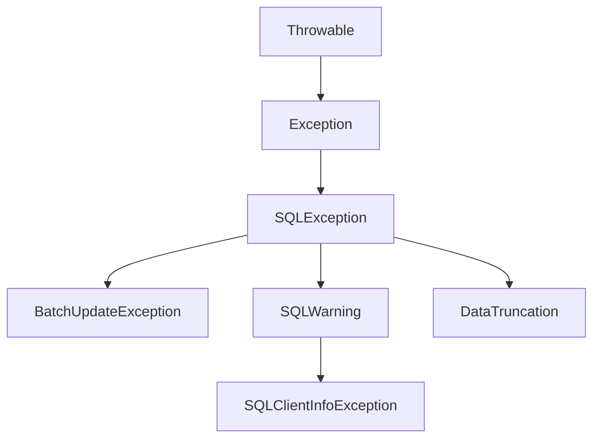

# Java JDBC异常处理

在使用JDBC连接数据库进行操作时，由于网络、权限、SQL语法等原因可能会发生各种异常。合理的异常处理能够提高应用程序的稳定性和用户体验。本文将全面介绍JDBC异常处理的基本概念、常见异常类型以及最佳实践方法。

## JDBC异常类层次结构

在深入学习JDBC异常处理之前，需要了解JDBC异常的类层次结构。JDBC异常主要基于`java.sql.SQLException`类。



其中：

- `SQLException`：JDBC操作的基本异常类
- `BatchUpdateException`：批处理更新时发生的异常
- `SQLWarning`：数据库访问警告
- `DataTruncation`：数据截断警告
- `SQLClientInfoException`：设置客户端属性失败时的异常

## 基本异常处理方法

### 使用try-catch块捕获SQLException

最基本的JDBC异常处理方式是使用try-catch块捕获`SQLException`：

```java
Connection conn = null;
Statement stmt = null;
ResultSet rs = null;

try {
    // 建立连接
    conn = DriverManager.getConnection("jdbc:mysql://localhost:3306/testdb", "username", "password");
    
    // 创建Statement对象
    stmt = conn.createStatement();
    
    // 执行查询
    rs = stmt.executeQuery("SELECT * FROM users");
    
    // 处理结果集
    while (rs.next()) {
        System.out.println("ID: " + rs.getInt("id") + ", Name: " + rs.getString("name"));
    }
} catch (SQLException e) {
    System.err.println("数据库操作失败: " + e.getMessage());
    e.printStackTrace();
} finally {
    // 关闭资源
    try {
        if (rs != null) rs.close();
        if (stmt != null) stmt.close();
        if (conn != null) conn.close();
    } catch (SQLException e) {
        e.printStackTrace();
    }
}
```

### 获取异常详细信息

`SQLException` 提供了多种方法来获取异常的详细信息：

```java
try {
    // JDBC 操作...
} catch (SQLException e) {
    System.err.println("SQL状态: " + e.getSQLState());
    System.err.println("错误码: " + e.getErrorCode());
    System.err.println("错误消息: " + e.getMessage());
    
    // 获取链式异常
    SQLException nextEx = e.getNextException();
    while (nextEx != null) {
        System.err.println("链式异常: " + nextEx.getMessage());
        nextEx = nextEx.getNextException();
    }
}
```

## 使用try-with-resources简化资源管理

Java 7引入的try-with-resources语法可以大大简化JDBC资源的关闭操作：

```java
try (
    Connection conn = DriverManager.getConnection("jdbc:mysql://localhost:3306/testdb", "username", "password");
    Statement stmt = conn.createStatement();
    ResultSet rs = stmt.executeQuery("SELECT * FROM users")
) {
    while (rs.next()) {
        System.out.println("ID: " + rs.getInt("id") + ", Name: " + rs.getString("name"));
    }
} catch (SQLException e) {
    System.err.println("数据库操作失败: " + e.getMessage());
    e.printStackTrace();
}
```

:::tip
使用try-with-resources语法，不需要在finally块中手动关闭资源，Java会自动关闭实现了AutoCloseable接口的资源，包括Connection、Statement和ResultSet。
:::

## 常见JDBC异常类型及处理方法

### 连接异常

连接数据库时可能出现的异常：

```java
try {
    Connection conn = DriverManager.getConnection("jdbc:mysql://localhost:3306/testdb", "username", "password");
    // 数据库操作...
} catch (SQLException e) {
    if (e.getSQLState().equals("08001")) {
        System.err.println("无法连接到数据库，请检查网络或数据库服务是否正常运行");
    } else if (e.getSQLState().equals("28000")) {
        System.err.println("用户名或密码错误");
    } else {
        System.err.println("连接数据库时发生错误: " + e.getMessage());
    }
}
```

### SQL语法错误

执行SQL语句时的语法错误：

```java
try {
    Statement stmt = conn.createStatement();
    // 错误的SQL语句，缺少FROM子句
    ResultSet rs = stmt.executeQuery("SELECT user_id, username WHERE age > 18");
    // 处理结果...
} catch (SQLException e) {
    if (e.getSQLState().startsWith("42")) {
        System.err.println("SQL语法错误: " + e.getMessage());
    } else {
        System.err.println("执行查询时发生错误: " + e.getMessage());
    }
}
```

### 数据完整性约束违反

插入或更新数据违反唯一约束、外键约束等：

```java
try {
    PreparedStatement pstmt = conn.prepareStatement(
        "INSERT INTO users (id, username, email) VALUES (?, ?, ?)"
    );
    pstmt.setInt(1, 1); // 假设ID=1已经存在
    pstmt.setString(2, "john");
    pstmt.setString(3, "john@example.com");
    pstmt.executeUpdate();
} catch (SQLException e) {
    if (e.getSQLState().equals("23000")) {
        System.err.println("数据违反完整性约束: " + e.getMessage());
    } else {
        System.err.println("插入数据时发生错误: " + e.getMessage());
    }
}
```

### 处理事务异常

事务操作中的异常处理：

```java
Connection conn = null;
try {
    conn = DriverManager.getConnection("jdbc:mysql://localhost:3306/testdb", "username", "password");
    
    // 设置手动提交事务
    conn.setAutoCommit(false);
    
    // 执行多个SQL操作...
    Statement stmt = conn.createStatement();
    stmt.executeUpdate("UPDATE accounts SET balance = balance - 100 WHERE id = 1");
    stmt.executeUpdate("UPDATE accounts SET balance = balance + 100 WHERE id = 2");
    
    // 提交事务
    conn.commit();
} catch (SQLException e) {
    try {
        if (conn != null) {
            // 发生异常，回滚事务
            conn.rollback();
            System.err.println("事务已回滚: " + e.getMessage());
        }
    } catch (SQLException ex) {
        System.err.println("回滚事务失败: " + ex.getMessage());
    }
} finally {
    try {
        if (conn != null) {
            // 恢复自动提交
            conn.setAutoCommit(true);
            conn.close();
        }
    } catch (SQLException e) {
        System.err.println("关闭连接失败: " + e.getMessage());
    }
}
```

## 自定义异常处理

为了使应用程序的异常处理更加清晰，通常会定义自定义异常类，将JDBC异常转换为应用程序特定的异常。

### 创建自定义数据库异常类

```java
public class DatabaseException extends RuntimeException {
    private String sqlState;
    private int errorCode;
    
    public DatabaseException(String message, SQLException cause) {
        super(message, cause);
        this.sqlState = cause.getSQLState();
        this.errorCode = cause.getErrorCode();
    }
    
    public String getSqlState() {
        return sqlState;
    }
    
    public int getErrorCode() {
        return errorCode;
    }
}
```

### 使用自定义异常

```java
public class UserDAO {
    public User getUserById(int id) {
        try (
            Connection conn = DriverManager.getConnection("jdbc:mysql://localhost:3306/testdb", "username", "password");
            PreparedStatement pstmt = conn.prepareStatement("SELECT * FROM users WHERE id = ?")
        ) {
            pstmt.setInt(1, id);
            try (ResultSet rs = pstmt.executeQuery()) {
                if (rs.next()) {
                    User user = new User();
                    user.setId(rs.getInt("id"));
                    user.setName(rs.getString("name"));
                    // 设置其他属性...
                    return user;
                } else {
                    return null;
                }
            }
        } catch (SQLException e) {
            throw new DatabaseException("获取用户信息失败: ID=" + id, e);
        }
    }
}
```

## 实际案例：用户注册系统中的异常处理

以下是一个用户注册系统中处理JDBC异常的完整示例：

```java
public class UserRegistrationService {
    
    public void registerUser(User user) throws RegistrationException {
        Connection conn = null;
        PreparedStatement pstmt = null;
        
        try {
            conn = DatabaseUtil.getConnection();
            conn.setAutoCommit(false); // 开始事务
            
            // 检查用户名是否已存在
            pstmt = conn.prepareStatement("SELECT COUNT(*) FROM users WHERE username = ?");
            pstmt.setString(1, user.getUsername());
            
            ResultSet rs = pstmt.executeQuery();
            if (rs.next() && rs.getInt(1) > 0) {
                throw new RegistrationException("用户名 '" + user.getUsername() + "' 已被注册");
            }
            rs.close();
            pstmt.close();
            
            // 插入用户记录
            pstmt = conn.prepareStatement(
                "INSERT INTO users (username, password, email, created_at) VALUES (?, ?, ?, ?)",
                Statement.RETURN_GENERATED_KEYS
            );
            pstmt.setString(1, user.getUsername());
            pstmt.setString(2, hashPassword(user.getPassword()));
            pstmt.setString(3, user.getEmail());
            pstmt.setTimestamp(4, new Timestamp(System.currentTimeMillis()));
            
            int affectedRows = pstmt.executeUpdate();
            if (affectedRows == 0) {
                throw new RegistrationException("创建用户失败，没有行被插入");
            }
            
            // 获取自动生成的ID
            ResultSet generatedKeys = pstmt.getGeneratedKeys();
            if (generatedKeys.next()) {
                user.setId(generatedKeys.getInt(1));
            } else {
                throw new RegistrationException("创建用户失败，无法获取ID");
            }
            
            // 插入用户角色
            pstmt = conn.prepareStatement("INSERT INTO user_roles (user_id, role_id) VALUES (?, ?)");
            pstmt.setInt(1, user.getId());
            pstmt.setInt(2, 1); // 假设1是普通用户角色ID
            pstmt.executeUpdate();
            
            // 提交事务
            conn.commit();
            
        } catch (SQLException e) {
            // 尝试回滚事务
            try {
                if (conn != null) {
                    conn.rollback();
                }
            } catch (SQLException ex) {
                System.err.println("回滚事务失败: " + ex.getMessage());
            }
            
            // 处理特定的SQL异常
            if (e.getSQLState().equals("23000")) {
                // 唯一约束冲突
                if (e.getMessage().contains("email")) {
                    throw new RegistrationException("邮箱 '" + user.getEmail() + "' 已被注册", e);
                } else {
                    throw new RegistrationException("用户数据冲突", e);
                }
            } else {
                throw new RegistrationException("注册用户时发生数据库错误", e);
            }
        } finally {
            // 关闭资源
            try {
                if (pstmt != null) pstmt.close();
                if (conn != null) {
                    conn.setAutoCommit(true); // 恢复自动提交
                    conn.close();
                }
            } catch (SQLException e) {
                System.err.println("关闭数据库资源失败: " + e.getMessage());
            }
        }
    }
    
    private String hashPassword(String password) {
        // 实现密码哈希算法
        return "hashed_" + password; // 简化示例
    }
    
    public static class RegistrationException extends Exception {
        public RegistrationException(String message) {
            super(message);
        }
        
        public RegistrationException(String message, Throwable cause) {
            super(message, cause);
        }
    }
}
```

以上示例展示了：

1. 事务管理
2. 自定义异常处理
3. 错误代码和状态检查
4. 资源正确关闭
5. 异常信息转换为用户友好的消息

## 最佳实践

### 1. 使用合适的异常粒度

不同的数据库操作可能需要不同的异常处理策略：

```java
try {
    // 数据库操作
} catch (SQLSyntaxErrorException e) {
    // 处理SQL语法错误
} catch (SQLIntegrityConstraintViolationException e) {
    // 处理约束违反
} catch (SQLTransactionRollbackException e) {
    // 处理事务回滚
} catch (SQLException e) {
    // 处理其他SQL异常
}
```

### 2. 使用批处理异常处理

批处理操作中的异常处理：

```java
try {
    conn.setAutoCommit(false);
    PreparedStatement pstmt = conn.prepareStatement("INSERT INTO logs (message) VALUES (?)");
    
    for (String message : messages) {
        pstmt.setString(1, message);
        pstmt.addBatch();
    }
    
    int[] results = pstmt.executeBatch();
    conn.commit();
    
    System.out.println("批处理成功完成，插入 " + results.length + " 条记录");
} catch (BatchUpdateException e) {
    conn.rollback();
    
    // 获取成功执行的更新数量
    int[] updateCounts = e.getUpdateCounts();
    System.err.println("批处理部分失败，成功更新 " + updateCounts.length + " 条记录");
    
    // 输出每个操作的状态
    for (int i = 0; i < updateCounts.length; i++) {
        if (updateCounts[i] == Statement.EXECUTE_FAILED) {
            System.err.println("第 " + i + " 个操作失败");
        } else {
            System.out.println("第 " + i + " 个操作成功更新了 " + updateCounts[i] + " 条记录");
        }
    }
    
    System.err.println("批处理异常: " + e.getMessage());
}
```

### 3. 处理警告

有时数据库操作可能产生警告而不是异常：

```java
Statement stmt = conn.createStatement();
stmt.executeUpdate("UPDATE employees SET salary = salary * 1.1");

// 检查警告
SQLWarning warning = stmt.getWarnings();
while (warning != null) {
    System.out.println("警告: " + warning.getMessage());
    warning = warning.getNextWarning();
}
```

### 4. 使用数据库连接池时的异常处理

```java
DataSource dataSource = setupDataSource(); // 获取连接池数据源

try (
    Connection conn = dataSource.getConnection();
    PreparedStatement pstmt = conn.prepareStatement("SELECT * FROM products")
) {
    // 数据库操作...
} catch (SQLTransientConnectionException e) {
    // 处理临时连接问题，可以尝试重试
    System.err.println("临时连接问题，可能是网络波动: " + e.getMessage());
} catch (SQLNonTransientConnectionException e) {
    // 处理非临时连接问题，需要修复配置或服务器
    System.err.println("严重的连接问题，可能需要检查配置: " + e.getMessage());
} catch (SQLException e) {
    // 处理其他SQL异常
    System.err.println("数据库操作失败: " + e.getMessage());
}
```

## 总结

JDBC异常处理是Java数据库编程中不可或缺的部分，良好的异常处理可以：

1. 提高应用程序的稳定性和可靠性
2. 提供更好的用户体验
3. 帮助开发人员诊断和修复问题
4. 确保数据库资源得到正确释放
5. 保证数据的完整性和一致性

本文介绍了JDBC异常的基本类型、常见处理方式以及最佳实践。掌握这些知识点将帮助你开发出更加健壮的数据库应用程序。

## 练习

1. 编写一个完整的DAO类，实现对用户表的CRUD操作，并包含适当的异常处理。
2. 实现一个简单的转账功能，确保在出现异常时能够正确回滚事务。
3. 创建一个自定义的数据库异常层次结构，区分不同类型的数据库操作异常。
4. 修改示例代码，使用记录日志的方式记录异常信息，而不是简单地打印到控制台。
5. 编写一个批量数据导入程序，处理在导入过程中可能出现的各种异常。

## 推荐资源

- Oracle官方JDBC教程
- 《Java Database Programming with JDBC》
- 《Effective Java》第8章：异常处理
- Spring框架的数据访问异常层次结构设计

:::caution
务必记住，在生产环境中永远不要将原始的SQL异常直接显示给最终用户，因为它们可能包含敏感信息或暴露数据库结构。始终将其转换为用户友好的消息。
:::