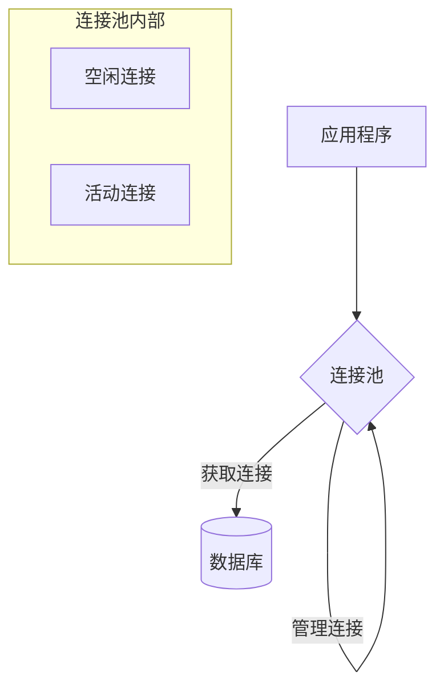

# Java 数据库连接池

## 什么是数据库连接池？

数据库连接池（Connection Pool）是一种用于管理数据库连接的技术，它在内存中维护一定数量的数据库连接对象，当应用需要访问数据库时，可以重用这些连接，而不是每次都创建新的连接。

:::note 为什么需要连接池
建立数据库连接是一个资源密集型操作，涉及网络通信、认证和资源分配。如果每次数据库操作都创建新连接，会极大地降低应用性能。
:::

## 数据库连接池的工作原理



数据库连接池的基本工作流程：

1. **初始化**：应用启动时，连接池会创建一定数量的数据库连接
2. **请求连接**：应用程序向连接池请求一个连接
3. **分配连接**：连接池从空闲连接中选择一个并提供给应用
4. **使用连接**：应用程序使用该连接执行数据库操作
5. **归还连接**：操作完成后，应用将连接归还给连接池（而不是关闭）
6. **连接管理**：连接池负责管理连接的生命周期、验证连接有效性等

## 数据库连接池的优势

- **性能提升**：重用连接避免了频繁创建/销毁连接的开销
- **资源控制**：限制数据库连接数量，防止数据库服务器过载
- **统一管理**：集中管理数据库连接，便于监控和调优
- **提高可靠性**：提供连接验证、失效检测和自动恢复机制

## 常用的Java连接池实现

在Java生态中，有几种流行的连接池实现：

1. **DBCP** (Database Connection Pool)：Apache Commons项目的一部分
2. **C3P0**：一个开源的JDBC连接池
3. **HikariCP**：性能最佳的连接池之一，Spring Boot 2.x的默认选择
4. **Druid**：阿里巴巴开源的数据库连接池，具有强大的监控功能
5. **Tomcat JDBC Pool**：Tomcat服务器的连接池实现

## 使用JDBC连接池的基本步骤

接下来，我们将学习如何在Java应用中使用连接池。这里以HikariCP为例：

### 1. 添加依赖

如果使用Maven：

```xml
<dependency>
    <groupId>com.zaxxer</groupId>
    <artifactId>HikariCP</artifactId>
    <version>5.0.1</version>
</dependency>

<!-- MySQL驱动 -->
<dependency>
    <groupId>mysql</groupId>
    <artifactId>mysql-connector-java</artifactId>
    <version>8.0.28</version>
</dependency>
```

### 2. 创建连接池

```java
import com.zaxxer.hikari.HikariConfig;
import com.zaxxer.hikari.HikariDataSource;
import java.sql.Connection;
import java.sql.SQLException;

public class ConnectionPoolDemo {
    
    private static HikariDataSource dataSource;
    
    static {
        // 创建配置对象
        HikariConfig config = new HikariConfig();
        // 设置JDBC URL、用户名和密码
        config.setJdbcUrl("jdbc:mysql://localhost:3306/mydatabase");
        config.setUsername("username");
        config.setPassword("password");
        
        // 设置连接池参数
        config.setMaximumPoolSize(10); // 最大连接数
        config.setMinimumIdle(5);      // 最小空闲连接
        config.setIdleTimeout(30000);  // 空闲连接超时（毫秒）
        config.setConnectionTimeout(30000); // 连接超时时间
        
        // 创建数据源
        dataSource = new HikariDataSource(config);
    }
    
    // 获取连接
    public static Connection getConnection() throws SQLException {
        return dataSource.getConnection();
    }
    
    // 关闭连接池
    public static void closePool() {
        if (dataSource != null) {
            dataSource.close();
        }
    }
}
```

### 3. 使用连接池中的连接

```java
import java.sql.Connection;
import java.sql.PreparedStatement;
import java.sql.ResultSet;
import java.sql.SQLException;

public class DatabaseOperations {
    
    public void fetchUserData(int userId) {
        // 声明连接、语句和结果集
        Connection conn = null;
        PreparedStatement pstmt = null;
        ResultSet rs = null;
        
        try {
            // 从连接池获取连接
            conn = ConnectionPoolDemo.getConnection();
            
            // 使用连接执行SQL操作
            pstmt = conn.prepareStatement("SELECT * FROM users WHERE id = ?");
            pstmt.setInt(1, userId);
            rs = pstmt.executeQuery();
            
            // 处理结果集
            while (rs.next()) {
                String username = rs.getString("username");
                String email = rs.getString("email");
                System.out.println("用户: " + username + ", 邮箱: " + email);
            }
            
        } catch (SQLException e) {
            e.printStackTrace();
        } finally {
            // 关闭资源（注意：连接不是真正关闭，而是返回池中）
            try {
                if (rs != null) rs.close();
                if (pstmt != null) pstmt.close();
                if (conn != null) conn.close(); // 实际上是归还连接到池中
            } catch (SQLException e) {
                e.printStackTrace();
            }
        }
    }
}
```

:::caution 重要提示
当你调用连接池获取的Connection对象的close()方法时，连接并没有真正关闭，而是归还到连接池中，以便后续复用。这是连接池的关键工作方式之一。
:::

## 连接池常见配置参数

不同的连接池实现有各自的配置参数，但大多数连接池支持以下核心参数：

| 参数名 | 描述 | 推荐值 |
|-------|------|--------|
| 最大连接数 | 池中允许的最大连接数 | 根据数据库性能和应用需求，通常10-100 |
| 最小空闲连接 | 池中保持的最小空闲连接数 | 通常为最大连接数的10%-30% |
| 初始连接数 | 池初始化时创建的连接数 | 与最小空闲连接相同或更小 |
| 连接超时 | 等待获取连接的最长时间 | 10-30秒，视应用需求而定 |
| 空闲超时 | 空闲连接被回收前的时间 | 几分钟到几十分钟 |
| 最大生命周期 | 连接被强制关闭前的最长存活时间 | 通常为数小时（如8小时） |
| 连接检测 | 检查连接是否有效的策略 | 建议按需检测，避免过度检测影响性能 |

## 实战案例：电商系统商品查询优化

以下是一个真实场景案例，展示了如何在电商系统中使用连接池优化商品查询性能。

### 问题场景

某电商平台在高峰期每秒接收上千次商品查询请求，每次请求都需要连接数据库获取商品信息。如果不使用连接池，系统性能会严重下降。

### 解决方案

创建一个专用的连接池服务类：

```java
public class ProductDatabaseService {
    
    private static HikariDataSource dataSource;
    
    static {
        try {
            // 加载配置文件
            Properties props = new Properties();
            props.load(ProductDatabaseService.class.getClassLoader().getResourceAsStream("database.properties"));
            
            HikariConfig config = new HikariConfig();
            config.setJdbcUrl(props.getProperty("db.url"));
            config.setUsername(props.getProperty("db.user"));
            config.setPassword(props.getProperty("db.password"));
            
            // 针对高并发查询场景的优化配置
            config.setMaximumPoolSize(50);  // 支持较高并发
            config.setMinimumIdle(10);      // 维持一定数量的空闲连接
            config.setIdleTimeout(60000);   // 空闲连接保留较长时间
            config.setConnectionTimeout(5000); // 快速失败，避免请求堆积
            
            // 性能优化设置
            config.addDataSourceProperty("cachePrepStmts", "true");
            config.addDataSourceProperty("prepStmtCacheSize", "250");
            config.addDataSourceProperty("prepStmtCacheSqlLimit", "2048");
            
            dataSource = new HikariDataSource(config);
        } catch (Exception e) {
            throw new RuntimeException("初始化连接池失败", e);
        }
    }
    
    // 获取商品详情
    public Product getProductDetails(long productId) {
        Product product = null;
        
        try (Connection conn = dataSource.getConnection();
             PreparedStatement pstmt = conn.prepareStatement(
                     "SELECT id, name, price, stock, description FROM products WHERE id = ?")) {
            
            pstmt.setLong(1, productId);
            
            try (ResultSet rs = pstmt.executeQuery()) {
                if (rs.next()) {
                    product = new Product(
                        rs.getLong("id"),
                        rs.getString("name"),
                        rs.getBigDecimal("price"),
                        rs.getInt("stock"),
                        rs.getString("description")
                    );
                }
            }
            
        } catch (SQLException e) {
            logger.error("查询商品信息失败: " + productId, e);
            throw new ServiceException("无法获取商品信息");
        }
        
        return product;
    }
    
    // 批量获取商品列表（分页）
    public List<ProductSummary> getProductList(int categoryId, int page, int size) {
        List<ProductSummary> products = new ArrayList<>();
        int offset = (page - 1) * size;
        
        try (Connection conn = dataSource.getConnection();
             PreparedStatement pstmt = conn.prepareStatement(
                     "SELECT id, name, price, image_url FROM products " +
                     "WHERE category_id = ? ORDER BY popularity DESC LIMIT ? OFFSET ?")) {
            
            pstmt.setInt(1, categoryId);
            pstmt.setInt(2, size);
            pstmt.setInt(3, offset);
            
            try (ResultSet rs = pstmt.executeQuery()) {
                while (rs.next()) {
                    ProductSummary summary = new ProductSummary(
                        rs.getLong("id"),
                        rs.getString("name"),
                        rs.getBigDecimal("price"),
                        rs.getString("image_url")
                    );
                    products.add(summary);
                }
            }
            
        } catch (SQLException e) {
            logger.error("查询商品列表失败: 分类=" + categoryId + ", 页码=" + page, e);
            throw new ServiceException("无法加载商品列表");
        }
        
        return products;
    }
    
    // 应用关闭时释放资源
    public static void shutdown() {
        if (dataSource != null) {
            dataSource.close();
        }
    }
}
```

### 性能改进结果

使用连接池后，系统性能得到明显改善：

1. 平均响应时间从原来的300毫秒降低到50毫秒
2. 服务器CPU使用率降低约40%
3. 数据库服务器负载降低约60%
4. 系统可支持的并发查询请求数提高了5倍

## 连接池最佳实践

1. **正确选择连接池大小**：连接池不是越大越好，过大的连接池会消耗更多资源，并可能导致数据库服务器过载
   
2. **合理配置超时参数**：设置合适的连接获取超时和空闲超时参数，避免资源浪费

3. **使用连接测试**：定期测试连接是否有效，但不要过于频繁以避免性能损失
   ```java
   config.setConnectionTestQuery("SELECT 1");
   config.setValidationTimeout(5000); // 5秒超时
   ```

4. **处理连接泄漏**：确保总是在finally块中关闭连接，或使用try-with-resources语法
   ```java
   try (Connection conn = dataSource.getConnection()) {
       // 使用连接...
   } // 自动关闭（归还）连接
   ```

5. **监控连接池状态**：定期检查连接池指标，如活动连接数、等待时间等

6. **使用PreparedStatement缓存**：大多数连接池支持PreparedStatement缓存，可以提高性能
   ```java
   config.addDataSourceProperty("cachePrepStmts", "true");
   config.addDataSourceProperty("prepStmtCacheSize", "250");
   ```

7. **避免在连接上设置自动提交模式**：保持连接池中连接的一致配置

## 总结

数据库连接池是Java应用中优化数据库访问的关键技术。通过复用数据库连接，连接池显著提高了应用程序性能，减少了资源消耗。

在本教程中，我们学习了：
- 数据库连接池的基本概念和工作原理
- 常见的Java连接池实现
- 如何配置和使用HikariCP连接池
- 连接池的重要配置参数及调优方法
- 实际业务场景中的连接池应用案例
- 连接池使用的最佳实践

掌握数据库连接池技术是Java开发者必备的技能之一，它能够帮助你构建高性能、可扩展的数据库应用。

## 练习

1. 创建一个使用HikariCP的简单应用程序，实现对用户表的CRUD操作。
2. 尝试比较不同连接池实现（如HikariCP、Druid和C3P0）的性能差异。
3. 编写一个程序，测试不同连接池大小对性能的影响。
4. 实现一个监控工具，记录并报告连接池的使用情况（活动连接数、等待时间等）。

## 额外资源

- [HikariCP GitHub 仓库](https://github.com/brettwooldridge/HikariCP)
- [JDBC 连接池调优指南](https://github.com/brettwooldridge/HikariCP/wiki/About-Pool-Sizing)
- [Java 性能权威指南](https://www.oreilly.com/library/view/java-performance-the/9781449363512/)（包含数据库连接优化章节）