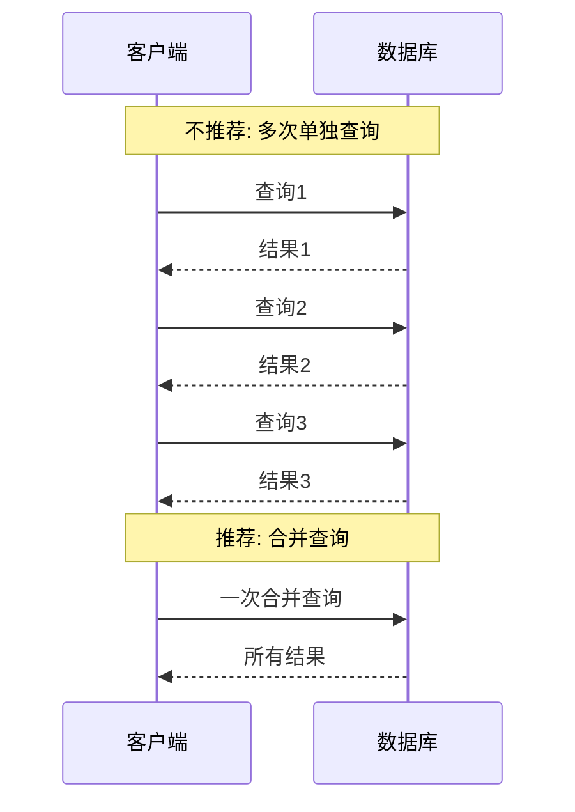

# Java JDBC最佳实践

## 引言

JDBC (Java Database Connectivity) 是Java语言访问关系型数据库的标准API。虽然JDBC功能强大，但不当使用可能导致性能问题、内存泄漏甚至安全漏洞。本文将介绍一系列JDBC最佳实践，帮助初学者避开常见陷阱，编写高效、安全、可维护的数据库操作代码。

## 数据库连接管理

### 1. 使用连接池

手动创建和关闭数据库连接是昂贵的操作。在实际应用中，应该使用连接池管理数据库连接。

:::tip
常用的连接池技术包括：HikariCP、Apache DBCP、C3P0等，其中HikariCP性能最优。
:::

**不推荐的做法**:

```java
// 每次操作创建新连接
Connection conn = DriverManager.getConnection(url, username, password);
// 使用连接...
conn.close();
```

**推荐的做法**:

```java
// 使用HikariCP连接池
HikariConfig config = new HikariConfig();
config.setJdbcUrl(url);
config.setUsername(username);
config.setPassword(password);
config.setMaximumPoolSize(10);
        
HikariDataSource dataSource = new HikariDataSource(config);
        
// 从连接池获取连接
Connection conn = dataSource.getConnection();
// 使用连接...
conn.close(); // 实际上是归还连接到池中
```

### 2. 及时关闭资源

未及时关闭的数据库资源会导致内存泄漏和连接耗尽。使用try-with-resources语句自动关闭资源。

**不推荐的做法**:

```java
Connection conn = null;
Statement stmt = null;
ResultSet rs = null;
try {
    conn = dataSource.getConnection();
    stmt = conn.createStatement();
    rs = stmt.executeQuery("SELECT * FROM users");
    // 处理结果...
} catch (SQLException e) {
    e.printStackTrace();
} finally {
    if (rs != null) {
        try { rs.close(); } catch (SQLException e) { e.printStackTrace(); }
    }
    if (stmt != null) {
        try { stmt.close(); } catch (SQLException e) { e.printStackTrace(); }
    }
    if (conn != null) {
        try { conn.close(); } catch (SQLException e) { e.printStackTrace(); }
    }
}
```

**推荐的做法**:

```java
try (Connection conn = dataSource.getConnection();
     Statement stmt = conn.createStatement();
     ResultSet rs = stmt.executeQuery("SELECT * FROM users")) {
    
    // 处理结果...
    
} catch (SQLException e) {
    e.printStackTrace();
}
```

## SQL注入防御

### 使用PreparedStatement

永远不要直接拼接SQL语句，这会导致SQL注入风险。始终使用PreparedStatement预编译SQL并绑定参数。

**不安全的做法**:

```java
String username = request.getParameter("username"); // 可能包含恶意输入
String sql = "SELECT * FROM users WHERE username = '" + username + "'";
Statement stmt = connection.createStatement();
ResultSet rs = stmt.executeQuery(sql);
```

**安全的做法**:

```java
String username = request.getParameter("username");
String sql = "SELECT * FROM users WHERE username = ?";
PreparedStatement pstmt = connection.prepareStatement(sql);
pstmt.setString(1, username);
ResultSet rs = pstmt.executeQuery();
```

## 批量处理

### 使用批量操作提高性能

当需要执行多条类似的SQL语句时，使用批量操作可以显著提高性能。

```java
try (Connection conn = dataSource.getConnection();
     PreparedStatement pstmt = conn.prepareStatement(
             "INSERT INTO products (name, price) VALUES (?, ?)")) {
    
    conn.setAutoCommit(false);
    
    for (Product product : productList) {
        pstmt.setString(1, product.getName());
        pstmt.setDouble(2, product.getPrice());
        pstmt.addBatch();
    }
    
    int[] updateCounts = pstmt.executeBatch();
    conn.commit();
    
    System.out.println("已批量插入 " + updateCounts.length + " 条记录");
    
} catch (SQLException e) {
    e.printStackTrace();
}
```

## 事务管理

### 正确使用事务

对于需要保证原子性的多操作组合，正确使用事务非常重要。

```java
Connection conn = null;
try {
    conn = dataSource.getConnection();
    conn.setAutoCommit(false); // 开始事务
    
    // 执行多个操作
    try (PreparedStatement pstmt1 = conn.prepareStatement("UPDATE accounts SET balance = balance - ? WHERE id = ?")) {
        pstmt1.setDouble(1, amount);
        pstmt1.setLong(2, fromAccountId);
        pstmt1.executeUpdate();
    }
    
    try (PreparedStatement pstmt2 = conn.prepareStatement("UPDATE accounts SET balance = balance + ? WHERE id = ?")) {
        pstmt2.setDouble(1, amount);
        pstmt2.setLong(2, toAccountId);
        pstmt2.executeUpdate();
    }
    
    conn.commit(); // 提交事务
    System.out.println("转账成功");
    
} catch (SQLException e) {
    if (conn != null) {
        try {
            conn.rollback(); // 出错时回滚
            System.out.println("转账失败，已回滚");
        } catch (SQLException ex) {
            ex.printStackTrace();
        }
    }
    e.printStackTrace();
} finally {
    if (conn != null) {
        try {
            conn.setAutoCommit(true); // 恢复自动提交
            conn.close();
        } catch (SQLException e) {
            e.printStackTrace();
        }
    }
}
```

## 结果集处理

### 有效处理ResultSet

处理结果集时，避免在循环中进行昂贵的操作，并注意正确地获取不同类型的数据。

```java
try (Connection conn = dataSource.getConnection();
     PreparedStatement pstmt = conn.prepareStatement("SELECT id, name, birth_date, salary FROM employees");
     ResultSet rs = pstmt.executeQuery()) {
    
    List<Employee> employees = new ArrayList<>();
    
    while (rs.next()) {
        Employee emp = new Employee();
        emp.setId(rs.getLong("id"));
        emp.setName(rs.getString("name"));
        
        // 处理可能为NULL的日期
        java.sql.Date birthDate = rs.getDate("birth_date");
        if (!rs.wasNull()) {
            emp.setBirthDate(birthDate.toLocalDate());
        }
        
        emp.setSalary(rs.getBigDecimal("salary"));
        
        employees.add(emp);
    }
    
    System.out.println("加载了 " + employees.size() + " 名员工信息");
    
} catch (SQLException e) {
    e.printStackTrace();
}
```

## 错误处理和日志

### 恰当处理JDBC异常

JDBC异常包含丰富的信息，恰当处理这些异常可以帮助诊断问题。

```java
try {
    // JDBC操作...
} catch (SQLException e) {
    // 打印详细错误信息
    System.err.println("SQL错误码: " + e.getErrorCode());
    System.err.println("SQL状态: " + e.getSQLState());
    System.err.println("错误消息: " + e.getMessage());
    
    // 在实际应用中使用日志框架
    logger.error("数据库操作失败", e);
    
    // 可能的恢复措施
    if (e.getErrorCode() == 1205) { // 假设1205是死锁错误码
        // 重试逻辑
    }
}
```

## 实际案例：学生管理系统

下面是一个综合应用JDBC最佳实践的学生管理系统示例：

```java
public class StudentDAO {
    private final DataSource dataSource;
    
    public StudentDAO(DataSource dataSource) {
        this.dataSource = dataSource;
    }
    
    public void addStudent(Student student) throws DAOException {
        String sql = "INSERT INTO students (name, email, grade) VALUES (?, ?, ?)";
        
        try (Connection conn = dataSource.getConnection();
             PreparedStatement pstmt = conn.prepareStatement(sql, Statement.RETURN_GENERATED_KEYS)) {
            
            pstmt.setString(1, student.getName());
            pstmt.setString(2, student.getEmail());
            pstmt.setInt(3, student.getGrade());
            
            int affectedRows = pstmt.executeUpdate();
            
            if (affectedRows == 0) {
                throw new DAOException("创建学生记录失败，未插入任何行");
            }
            
            try (ResultSet generatedKeys = pstmt.getGeneratedKeys()) {
                if (generatedKeys.next()) {
                    student.setId(generatedKeys.getLong(1));
                } else {
                    throw new DAOException("创建学生记录失败，未获取到ID");
                }
            }
            
        } catch (SQLException e) {
            throw new DAOException("添加学生失败", e);
        }
    }
    
    public List<Student> findStudentsByGrade(int grade) throws DAOException {
        String sql = "SELECT id, name, email, grade FROM students WHERE grade = ?";
        List<Student> students = new ArrayList<>();
        
        try (Connection conn = dataSource.getConnection();
             PreparedStatement pstmt = conn.prepareStatement(sql)) {
            
            pstmt.setInt(1, grade);
            
            try (ResultSet rs = pstmt.executeQuery()) {
                while (rs.next()) {
                    Student student = new Student();
                    student.setId(rs.getLong("id"));
                    student.setName(rs.getString("name"));
                    student.setEmail(rs.getString("email"));
                    student.setGrade(rs.getInt("grade"));
                    students.add(student);
                }
            }
            
            return students;
            
        } catch (SQLException e) {
            throw new DAOException("查询学生失败", e);
        }
    }
    
    public void updateStudentGrades(Map<Long, Integer> studentGrades) throws DAOException {
        String sql = "UPDATE students SET grade = ? WHERE id = ?";
        
        try (Connection conn = dataSource.getConnection()) {
            conn.setAutoCommit(false);
            
            try (PreparedStatement pstmt = conn.prepareStatement(sql)) {
                for (Map.Entry<Long, Integer> entry : studentGrades.entrySet()) {
                    pstmt.setInt(1, entry.getValue());
                    pstmt.setLong(2, entry.getKey());
                    pstmt.addBatch();
                }
                
                int[] updateCounts = pstmt.executeBatch();
                conn.commit();
                
                // 验证所有更新是否成功
                for (int count : updateCounts) {
                    if (count != 1) {
                        throw new DAOException("批量更新学生成绩部分失败");
                    }
                }
            } catch (SQLException e) {
                conn.rollback();
                throw e;
            } finally {
                conn.setAutoCommit(true);
            }
            
        } catch (SQLException e) {
            throw new DAOException("更新学生成绩失败", e);
        }
    }
}
```

使用示例：

```java
// 初始化连接池
HikariConfig config = new HikariConfig();
config.setJdbcUrl("jdbc:mysql://localhost:3306/school");
config.setUsername("root");
config.setPassword("password");
DataSource dataSource = new HikariDataSource(config);

// 创建DAO
StudentDAO studentDAO = new StudentDAO(dataSource);

// 添加学生
Student newStudent = new Student();
newStudent.setName("张三");
newStudent.setEmail("zhangsan@example.com");
newStudent.setGrade(3);
studentDAO.addStudent(newStudent);
System.out.println("添加学生成功，ID: " + newStudent.getId());

// 查询学生
List<Student> gradeThreeStudents = studentDAO.findStudentsByGrade(3);
System.out.println("三年级学生列表:");
for (Student s : gradeThreeStudents) {
    System.out.println(s.getId() + ": " + s.getName());
}

// 批量更新成绩
Map<Long, Integer> updates = new HashMap<>();
updates.put(1L, 4);  // ID为1的学生升级到4年级
updates.put(2L, 4);  // ID为2的学生升级到4年级
studentDAO.updateStudentGrades(updates);
System.out.println("已将2名学生升级到4年级");
```

## 性能优化

### 1. 最小化数据库往返

减少客户端和数据库服务器之间的往返通信可以提高性能。



### 2. 使用适当的获取大小

对于大型结果集，设置适当的获取大小可以优化内存使用。

```java
Statement stmt = conn.createStatement();
stmt.setFetchSize(100); // 每次从数据库获取100行
ResultSet rs = stmt.executeQuery("SELECT * FROM large_table");
```

## 总结

JDBC是Java开发者与数据库交互的基础工具，掌握这些最佳实践对于编写高质量的数据库应用至关重要：

1. **连接管理**：使用连接池并正确关闭资源
2. **安全性**：使用PreparedStatement防止SQL注入
3. **性能优化**：批量处理和适当的获取大小设置
4. **事务处理**：正确使用事务确保数据完整性
5. **错误处理**：恰当处理JDBC异常并提供有用的日志

遵循这些最佳实践，你将能够开发出更安全、更高效、更可维护的数据库应用程序。

## 练习与深入学习

1. 创建一个简单的图书管理系统，实现图书的CRUD操作，应用本文中的所有最佳实践。
2. 尝试使用不同的连接池（HikariCP、DBCP、C3P0）比较它们的性能差异。
3. 探索ORM框架（如Hibernate或MyBatis）如何简化JDBC操作并内置许多最佳实践。

## 参考资源

- [Java JDBC API文档](https://docs.oracle.com/javase/8/docs/technotes/guides/jdbc/)
- [HikariCP连接池](https://github.com/brettwooldridge/HikariCP)
- [OWASP SQL注入防御指南](https://cheatsheetseries.owasp.org/cheatsheets/SQL_Injection_Prevention_Cheat_Sheet.html)

:::caution
记住，数据库访问是应用程序中最常见的性能瓶颈之一。定期审查和优化你的JDBC代码可以带来显著的性能提升。
:::