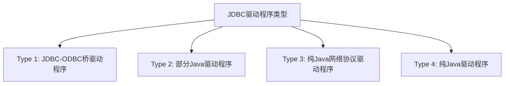

# Java 驱动程序

在Java应用程序与数据库交互的世界中，JDBC驱动程序扮演着至关重要的角色。它们就像是Java应用程序与各种数据库之间的翻译官，使得开发者能够使用统一的API来操作不同类型的数据库。

## 什么是JDBC驱动程序？

JDBC（Java Database Connectivity）驱动程序是一组Java类，它实现了JDBC API中定义的接口，为Java应用程序提供了与特定数据库进行通信的能力。这些驱动程序负责将JDBC调用转换为特定数据库能够理解的网络协议。

:::note
JDBC驱动程序是连接Java应用程序与数据库的桥梁，不同的数据库需要使用不同的JDBC驱动程序。
:::

## JDBC驱动程序的类型

JDBC驱动程序主要分为四种类型：



### 1. Type 1: JDBC-ODBC桥驱动程序

这种类型的驱动程序通过ODBC（Open Database Connectivity）驱动程序来访问数据库。JDBC API的方法调用被转换为ODBC函数调用。

**优点：**
- 可以连接到几乎任何提供ODBC驱动程序的数据库

**缺点：**
- 需要在客户端安装ODBC驱动程序
- 性能较差
- Java 8已经移除了JDBC-ODBC桥

### 2. Type 2: 部分Java驱动程序

这种驱动程序将JDBC调用转换为数据库特定的客户端API调用。它部分使用Java实现，部分使用本地代码实现。

**优点：**
- 性能优于Type 1驱动程序

**缺点：**
- 需要在客户端安装数据库特定的本地库
- 平台依赖性

### 3. Type 3: 纯Java网络协议驱动程序

这种驱动程序使用中间件（应用服务器）来转换JDBC调用，然后将其发送到各种数据库。

**优点：**
- 纯Java实现，平台独立
- 无需安装特定数据库的客户端软件
- 支持连接池和负载均衡

**缺点：**
- 需要额外的中间层服务器
- 架构更复杂

### 4. Type 4: 纯Java驱动程序

这是最常用的JDBC驱动程序类型，采用纯Java实现，直接与数据库通信，无需中间层或本地库。

**优点：**
- 纯Java实现，平台独立
- 性能最佳
- 无需额外软件支持
- 直接与数据库通信

**缺点：**
- 针对特定数据库，不同数据库需要不同的驱动程序

:::tip
在实际开发中，Type 4（纯Java驱动程序）是推荐使用的驱动程序类型，因为它提供了最佳的性能和最简单的部署模型。
:::

## 常见数据库的JDBC驱动程序

不同的数据库系统提供自己的JDBC驱动程序：

| 数据库    | 驱动程序类                                   | JAR文件名称例子              |
|-----------|----------------------------------------------|------------------------------|
| MySQL     | `com.mysql.cj.jdbc.Driver`                   | mysql-connector-java-8.0.27.jar |
| PostgreSQL| `org.postgresql.Driver`                      | postgresql-42.3.1.jar        |
| Oracle    | `oracle.jdbc.OracleDriver`                   | ojdbc8.jar                   |
| SQL Server| `com.microsoft.sqlserver.jdbc.SQLServerDriver`| mssql-jdbc-9.4.0.jre11.jar   |
| SQLite    | `org.sqlite.JDBC`                            | sqlite-jdbc-3.36.0.3.jar     |
| H2        | `org.h2.Driver`                              | h2-1.4.200.jar               |

## 如何使用JDBC驱动程序

使用JDBC驱动程序连接数据库的一般步骤如下：

### 1. 添加JDBC驱动程序到项目中

首先，你需要将相应数据库的JDBC驱动程序JAR文件添加到你的项目依赖中。

**使用Maven：**

```xml
<!-- MySQL驱动程序示例 -->
<dependency>
    <groupId>mysql</groupId>
    <artifactId>mysql-connector-java</artifactId>
    <version>8.0.27</version>
</dependency>
```

### 2. 加载JDBC驱动程序

```java
try {
    // 加载MySQL驱动程序
    Class.forName("com.mysql.cj.jdbc.Driver");
} catch (ClassNotFoundException e) {
    System.err.println("无法加载数据库驱动程序: " + e.getMessage());
    e.printStackTrace();
}
```

:::note
从JDBC 4.0（Java 6）开始，当你首次尝试连接到数据库时，驱动程序会自动注册，因此显式调用`Class.forName()`不再是必需的。然而，为了向后兼容性和确保驱动程序正确加载，有时仍然包含这一步。
:::

### 3. 建立数据库连接

```java
import java.sql.Connection;
import java.sql.DriverManager;
import java.sql.SQLException;

public class JDBCConnectionExample {
    public static void main(String[] args) {
        // 数据库URL
        String url = "jdbc:mysql://localhost:3306/mydb?useSSL=false";
        // 数据库用户名和密码
        String user = "username";
        String password = "password";
        
        // 声明Connection对象
        Connection connection = null;
        
        try {
            // 建立连接
            connection = DriverManager.getConnection(url, user, password);
            System.out.println("数据库连接成功！");
            
            // 在这里执行数据库操作...
            
        } catch (SQLException e) {
            System.err.println("连接数据库时发生错误: " + e.getMessage());
            e.printStackTrace();
        } finally {
            // 关闭连接
            if (connection != null) {
                try {
                    connection.close();
                    System.out.println("数据库连接已关闭。");
                } catch (SQLException e) {
                    System.err.println("关闭连接时发生错误: " + e.getMessage());
                }
            }
        }
    }
}
```

**输出：**
```
数据库连接成功！
数据库连接已关闭。
```

### 4. JDBC URL格式

JDBC URL是连接数据库的地址，不同数据库有不同的格式：

| 数据库    | URL格式                                               | 示例                                                 |
|-----------|---------------------------------------------------------|------------------------------------------------------|
| MySQL     | `jdbc:mysql://主机名:端口/数据库名?参数=值`              | `jdbc:mysql://localhost:3306/mydb?useSSL=false`      |
| PostgreSQL| `jdbc:postgresql://主机名:端口/数据库名`                 | `jdbc:postgresql://localhost:5432/mydb`              |
| Oracle    | `jdbc:oracle:thin:@主机名:端口:SID`                      | `jdbc:oracle:thin:@localhost:1521:orcl`              |
| SQL Server| `jdbc:sqlserver://主机名:端口;databaseName=数据库名`     | `jdbc:sqlserver://localhost:1433;databaseName=mydb`  |
| SQLite    | `jdbc:sqlite:数据库文件路径`                             | `jdbc:sqlite:C:/data/mydb.db`                        |
| H2        | `jdbc:h2:文件路径` 或 `jdbc:h2:mem:数据库名`（内存）     | `jdbc:h2:./data/mydb` 或 `jdbc:h2:mem:testdb`        |

## 驱动程序管理器

`DriverManager`类是JDBC的核心类之一，负责管理JDBC驱动程序并建立数据库连接。

### 主要功能：

1. **注册驱动程序**：当驱动程序类被加载时，它会自动向`DriverManager`注册自己。
2. **建立连接**：通过`getConnection()`方法连接数据库。
3. **设置登录超时**：通过`setLoginTimeout()`方法设置连接超时时间。

```java
// 设置登录超时时间为5秒
DriverManager.setLoginTimeout(5);

// 获取连接
Connection connection = DriverManager.getConnection(url, user, password);
```

## 实际案例：完整的JDBC示例

下面是一个完整的JDBC示例，展示了如何使用驱动程序连接MySQL数据库并执行简单的CRUD（创建、读取、更新、删除）操作：

```java
import java.sql.*;

public class JDBCExample {
    // 数据库连接信息
    static final String JDBC_DRIVER = "com.mysql.cj.jdbc.Driver";
    static final String DB_URL = "jdbc:mysql://localhost:3306/employees?useSSL=false";
    static final String USER = "root";
    static final String PASS = "password";
    
    public static void main(String[] args) {
        Connection conn = null;
        Statement stmt = null;
        ResultSet rs = null;
        
        try {
            // 注册JDBC驱动程序
            Class.forName(JDBC_DRIVER);
            
            // 打开连接
            System.out.println("连接数据库...");
            conn = DriverManager.getConnection(DB_URL, USER, PASS);
            
            // 创建Statement对象
            stmt = conn.createStatement();
            
            // 创建表
            System.out.println("创建表...");
            String sql = "CREATE TABLE IF NOT EXISTS employees " +
                         "(id INT PRIMARY KEY AUTO_INCREMENT, " +
                         " name VARCHAR(50), " +
                         " age INT, " +
                         " department VARCHAR(50))";
            stmt.executeUpdate(sql);
            
            // 插入数据
            System.out.println("插入数据...");
            sql = "INSERT INTO employees (name, age, department) VALUES " +
                  "('张三', 28, '研发部'), " +
                  "('李四', 32, '市场部'), " +
                  "('王五', 45, '人事部')";
            int rowsAffected = stmt.executeUpdate(sql);
            System.out.println("已插入 " + rowsAffected + " 条记录");
            
            // 查询数据
            System.out.println("\n查询所有员工信息:");
            sql = "SELECT id, name, age, department FROM employees";
            rs = stmt.executeQuery(sql);
            
            // 处理结果集
            while(rs.next()) {
                // 通过列名获取
                int id = rs.getInt("id");
                String name = rs.getString("name");
                int age = rs.getInt("age");
                String department = rs.getString("department");
                
                // 显示结果
                System.out.println("ID: " + id + ", 姓名: " + name + 
                                   ", 年龄: " + age + ", 部门: " + department);
            }
            
            // 更新数据
            System.out.println("\n更新数据...");
            sql = "UPDATE employees SET age = 29 WHERE name = '张三'";
            rowsAffected = stmt.executeUpdate(sql);
            System.out.println("已更新 " + rowsAffected + " 条记录");
            
            // 删除数据
            System.out.println("\n删除数据...");
            sql = "DELETE FROM employees WHERE name = '王五'";
            rowsAffected = stmt.executeUpdate(sql);
            System.out.println("已删除 " + rowsAffected + " 条记录");
            
            // 再次查询以验证更新和删除
            System.out.println("\n更新后的员工信息:");
            sql = "SELECT id, name, age, department FROM employees";
            rs = stmt.executeQuery(sql);
            
            while(rs.next()) {
                int id = rs.getInt("id");
                String name = rs.getString("name");
                int age = rs.getInt("age");
                String department = rs.getString("department");
                
                System.out.println("ID: " + id + ", 姓名: " + name + 
                                   ", 年龄: " + age + ", 部门: " + department);
            }
            
        } catch(SQLException se) {
            // 处理JDBC错误
            se.printStackTrace();
        } catch(Exception e) {
            // 处理Class.forName错误
            e.printStackTrace();
        } finally {
            // 关闭资源
            try {
                if(rs != null) rs.close();
                if(stmt != null) stmt.close();
                if(conn != null) conn.close();
                System.out.println("\n资源已关闭。");
            } catch(SQLException se) {
                se.printStackTrace();
            }
        }
    }
}
```

**输出：**
```
连接数据库...
创建表...
插入数据...
已插入 3 条记录

查询所有员工信息:
ID: 1, 姓名: 张三, 年龄: 28, 部门: 研发部
ID: 2, 姓名: 李四, 年龄: 32, 部门: 市场部
ID: 3, 姓名: 王五, 年龄: 45, 部门: 人事部

更新数据...
已更新 1 条记录

删除数据...
已删除 1 条记录

更新后的员工信息:
ID: 1, 姓名: 张三, 年龄: 29, 部门: 研发部
ID: 2, 姓名: 李四, 年龄: 32, 部门: 市场部

资源已关闭。
```

## 使用PreparedStatement防止SQL注入

使用`PreparedStatement`是防止SQL注入攻击的最佳实践：

```java
// 不安全的方式（容易受到SQL注入攻击）
String sql = "SELECT * FROM users WHERE username = '" + inputUsername + "'";
Statement stmt = conn.createStatement();
ResultSet rs = stmt.executeQuery(sql);

// 安全的方式（使用PreparedStatement）
String sql = "SELECT * FROM users WHERE username = ?";
PreparedStatement pstmt = conn.prepareStatement(sql);
pstmt.setString(1, inputUsername);
ResultSet rs = pstmt.executeQuery();
```

:::warning
始终使用PreparedStatement而不是Statement来处理包含用户输入的SQL查询，以防止SQL注入攻击。
:::

## 驱动程序最佳实践

1. **使用连接池**：为了提高性能，使用连接池管理数据库连接（如HikariCP、C3P0、DBCP）。
2. **总是关闭资源**：使用try-with-resources语句或在finally块中关闭所有JDBC资源（ResultSet、Statement、Connection）。
3. **使用最新的驱动程序**：定期更新JDBC驱动程序以获取性能改进和安全修复。
4. **正确处理异常**：捕获并适当处理所有可能的SQLException。
5. **批处理操作**：使用批处理来提高多条SQL语句的执行效率。
6. **避免硬编码连接信息**：将数据库连接信息存储在配置文件中，而不是硬编码在应用程序中。

## 总结

JDBC驱动程序是Java应用程序与数据库交互的基础。它们遵循JDBC API规范，使开发者能够使用统一的接口访问不同类型的数据库。其中，Type 4纯Java驱动程序是现代应用程序中最常用的驱动程序类型，因为它们提供了最佳性能和最简单的部署模型。

了解如何正确选择、配置和使用JDBC驱动程序对于开发健壮、高效的Java数据库应用程序至关重要。始终遵循安全最佳实践，如使用PreparedStatement防止SQL注入，并确保适当管理资源以避免内存泄漏。

## 练习与进阶

1. 尝试使用不同的数据库（MySQL、PostgreSQL、SQLite等）及其对应的JDBC驱动程序。
2. 实现一个简单的数据库连接池。
3. 使用批处理操作向数据库插入大量数据，并比较与单条插入的性能差异。
4. 研究事务管理，了解如何使用JDBC处理事务。
5. 探索如何使用JDBC处理BLOB和CLOB数据类型。

## 进一步阅读资源

- [Oracle JDBC驱动程序文档](https://docs.oracle.com/en/database/oracle/oracle-database/21/jjdbc/)
- [MySQL Connector/J文档](https://dev.mysql.com/doc/connector-j/en/)
- [PostgreSQL JDBC驱动程序文档](https://jdbc.postgresql.org/documentation/)
- [HikariCP连接池](https://github.com/brettwooldridge/HikariCP)
- [Common JDBC Pitfalls](https://vladmihalcea.com/jdbc-driver-connection-url-strings/)

通过掌握JDBC驱动程序，你将能够在Java应用程序中高效、安全地与各种数据库交互，这是开发企业级应用程序的基本技能。