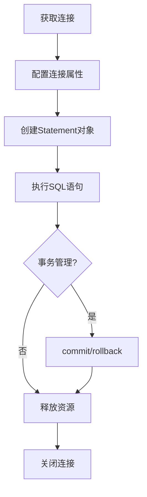

# Java Connection接口

在JDBC（Java Database Connectivity）中，Connection接口是连接Java应用程序和数据库的桥梁。作为JDBC API中最基础的组成部分之一，它为开发者提供了与数据库交互的能力，使应用程序能够执行SQL语句、管理事务以及处理数据库连接资源。

## Connection接口的作用

Connection接口在JDBC中扮演着以下核心角色：

1. **建立数据库连接**：提供连接到特定数据库的方法
2. **执行SQL语句**：创建Statement、PreparedStatement和CallableStatement对象
3. **管理事务**：控制数据库事务的提交和回滚
4. **设置连接属性**：如自动提交、事务隔离级别等
5. **管理元数据**：获取关于数据库和结果集的元数据信息

## 获取数据库连接

要使用Connection接口，首先需要获取一个Connection对象。在JDBC中，获取连接的标准方式是通过DriverManager类：

```java
import java.sql.Connection;
import java.sql.DriverManager;
import java.sql.SQLException;

public class ConnectionExample {
    public static void main(String[] args) {
        // 连接参数
        String url = "jdbc:mysql://localhost:3306/mydb";
        String username = "root";
        String password = "password";
        
        // 声明Connection对象
        Connection connection = null;
        
        try {
            // 获取连接
            connection = DriverManager.getConnection(url, username, password);
            System.out.println("数据库连接成功!");
            
            // 使用连接执行操作...
            
        } catch (SQLException e) {
            System.out.println("数据库连接失败: " + e.getMessage());
        } finally {
            // 关闭连接
            try {
                if (connection != null && !connection.isClosed()) {
                    connection.close();
                    System.out.println("数据库连接已关闭!");
                }
            } catch (SQLException e) {
                System.out.println("关闭连接失败: " + e.getMessage());
            }
        }
    }
}
```

:::tip
从JDBC 4.0版本开始，不再需要手动加载数据库驱动（Class.forName()），因为驱动会通过SPI（Service Provider Interface）机制自动加载。
:::

## Connection接口的主要方法

Connection接口提供了许多重要方法，下面是一些常用方法的介绍：

### 1. 创建Statement对象

```java
Statement createStatement() throws SQLException;
PreparedStatement prepareStatement(String sql) throws SQLException;
CallableStatement prepareCall(String sql) throws SQLException;
```

这些方法用于创建不同类型的Statement对象，用于执行SQL语句：

```java
// 创建Statement对象
Statement stmt = connection.createStatement();

// 创建PreparedStatement对象
PreparedStatement pstmt = connection.prepareStatement("SELECT * FROM users WHERE id = ?");

// 创建CallableStatement对象
CallableStatement cstmt = connection.prepareCall("{call my_procedure(?)}");
```

### 2. 事务管理

```java
void setAutoCommit(boolean autoCommit) throws SQLException;
boolean getAutoCommit() throws SQLException;
void commit() throws SQLException;
void rollback() throws SQLException;
```

使用这些方法可以控制事务的提交和回滚：

```java
try {
    // 关闭自动提交
    connection.setAutoCommit(false);
    
    // 执行一系列SQL操作
    Statement stmt = connection.createStatement();
    stmt.executeUpdate("INSERT INTO users (name, email) VALUES ('张三', 'zhangsan@example.com')");
    stmt.executeUpdate("UPDATE accounts SET balance = balance - 100 WHERE user_id = 1");
    stmt.executeUpdate("UPDATE accounts SET balance = balance + 100 WHERE user_id = 2");
    
    // 提交事务
    connection.commit();
    System.out.println("事务提交成功!");
    
} catch (SQLException e) {
    // 发生错误时回滚事务
    if (connection != null) {
        try {
            connection.rollback();
            System.out.println("事务已回滚!");
        } catch (SQLException ex) {
            ex.printStackTrace();
        }
    }
    e.printStackTrace();
} finally {
    // 恢复自动提交
    if (connection != null) {
        try {
            connection.setAutoCommit(true);
        } catch (SQLException e) {
            e.printStackTrace();
        }
    }
}
```

### 3. 设置事务隔离级别

```java
void setTransactionIsolation(int level) throws SQLException;
int getTransactionIsolation() throws SQLException;
```

JDBC定义了以下事务隔离级别常量：

```java
// 示例：设置事务隔离级别
connection.setTransactionIsolation(Connection.TRANSACTION_READ_COMMITTED);
```

事务隔离级别包括：

- `Connection.TRANSACTION_NONE`
- `Connection.TRANSACTION_READ_UNCOMMITTED`
- `Connection.TRANSACTION_READ_COMMITTED`
- `Connection.TRANSACTION_REPEATABLE_READ`
- `Connection.TRANSACTION_SERIALIZABLE`

### 4. 连接状态管理

```java
boolean isClosed() throws SQLException;
void close() throws SQLException;
boolean isValid(int timeout) throws SQLException;
```

这些方法用于管理连接的状态：

```java
// 检查连接是否关闭
if (!connection.isClosed()) {
    // 使用连接...
}

// 检查连接是否有效（5秒超时）
if (connection.isValid(5)) {
    System.out.println("连接有效");
} else {
    System.out.println("连接无效");
}
```

## 连接池与Connection接口

在实际应用中，频繁创建和关闭数据库连接会消耗大量资源。因此，通常使用连接池来管理Connection对象：

```java
import java.sql.Connection;
import java.sql.SQLException;
import javax.sql.DataSource;
import com.zaxxer.hikari.HikariConfig;
import com.zaxxer.hikari.HikariDataSource;

public class ConnectionPoolExample {
    public static void main(String[] args) {
        // 配置HikariCP连接池
        HikariConfig config = new HikariConfig();
        config.setJdbcUrl("jdbc:mysql://localhost:3306/mydb");
        config.setUsername("root");
        config.setPassword("password");
        config.setMaximumPoolSize(10);
        
        // 创建数据源
        DataSource dataSource = new HikariDataSource(config);
        
        try (Connection conn = dataSource.getConnection()) {
            // 使用连接执行操作
            System.out.println("从连接池获取连接成功!");
            
            // 当connection.close()被调用时，连接不会真正关闭
            // 而是返回到连接池中供后续使用
        } catch (SQLException e) {
            e.printStackTrace();
        }
    }
}
```

:::note
使用连接池后，调用`connection.close()`方法通常不会真正关闭连接，而是将连接归还到池中以供重用。这大大提高了应用程序的性能。
:::

## 实际应用场景

### 场景一：用户注册系统

下面是一个使用Connection接口实现用户注册功能的实例：

```java
public class UserRegistrationService {
    private final String DB_URL = "jdbc:mysql://localhost:3306/userdb";
    private final String USER = "admin";
    private final String PASS = "admin123";
    
    public boolean registerUser(String username, String email, String password) {
        String sql = "INSERT INTO users (username, email, password) VALUES (?, ?, ?)";
        
        try (Connection conn = DriverManager.getConnection(DB_URL, USER, PASS);
             PreparedStatement pstmt = conn.prepareStatement(sql)) {
            
            pstmt.setString(1, username);
            pstmt.setString(2, email);
            pstmt.setString(3, hashPassword(password)); // 假设有一个密码哈希方法
            
            int rowsAffected = pstmt.executeUpdate();
            return rowsAffected > 0;
            
        } catch (SQLException e) {
            System.out.println("注册失败: " + e.getMessage());
            return false;
        }
    }
    
    private String hashPassword(String password) {
        // 实现密码哈希算法
        return password; // 简化示例
    }
}
```

### 场景二：银行转账（事务管理）

下面展示了如何使用Connection接口的事务管理功能来实现银行账户转账：

```java
public class BankTransferService {
    private final String DB_URL = "jdbc:mysql://localhost:3306/bankdb";
    private final String USER = "bank_admin";
    private final String PASS = "secure_password";
    
    public boolean transferMoney(int fromAccountId, int toAccountId, double amount) {
        Connection conn = null;
        try {
            conn = DriverManager.getConnection(DB_URL, USER, PASS);
            
            // 开始事务
            conn.setAutoCommit(false);
            
            // 检查余额是否足够
            String checkBalanceSql = "SELECT balance FROM accounts WHERE id = ?";
            PreparedStatement checkStmt = conn.prepareStatement(checkBalanceSql);
            checkStmt.setInt(1, fromAccountId);
            ResultSet rs = checkStmt.executeQuery();
            
            if (rs.next()) {
                double currentBalance = rs.getDouble("balance");
                if (currentBalance < amount) {
                    conn.rollback();
                    return false; // 余额不足
                }
            } else {
                conn.rollback();
                return false; // 账户不存在
            }
            
            // 从源账户扣款
            String withdrawSql = "UPDATE accounts SET balance = balance - ? WHERE id = ?";
            PreparedStatement withdrawStmt = conn.prepareStatement(withdrawSql);
            withdrawStmt.setDouble(1, amount);
            withdrawStmt.setInt(2, fromAccountId);
            withdrawStmt.executeUpdate();
            
            // 向目标账户存款
            String depositSql = "UPDATE accounts SET balance = balance + ? WHERE id = ?";
            PreparedStatement depositStmt = conn.prepareStatement(depositSql);
            depositStmt.setDouble(1, amount);
            depositStmt.setInt(2, toAccountId);
            depositStmt.executeUpdate();
            
            // 记录交易日志
            String logSql = "INSERT INTO transactions (from_account, to_account, amount, transaction_date) VALUES (?, ?, ?, NOW())";
            PreparedStatement logStmt = conn.prepareStatement(logSql);
            logStmt.setInt(1, fromAccountId);
            logStmt.setInt(2, toAccountId);
            logStmt.setDouble(3, amount);
            logStmt.executeUpdate();
            
            // 提交事务
            conn.commit();
            return true;
            
        } catch (SQLException e) {
            // 发生异常，回滚事务
            try {
                if (conn != null) {
                    conn.rollback();
                }
            } catch (SQLException ex) {
                ex.printStackTrace();
            }
            System.out.println("转账失败: " + e.getMessage());
            return false;
        } finally {
            try {
                if (conn != null) {
                    // 恢复自动提交
                    conn.setAutoCommit(true);
                    conn.close();
                }
            } catch (SQLException e) {
                e.printStackTrace();
            }
        }
    }
}
```

## Connection接口的生命周期

Connection对象的典型生命周期如下图所示：



:::caution
不正确地管理Connection对象可能导致连接泄漏，这是JDBC应用程序中常见的性能问题。始终在finally块中关闭连接，或者使用try-with-resources语句自动管理资源关闭。
:::

## 最佳实践

使用Connection接口时，请遵循以下最佳实践：

1. **使用try-with-resources**：自动关闭资源，避免连接泄漏
2. **使用连接池**：重用连接以提高性能
3. **正确管理事务**：明确何时开始和结束事务
4. **使用PreparedStatement**：防止SQL注入攻击
5. **设置合适的事务隔离级别**：根据应用场景平衡一致性和性能
6. **定期检查连接有效性**：使用`isValid()`方法检查连接状态

## 总结

Connection接口是JDBC中最基础也是最重要的组件之一，它为Java应用程序和数据库之间提供了通信桥梁。通过Connection对象，开发者可以执行SQL语句、管理事务、控制数据库连接属性，以及获取数据库元数据等。

掌握Connection接口的正确使用对于开发高效、可靠的数据库应用程序至关重要。特别是在处理事务和资源管理方面，正确使用Connection接口可以帮助避免数据一致性问题和资源泄漏。

## 练习

1. 编写一个程序，使用Connection接口连接到MySQL数据库，并查询一张表的内容。
2. 实现一个转账功能，确保在转账过程中使用事务来保证数据一致性。
3. 创建一个简单的连接池管理类，实现获取和释放连接的功能。
4. 编写代码测试不同的事务隔离级别，观察它们对并发操作的影响。

## 进一步学习资源

- [Java JDBC官方文档](https://docs.oracle.com/javase/8/docs/technotes/guides/jdbc/)
- 《Java数据库编程》
- 《高性能MySQL》
- [HikariCP连接池](https://github.com/brettwooldridge/HikariCP)
- [Apache Commons DBCP](https://commons.apache.org/proper/commons-dbcp/)

通过深入学习Connection接口，你将能够更有效地进行数据库编程，并构建更可靠的Java应用程序。