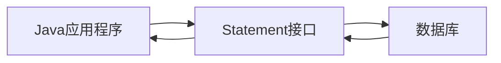
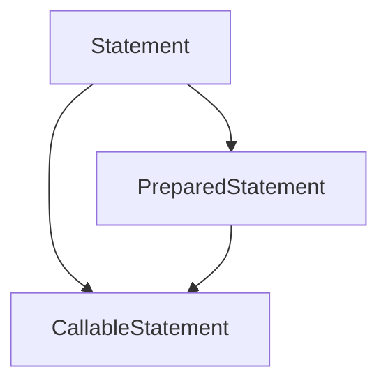

# Java Statement接口

在Java数据库编程中，Statement接口是JDBC API的核心组件之一，它提供了执行SQL语句和获取查询结果的基本功能。作为初学者，理解这个接口对于掌握Java数据库操作至关重要。

## Statement接口简介

Statement接口位于`java.sql`包中，是用来执行静态SQL语句并返回其生成的结果的对象。它是Java应用程序与数据库之间的桥梁，允许开发者向数据库发送SQL命令并处理返回的结果。



## Statement的基本使用流程

使用Statement接口的基本步骤如下：

1. 建立数据库连接（Connection）
2. 通过Connection创建Statement对象
3. 执行SQL语句
4. 处理执行结果
5. 关闭Statement和Connection资源

## 创建Statement对象

要创建Statement对象，首先需要获取Connection对象：

```java
import java.sql.Connection;
import java.sql.DriverManager;
import java.sql.Statement;
import java.sql.SQLException;

public class StatementDemo {
    public static void main(String[] args) {
        Connection conn = null;
        Statement stmt = null;
        
        try {
            // 1. 注册JDBC驱动
            Class.forName("com.mysql.jdbc.Driver");
            
            // 2. 打开连接
            conn = DriverManager.getConnection(
                "jdbc:mysql://localhost:3306/testdb", "username", "password");
            
            // 3. 创建Statement对象
            stmt = conn.createStatement();
            
            // 后续使用stmt执行SQL语句...
            
        } catch(SQLException se) {
            se.printStackTrace();
        } catch(Exception e) {
            e.printStackTrace();
        } finally {
            // 关闭资源
            try {
                if(stmt!=null) stmt.close();
            } catch(SQLException se2) { }
            try {
                if(conn!=null) conn.close();
            } catch(SQLException se) {
                se.printStackTrace();
            }
        }
    }
}
```

## 执行SQL语句

Statement接口提供了三种执行SQL语句的方法：

### 1. execute()

用于执行可能返回多个结果集的SQL语句。

```java
boolean hasResultSet = stmt.execute(sql);
```

返回值表示第一个结果是否为ResultSet对象，如果是则返回true，否则返回false。

### 2. executeQuery()

用于执行SELECT查询，返回查询结果集。

```java
String sql = "SELECT id, name, age FROM students";
ResultSet rs = stmt.executeQuery(sql);
```

### 3. executeUpdate()

用于执行INSERT、UPDATE、DELETE等修改数据的SQL语句，返回受影响的行数。

```java
String sql = "UPDATE students SET age = 21 WHERE id = 1";
int rowsAffected = stmt.executeUpdate(sql);
System.out.println("更新了 " + rowsAffected + " 行数据");
```

## 处理查询结果

当使用`executeQuery()`执行SELECT语句后，需要使用ResultSet对象处理返回的结果：

```java
String sql = "SELECT id, name, age FROM students";
ResultSet rs = stmt.executeQuery(sql);

// 遍历结果集
while(rs.next()) {
    // 通过列名获取
    int id = rs.getInt("id");
    String name = rs.getString("name");
    int age = rs.getInt("age");
    
    // 或通过列索引获取（索引从1开始）
    // int id = rs.getInt(1);
    // String name = rs.getString(2);
    // int age = rs.getInt(3);
    
    System.out.println("ID: " + id + ", 姓名: " + name + ", 年龄: " + age);
}

// 关闭ResultSet
rs.close();
```

## 完整示例：学生信息管理

下面是一个完整的示例，展示如何使用Statement接口进行基本的CRUD（创建、读取、更新、删除）操作：

```java
import java.sql.*;

public class StudentManagementSystem {
    // 数据库连接信息
    private static final String JDBC_URL = "jdbc:mysql://localhost:3306/school";
    private static final String USER = "root";
    private static final String PASSWORD = "password";
    
    public static void main(String[] args) {
        try {
            // 加载驱动
            Class.forName("com.mysql.jdbc.Driver");
            
            // 创建连接
            Connection conn = DriverManager.getConnection(JDBC_URL, USER, PASSWORD);
            
            // 创建Statement
            Statement stmt = conn.createStatement();
            
            // 创建表（如果不存在）
            String createTableSQL = "CREATE TABLE IF NOT EXISTS students (" +
                                   "id INT AUTO_INCREMENT PRIMARY KEY, " +
                                   "name VARCHAR(50) NOT NULL, " +
                                   "age INT, " +
                                   "grade VARCHAR(10))";
            stmt.executeUpdate(createTableSQL);
            System.out.println("表已创建或已存在");
            
            // 插入数据
            String insertSQL = "INSERT INTO students (name, age, grade) " +
                              "VALUES ('张三', 20, 'A级'), " +
                              "('李四', 22, 'B级'), " +
                              "('王五', 21, 'A级')";
            int rowsInserted = stmt.executeUpdate(insertSQL);
            System.out.println("插入了 " + rowsInserted + " 条数据");
            
            // 查询数据
            String selectSQL = "SELECT * FROM students";
            ResultSet rs = stmt.executeQuery(selectSQL);
            
            System.out.println("\n学生信息列表：");
            System.out.println("---------------------------------------");
            System.out.println("ID\t姓名\t年龄\t等级");
            System.out.println("---------------------------------------");
            
            while(rs.next()) {
                int id = rs.getInt("id");
                String name = rs.getString("name");
                int age = rs.getInt("age");
                String grade = rs.getString("grade");
                
                System.out.println(id + "\t" + name + "\t" + age + "\t" + grade);
            }
            
            // 更新数据
            String updateSQL = "UPDATE students SET grade = 'S级' WHERE name = '张三'";
            int rowsUpdated = stmt.executeUpdate(updateSQL);
            System.out.println("\n更新了 " + rowsUpdated + " 条数据");
            
            // 再次查询以验证更新
            rs = stmt.executeQuery("SELECT * FROM students WHERE name = '张三'");
            if(rs.next()) {
                System.out.println("\n更新后的张三信息：");
                System.out.println("ID: " + rs.getInt("id"));
                System.out.println("姓名: " + rs.getString("name"));
                System.out.println("年龄: " + rs.getInt("age"));
                System.out.println("等级: " + rs.getString("grade"));
            }
            
            // 删除数据
            String deleteSQL = "DELETE FROM students WHERE name = '李四'";
            int rowsDeleted = stmt.executeUpdate(deleteSQL);
            System.out.println("\n删除了 " + rowsDeleted + " 条数据");
            
            // 关闭资源
            rs.close();
            stmt.close();
            conn.close();
            
        } catch(Exception e) {
            e.printStackTrace();
        }
    }
}
```

:::note
上述代码运行后，可能的输出结果：

```
表已创建或已存在
插入了 3 条数据

学生信息列表：
---------------------------------------
ID	姓名	年龄	等级
---------------------------------------
1	张三	20	A级
2	李四	22	B级
3	王五	21	A级

更新了 1 条数据

更新后的张三信息：
ID: 1
姓名: 张三
年龄: 20
等级: S级

删除了 1 条数据
```
:::

## Statement的特性与注意事项

### Statement的特点

1. 简单易用，适合执行静态SQL语句
2. 每次执行SQL语句时，都会编译一次
3. 可以执行DDL（数据定义语言）、DML（数据操纵语言）等各种SQL语句

### 使用Statement的注意事项

1. **SQL注入风险**：使用Statement直接拼接SQL字符串容易导致SQL注入攻击
   
   ```java
   // 不安全的做法
   String userInput = "' OR '1'='1";
   String sql = "SELECT * FROM users WHERE username = '" + userInput + "'";
   // 结果SQL: SELECT * FROM users WHERE username = '' OR '1'='1'
   ```
   
   :::warning
   在实际应用中，应该使用PreparedStatement代替Statement来防止SQL注入风险。
   :::

2. **性能考量**：对于需要重复执行的SQL语句，Statement的性能不如PreparedStatement
3. **资源管理**：使用完Statement后必须关闭，以释放数据库资源

## 批处理操作

Statement接口支持批处理操作，可以一次性发送多条SQL语句到数据库执行，提高效率：

```java
// 关闭自动提交
conn.setAutoCommit(false);

Statement stmt = conn.createStatement();

// 添加批处理命令
stmt.addBatch("INSERT INTO students(name, age) VALUES('小明', 18)");
stmt.addBatch("INSERT INTO students(name, age) VALUES('小红', 19)");
stmt.addBatch("INSERT INTO students(name, age) VALUES('小刚', 20)");

// 执行批处理
int[] counts = stmt.executeBatch();

// 提交事务
conn.commit();

System.out.println("成功执行了 " + counts.length + " 条命令");
```

## Statement vs. PreparedStatement vs. CallableStatement

JDBC提供了三种Statement类型，它们之间的关系如下：



- **Statement**：用于执行静态SQL语句
- **PreparedStatement**：Statement的子接口，用于执行预编译SQL语句，更安全、更高效
- **CallableStatement**：PreparedStatement的子接口，用于调用存储过程

## 实际应用场景

### 场景1：数据报表生成

假设需要从数据库中生成简单的销售报表：

```java
public static void generateSalesReport(Connection conn, String startDate, String endDate) throws SQLException {
    Statement stmt = null;
    ResultSet rs = null;
    
    try {
        stmt = conn.createStatement();
        String sql = "SELECT product_name, SUM(quantity) as total_sold, " + 
                     "SUM(price * quantity) as revenue " +
                     "FROM sales " +
                     "WHERE sale_date BETWEEN '" + startDate + "' AND '" + endDate + "' " +
                     "GROUP BY product_name " +
                     "ORDER BY revenue DESC";
        
        rs = stmt.executeQuery(sql);
        
        System.out.println("销售报表 (" + startDate + " 至 " + endDate + ")");
        System.out.println("---------------------------------------------");
        System.out.println("产品名称\t\t销售量\t\t收入");
        System.out.println("---------------------------------------------");
        
        while(rs.next()) {
            String productName = rs.getString("product_name");
            int totalSold = rs.getInt("total_sold");
            double revenue = rs.getDouble("revenue");
            
            System.out.printf("%-20s %-10d ¥%.2f\n", productName, totalSold, revenue);
        }
    } finally {
        if(rs != null) rs.close();
        if(stmt != null) stmt.close();
    }
}
```

### 场景2：数据库初始化

在应用启动时初始化数据库结构：

```java
public static void initializeDatabase(Connection conn) throws SQLException {
    Statement stmt = null;
    
    try {
        stmt = conn.createStatement();
        
        // 创建表
        stmt.executeUpdate("CREATE TABLE IF NOT EXISTS users (" +
                          "id INT AUTO_INCREMENT PRIMARY KEY, " +
                          "username VARCHAR(50) UNIQUE NOT NULL, " +
                          "password VARCHAR(100) NOT NULL, " +
                          "email VARCHAR(100), " +
                          "created_at TIMESTAMP DEFAULT CURRENT_TIMESTAMP)");
        
        stmt.executeUpdate("CREATE TABLE IF NOT EXISTS products (" +
                          "id INT AUTO_INCREMENT PRIMARY KEY, " +
                          "name VARCHAR(100) NOT NULL, " +
                          "price DECIMAL(10,2) NOT NULL, " +
                          "stock INT DEFAULT 0)");
        
        // 插入初始数据
        stmt.executeUpdate("INSERT INTO users(username, password, email) VALUES" +
                          "('admin', 'admin123', 'admin@example.com')" +
                          "ON DUPLICATE KEY UPDATE id=id");
        
        System.out.println("数据库初始化完成");
    } finally {
        if(stmt != null) stmt.close();
    }
}
```

## 总结

Statement接口是Java JDBC API中的基础组件，为执行SQL语句提供了简单直接的方式。本文介绍了：

- Statement的基本概念和用法
- 三种执行SQL语句的方法：execute()、executeQuery()和executeUpdate()
- 处理查询结果集的方法
- 批处理操作
- Statement与其他类型Statement的比较
- 实际应用场景和示例

尽管Statement接口使用简便，但在实际开发中，为了防止SQL注入以及提高性能，通常推荐使用PreparedStatement来替代Statement，特别是对于需要使用参数的SQL语句。

## 练习任务

1. 创建一个图书管理系统，使用Statement接口实现对图书的增删改查操作。
2. 编写代码，使用批处理功能一次插入多条记录到数据库。
3. 编写一个程序，从一个文本文件中读取SQL语句，然后使用Statement接口执行它们。
4. 比较Statement和PreparedStatement的性能，尝试编写测试代码执行同样的操作1000次，比较二者的执行时间。

## 进一步学习资源

- 深入学习JDBC API官方文档
- 了解PreparedStatement接口以提高安全性和性能
- 学习如何使用连接池(如DBCP, HikariCP等)管理数据库连接
- 研究ORM框架(如MyBatis, Hibernate)简化数据库操作