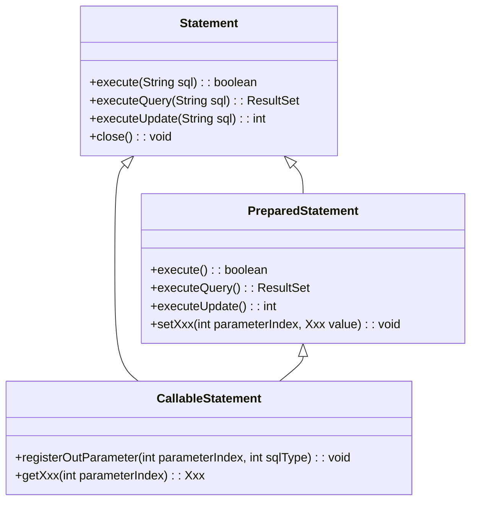

# Java PreparedStatement

在 Java 数据库编程中，`PreparedStatement` 是一个强大的工具，它不仅可以帮助你编写更安全的代码，还能提高应用程序的性能。本文将详细介绍 `PreparedStatement` 的基本概念、使用方法以及最佳实践。

## 什么是 PreparedStatement？

`PreparedStatement` 是 JDBC API 中 `Statement` 接口的子接口，它表示预编译的 SQL 语句。与普通的 `Statement` 不同，`PreparedStatement` 对象包含已编译的 SQL 语句，这个语句可能包含一个或多个参数占位符（用 `?` 表示）。



## PreparedStatement 的优势

使用 `PreparedStatement` 相比普通的 `Statement` 有以下几个主要优势：

1. **防止 SQL 注入攻击**：参数值在发送到数据库之前会被适当地转义，避免恶意 SQL 注入。
2. **提高执行效率**：SQL 语句只编译一次，可以多次执行，减少了编译开销。
3. **处理特殊字符**：无需手动处理单引号等特殊字符，`PreparedStatement` 会自动处理。
4. **方便处理二进制数据**：提供了专门的方法处理二进制数据，如 BLOB、CLOB 等。

## 如何使用 PreparedStatement

### 基本步骤

1. 建立数据库连接（`Connection`）
2. 创建 `PreparedStatement` 对象
3. 设置参数值
4. 执行 SQL 语句
5. 处理结果
6. 关闭资源

### 创建 PreparedStatement 示例

```java
import java.sql.Connection;
import java.sql.DriverManager;
import java.sql.PreparedStatement;
import java.sql.SQLException;

public class PreparedStatementDemo {
    public static void main(String[] args) {
        String url = "jdbc:mysql://localhost:3306/mydb";
        String username = "root";
        String password = "password";
        
        try (Connection conn = DriverManager.getConnection(url, username, password)) {
            // 创建PreparedStatement，?是参数占位符
            String sql = "INSERT INTO users (name, email) VALUES (?, ?)";
            PreparedStatement pstmt = conn.prepareStatement(sql);
            
            // 设置参数值
            pstmt.setString(1, "John Doe");  // 设置第一个参数
            pstmt.setString(2, "john@example.com");  // 设置第二个参数
            
            // 执行SQL语句
            int rowsAffected = pstmt.executeUpdate();
            System.out.println(rowsAffected + " 行已插入");
            
            // 关闭资源
            pstmt.close();
        } catch (SQLException e) {
            e.printStackTrace();
        }
    }
}
```

输出：
```
1 行已插入
```

:::note
上面的示例使用了 Java 7 引入的 try-with-resources 语句，它会自动关闭 `Connection` 资源，避免了显式调用 `close()` 方法。
:::

## 设置参数值的方法

`PreparedStatement` 提供了一系列 `setXxx()` 方法用于设置不同类型的参数：

- `setString(int parameterIndex, String x)`：设置字符串参数
- `setInt(int parameterIndex, int x)`：设置整数参数
- `setLong(int parameterIndex, long x)`：设置长整数参数
- `setDouble(int parameterIndex, double x)`：设置双精度浮点数参数
- `setDate(int parameterIndex, Date x)`：设置日期参数
- `setTimestamp(int parameterIndex, Timestamp x)`：设置时间戳参数
- `setBoolean(int parameterIndex, boolean x)`：设置布尔值参数
- `setNull(int parameterIndex, int sqlType)`：设置 NULL 值
- `setBlob(int parameterIndex, Blob x)`：设置二进制大对象参数
- `setClob(int parameterIndex, Clob x)`：设置字符大对象参数

:::caution
参数索引从 1 开始，而不是从 0 开始！
:::

## PreparedStatement 的主要操作

### 执行查询（SELECT）

```java
String sql = "SELECT * FROM users WHERE age > ? AND country = ?";
PreparedStatement pstmt = conn.prepareStatement(sql);

pstmt.setInt(1, 18);
pstmt.setString(2, "USA");

ResultSet rs = pstmt.executeQuery();
while (rs.next()) {
    int id = rs.getInt("id");
    String name = rs.getString("name");
    String email = rs.getString("email");
    System.out.println(id + ", " + name + ", " + email);
}

rs.close();
pstmt.close();
```

### 执行更新（UPDATE）

```java
String sql = "UPDATE users SET email = ? WHERE id = ?";
PreparedStatement pstmt = conn.prepareStatement(sql);

pstmt.setString(1, "new.email@example.com");
pstmt.setInt(2, 1);

int rowsUpdated = pstmt.executeUpdate();
System.out.println(rowsUpdated + " 行已更新");

pstmt.close();
```

### 执行删除（DELETE）

```java
String sql = "DELETE FROM users WHERE id = ?";
PreparedStatement pstmt = conn.prepareStatement(sql);

pstmt.setInt(1, 1);

int rowsDeleted = pstmt.executeUpdate();
System.out.println(rowsDeleted + " 行已删除");

pstmt.close();
```

### 批处理操作

当需要执行多条类似的 SQL 语句时，可以使用批处理功能提高性能：

```java
String sql = "INSERT INTO users (name, email) VALUES (?, ?)";
PreparedStatement pstmt = conn.prepareStatement(sql);

// 第一组数据
pstmt.setString(1, "Alice");
pstmt.setString(2, "alice@example.com");
pstmt.addBatch();  // 添加到批处理

// 第二组数据
pstmt.setString(1, "Bob");
pstmt.setString(2, "bob@example.com");
pstmt.addBatch();  // 添加到批处理

// 第三组数据
pstmt.setString(1, "Charlie");
pstmt.setString(2, "charlie@example.com");
pstmt.addBatch();  // 添加到批处理

// 执行批处理
int[] updateCounts = pstmt.executeBatch();
System.out.println("批处理执行完成，共影响 " + updateCounts.length + " 条记录");

pstmt.close();
```

## 实际应用案例：用户登录验证

下面是一个简单的用户登录验证示例，展示了 `PreparedStatement` 在实际应用中的用法：

```java
public boolean validateLogin(String username, String password) {
    boolean valid = false;
    String url = "jdbc:mysql://localhost:3306/userdb";
    String dbUser = "root";
    String dbPassword = "password";
    
    try (Connection conn = DriverManager.getConnection(url, dbUser, dbPassword)) {
        // 使用PreparedStatement避免SQL注入
        String sql = "SELECT * FROM users WHERE username = ? AND password = ?";
        PreparedStatement pstmt = conn.prepareStatement(sql);
        
        pstmt.setString(1, username);
        pstmt.setString(2, password);  // 实际应用中应该使用加密的密码
        
        ResultSet rs = pstmt.executeQuery();
        valid = rs.next();  // 如果找到匹配的记录，则返回true
        
        rs.close();
        pstmt.close();
    } catch (SQLException e) {
        e.printStackTrace();
    }
    
    return valid;
}
```

:::warning
上述示例中，密码是以明文形式存储和比较的，这在实际应用中是不安全的。实际应用应该使用加密算法（如 BCrypt）来存储和验证密码。
:::

## 防止 SQL 注入攻击

SQL 注入是一种常见的安全漏洞，攻击者通过在输入字段中插入恶意 SQL 代码来执行未授权的操作。`PreparedStatement` 通过参数化查询有效防止了这种攻击。

### 不安全的方式（使用 Statement）：

```java
// 不安全的方式
String username = "admin' --";  // 恶意输入
String password = "anything";

// 构造SQL语句 - 容易受到SQL注入攻击
String sql = "SELECT * FROM users WHERE username = '" + username + 
             "' AND password = '" + password + "'";
Statement stmt = conn.createStatement();
ResultSet rs = stmt.executeQuery(sql);
```

在上面的例子中，实际执行的 SQL 语句会变成：

```sql
SELECT * FROM users WHERE username = 'admin' --' AND password = 'anything'
```

由于 `--` 是 SQL 中的注释符号，所以后面的条件会被忽略，这样只要用户名是 `admin`，就能成功登录，无需密码。

### 安全的方式（使用 PreparedStatement）：

```java
// 安全的方式
String username = "admin' --";  // 同样的恶意输入
String password = "anything";

// 使用参数化查询 - 防止SQL注入
String sql = "SELECT * FROM users WHERE username = ? AND password = ?";
PreparedStatement pstmt = conn.prepareStatement(sql);
pstmt.setString(1, username);
pstmt.setString(2, password);
ResultSet rs = pstmt.executeQuery();
```

使用 `PreparedStatement`，参数值会被正确转义，恶意输入将被视为普通文本，而不是可执行的 SQL 代码。

## 高级功能

### 获取自动生成的键

当向表中插入数据时，通常会使用自增主键。可以使用 `PreparedStatement` 获取这些自动生成的键：

```java
String sql = "INSERT INTO products (name, price) VALUES (?, ?)";
PreparedStatement pstmt = conn.prepareStatement(sql, Statement.RETURN_GENERATED_KEYS);

pstmt.setString(1, "New Product");
pstmt.setDouble(2, 19.99);
pstmt.executeUpdate();

// 获取生成的主键
ResultSet generatedKeys = pstmt.getGeneratedKeys();
if (generatedKeys.next()) {
    long id = generatedKeys.getLong(1);
    System.out.println("生成的ID: " + id);
}

generatedKeys.close();
pstmt.close();
```

### 处理 BLOB（二进制大对象）

```java
String sql = "INSERT INTO documents (name, content) VALUES (?, ?)";
PreparedStatement pstmt = conn.prepareStatement(sql);

// 假设我们要存储一个文件
File file = new File("document.pdf");
FileInputStream fis = new FileInputStream(file);

pstmt.setString(1, "Important Document");
pstmt.setBinaryStream(2, fis, (int)file.length());
pstmt.executeUpdate();

fis.close();
pstmt.close();
```

## 最佳实践

1. **始终使用 PreparedStatement 而不是 Statement**，特别是当 SQL 语句包含用户输入时。
2. **重用 PreparedStatement 对象**，特别是执行相同查询多次时，以提高性能。
3. **使用批处理**（batch updates）处理多条类似的 SQL 语句。
4. **正确关闭资源**，使用 try-with-resources 语句或在 finally 块中关闭资源。
5. **使用适当的数据类型**设置参数，避免不必要的类型转换。
6. **在处理大量数据时设置适当的获取大小**（fetch size）以优化内存使用。
7. **处理查询结果前检查 ResultSet 是否为空**。

## 总结

`PreparedStatement` 是 Java JDBC 中一个非常重要的接口，它提供了一种安全、高效的方式来执行参数化 SQL 查询。相比普通的 `Statement`，它具有防止 SQL 注入、提高性能和便于处理各种数据类型等优势。

在实际开发中，应该优先使用 `PreparedStatement` 而不是 `Statement`，特别是当处理包含用户输入的 SQL 语句时。掌握 `PreparedStatement` 的用法，是成为一名合格的 Java 数据库程序员的必备技能。

## 练习

1. 编写一个程序，使用 `PreparedStatement` 向表中插入数据，并获取自动生成的主键。
2. 实现一个简单的地址簿应用，使用 `PreparedStatement` 完成增删改查操作。
3. 编写一个批处理程序，使用 `PreparedStatement` 批量导入 CSV 文件中的数据到数据库表中。
4. 实现一个简单的登录系统，使用 `PreparedStatement` 防止 SQL 注入攻击。
5. 编写一个程序，使用 `PreparedStatement` 处理二进制数据（如图片文件）的存储和检索。

## 扩展阅读

- JDBC API 官方文档中的 [PreparedStatement](https://docs.oracle.com/javase/8/docs/api/java/sql/PreparedStatement.html) 部分
- 深入理解 JDBC 连接池技术
- 学习 ORM（对象关系映射）框架如何封装和使用 `PreparedStatement`

通过本文的学习，你应该已经掌握了 `PreparedStatement` 的基本概念和使用方法。随着实践经验的积累，你将能够更加熟练地使用这一强大工具来开发安全、高效的数据库应用程序。