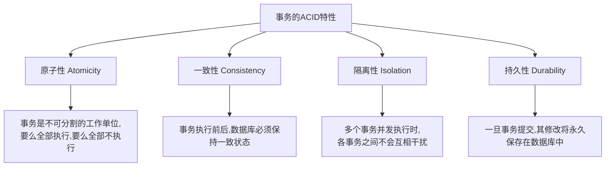
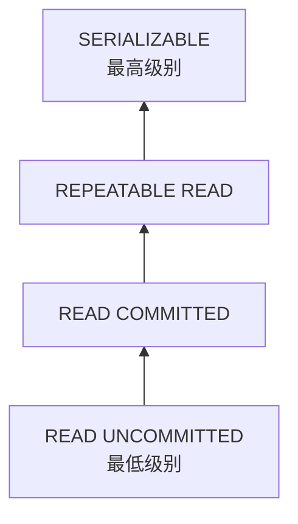

# Java 事务管理

## 事务的概念

在数据库操作中，**事务(Transaction)**是一组作为单一逻辑工作单元执行的操作序列。简单来说，事务是一组要么全部执行成功，要么全部不执行的SQL语句集合。

考虑一个银行转账的例子：当A账户向B账户转账100元时，需要执行两个操作：
1. 从A账户减去100元
2. 向B账户增加100元

这两个操作必须作为一个整体来执行，不能只执行其中之一。事务管理就是保证这类操作的完整性和一致性。

## 事务的ACID特性

事务具有四个基本特性，通常称为ACID特性：



## JDBC事务控制

在JDBC中，事务控制主要通过以下三个方法实现：

1. `setAutoCommit(boolean autoCommit)` - 设置自动提交模式
2. `commit()` - 提交事务
3. `rollback()` - 回滚事务

默认情况下，JDBC连接处于自动提交模式，每条SQL语句执行后都会自动提交。要实现事务控制，需要关闭自动提交模式。

### 基本事务控制示例

下面是一个简单的事务控制示例，演示了如何在Java中使用JDBC进行事务管理：

```java
import java.sql.Connection;
import java.sql.DriverManager;
import java.sql.SQLException;
import java.sql.Statement;

public class TransactionExample {
    public static void main(String[] args) {
        Connection conn = null;
        try {
            // 1. 建立连接
            conn = DriverManager.getConnection("jdbc:mysql://localhost:3306/mydatabase", "username", "password");
            
            // 2. 关闭自动提交模式
            conn.setAutoCommit(false);
            
            Statement stmt = conn.createStatement();
            
            // 3. 执行SQL语句
            // 从账户A减去100
            stmt.executeUpdate("UPDATE accounts SET balance = balance - 100 WHERE account_id = 'A'");
            
            // 模拟系统故障
            // int i = 1/0;  // 取消注释此行可以测试异常情况下的回滚
            
            // 向账户B增加100
            stmt.executeUpdate("UPDATE accounts SET balance = balance + 100 WHERE account_id = 'B'");
            
            // 4. 提交事务
            conn.commit();
            System.out.println("事务提交成功!");
            
        } catch (Exception e) {
            // 5. 发生异常，回滚事务
            try {
                if (conn != null) {
                    conn.rollback();
                    System.out.println("事务已回滚!");
                }
            } catch (SQLException ex) {
                ex.printStackTrace();
            }
            e.printStackTrace();
        } finally {
            // 6. 恢复自动提交模式并关闭连接
            try {
                if (conn != null) {
                    conn.setAutoCommit(true);
                    conn.close();
                }
            } catch (SQLException e) {
                e.printStackTrace();
            }
        }
    }
}
```

运行结果：
```
事务提交成功!
```

如果取消注释`int i = 1/0;`这一行，会产生除零异常，触发事务回滚，输出：
```
事务已回滚!
java.lang.ArithmeticException: / by zero
    at TransactionExample.main(TransactionExample.java:24)
```

## 事务隔离级别

当多个事务并发执行时，可能会出现一些问题，如脏读、不可重复读和幻读。为了解决这些问题，SQL标准定义了四种事务隔离级别：



在JDBC中，可以通过`Connection`接口的`setTransactionIsolation()`方法设置事务隔离级别：

```java
// 设置事务隔离级别
conn.setTransactionIsolation(Connection.TRANSACTION_READ_COMMITTED);
```

各个隔离级别的特点和适用场景如下表：

| 隔离级别 | 脏读 | 不可重复读 | 幻读 | 说明 |
|---------|------|-----------|------|------|
| READ UNCOMMITTED | 可能 | 可能 | 可能 | 一个事务可以读取另一个未提交事务的数据 |
| READ COMMITTED | 不可能 | 可能 | 可能 | 一个事务只能读取另一个已提交事务的数据 |
| REPEATABLE READ | 不可能 | 不可能 | 可能 | 确保同一事务多次读取的数据一致 |
| SERIALIZABLE | 不可能 | 不可能 | 不可能 | 完全隔离，性能最低 |

:::note
MySQL的InnoDB存储引擎默认使用**REPEATABLE READ**隔离级别，而大多数数据库系统默认使用**READ COMMITTED**级别。
:::

## 事务的保存点（Savepoints）

JDBC还支持在事务中设置保存点，允许在事务内部创建检查点，以便在发生错误时可以回滚到特定点，而不必回滚整个事务。

```java
import java.sql.*;

public class SavepointExample {
    public static void main(String[] args) {
        Connection conn = null;
        Savepoint savepoint1 = null;
        
        try {
            // 建立连接
            conn = DriverManager.getConnection("jdbc:mysql://localhost:3306/mydatabase", "username", "password");
            
            // 关闭自动提交
            conn.setAutoCommit(false);
            
            Statement stmt = conn.createStatement();
            
            // 执行第一条SQL语句
            stmt.executeUpdate("INSERT INTO customers VALUES (1, 'John')");
            
            // 设置保存点
            savepoint1 = conn.setSavepoint("Savepoint1");
            
            // 执行第二条SQL语句
            stmt.executeUpdate("INSERT INTO customers VALUES (2, 'Jane')");
            
            // 模拟错误
            // int i = 1/0;
            
            // 执行第三条SQL语句
            stmt.executeUpdate("INSERT INTO customers VALUES (3, 'Bob')");
            
            // 提交事务
            conn.commit();
            System.out.println("所有操作成功执行!");
            
        } catch (Exception e) {
            try {
                if (conn != null && savepoint1 != null) {
                    // 只回滚到保存点，保留第一条插入操作
                    conn.rollback(savepoint1);
                    conn.commit();
                    System.out.println("回滚到保存点，第一条插入操作已保留!");
                }
            } catch (SQLException ex) {
                ex.printStackTrace();
            }
            e.printStackTrace();
        } finally {
            // 关闭资源
            try {
                if (conn != null) {
                    conn.setAutoCommit(true);
                    conn.close();
                }
            } catch (SQLException e) {
                e.printStackTrace();
            }
        }
    }
}
```

如果取消注释`int i = 1/0;`这行，程序会回滚到保存点，只保留第一条插入操作。

## 实际应用案例：订单系统

下面是一个模拟电商订单系统的实际应用案例，展示了如何在复杂业务逻辑中使用事务管理：

```java
import java.sql.*;

public class OrderSystem {
    public static void main(String[] args) {
        // 模拟参数
        int userId = 1001;
        int productId = 2001;
        int quantity = 5;
        double price = 99.99;
        
        placeOrder(userId, productId, quantity, price);
    }
    
    public static void placeOrder(int userId, int productId, int quantity, double price) {
        Connection conn = null;
        PreparedStatement pstmt = null;
        ResultSet rs = null;
        
        try {
            // 1. 获取数据库连接
            conn = DriverManager.getConnection("jdbc:mysql://localhost:3306/ecommerce", "username", "password");
            
            // 2. 开始事务
            conn.setAutoCommit(false);
            
            // 3. 检查库存
            pstmt = conn.prepareStatement("SELECT stock FROM products WHERE product_id = ?");
            pstmt.setInt(1, productId);
            rs = pstmt.executeQuery();
            
            if (rs.next()) {
                int currentStock = rs.getInt("stock");
                
                if (currentStock < quantity) {
                    throw new Exception("库存不足，当前库存: " + currentStock);
                }
            } else {
                throw new Exception("产品不存在: " + productId);
            }
            
            // 4. 创建订单
            pstmt = conn.prepareStatement(
                "INSERT INTO orders (user_id, order_date, total_amount) VALUES (?, NOW(), ?)",
                Statement.RETURN_GENERATED_KEYS
            );
            pstmt.setInt(1, userId);
            pstmt.setDouble(2, price * quantity);
            pstmt.executeUpdate();
            
            // 获取生成的订单ID
            rs = pstmt.getGeneratedKeys();
            int orderId = 0;
            if (rs.next()) {
                orderId = rs.getInt(1);
            } else {
                throw new Exception("创建订单失败，未能获取订单ID");
            }
            
            // 5. 添加订单项目
            pstmt = conn.prepareStatement(
                "INSERT INTO order_items (order_id, product_id, quantity, price) VALUES (?, ?, ?, ?)"
            );
            pstmt.setInt(1, orderId);
            pstmt.setInt(2, productId);
            pstmt.setInt(3, quantity);
            pstmt.setDouble(4, price);
            pstmt.executeUpdate();
            
            // 6. 更新库存
            pstmt = conn.prepareStatement(
                "UPDATE products SET stock = stock - ? WHERE product_id = ?"
            );
            pstmt.setInt(1, quantity);
            pstmt.setInt(2, productId);
            pstmt.executeUpdate();
            
            // 7. 提交事务
            conn.commit();
            System.out.println("订单已成功创建，订单号: " + orderId);
            
        } catch (Exception e) {
            // 8. 发生异常，回滚事务
            try {
                if (conn != null) {
                    conn.rollback();
                }
            } catch (SQLException ex) {
                ex.printStackTrace();
            }
            System.out.println("订单创建失败: " + e.getMessage());
            e.printStackTrace();
        } finally {
            // 9. 关闭资源
            try {
                if (rs != null) rs.close();
                if (pstmt != null) pstmt.close();
                if (conn != null) {
                    conn.setAutoCommit(true);
                    conn.close();
                }
            } catch (SQLException e) {
                e.printStackTrace();
            }
        }
    }
}
```

这个案例展示了一个完整的订单处理流程：
1. 检查产品库存
2. 创建订单记录
3. 添加订单项目
4. 更新产品库存

整个过程作为一个事务处理，确保所有操作要么全部成功，要么全部失败。

## 使用事务的最佳实践

:::tip 最佳实践
1. **事务边界要小**：尽量减少事务的执行时间，避免长时间占用数据库资源
2. **避免在事务中进行用户交互**：用户交互可能会导致事务长时间不结束
3. **选择合适的隔离级别**：根据业务需求选择适当的隔离级别，避免过度隔离带来的性能问题
4. **错误处理要彻底**：确保在异常情况下正确回滚事务
5. **使用try-with-resources简化资源管理**：Java 7及以上版本可以使用此特性自动关闭资源
6. **了解数据库的锁机制**：不同的数据库有不同的锁机制，了解这些机制有助于避免死锁
:::

## 使用Spring管理事务

在实际项目中，通常会使用Spring等框架来管理事务，而不是直接使用JDBC API。Spring提供了声明式事务管理，可以通过注解轻松实现事务控制。

:::note
如果你计划在企业级应用中使用事务管理，建议学习Spring的事务管理功能。
:::

## 总结

事务管理是数据库操作中保证数据一致性和完整性的重要机制。通过JDBC的事务管理功能，我们可以：

1. 确保一组相关操作要么全部成功，要么全部失败
2. 在复杂业务逻辑中维护数据的一致性
3. 通过设置适当的隔离级别来解决并发访问问题
4. 使用保存点实现更灵活的错误处理策略

掌握事务管理对于开发可靠的数据库应用程序至关重要，它是构建企业级应用的基础技能之一。

## 练习与实践

1. 创建一个模拟银行转账的应用，实现从一个账户向另一个账户转账的功能，确保使用事务来保证数据一致性。
2. 尝试在不同的事务隔离级别下运行查询，观察结果的差异。
3. 实现一个使用保存点的事务，模拟多步操作中的部分回滚。
4. 设计一个简单的库存管理系统，使用事务确保库存操作的原子性。

## 进一步阅读

- [JDBC API 文档](https://docs.oracle.com/javase/8/docs/technotes/guides/jdbc/)
- [MySQL 事务和隔离级别](https://dev.mysql.com/doc/refman/8.0/en/innodb-transaction-isolation-levels.html)
- [Spring 事务管理](https://docs.spring.io/spring-framework/docs/current/reference/html/data-access.html#transaction)

通过深入理解和实践事务管理，你将能够开发出更加健壮和可靠的数据库应用程序。