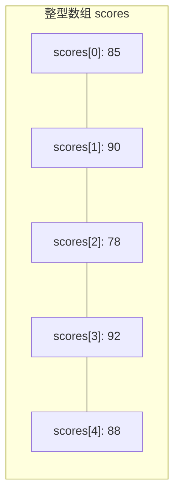

# Java 数组基础

## 引言

在编程中，我们经常需要存储和处理大量相同类型的数据。例如，存储100个学生的成绩、处理一周的温度数据或管理商品库存。如果为每个数据都创建单独的变量，代码将变得冗长且难以维护。Java数组解决了这个问题，它允许我们使用单个变量名来引用一组相同类型的数据集合。

## 什么是数组？

数组是一种用于存储**相同类型**多个值的数据结构。想象数组是一排连续的盒子，每个盒子都有一个编号（索引），可以存放一个特定类型的数据。



## 数组的特性

- **固定长度**：一旦创建，数组长度不可改变
- **相同数据类型**：数组中所有元素必须是相同类型
- **基于索引**：通过从0开始的索引访问元素
- **连续内存**：数组在内存中占据连续空间

## 声明数组

在Java中声明数组有两种主要语法：

```java
// 方式1：类型[] 变量名
int[] numbers;
String[] names;

// 方式2：类型 变量名[]
int scores[];
String fruits[];
```

虽然两种方式都正确，但第一种写法（类型[] 变量名）是推荐的Java风格，更清晰地表明这是一个数组变量。

## 创建和初始化数组

声明数组后，我们需要创建数组对象并分配内存。有几种方法可以做到这一点：

### 1. 使用new关键字创建指定大小的数组

```java
// 创建一个可以存储5个整数的数组
int[] numbers = new int[5];

// 创建一个可以存储3个字符串的数组
String[] names = new String[3];
```

使用这种方式时，数组会自动用默认值初始化：
- 数字类型：0 (整数) 或 0.0 (浮点数)
- 布尔类型：false
- 引用类型：null

### 2. 创建并初始化数组

```java
// 创建并初始化整数数组
int[] scores = {85, 90, 78, 92, 88};

// 创建并初始化字符串数组
String[] fruits = {"Apple", "Banana", "Orange"};
```

### 3. 先声明，后创建并初始化

```java
// 先声明
int[] numbers;
// 后创建并分配内存
numbers = new int[5];

// 或者先声明后直接初始化
String[] colors;
colors = new String[] {"Red", "Green", "Blue"};
```

:::caution 注意
不能这样写：
```java
String[] colors;
colors = {"Red", "Green", "Blue"}; // 编译错误!
```
如果分开声明和初始化，必须使用`new`关键字。
:::

## 访问数组元素

数组使用从0开始的索引来访问元素。这意味着第一个元素的索引是0，第二个元素的索引是1，以此类推：

```java
int[] scores = {85, 90, 78, 92, 88};

// 访问第一个元素（索引为0）
System.out.println("第一个分数: " + scores[0]);  // 输出: 第一个分数: 85

// 访问第三个元素（索引为2）
System.out.println("第三个分数: " + scores[2]);  // 输出: 第三个分数: 78

// 修改数组元素
scores[1] = 95;
System.out.println("修改后的第二个分数: " + scores[1]);  // 输出: 修改后的第二个分数: 95
```

:::warning 警告
访问超出范围的索引会导致`ArrayIndexOutOfBoundsException`异常。

```java
int[] numbers = {1, 2, 3};
System.out.println(numbers[3]); // 错误! 索引范围是0-2
```
:::

## 数组长度

Java数组有一个`length`属性，可以获取数组的长度（元素个数）：

```java
int[] numbers = {10, 20, 30, 40, 50};
System.out.println("数组长度: " + numbers.length);  // 输出: 数组长度: 5
```

## 遍历数组

有多种方法可以遍历数组中的所有元素：

### 1. 使用for循环

```java
int[] numbers = {10, 20, 30, 40, 50};

// 使用传统for循环
for (int i = 0; i < numbers.length; i++) {
    System.out.println("Element at index " + i + ": " + numbers[i]);
}
```

输出:
```
Element at index 0: 10
Element at index 1: 20
Element at index 2: 30
Element at index 3: 40
Element at index 4: 50
```

### 2. 使用增强for循环（for-each）

```java
int[] numbers = {10, 20, 30, 40, 50};

// 使用增强for循环
for (int number : numbers) {
    System.out.println(number);
}
```

输出:
```
10
20
30
40
50
```

## 多维数组

Java支持多维数组，最常见的是二维数组，可以想象成"数组的数组"：

### 声明和创建二维数组

```java
// 声明并创建一个2×3的二维数组
int[][] matrix = new int[2][3];

// 声明并初始化二维数组
int[][] grid = {
    {1, 2, 3},
    {4, 5, 6}
};
```

### 访问二维数组元素

```java
int[][] grid = {
    {1, 2, 3},
    {4, 5, 6}
};

// 访问第1行第2列的元素(索引从0开始)
System.out.println(grid[0][1]);  // 输出: 2

// 修改元素
grid[1][0] = 9;
System.out.println(grid[1][0]);  // 输出: 9
```

### 遍历二维数组

```java
int[][] grid = {
    {1, 2, 3},
    {4, 5, 6}
};

// 使用嵌套for循环
for (int i = 0; i < grid.length; i++) {
    for (int j = 0; j < grid[i].length; j++) {
        System.out.print(grid[i][j] + " ");
    }
    System.out.println();  // 换行
}
```

输出:
```
1 2 3 
4 5 6 
```

## 实际应用案例

### 案例1：计算学生成绩平均分

```java
public class StudentScores {
    public static void main(String[] args) {
        // 存储5个学生的成绩
        int[] scores = {78, 92, 85, 64, 97};
        
        // 计算总分
        int sum = 0;
        for (int score : scores) {
            sum += score;
        }
        
        // 计算平均分
        double average = (double) sum / scores.length;
        
        // 输出结果
        System.out.println("学生成绩: ");
        for (int i = 0; i < scores.length; i++) {
            System.out.println("学生 " + (i+1) + ": " + scores[i]);
        }
        System.out.println("平均分: " + average);
        
        // 找出最高分
        int max = scores[0];
        for (int i = 1; i < scores.length; i++) {
            if (scores[i] > max) {
                max = scores[i];
            }
        }
        System.out.println("最高分: " + max);
    }
}
```

输出:
```
学生成绩: 
学生 1: 78
学生 2: 92
学生 3: 85
学生 4: 64
学生 5: 97
平均分: 83.2
最高分: 97
```

### 案例2：简单图书管理

```java
public class BookManager {
    public static void main(String[] args) {
        // 存储图书信息
        String[] bookTitles = {"Java编程", "数据结构", "算法导论", "设计模式", "网络编程"};
        boolean[] borrowed = {false, true, false, false, true};
        
        // 显示所有图书及其状态
        System.out.println("图书馆馆藏状态:");
        System.out.println("------------------");
        for (int i = 0; i < bookTitles.length; i++) {
            System.out.println(bookTitles[i] + " - " + 
                              (borrowed[i] ? "已借出" : "可借阅"));
        }
        
        // 统计可借阅的图书数量
        int availableCount = 0;
        for (boolean status : borrowed) {
            if (!status) {
                availableCount++;
            }
        }
        
        System.out.println("------------------");
        System.out.println("当前可借阅图书数量: " + availableCount);
    }
}
```

输出:
```
图书馆馆藏状态:
------------------
Java编程 - 可借阅
数据结构 - 已借出
算法导论 - 可借阅
设计模式 - 可借阅
网络编程 - 已借出
------------------
当前可借阅图书数量: 3
```

## 常见数组操作

### 复制数组

Java提供了几种复制数组的方法：

#### 使用Arrays.copyOf()

```java
import java.util.Arrays;

public class ArrayCopyDemo {
    public static void main(String[] args) {
        int[] original = {1, 2, 3, 4, 5};
        
        // 创建一个新数组，包含original的所有元素
        int[] copy = Arrays.copyOf(original, original.length);
        
        // 修改copy数组不会影响original
        copy[0] = 100;
        
        System.out.println("Original array: " + Arrays.toString(original));
        System.out.println("Copied array: " + Arrays.toString(copy));
    }
}
```

输出:
```
Original array: [1, 2, 3, 4, 5]
Copied array: [100, 2, 3, 4, 5]
```

#### 使用System.arraycopy()

```java
public class SystemArrayCopyDemo {
    public static void main(String[] args) {
        int[] source = {1, 2, 3, 4, 5};
        int[] destination = new int[5];
        
        // 从source复制到destination
        System.arraycopy(source, 0, destination, 0, source.length);
        
        // 输出复制后的数组
        System.out.print("Destination array: ");
        for (int num : destination) {
            System.out.print(num + " ");
        }
    }
}
```

输出:
```
Destination array: 1 2 3 4 5 
```

### 数组排序

Java提供了Arrays.sort()方法来对数组进行排序：

```java
import java.util.Arrays;

public class ArraySortDemo {
    public static void main(String[] args) {
        // 整数数组排序
        int[] numbers = {5, 2, 9, 1, 3};
        Arrays.sort(numbers);
        System.out.println("排序后的数字: " + Arrays.toString(numbers));
        
        // 字符串数组排序
        String[] names = {"Zhang", "Li", "Wang", "Chen", "Yang"};
        Arrays.sort(names);
        System.out.println("排序后的名字: " + Arrays.toString(names));
    }
}
```

输出:
```
排序后的数字: [1, 2, 3, 5, 9]
排序后的名字: [Chen, Li, Wang, Yang, Zhang]
```

## 常见问题与解决方案

### 1. 数组大小固定的限制

如果需要动态调整大小的数组，考虑使用`ArrayList`类：

```java
import java.util.ArrayList;

public class ArrayListDemo {
    public static void main(String[] args) {
        // 创建ArrayList
        ArrayList<String> fruits = new ArrayList<>();
        
        // 添加元素
        fruits.add("Apple");
        fruits.add("Banana");
        fruits.add("Orange");
        
        // 访问元素
        System.out.println("第二个水果: " + fruits.get(1));
        
        // 添加更多元素
        fruits.add("Mango");
        fruits.add("Grape");
        
        // 显示大小
        System.out.println("水果数量: " + fruits.size());
        
        // 遍历所有元素
        System.out.println("所有水果:");
        for (String fruit : fruits) {
            System.out.println("- " + fruit);
        }
    }
}
```

### 2. 数组边界检查

始终确保数组访问在有效范围内：

```java
public class SafeArrayAccess {
    public static void main(String[] args) {
        int[] numbers = {1, 2, 3};
        int index = 5;  // 超出范围的索引
        
        // 安全访问数组
        if (index >= 0 && index < numbers.length) {
            System.out.println(numbers[index]);
        } else {
            System.out.println("索引 " + index + " 超出范围 (0-" + (numbers.length-1) + ")");
        }
    }
}
```

输出:
```
索引 5 超出范围 (0-2)
```

## 总结

Java数组是一种基础且强大的数据结构，用于存储相同类型的多个值。本文涵盖了：

- 数组的声明和创建
- 数组元素访问和修改
- 一维和多维数组的使用
- 数组遍历的多种方式
- 数组的实际应用案例
- 常用数组操作如复制和排序

掌握数组是进一步学习更复杂数据结构和算法的基础。随着经验的积累，你会发现数组在解决各种编程问题中的重要作用。

## 练习题

1. 创建一个整型数组，存储10个随机数（1-100之间），然后计算它们的平均值。
2. 编写程序找出数组中的最大值和最小值。
3. 创建两个数组，并编写代码将它们合并成一个新数组。
4. 编写程序检查一个数组是否包含特定值。
5. 创建一个二维数组表示3x3矩阵，计算主对角线元素之和。

:::tip 进阶学习
完成基础数组学习后，可以继续探索Java的集合框架，如ArrayList、LinkedList等，它们提供了更灵活的数据处理能力。
:::