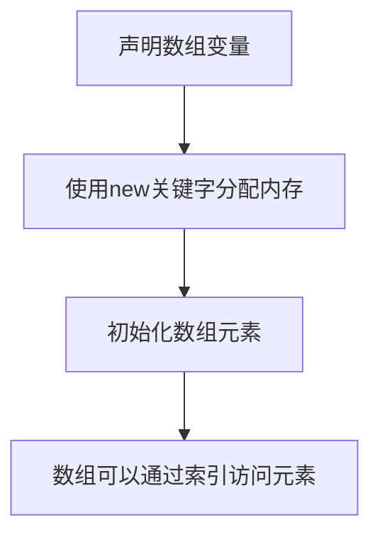

# Java 数组声明

## 什么是Java数组？

数组是Java中最基础的数据结构之一，它允许我们在一个变量中存储多个相同类型的值。数组在编程中被广泛应用，特别是在需要管理和操作大量相似数据的场景下。与单个变量相比，数组提供了更高效的数据存储和访问方式。

在Java中，数组是一个对象，它包含固定数量的同类型值。数组的长度在创建后是固定的，不能更改。

## 数组声明的语法

在Java中，声明数组有两种基本语法形式：

### 方式一：类型[] 数组名

```java
int[] numbers;     // 整型数组声明
String[] names;    // 字符串数组声明
double[] prices;   // 双精度浮点型数组声明
```

### 方式二：类型 数组名[]

```java
int numbers[];     // 整型数组声明
String names[];    // 字符串数组声明
double prices[];   // 双精度浮点型数组声明
```

:::note
虽然两种声明方式在Java中都是有效的，但第一种方式（类型[] 数组名）更为推荐，因为它明确指出变量类型是一个数组。
:::

## 数组的初始化

声明数组后，我们需要初始化它才能使用。Java中有几种初始化数组的方法：

### 1. 使用new关键字初始化

```java
int[] numbers = new int[5]; // 创建一个包含5个整数的数组
```

这种方式会创建一个指定长度的数组，并用默认值填充（对于数值类型是0，对于布尔类型是false，对于引用类型是null）。

### 2. 在声明的同时初始化数组内容

```java
int[] numbers = {10, 20, 30, 40, 50}; // 创建并初始化一个包含5个整数的数组
```

### 3. 先声明后初始化

```java
int[] numbers;           // 声明数组
numbers = new int[5];    // 分配内存空间
// 或者
numbers = new int[]{10, 20, 30, 40, 50}; // 分配内存并初始化值
```

## 多维数组声明

Java也支持多维数组，最常见的是二维数组：

```java
int[][] matrix = new int[3][4]; // 创建一个3行4列的二维数组
```

也可以在声明时初始化二维数组：

```java
int[][] matrix = {
    {1, 2, 3, 4},
    {5, 6, 7, 8},
    {9, 10, 11, 12}
};
```

:::tip
Java中的多维数组实际上是"数组的数组"，因此可以创建不规则数组（即每行的列数可以不同）。
:::

## 数组长度

使用`.length`属性可以获取数组的长度：

```java
int[] numbers = {10, 20, 30, 40, 50};
System.out.println("数组长度: " + numbers.length); // 输出：数组长度: 5
```

## 实际应用案例

### 案例1：计算学生成绩平均分

```java
public class StudentGrades {
    public static void main(String[] args) {
        // 声明并初始化一个存储学生成绩的数组
        int[] grades = {85, 90, 78, 92, 88};
        
        // 计算总分
        int sum = 0;
        for (int grade : grades) {
            sum += grade;
        }
        
        // 计算平均分
        double average = (double) sum / grades.length;
        
        // 显示结果
        System.out.println("学生成绩: ");
        for (int i = 0; i < grades.length; i++) {
            System.out.println("学生" + (i+1) + ": " + grades[i]);
        }
        System.out.println("平均分: " + average);
    }
}
```

输出结果：
```
学生成绩: 
学生1: 85
学生2: 90
学生3: 78
学生4: 92
学生5: 88
平均分: 86.6
```

### 案例2：使用二维数组存储和处理表格数据

```java
public class SalesData {
    public static void main(String[] args) {
        // 声明并初始化一个二维数组，表示4个季度，3个产品的销售数据
        int[][] sales = {
            {1200, 1500, 1300}, // 第一季度
            {1400, 1200, 1600}, // 第二季度
            {1300, 1400, 1500}, // 第三季度
            {1500, 1600, 1400}  // 第四季度
        };
        
        // 计算每个季度的总销售额
        System.out.println("季度销售总额:");
        for (int quarter = 0; quarter < sales.length; quarter++) {
            int quarterlyTotal = 0;
            for (int product = 0; product < sales[quarter].length; product++) {
                quarterlyTotal += sales[quarter][product];
            }
            System.out.println("第" + (quarter + 1) + "季度: " + quarterlyTotal);
        }
        
        // 计算每个产品的年度销售总额
        System.out.println("\n产品年度销售总额:");
        for (int product = 0; product < sales[0].length; product++) {
            int productTotal = 0;
            for (int quarter = 0; quarter < sales.length; quarter++) {
                productTotal += sales[quarter][product];
            }
            System.out.println("产品" + (product + 1) + ": " + productTotal);
        }
    }
}
```

输出结果：
```
季度销售总额:
第1季度: 4000
第2季度: 4200
第3季度: 4200
第4季度: 4500

产品年度销售总额:
产品1: 5400
产品2: 5700
产品3: 5800
```

## 数组声明的注意事项

1. **数组长度不可变**：一旦创建，数组的长度就不能改变。如果需要动态大小的数组，可以考虑使用`ArrayList`。

2. **类型一致性**：数组中的所有元素必须是相同类型或该类型的子类。

3. **索引从0开始**：访问数组元素时，索引从0开始，最大索引为数组长度减1。

4. **数组越界**：尝试访问数组范围外的元素会导致`ArrayIndexOutOfBoundsException`异常。

```java
int[] numbers = {10, 20, 30};
// System.out.println(numbers[3]); // 会抛出ArrayIndexOutOfBoundsException
```

## 数组的内存分配

在Java中，数组是对象，所以它们存储在堆内存中。当我们声明并初始化一个数组时，发生以下步骤：



## 总结

数组是Java中的一种基本数据结构，用于存储同类型的多个元素。本文介绍了数组的声明方式、初始化方法以及基本操作。我们还探讨了多维数组和一些实际应用案例。

理解数组的声明和使用对于编程是至关重要的，因为它们在各种程序中广泛使用，从简单的数据存储到复杂的算法实现。

## 练习题

1. 声明一个包含10个整数的数组，并将所有元素初始化为5的倍数。
2. 创建一个字符串数组，包含你最喜欢的5本书的名称，然后逐一打印出来。
3. 声明并初始化一个3x3的二维数组，使其成为一个单位矩阵（主对角线全为1，其他元素为0）。
4. 编写一个程序，找出整数数组中的最大值和最小值。

:::caution
使用数组时，务必小心数组索引，以避免越界访问导致的运行时异常。
:::

## 扩展阅读

- Java集合框架中的`ArrayList`类提供了更灵活的数组实现，它可以动态调整大小。
- `Arrays`类提供了多种用于操作数组的静态方法，如排序和搜索。
- 对于处理大量数据，可以考虑使用更高级的数据结构，如`List`、`Set`或`Map`。