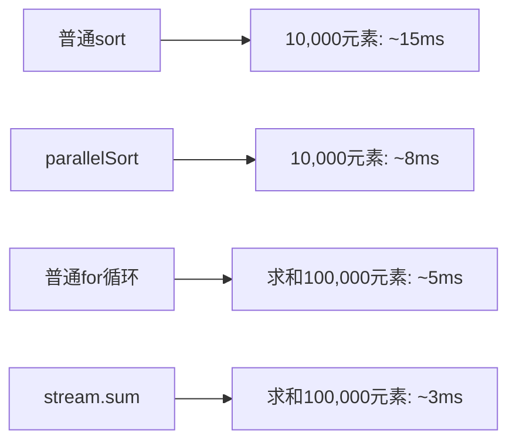

# Java 数组工具类

在Java编程中，数组是一种基础且常用的数据结构。为了简化对数组的操作，Java提供了一个强大的工具类 - `Arrays`。本文将全面介绍这个工具类的功能和用法，帮助你更高效地处理数组。

## 什么是Arrays工具类？

`Arrays`是Java标准库中`java.util`包下的一个工具类，专门用于操作和处理数组。它提供了一系列静态方法，包括排序、搜索、比较、填充、转换等功能，极大地简化了数组处理代码。

:::note 导入说明
使用Arrays类前，需要导入：
```java
import java.util.Arrays;
```
:::

## Arrays类常用方法

### 1. 数组排序 - sort()

`sort()`方法可以对数组元素进行升序排序。

```java
// 对整型数组排序
int[] numbers = {5, 2, 9, 1, 5, 6};
Arrays.sort(numbers);
System.out.println("排序后: " + Arrays.toString(numbers));

// 对字符串数组排序
String[] names = {"Tom", "Alice", "Bob", "John"};
Arrays.sort(names);
System.out.println("排序后: " + Arrays.toString(names));
```

输出结果：
```
排序后: [1, 2, 5, 5, 6, 9]
排序后: [Alice, Bob, John, Tom]
```

:::tip 部分排序
`sort()`方法也支持对数组的部分区间进行排序：
```java
int[] numbers = {5, 2, 9, 1, 5, 6};
// 只对索引1到4的元素进行排序（不包括索引4）
Arrays.sort(numbers, 1, 4);
// 结果将是 [5, 1, 2, 9, 5, 6]
```
:::

### 2. 数组搜索 - binarySearch()

`binarySearch()`方法使用二分查找算法在已排序数组中查找元素。

```java
int[] numbers = {1, 2, 5, 7, 9, 11};
int index = Arrays.binarySearch(numbers, 5);
System.out.println("元素5的索引: " + index);

// 尝试查找不存在的元素
int index2 = Arrays.binarySearch(numbers, 6);
System.out.println("元素6的索引: " + index2); // 返回负数
```

输出结果：
```
元素5的索引: 2
元素6的索引: -4
```

:::caution 注意事项
使用`binarySearch()`前，数组必须是已排序的（升序），否则结果不可预测。
如果元素不存在，返回值是`-(insertion point) - 1`，其中insertion point是应该插入这个元素的位置索引。
:::

### 3. 数组填充 - fill()

`fill()`方法可以用指定值填充整个数组或数组的一部分。

```java
int[] numbers = new int[5];
// 填充整个数组
Arrays.fill(numbers, 10);
System.out.println("填充后: " + Arrays.toString(numbers));

// 填充数组的一部分
int[] numbers2 = new int[5];
Arrays.fill(numbers2, 1, 4, 20);
System.out.println("部分填充: " + Arrays.toString(numbers2));
```

输出结果：
```
填充后: [10, 10, 10, 10, 10]
部分填充: [0, 20, 20, 20, 0]
```

### 4. 数组比较 - equals() 和 deepEquals()

`equals()`方法比较两个数组是否相等（元素值相同且顺序相同）。

```java
int[] array1 = {1, 2, 3};
int[] array2 = {1, 2, 3};
int[] array3 = {3, 2, 1};

System.out.println("array1 等于 array2: " + Arrays.equals(array1, array2));
System.out.println("array1 等于 array3: " + Arrays.equals(array1, array3));
```

输出结果：
```
array1 等于 array2: true
array1 等于 array3: false
```

`deepEquals()`方法用于比较多维数组：

```java
int[][] deepArray1 = {{1, 2}, {3, 4}};
int[][] deepArray2 = {{1, 2}, {3, 4}};
System.out.println("deepArray1 等于 deepArray2: " + Arrays.deepEquals(deepArray1, deepArray2));
```

输出结果：
```
deepArray1 等于 deepArray2: true
```

### 5. 数组转字符串 - toString() 和 deepToString()

`toString()`方法将数组转换为可读性良好的字符串。

```java
int[] numbers = {1, 2, 3, 4, 5};
System.out.println("数组内容: " + Arrays.toString(numbers));
```

输出结果：
```
数组内容: [1, 2, 3, 4, 5]
```

`deepToString()`用于多维数组：

```java
int[][] matrix = {{1, 2, 3}, {4, 5, 6}};
System.out.println("二维数组: " + Arrays.deepToString(matrix));
```

输出结果：
```
二维数组: [[1, 2, 3], [4, 5, 6]]
```

### 6. 数组复制 - copyOf() 和 copyOfRange()

`copyOf()`方法复制数组，可以指定新数组的长度。

```java
int[] original = {1, 2, 3, 4, 5};
int[] copied = Arrays.copyOf(original, 8);
System.out.println("复制后: " + Arrays.toString(copied));
```

输出结果：
```
复制后: [1, 2, 3, 4, 5, 0, 0, 0]
```

`copyOfRange()`方法复制数组的指定区间：

```java
int[] original = {1, 2, 3, 4, 5};
int[] copied = Arrays.copyOfRange(original, 1, 4);
System.out.println("复制区间后: " + Arrays.toString(copied));
```

输出结果：
```
复制区间后: [2, 3, 4]
```

### 7. 数组并行操作 - parallelSort(), parallelSetAll()

Java 8引入了一些并行处理数组的方法，适合大型数组操作。

```java
int[] bigArray = new int[10000];
// 随机填充数组
Arrays.setAll(bigArray, i -> (int)(Math.random() * 10000));
// 并行排序
long startTime = System.currentTimeMillis();
Arrays.parallelSort(bigArray);
long endTime = System.currentTimeMillis();
System.out.println("并行排序耗时: " + (endTime - startTime) + "ms");
```

### 8. Stream操作 - stream()

Java 8后，可以通过`stream()`方法将数组转换为流，进行更强大的操作。

```java
int[] numbers = {1, 2, 3, 4, 5};
int sum = Arrays.stream(numbers).sum();
double avg = Arrays.stream(numbers).average().getAsDouble();
System.out.println("数组元素和: " + sum);
System.out.println("数组平均值: " + avg);
```

输出结果：
```
数组元素和: 15
数组平均值: 3.0
```

## 实际应用场景

### 场景1：学生成绩排序

假设你需要处理一个班级的学生成绩数据：

```java
public class StudentGradeAnalysis {
    public static void main(String[] args) {
        // 学生的数学成绩
        int[] mathScores = {78, 95, 68, 87, 72, 90, 81, 65};
        
        // 排序前的成绩
        System.out.println("原始成绩: " + Arrays.toString(mathScores));
        
        // 对成绩排序
        Arrays.sort(mathScores);
        
        // 排序后的成绩
        System.out.println("排序后成绩: " + Arrays.toString(mathScores));
        
        // 计算平均分
        double average = Arrays.stream(mathScores).average().orElse(0);
        System.out.println("平均分: " + average);
        
        // 查找特定分数是否存在
        int searchScore = 87;
        int position = Arrays.binarySearch(mathScores, searchScore);
        if (position >= 0) {
            System.out.println("找到分数 " + searchScore + " 在位置 " + position);
        } else {
            System.out.println("未找到分数 " + searchScore);
        }
    }
}
```

### 场景2：商品库存管理

```java
public class InventorySystem {
    public static void main(String[] args) {
        // 商品ID
        String[] productIds = {"A123", "B456", "C789", "D012", "E345"};
        // 对应的库存量
        int[] stockLevels = {24, 15, 32, 8, 40};
        
        // 打印库存报表
        System.out.println("商品库存报表:");
        for (int i = 0; i < productIds.length; i++) {
            System.out.println("商品 " + productIds[i] + ": " + stockLevels[i] + " 件");
        }
        
        // 找出库存最低的商品
        int[] sortedStock = Arrays.copyOf(stockLevels, stockLevels.length);
        Arrays.sort(sortedStock);
        int lowestStock = sortedStock[0];
        
        // 找出对应的商品ID
        for (int i = 0; i < stockLevels.length; i++) {
            if (stockLevels[i] == lowestStock) {
                System.out.println("\n库存最低的商品是: " + productIds[i] + "，仅剩 " + lowestStock + " 件");
                break;
            }
        }
        
        // 判断是否有商品需要补货（库存少于10件）
        boolean needRestock = Arrays.stream(stockLevels).anyMatch(stock -> stock < 10);
        System.out.println("是否需要补货: " + needRestock);
    }
}
```

## 性能考虑

在处理大型数组时，Arrays工具类的性能表现如何？这里是一个简单的性能对比：



:::tip 性能提示
- 对于小型数组（元素少于1000个），普通sort和parallelSort性能差异不大
- 对于非常大的数组，使用并行方法可以显著提高性能
- 简单操作（如求和）使用传统for循环可能更快
- 复杂操作使用stream API通常更高效且代码更简洁
:::

## 总结

Arrays工具类是Java中处理数组的强大助手，通过它提供的各种方法，我们可以轻松实现数组的排序、搜索、填充、比较等操作，无需编写繁琐的自定义代码。掌握这些方法将大大提高你处理数组数据的效率。

主要记住以下几点：
1. 排序使用`sort()`方法，搜索使用`binarySearch()`方法（记得先排序）
2. 数组比较使用`equals()`或`deepEquals()`（多维数组）
3. 转字符串展示使用`toString()`或`deepToString()`
4. 数组复制使用`copyOf()`或`copyOfRange()`
5. 大型数组可考虑使用并行方法如`parallelSort()`
6. Java 8后可利用`stream()`进行更复杂的数据处理

## 练习题

1. 编写程序，使用Arrays类的方法将一个包含10个随机数的数组排序，并找出其中的最大值和最小值。
2. 创建两个字符串数组，使用Arrays的方法判断它们是否相等。
3. 编写一个方法，接收一个整数数组，返回一个新数组，新数组只包含原数组中的偶数元素。使用Arrays类的方法实现。

## 额外学习资源

- [Java官方文档 - Arrays类](https://docs.oracle.com/en/java/javase/17/docs/api/java.base/java/util/Arrays.html)
- [Java教程 - Arrays工具类](https://docs.oracle.com/javase/tutorial/java/nutsandbolts/arrays.html)

通过学习和实践本文所介绍的Arrays工具类方法，你将能更加高效地处理Java中的数组操作。这些知识将在你的编程生涯中频繁使用，是Java开发的基础技能之一。