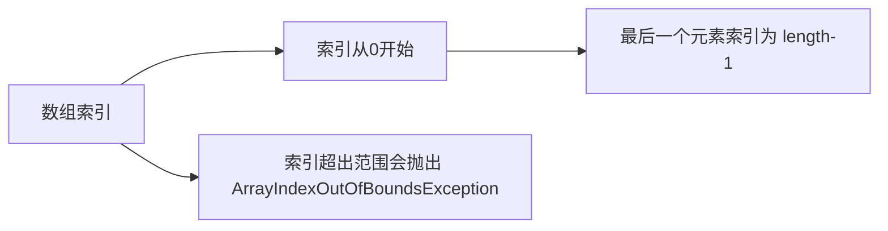

# Java 数组访问

在Java编程中，数组是最基本的数据结构之一，它允许我们在单个变量中存储多个相同类型的值。本文将详细介绍如何在Java中访问数组元素，以及与数组访问相关的重要概念和技巧。

## 数组索引基础

Java中的数组使用从0开始的索引来访问各个元素。这意味着第一个元素的索引是0，第二个元素的索引是1，以此类推。



### 基本访问语法

访问数组元素的基本语法如下：

```java
数组名[索引]
```

示例：

```java
// 声明并初始化一个整型数组
int[] numbers = {10, 20, 30, 40, 50};

// 访问数组的第一个元素(索引为0)
int firstElement = numbers[0];  // 值为10

// 访问数组的第三个元素(索引为2)
int thirdElement = numbers[2];  // 值为30

// 修改数组的第五个元素(索引为4)
numbers[4] = 500;

System.out.println("第一个元素: " + firstElement);
System.out.println("第三个元素: " + thirdElement);
System.out.println("修改后的第五个元素: " + numbers[4]);
```

输出结果：

```
第一个元素: 10
第三个元素: 30
修改后的第五个元素: 500
```

## 数组长度与边界

在Java中，可以通过`length`属性获取数组的长度（元素个数）：

```java
int[] array = {1, 2, 3, 4, 5};
int length = array.length; // length值为5
```

:::warning
数组索引必须在0到`length-1`的范围内。如果尝试访问超出这个范围的元素，Java会抛出`ArrayIndexOutOfBoundsException`异常。
:::

例如：

```java
int[] numbers = {1, 2, 3};
// 以下代码会抛出ArrayIndexOutOfBoundsException异常
int value = numbers[3]; // 尝试访问索引3，但数组最大索引是2
```

## 数组遍历方法

### 使用for循环

最常见的数组遍历方式是使用标准for循环：

```java
int[] scores = {85, 92, 78, 95, 88};

System.out.println("使用for循环遍历数组:");
for (int i = 0; i < scores.length; i++) {
    System.out.println("第" + (i+1) + "个元素: " + scores[i]);
}
```

输出结果：

```
使用for循环遍历数组:
第1个元素: 85
第2个元素: 92
第3个元素: 78
第4个元素: 95
第5个元素: 88
```

### 使用增强for循环（for-each）

Java 5引入了增强for循环，使数组遍历更加简洁：

```java
String[] fruits = {"苹果", "香蕉", "橙子", "葡萄", "西瓜"};

System.out.println("使用增强for循环遍历数组:");
for (String fruit : fruits) {
    System.out.println(fruit);
}
```

输出结果：

```
使用增强for循环遍历数组:
苹果
香蕉
橙子
葡萄
西瓜
```

:::note
增强for循环（for-each）更简洁，但如果需要知道当前元素的索引位置或需要修改数组元素，就必须使用传统的for循环。
:::

## 多维数组访问

Java支持多维数组，最常见的是二维数组。访问二维数组需要两个索引：第一个表示行，第二个表示列。

```java
// 创建一个3x3的二维数组
int[][] matrix = {
    {1, 2, 3},
    {4, 5, 6},
    {7, 8, 9}
};

// 访问第2行第3列的元素（索引是[1][2]）
int element = matrix[1][2];  // 值为6
System.out.println("第2行第3列的元素: " + element);

// 遍历二维数组
System.out.println("二维数组的所有元素:");
for (int i = 0; i < matrix.length; i++) {
    for (int j = 0; j < matrix[i].length; j++) {
        System.out.print(matrix[i][j] + " ");
    }
    System.out.println(); // 换行
}
```

输出结果：

```
第2行第3列的元素: 6
二维数组的所有元素:
1 2 3 
4 5 6 
7 8 9 
```

## 数组索引和操作的最佳实践

### 避免数组越界

始终确保索引在有效范围内：

```java
public static void safeAccess(int[] array, int index) {
    if (index >= 0 && index < array.length) {
        System.out.println("值: " + array[index]);
    } else {
        System.out.println("索引 " + index + " 超出范围!");
    }
}

// 使用示例
int[] numbers = {10, 20, 30};
safeAccess(numbers, 1);  // 正常访问
safeAccess(numbers, 5);  // 索引超出范围
```

输出结果：

```
值: 20
索引 5 超出范围!
```

### 使用数组工具类

Java提供了`Arrays`类，包含许多用于操作数组的实用方法：

```java
import java.util.Arrays;

// 初始化数组
int[] values = {5, 3, 9, 1, 7};

// 数组排序
Arrays.sort(values);
System.out.println("排序后: " + Arrays.toString(values));

// 数组元素查找
int index = Arrays.binarySearch(values, 7);
System.out.println("元素7的索引: " + index);

// 数组填充
int[] newArray = new int[5];
Arrays.fill(newArray, 10);
System.out.println("填充后的数组: " + Arrays.toString(newArray));
```

输出结果：

```
排序后: [1, 3, 5, 7, 9]
元素7的索引: 3
填充后的数组: [10, 10, 10, 10, 10]
```

## 实际应用案例

### 案例1：学生成绩统计

```java
public class StudentGradeAnalyzer {
    public static void main(String[] args) {
        // 存储五名学生的成绩
        int[] grades = {87, 92, 65, 78, 89};
        
        // 计算总分
        int sum = 0;
        for (int grade : grades) {
            sum += grade;
        }
        
        // 计算平均分
        double average = (double) sum / grades.length;
        
        // 找出最高分和最低分
        int highest = grades[0];
        int lowest = grades[0];
        
        for (int i = 1; i < grades.length; i++) {
            if (grades[i] > highest) {
                highest = grades[i];
            }
            if (grades[i] < lowest) {
                lowest = grades[i];
            }
        }
        
        // 输出结果
        System.out.println("学生成绩: " + Arrays.toString(grades));
        System.out.println("总分: " + sum);
        System.out.println("平均分: " + average);
        System.out.println("最高分: " + highest);
        System.out.println("最低分: " + lowest);
    }
}
```

输出结果：

```
学生成绩: [87, 92, 65, 78, 89]
总分: 411
平均分: 82.2
最高分: 92
最低分: 65
```

### 案例2：简单的购物车管理

```java
public class ShoppingCart {
    public static void main(String[] args) {
        // 商品列表
        String[] products = {"笔记本电脑", "手机", "耳机", "鼠标", "键盘"};
        
        // 价格列表
        double[] prices = {5999.99, 3999.99, 499.99, 99.99, 199.99};
        
        // 购买数量
        int[] quantities = {1, 2, 3, 2, 1};
        
        // 计算总价
        double totalCost = 0;
        
        System.out.println("购物清单:");
        System.out.println("-----------------------");
        System.out.printf("%-12s %-10s %-6s %-10s\n", "商品", "单价", "数量", "小计");
        
        for (int i = 0; i < products.length; i++) {
            double itemTotal = prices[i] * quantities[i];
            totalCost += itemTotal;
            
            System.out.printf("%-12s ￥%-9.2f %-6d ￥%-9.2f\n", 
                             products[i], prices[i], quantities[i], itemTotal);
        }
        
        System.out.println("-----------------------");
        System.out.printf("总计: ￥%.2f\n", totalCost);
    }
}
```

输出结果：

```
购物清单:
-----------------------
商品         单价       数量   小计      
笔记本电脑    ￥5999.99  1     ￥5999.99  
手机         ￥3999.99  2     ￥7999.98  
耳机         ￥499.99   3     ￥1499.97  
鼠标         ￥99.99    2     ￥199.98   
键盘         ￥199.99   1     ￥199.99   
-----------------------
总计: ￥15899.91
```

## 总结

Java数组访问是编程中的一项基本技能，掌握好数组的索引规则和访问方法可以帮助你高效地处理多个相关数据。本文涵盖了：

- 数组索引基础（从0开始）
- 数组元素的访问和修改
- 数组长度和边界检查
- 多种数组遍历方法
- 多维数组的访问
- 数组操作的最佳实践
- 实际应用案例

记住始终检查数组索引是否在有效范围内，以避免运行时出现`ArrayIndexOutOfBoundsException`异常。

## 练习

1. 编写一个程序，创建一个包含10个随机整数（1-100）的数组，然后找出其中的最大值、最小值和平均值。

2. 创建一个字符数组，内容是你的名字，然后逆序打印出来。

3. 编写一个程序，统计一个整型数组中偶数和奇数的个数。

4. 实现一个方法，接收一个二维数组作为参数，返回该数组主对角线（从左上到右下）元素的和。

:::tip
数组是最基础也是最常用的数据结构，掌握好数组的访问和操作是学习其他数据结构和算法的基础。多加练习，熟能生巧！
:::