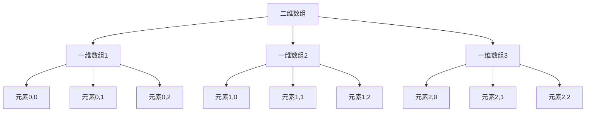

# Java 多维数组

## 介绍

在Java编程中，有时候我们需要表示更复杂的数据结构，比如矩阵、表格或者三维空间中的点。这时，一维数组就不足以满足我们的需求了。这就是多维数组登场的时刻。

多维数组本质上是"数组的数组"。在Java中，最常见的多维数组是二维数组，但也可以创建三维、四维甚至更高维度的数组。本文将重点介绍二维数组，同时也会简要提及更高维度的数组。

## 二维数组基础

### 什么是二维数组？

二维数组可以想象成一个表格或矩阵，有行和列。在Java中，二维数组是由多个一维数组组成的。



### 声明二维数组

在Java中有多种方式声明二维数组：

```java
// 声明方式1
int[][] array2D;

// 声明方式2
int array2D[][];

// 声明方式3 (不推荐，但合法)
int[] array2D[];
```

推荐使用第一种方式，因为它最清晰地表达了这是一个二维整数数组。

### 创建二维数组

声明之后，我们需要初始化数组：

```java
// 创建3行4列的二维数组
int[][] matrix = new int[3][4];
```

这会创建一个包含3行4列的二维数组，所有元素初始值为0（因为是int类型的默认值）。

### 初始化二维数组

你也可以在创建时直接初始化二维数组：

```java
// 直接初始化二维数组
int[][] matrix = {
    {1, 2, 3, 4},
    {5, 6, 7, 8},
    {9, 10, 11, 12}
};
```

### 访问二维数组元素

访问二维数组的元素需要使用两个索引，第一个指定行，第二个指定列：

```java
int[][] matrix = {
    {1, 2, 3},
    {4, 5, 6},
    {7, 8, 9}
};

// 访问第2行第3列的元素 (记住：索引从0开始)
int element = matrix[1][2]; // 值为6
```

### 完整示例

以下是一个完整的二维数组示例：

```java
public class TwoDArrayExample {
    public static void main(String[] args) {
        // 创建一个2行3列的二维数组
        int[][] arr = new int[2][3];
        
        // 初始化数组
        arr[0][0] = 1;
        arr[0][1] = 2;
        arr[0][2] = 3;
        arr[1][0] = 4;
        arr[1][1] = 5;
        arr[1][2] = 6;
        
        // 打印数组内容
        System.out.println("二维数组内容:");
        for (int i = 0; i < arr.length; i++) {
            for (int j = 0; j < arr[i].length; j++) {
                System.out.print(arr[i][j] + " ");
            }
            System.out.println(); // 换行
        }
    }
}
```

输出：
```
二维数组内容:
1 2 3 
4 5 6 
```

## Java 中的不规则数组

Java允许创建每行列数不同的二维数组，这种数组称为"不规则数组"或"锯齿状数组"。

```java
public class JaggedArrayExample {
    public static void main(String[] args) {
        // 创建一个具有3行的数组，但每行的列数不同
        int[][] jaggedArray = new int[3][];
        
        // 为每行分配不同长度的数组
        jaggedArray[0] = new int[3];
        jaggedArray[1] = new int[5];
        jaggedArray[2] = new int[2];
        
        // 填充数组
        int value = 1;
        for (int i = 0; i < jaggedArray.length; i++) {
            for (int j = 0; j < jaggedArray[i].length; j++) {
                jaggedArray[i][j] = value++;
            }
        }
        
        // 打印不规则数组
        System.out.println("不规则数组内容:");
        for (int i = 0; i < jaggedArray.length; i++) {
            for (int j = 0; j < jaggedArray[i].length; j++) {
                System.out.print(jaggedArray[i][j] + " ");
            }
            System.out.println();
        }
    }
}
```

输出：
```
不规则数组内容:
1 2 3 
4 5 6 7 8 
9 10 
```

## 使用增强for循环遍历二维数组

Java 5引入的增强for循环可以更简洁地遍历二维数组：

```java
public class EnhancedForLoopExample {
    public static void main(String[] args) {
        int[][] matrix = {
            {1, 2, 3},
            {4, 5, 6},
            {7, 8, 9}
        };
        
        System.out.println("使用增强for循环遍历二维数组:");
        for (int[] row : matrix) {
            for (int element : row) {
                System.out.print(element + " ");
            }
            System.out.println();
        }
    }
}
```

输出：
```
使用增强for循环遍历二维数组:
1 2 3 
4 5 6 
7 8 9 
```

## 三维及更高维度的数组

Java也支持三维及更高维度的数组，但随着维度增加，代码复杂度也会相应提高。

### 三维数组示例

```java
public class ThreeDArrayExample {
    public static void main(String[] args) {
        // 创建一个3x3x3的三维数组
        int[][][] threeDArray = new int[3][3][3];
        
        // 初始化部分元素
        threeDArray[0][0][0] = 1;
        threeDArray[1][1][1] = 5;
        threeDArray[2][2][2] = 9;
        
        // 打印特定元素
        System.out.println("三维数组中的元素 [1][1][1]: " + threeDArray[1][1][1]);
        
        // 遍历整个三维数组
        System.out.println("三维数组内容:");
        for (int i = 0; i < threeDArray.length; i++) {
            for (int j = 0; j < threeDArray[i].length; j++) {
                for (int k = 0; k < threeDArray[i][j].length; k++) {
                    System.out.print(threeDArray[i][j][k] + " ");
                }
                System.out.println();
            }
            System.out.println("----");
        }
    }
}
```

输出片段：
```
三维数组中的元素 [1][1][1]: 5
三维数组内容:
1 0 0 
0 0 0 
0 0 0 
----
0 0 0 
0 5 0 
0 0 0 
----
0 0 0 
0 0 0 
0 0 9 
----
```

## 实际应用场景

多维数组在实际编程中有许多应用。以下是几个常见的例子：

### 1. 井字棋游戏

```java
public class TicTacToe {
    public static void main(String[] args) {
        // 创建一个3x3的井字棋棋盘
        char[][] board = new char[3][3];
        
        // 初始化棋盘
        for (int i = 0; i < board.length; i++) {
            for (int j = 0; j < board[i].length; j++) {
                board[i][j] = ' ';
            }
        }
        
        // 放置一些棋子
        board[0][0] = 'X';
        board[1][1] = 'O';
        board[2][2] = 'X';
        
        // 显示棋盘
        System.out.println("井字棋棋盘:");
        for (int i = 0; i < board.length; i++) {
            System.out.println(" " + board[i][0] + " | " + board[i][1] + " | " + board[i][2] + " ");
            if (i < 2) {
                System.out.println("---+---+---");
            }
        }
    }
}
```

输出：
```
井字棋棋盘:
 X |   |   
---+---+---
   | O |   
---+---+---
   |   | X 
```

### 2. 图像处理

在图像处理中，二维数组常用于表示像素矩阵：

```java
public class ImageProcessingExample {
    public static void main(String[] args) {
        // 模拟一个小的灰度图像 (0-255)
        int[][] image = {
            {120, 80, 200, 90},
            {50, 150, 100, 60},
            {30, 70, 110, 140}
        };
        
        // 对图像进行反转处理
        for (int i = 0; i < image.length; i++) {
            for (int j = 0; j < image[i].length; j++) {
                image[i][j] = 255 - image[i][j]; // 反转灰度值
            }
        }
        
        // 显示处理后的图像
        System.out.println("处理后的图像像素值:");
        for (int[] row : image) {
            for (int pixel : row) {
                System.out.printf("%3d ", pixel);
            }
            System.out.println();
        }
    }
}
```

输出：
```
处理后的图像像素值:
135 175  55 165 
205 105 155 195 
225 185 145 115 
```

### 3. 矩阵运算

多维数组在矩阵运算中非常有用：

```java
public class MatrixAddition {
    public static void main(String[] args) {
        int[][] matrixA = {
            {1, 2, 3},
            {4, 5, 6},
            {7, 8, 9}
        };
        
        int[][] matrixB = {
            {9, 8, 7},
            {6, 5, 4},
            {3, 2, 1}
        };
        
        // 矩阵相加
        int[][] result = new int[3][3];
        for (int i = 0; i < matrixA.length; i++) {
            for (int j = 0; j < matrixA[i].length; j++) {
                result[i][j] = matrixA[i][j] + matrixB[i][j];
            }
        }
        
        // 显示结果
        System.out.println("矩阵相加结果:");
        for (int[] row : result) {
            for (int val : row) {
                System.out.print(val + " ");
            }
            System.out.println();
        }
    }
}
```

输出：
```
矩阵相加结果:
10 10 10 
10 10 10 
10 10 10 
```

## 多维数组的性能考虑

:::caution
多维数组可能会占用大量内存，特别是当维度和大小增加时。在处理大型多维数组时，要注意内存使用情况。
:::

例如，一个1000x1000的二维整数数组需要约4MB的内存（因为每个int占用4字节）。

如果你处理的是非常大的数据集，考虑使用更内存高效的数据结构或稀疏数组实现。

## 总结

在本文中，我们详细介绍了Java中的多维数组，包括：

- 二维数组的声明、创建和初始化
- 访问和遍历二维数组元素的方法
- 不规则（锯齿状）数组的使用
- 三维及更高维度数组
- 多维数组在实际应用中的例子

多维数组是Java编程中处理复杂数据结构的重要工具，掌握它们的使用方法对于解决许多实际问题至关重要。

## 练习

1. 创建一个3x3的二维数组，并使用随机数（1-100）填充它。
2. 编写一个程序，找出二维数组中的最大值和最小值。
3. 实现两个3x3矩阵的乘法运算。
4. 创建一个不规则数组，第一行有2个元素，第二行有3个元素，第三行有4个元素，并用递增的数字填充它。
5. 编写一个程序，将一个二维数组顺时针旋转90度。

:::tip
记住，多维数组本质上是"数组的数组"。理解这一点将帮助你更好地使用和操作它们。
:::

## 参考资源

- [Oracle Java官方文档 - 数组](https://docs.oracle.com/javase/tutorial/java/nutsandbolts/arrays.html)
- 《Java核心技术》第1卷 - 数组章节
- 《数据结构与算法分析：Java语言描述》- 多维数据结构章节

掌握多维数组的使用将为你解决复杂问题提供强大的工具！
