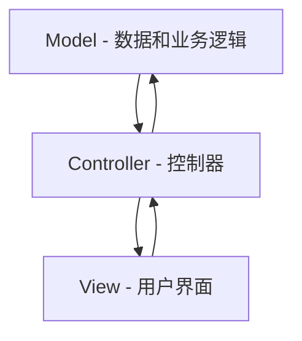

# Java GUI概述

## 什么是Java GUI编程?

图形用户界面(Graphical User Interface，简称GUI)是一种允许用户通过图形元素（如按钮、文本框、菜单等）与计算机程序交互的用户界面。Java作为一门功能强大的编程语言，提供了多种创建GUI应用程序的方式。

在Java中，主要有三种创建GUI的技术：

1. **AWT (Abstract Window Toolkit)** - Java最早的GUI库
2. **Swing** - 基于AWT构建的更先进的GUI工具包
3. **JavaFX** - 现代Java应用程序的下一代GUI框架

本教程主要关注Swing，它是初学者学习Java GUI编程的最佳起点。

## Java Swing简介

Swing是Java基础类(JFC)的一部分，它提供了一套丰富的"轻量级"组件，可以在不同平台上以相同的外观运行。与AWT不同，Swing组件是用纯Java实现的，而不是依赖于底层操作系统的原生组件。

### Swing的主要特点：

- **平台独立性**: 一次编写，到处运行
- **可定制外观**: 支持多种外观和感觉(Look and Feel)
- **丰富的组件集**: 从基础按钮到高级表格、树形结构等
- **MVC架构**: 组件的外观与逻辑分离

## 基本Swing组件

让我们看看一些最常用的Swing组件：

- `JFrame`: 主窗口
- `JPanel`: 容器组件，用于组织其他组件
- `JButton`: 按钮
- `JLabel`: 显示文本或图像
- `JTextField`: 单行文本输入
- `JTextArea`: 多行文本输入
- `JCheckBox`: 复选框
- `JRadioButton`: 单选按钮
- `JComboBox`: 下拉列表
- `JList`: 列表选择器

## 第一个Swing程序

下面是一个简单的Swing应用程序示例：

```java
import javax.swing.*;
import java.awt.*;
import java.awt.event.*;

public class FirstSwingExample {
    public static void main(String[] args) {
        // 创建JFrame实例
        JFrame frame = new JFrame("我的第一个Swing程序");
        
        // 设置窗口大小
        frame.setSize(300, 200);
        
        // 设置关闭操作
        frame.setDefaultCloseOperation(JFrame.EXIT_ON_CLOSE);
        
        // 创建JPanel
        JPanel panel = new JPanel();
        
        // 创建JLabel
        JLabel label = new JLabel("欢迎学习Java GUI编程!");
        
        // 创建JButton
        JButton button = new JButton("点击我");
        
        // 添加事件监听器
        button.addActionListener(new ActionListener() {
            public void actionPerformed(ActionEvent e) {
                label.setText("你好，Swing世界!");
            }
        });
        
        // 添加组件到面板
        panel.add(label);
        panel.add(button);
        
        // 添加面板到框架
        frame.add(panel);
        
        // 显示窗口
        frame.setVisible(true);
    }
}
```

运行这段代码，你将看到一个简单的窗口，其中包含一个标签和一个按钮。点击按钮后，标签的文本会改变。

## 布局管理

Swing提供了多种布局管理器来控制组件的位置和大小：

1. **FlowLayout**: 从左到右，从上到下排列组件
2. **BorderLayout**: 将容器分为五个区域(北、南、东、西、中)
3. **GridLayout**: 将容器分为网格，每个单元格大小相等
4. **BoxLayout**: 在单行或单列中排列组件
5. **GridBagLayout**: 最灵活但也最复杂的布局管理器
6. **CardLayout**: 堆叠组件，一次只显示一个
7. **null布局**: 通过绝对坐标定位组件

### BorderLayout示例

```java
JFrame frame = new JFrame("BorderLayout示例");
frame.setSize(400, 300);
frame.setDefaultCloseOperation(JFrame.EXIT_ON_CLOSE);

// 默认情况下JFrame使用BorderLayout
JButton northButton = new JButton("北");
JButton southButton = new JButton("南");
JButton eastButton = new JButton("东");
JButton westButton = new JButton("西");
JButton centerButton = new JButton("中");

frame.add(northButton, BorderLayout.NORTH);
frame.add(southButton, BorderLayout.SOUTH);
frame.add(eastButton, BorderLayout.EAST);
frame.add(westButton, BorderLayout.WEST);
frame.add(centerButton, BorderLayout.CENTER);

frame.setVisible(true);
```

### FlowLayout示例

```java
JFrame frame = new JFrame("FlowLayout示例");
frame.setSize(300, 150);
frame.setDefaultCloseOperation(JFrame.EXIT_ON_CLOSE);

// 创建一个使用FlowLayout的面板
JPanel panel = new JPanel(new FlowLayout());

// 添加5个按钮
for (int i = 1; i <= 5; i++) {
    panel.add(new JButton("按钮 " + i));
}

frame.add(panel);
frame.setVisible(true);
```

## 事件处理

Java Swing使用事件驱动编程模型，其中用户交互(如点击按钮)会触发事件，程序通过事件监听器响应这些事件。

### 常见的事件类型：

- `ActionEvent`: 当组件被激活时触发(如按钮点击)
- `MouseEvent`: 与鼠标操作相关
- `KeyEvent`: 与键盘操作相关
- `WindowEvent`: 与窗口状态变化相关
- `ItemEvent`: 当项目状态改变时触发(如复选框、下拉列表)

### 事件处理示例

```java
JButton button = new JButton("点击我");

// 方式1: 使用匿名内部类
button.addActionListener(new ActionListener() {
    @Override
    public void actionPerformed(ActionEvent e) {
        System.out.println("按钮被点击了!");
    }
});

// 方式2: 使用Lambda表达式(Java 8+)
button.addActionListener(e -> System.out.println("按钮被点击了!"));
```

## 实际案例：简单计算器

下面是一个简单计算器的实现，它展示了Swing组件、布局管理和事件处理的综合应用：

```java
import javax.swing.*;
import java.awt.*;
import java.awt.event.*;

public class SimpleCalculator {
    private JFrame frame;
    private JTextField displayField;
    private double firstNumber = 0;
    private String operation = "";
    private boolean startNewInput = true;
    
    public SimpleCalculator() {
        // 创建主窗口
        frame = new JFrame("简单计算器");
        frame.setSize(300, 400);
        frame.setDefaultCloseOperation(JFrame.EXIT_ON_CLOSE);
        frame.setLayout(new BorderLayout());
        
        // 创建显示区域
        displayField = new JTextField("0");
        displayField.setHorizontalAlignment(JTextField.RIGHT);
        displayField.setEditable(false);
        displayField.setFont(new Font("Arial", Font.BOLD, 24));
        frame.add(displayField, BorderLayout.NORTH);
        
        // 创建按钮面板
        JPanel buttonPanel = new JPanel();
        buttonPanel.setLayout(new GridLayout(5, 4, 5, 5));
        
        // 定义按钮标签
        String[] buttonLabels = {
            "7", "8", "9", "/",
            "4", "5", "6", "*",
            "1", "2", "3", "-",
            "0", ".", "=", "+",
            "C", "CE", "", ""
        };
        
        // 创建并添加按钮
        for (String label : buttonLabels) {
            if (label.isEmpty()) {
                buttonPanel.add(new JLabel());
            } else {
                JButton button = new JButton(label);
                button.addActionListener(new ButtonClickListener());
                buttonPanel.add(button);
            }
        }
        
        frame.add(buttonPanel, BorderLayout.CENTER);
        frame.setVisible(true);
    }
    
    private class ButtonClickListener implements ActionListener {
        @Override
        public void actionPerformed(ActionEvent e) {
            String command = e.getActionCommand();
            
            // 处理数字和小数点
            if ((command.charAt(0) >= '0' && command.charAt(0) <= '9') || command.equals(".")) {
                if (startNewInput) {
                    displayField.setText(command);
                    startNewInput = false;
                } else {
                    displayField.setText(displayField.getText() + command);
                }
            }
            // 处理操作符
            else if (command.equals("+") || command.equals("-") || 
                     command.equals("*") || command.equals("/")) {
                firstNumber = Double.parseDouble(displayField.getText());
                operation = command;
                startNewInput = true;
            }
            // 处理等号
            else if (command.equals("=")) {
                double secondNumber = Double.parseDouble(displayField.getText());
                double result = 0;
                
                if (operation.equals("+")) {
                    result = firstNumber + secondNumber;
                } else if (operation.equals("-")) {
                    result = firstNumber - secondNumber;
                } else if (operation.equals("*")) {
                    result = firstNumber * secondNumber;
                } else if (operation.equals("/")) {
                    result = firstNumber / secondNumber;
                }
                
                displayField.setText(String.valueOf(result));
                startNewInput = true;
            }
            // 处理清除按钮
            else if (command.equals("C")) {
                displayField.setText("0");
                startNewInput = true;
                firstNumber = 0;
                operation = "";
            }
            // 处理清除输入按钮
            else if (command.equals("CE")) {
                displayField.setText("0");
                startNewInput = true;
            }
        }
    }
    
    public static void main(String[] args) {
        // 在事件调度线程中创建GUI
        SwingUtilities.invokeLater(new Runnable() {
            @Override
            public void run() {
                new SimpleCalculator();
            }
        });
    }
}
```

这个计算器示例展示了如何组合使用多种Swing组件和布局管理器，以及如何处理用户交互事件来创建一个功能性的应用程序。

## Swing应用程序的最佳实践

:::tip
始终在事件调度线程(EDT)中创建和修改Swing组件，可以使用`SwingUtilities.invokeLater()`方法。
:::

```java
public static void main(String[] args) {
    SwingUtilities.invokeLater(new Runnable() {
        public void run() {
            createAndShowGUI();
        }
    });
}

private static void createAndShowGUI() {
    // 创建和设置窗口
    JFrame frame = new JFrame("Hello World");
    frame.setDefaultCloseOperation(JFrame.EXIT_ON_CLOSE);
    frame.setSize(300, 200);
    frame.setVisible(true);
}
```

:::caution
不要在事件处理程序中执行长时间运行的任务，这会导致GUI冻结。对于耗时操作，应使用`SwingWorker`或单独的线程。
:::

## Java GUI编程架构模式

为了使GUI应用程序更易于维护，通常采用以下架构模式：



- **模型(Model)**: 表示应用程序的数据和业务逻辑
- **视图(View)**: 负责展示数据和收集用户输入
- **控制器(Controller)**: 处理用户交互，并协调模型和视图

## 总结

Java GUI编程允许开发人员创建交互式的图形用户界面应用程序。通过Swing库，我们可以：

- 创建各种窗口、对话框和组件
- 使用布局管理器组织界面元素
- 通过事件监听器处理用户交互
- 自定义组件的外观和行为

掌握了这些基础知识后，你可以构建从简单工具到复杂企业应用程序的各种GUI应用。

## 练习

1. 创建一个简单的文本编辑器，包含文本区域和基本的菜单(文件、编辑)
2. 实现一个温度转换器(摄氏度/华氏度)，使用滑块和文本框
3. 设计一个带有多个选项卡的窗口，每个选项卡展示不同类型的表单元素
4. 创建一个简单的绘图应用，允许用户绘制基本形状

## 进一步学习资源

- Oracle的Java Swing教程
- Java Swing组件API文档
- 《Java图形界面开发实战》等相关书籍
- 在线Java GUI课程和视频教程

通过实践和探索，你将能够创建越来越复杂和精美的Java GUI应用程序。祝你学习顺利！