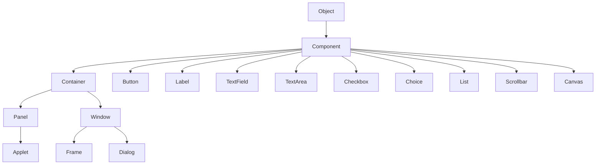

# Java AWT

## 什么是Java AWT?

AWT (Abstract Window Toolkit) 是Java最早的GUI（图形用户界面）工具包，它是Java标准库的一部分。AWT提供了一套用于创建窗口、按钮、文本框等用户界面元素的API，使开发人员能够构建跨平台的图形应用程序。

:::note
AWT是平台相关的，这意味着AWT组件在不同操作系统上的外观和行为可能会有所不同，因为它使用了各操作系统的原生UI组件。
:::

## AWT的主要特点

- **平台依赖性**：AWT使用底层操作系统的原生组件
- **轻量级**：相比Swing，AWT组件占用资源较少
- **包含基础组件**：按钮、标签、文本框、复选框等
- **事件处理机制**：用于响应用户交互

## AWT的基本组件

AWT组件可以分为以下几类：

### 容器组件

容器组件用于承载和组织其他组件：

- **Frame**：独立窗口，应用程序的主窗口
- **Panel**：简单容器，用于组织组件
- **Dialog**：对话框
- **Applet**：网页中运行的Java程序（现已弃用）

### 基本组件

这些是用户可以交互的UI元素：

- **Button**：按钮
- **Label**：标签（文本显示）
- **TextField**：单行文本输入框
- **TextArea**：多行文本输入框
- **Checkbox**：复选框
- **Choice**：下拉列表
- **List**：列表选择框
- **Scrollbar**：滚动条

## AWT的布局管理器

AWT提供多种布局管理器来控制组件的位置和大小：

1. **FlowLayout**：组件从左到右，从上到下排列
2. **BorderLayout**：将容器分为东南西北中五个区域
3. **GridLayout**：组件排列成网格
4. **CardLayout**：组件叠放，一次只显示一个
5. **GridBagLayout**：最灵活但最复杂的布局管理器

## AWT事件处理

AWT使用委托事件模型来处理用户交互：

1. **事件源**：生成事件的组件
2. **事件对象**：包含事件信息
3. **事件监听器**：接收和处理事件的接口

常见的事件监听器接口：

- **ActionListener**：按钮点击等动作事件
- **MouseListener**：鼠标点击、进入等事件
- **KeyListener**：键盘按键事件
- **WindowListener**：窗口状态变化事件

## 第一个AWT程序：Hello World窗口

下面是一个简单的AWT程序示例，创建一个带有标签的窗口：

```java
import java.awt.*;
import java.awt.event.*;

public class HelloAWT {
    public static void main(String[] args) {
        // 创建一个Frame窗口
        Frame frame = new Frame("我的第一个AWT程序");
        
        // 创建一个Label标签
        Label label = new Label("Hello, AWT World!", Label.CENTER);
        
        // 将标签添加到窗口中
        frame.add(label);
        
        // 设置窗口大小
        frame.setSize(300, 200);
        
        // 使窗口可见
        frame.setVisible(true);
        
        // 添加窗口关闭事件处理
        frame.addWindowListener(new WindowAdapter() {
            public void windowClosing(WindowEvent e) {
                System.exit(0);
            }
        });
    }
}
```

运行上面的代码，会显示一个带有"Hello, AWT World!"文本的窗口。

## 构建一个简单计算器

下面是一个更复杂的例子，展示如何使用AWT构建一个简单的计算器：

```java
import java.awt.*;
import java.awt.event.*;

public class SimpleCalculator extends Frame implements ActionListener {
    private TextField tfInput;
    private Button[] btNumbers = new Button[10];
    private Button btPlus, btMinus, btMultiply, btDivide, btEquals, btClear;
    private Panel panelNumbers, panelOperations;
    
    private double num1 = 0, num2 = 0, result = 0;
    private char operator;

    public SimpleCalculator() {
        // 设置窗口标题和布局
        super("简单计算器");
        setLayout(new BorderLayout());
        
        // 创建文本输入框
        tfInput = new TextField();
        tfInput.setEditable(false);
        add(tfInput, BorderLayout.NORTH);
        
        // 创建数字面板
        panelNumbers = new Panel();
        panelNumbers.setLayout(new GridLayout(4, 3));
        
        // 添加数字按钮0-9
        for(int i = 9; i >= 0; i--) {
            btNumbers[i] = new Button(String.valueOf(i));
            btNumbers[i].addActionListener(this);
            panelNumbers.add(btNumbers[i]);
        }
        
        // 添加清除和等号按钮到数字面板
        btClear = new Button("C");
        btClear.addActionListener(this);
        panelNumbers.add(btClear);
        
        btEquals = new Button("=");
        btEquals.addActionListener(this);
        panelNumbers.add(btEquals);
        
        // 添加数字面板到主窗口
        add(panelNumbers, BorderLayout.CENTER);
        
        // 创建运算符面板
        panelOperations = new Panel();
        panelOperations.setLayout(new GridLayout(4, 1));
        
        // 添加运算符按钮
        btPlus = new Button("+");
        btPlus.addActionListener(this);
        panelOperations.add(btPlus);
        
        btMinus = new Button("-");
        btMinus.addActionListener(this);
        panelOperations.add(btMinus);
        
        btMultiply = new Button("*");
        btMultiply.addActionListener(this);
        panelOperations.add(btMultiply);
        
        btDivide = new Button("/");
        btDivide.addActionListener(this);
        panelOperations.add(btDivide);
        
        // 添加运算符面板到主窗口
        add(panelOperations, BorderLayout.EAST);
        
        // 设置窗口属性
        setSize(300, 300);
        setVisible(true);
        
        // 添加窗口关闭事件
        addWindowListener(new WindowAdapter() {
            public void windowClosing(WindowEvent e) {
                System.exit(0);
            }
        });
    }
    
    @Override
    public void actionPerformed(ActionEvent e) {
        String command = e.getActionCommand();
        
        // 处理数字按钮点击
        if (Character.isDigit(command.charAt(0))) {
            tfInput.setText(tfInput.getText() + command);
        }
        // 处理运算符按钮点击
        else if (command.equals("+") || command.equals("-") || command.equals("*") || command.equals("/")) {
            num1 = Double.parseDouble(tfInput.getText());
            operator = command.charAt(0);
            tfInput.setText("");
        }
        // 处理等号按钮点击
        else if (command.equals("=")) {
            num2 = Double.parseDouble(tfInput.getText());
            
            switch(operator) {
                case '+': result = num1 + num2; break;
                case '-': result = num1 - num2; break;
                case '*': result = num1 * num2; break;
                case '/': 
                    if (num2 != 0) {
                        result = num1 / num2;
                    } else {
                        tfInput.setText("错误：除数为零");
                        return;
                    }
                    break;
            }
            
            tfInput.setText(String.valueOf(result));
        }
        // 处理清除按钮点击
        else if (command.equals("C")) {
            tfInput.setText("");
            num1 = num2 = result = 0;
        }
    }
    
    public static void main(String[] args) {
        new SimpleCalculator();
    }
}
```

这个计算器程序演示了如何：
- 创建和组织多个AWT组件
- 使用不同的布局管理器
- 实现事件处理
- 在用户界面中执行逻辑操作

## AWT组件层次结构

AWT组件具有层次结构，理解这一点很重要：



## AWT与Swing的比较

虽然AWT是Java最早的GUI工具包，但现在大多数Java应用程序使用更现代的Swing或JavaFX：

| 特性 | AWT | Swing |
|------|-----|-------|
| 平台相关性 | 是（重量级） | 否（轻量级） |
| 外观一致性 | 在不同平台上不一致 | 在所有平台上保持一致 |
| 组件丰富度 | 基本组件 | 更丰富的组件库 |
| MVC架构 | 不支持 | 支持 |
| 性能 | 较好 | 相对较慢 |
| 定制性 | 有限 | 强大 |

:::tip
如果你正在开发新的Java GUI应用，建议使用Swing或JavaFX而不是AWT。但学习AWT对理解Java GUI编程的历史和基本概念很有价值。
:::

## AWT的实际应用

虽然AWT在现代应用程序开发中使用较少，但它仍然在以下领域有应用：

1. **嵌入式系统**：资源受限的环境中，由于AWT的轻量级特性
2. **旧系统维护**：维护基于AWT的遗留代码
3. **简单工具**：不需要复杂UI的小型工具和实用程序
4. **教育**：学习Java GUI编程的基础知识

## 小结

Java AWT是Java最早的GUI工具包，它提供了构建图形界面所需的基本组件和功能：

- 各种UI组件（按钮、标签、文本框等）
- 容器组件用于组织UI元素
- 布局管理器控制组件的排列
- 事件处理机制响应用户交互

虽然在现代Java应用程序开发中，Swing和JavaFX已经在很大程度上取代了AWT，但了解AWT仍然对理解Java GUI编程的基础概念非常重要。

## 练习

1. 创建一个AWT窗口，包含一个文本框和一个按钮。当点击按钮时，在文本框中显示"Hello World!"

2. 使用AWT创建一个简单的表单，包含姓名、年龄输入框和一个提交按钮。当提交时，显示输入的信息。

3. 实现一个使用不同布局管理器的AWT程序，展示各种布局的效果。

4. 扩展计算器示例，添加更多功能如平方根、百分比等。

## 进一步学习资源

- Oracle官方Java文档中的AWT教程
- Java核心技术卷I中的GUI编程章节
- 学习更现代的GUI框架如Swing和JavaFX