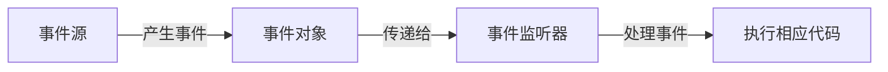

# Java 事件处理

在Java图形用户界面（GUI）编程中，事件处理是实现用户交互的核心机制。无论是按钮点击、鼠标移动还是键盘输入，都需要通过事件处理来响应这些用户操作。本文将全面介绍Java事件处理的基本概念、实现方式及实际应用。

## 事件处理基本概念

Java事件处理基于**委托事件模型**（Delegation Event Model），该模型包含三个核心组成部分：

1. **事件源（Event Source）**：产生事件的组件，如按钮、文本框等
2. **事件对象（Event Object）**：包含事件信息的对象，如点击位置、按键等
3. **事件监听器（Event Listener）**：接收事件并做出响应的对象

该模型的工作流程如下：



## 事件和监听器类型

Java AWT/Swing 提供了丰富的事件类型，常见的包括：

| 事件类 | 监听器接口 | 典型用途 |
|-------|-----------|---------|
| ActionEvent | ActionListener | 按钮点击、菜单选择 |
| MouseEvent | MouseListener, MouseMotionListener | 鼠标点击、移动 |
| KeyEvent | KeyListener | 键盘输入 |
| WindowEvent | WindowListener | 窗口操作(关闭、最小化) |
| ItemEvent | ItemListener | 选择组件状态改变 |
| FocusEvent | FocusListener | 组件获得/失去焦点 |

## 实现事件处理的方法

在Java中，有多种方式可以实现事件处理：

### 1. 实现监听器接口

最直接的方法是让类实现相应的监听器接口：

```java
import javax.swing.*;
import java.awt.event.*;

public class ButtonExample implements ActionListener {
    private JFrame frame;
    private JButton button;
    
    public ButtonExample() {
        // 创建窗口和按钮
        frame = new JFrame("按钮示例");
        button = new JButton("点击我");
        
        // 注册监听器
        button.addActionListener(this);
        
        // 设置窗口
        frame.add(button);
        frame.setSize(300, 200);
        frame.setDefaultCloseOperation(JFrame.EXIT_ON_CLOSE);
        frame.setVisible(true);
    }
    
    // 实现ActionListener接口的方法
    @Override
    public void actionPerformed(ActionEvent e) {
        JOptionPane.showMessageDialog(frame, "按钮被点击了！");
    }
    
    public static void main(String[] args) {
        new ButtonExample();
    }
}
```

:::tip 提示
当你的类需要处理多个不同类型的事件时，实现多个监听器接口是完全可行的。
:::

### 2. 使用内部类

当一个类需要处理多种事件时，使用内部类可以使代码更加模块化：

```java
import javax.swing.*;
import java.awt.event.*;

public class MultipleEventsExample {
    private JFrame frame;
    private JButton button;
    private JTextField textField;
    
    public MultipleEventsExample() {
        frame = new JFrame("多事件示例");
        button = new JButton("确认");
        textField = new JTextField(20);
        
        // 使用内部类处理按钮事件
        button.addActionListener(new ButtonClickHandler());
        
        // 使用内部类处理文本框事件
        textField.addKeyListener(new TextFieldKeyHandler());
        
        // 窗口布局
        JPanel panel = new JPanel();
        panel.add(textField);
        panel.add(button);
        frame.add(panel);
        
        frame.setSize(350, 150);
        frame.setDefaultCloseOperation(JFrame.EXIT_ON_CLOSE);
        frame.setVisible(true);
    }
    
    // 按钮事件处理内部类
    private class ButtonClickHandler implements ActionListener {
        @Override
        public void actionPerformed(ActionEvent e) {
            String text = textField.getText();
            if (!text.isEmpty()) {
                JOptionPane.showMessageDialog(frame, "您输入了: " + text);
            }
        }
    }
    
    // 文本框事件处理内部类
    private class TextFieldKeyHandler extends KeyAdapter {
        @Override
        public void keyReleased(KeyEvent e) {
            if (e.getKeyCode() == KeyEvent.VK_ENTER) {
                // 触发按钮的点击事件
                button.doClick();
            }
        }
    }
    
    public static void main(String[] args) {
        new MultipleEventsExample();
    }
}
```

### 3. 使用匿名内部类

对于简单的事件处理，匿名内部类是一种更简洁的方式：

```java
import javax.swing.*;
import java.awt.event.*;

public class AnonymousListenerExample {
    public static void main(String[] args) {
        JFrame frame = new JFrame("匿名内部类示例");
        JButton button = new JButton("点击");
        
        // 使用匿名内部类
        button.addActionListener(new ActionListener() {
            @Override
            public void actionPerformed(ActionEvent e) {
                JOptionPane.showMessageDialog(frame, "使用匿名内部类处理事件");
            }
        });
        
        frame.add(button);
        frame.setSize(300, 200);
        frame.setDefaultCloseOperation(JFrame.EXIT_ON_CLOSE);
        frame.setVisible(true);
    }
}
```

### 4. 使用Lambda表达式（Java 8+）

在Java 8及更高版本中，对于只有一个抽象方法的接口（函数式接口），可以使用Lambda表达式进一步简化代码：

```java
import javax.swing.*;
import java.awt.*;

public class LambdaListenerExample {
    public static void main(String[] args) {
        JFrame frame = new JFrame("Lambda表达式示例");
        JButton button = new JButton("点击");
        
        // 使用Lambda表达式
        button.addActionListener(e -> {
            JOptionPane.showMessageDialog(frame, "使用Lambda表达式处理事件");
        });
        
        frame.add(button);
        frame.setSize(300, 200);
        frame.setDefaultCloseOperation(JFrame.EXIT_ON_CLOSE);
        frame.setLayout(new FlowLayout());
        frame.setVisible(true);
    }
}
```

## 适配器类

对于包含多个方法的监听器接口，如果你只需要实现其中的一两个方法，可以使用适配器类。适配器类是接口的实现类，其中所有方法都有空实现。

常见的适配器类包括：
- MouseAdapter（对应MouseListener和MouseMotionListener）
- KeyAdapter（对应KeyListener）
- WindowAdapter（对应WindowListener）

例如使用WindowAdapter处理窗口关闭事件：

```java
import javax.swing.*;
import java.awt.event.*;

public class AdapterExample {
    public static void main(String[] args) {
        JFrame frame = new JFrame("适配器示例");
        
        // 使用WindowAdapter而不是实现WindowListener
        frame.addWindowListener(new WindowAdapter() {
            @Override
            public void windowClosing(WindowEvent e) {
                System.out.println("窗口正在关闭");
                System.exit(0);
            }
            
            @Override
            public void windowOpened(WindowEvent e) {
                System.out.println("窗口已打开");
            }
        });
        
        frame.setSize(300, 200);
        frame.setVisible(true);
    }
}
```

## 事件处理的顺序

当多个监听器注册到同一个事件源时，它们将按照注册的顺序被调用。事件传递顺序遵循以下规则：

1. 事件首先传递给最特定的组件
2. 如果该组件没有处理事件，则事件会传递给其父组件
3. 这一过程会一直持续到事件被处理或者到达组件层次的顶层

## 实际案例：简易计算器

下面是一个使用事件处理机制实现的简易计算器应用：

```java
import javax.swing.*;
import java.awt.*;
import java.awt.event.*;

public class SimpleCalculator extends JFrame {
    private JTextField display;
    private double firstNumber;
    private String operation;
    private boolean startNewInput;
    
    public SimpleCalculator() {
        super("简易计算器");
        setLayout(new BorderLayout());
        
        // 创建显示区域
        display = new JTextField("0");
        display.setEditable(false);
        display.setHorizontalAlignment(JTextField.RIGHT);
        display.setFont(new Font("Arial", Font.PLAIN, 20));
        add(display, BorderLayout.NORTH);
        
        // 创建按钮面板
        JPanel buttonPanel = new JPanel();
        buttonPanel.setLayout(new GridLayout(4, 4, 5, 5));
        
        // 数字按钮和运算符按钮
        String[] buttonLabels = {
            "7", "8", "9", "/",
            "4", "5", "6", "*",
            "1", "2", "3", "-",
            "0", ".", "=", "+"
        };
        
        for (String label : buttonLabels) {
            JButton button = new JButton(label);
            button.setFont(new Font("Arial", Font.PLAIN, 16));
            
            if (label.matches("[0-9.]")) {
                // 数字和小数点
                button.addActionListener(new DigitButtonHandler());
            } else {
                // 运算符
                button.addActionListener(new OperatorButtonHandler());
            }
            
            buttonPanel.add(button);
        }
        
        // 添加清除按钮
        JButton clearButton = new JButton("C");
        clearButton.setFont(new Font("Arial", Font.PLAIN, 16));
        clearButton.addActionListener(e -> {
            display.setText("0");
            firstNumber = 0;
            operation = null;
            startNewInput = true;
        });
        
        JPanel controlPanel = new JPanel(new GridLayout(1, 1));
        controlPanel.add(clearButton);
        
        add(buttonPanel, BorderLayout.CENTER);
        add(controlPanel, BorderLayout.SOUTH);
        
        setSize(300, 400);
        setDefaultCloseOperation(JFrame.EXIT_ON_CLOSE);
        setVisible(true);
        
        startNewInput = true;
    }
    
    // 处理数字按钮
    private class DigitButtonHandler implements ActionListener {
        @Override
        public void actionPerformed(ActionEvent e) {
            String digit = e.getActionCommand();
            
            if (startNewInput) {
                if (digit.equals(".")) {
                    display.setText("0.");
                } else {
                    display.setText(digit);
                }
                startNewInput = false;
            } else {
                String currentText = display.getText();
                // 确保不能输入多个小数点
                if (digit.equals(".") && currentText.contains(".")) {
                    return;
                }
                display.setText(currentText + digit);
            }
        }
    }
    
    // 处理运算符按钮
    private class OperatorButtonHandler implements ActionListener {
        @Override
        public void actionPerformed(ActionEvent e) {
            String newOperation = e.getActionCommand();
            
            if (!startNewInput) {
                calculate();
                startNewInput = true;
            }
            
            firstNumber = Double.parseDouble(display.getText());
            
            if (!newOperation.equals("=")) {
                operation = newOperation;
            } else {
                operation = null;
            }
        }
        
        private void calculate() {
            if (operation == null) return;
            
            double secondNumber = Double.parseDouble(display.getText());
            double result = 0;
            
            switch (operation) {
                case "+":
                    result = firstNumber + secondNumber;
                    break;
                case "-":
                    result = firstNumber - secondNumber;
                    break;
                case "*":
                    result = firstNumber * secondNumber;
                    break;
                case "/":
                    if (secondNumber != 0) {
                        result = firstNumber / secondNumber;
                    } else {
                        display.setText("错误");
                        return;
                    }
                    break;
            }
            
            // 显示结果，如果是整数则不显示小数点
            if (result == (int) result) {
                display.setText(String.valueOf((int) result));
            } else {
                display.setText(String.valueOf(result));
            }
        }
    }
    
    public static void main(String[] args) {
        SwingUtilities.invokeLater(() -> new SimpleCalculator());
    }
}
```

这个简易计算器展示了如何使用事件处理机制来创建有交互性的GUI应用程序。它包含了数字按钮和运算符按钮，用户可以输入数字并执行基本的四则运算。

## 总结

Java事件处理是GUI编程的核心概念之一，通过掌握事件处理机制，你可以创建响应用户操作的交互式应用程序。本文介绍了：

- 事件处理的基本概念和委托事件模型
- 常见的事件类型和监听器接口
- 实现事件处理的多种方法：实现接口、内部类、匿名内部类和Lambda表达式
- 使用适配器类简化代码
- 事件处理的顺序和传递机制
- 通过简易计算器案例展示事件处理的实际应用

## 练习

为加深对Java事件处理的理解，试着完成以下练习：

1. 创建一个简单的文本编辑器，包含菜单栏和基本功能（新建、打开、保存、退出）
2. 实现一个绘图应用，可以通过鼠标在面板上绘制线条和形状
3. 开发一个表单验证程序，当用户输入不合法数据时显示错误信息
4. 扩展计算器程序，添加更多功能（如平方根、百分比计算等）

:::tip 学习建议
事件处理是GUI编程的重要基础，建议先从简单的按钮点击事件开始尝试，逐渐过渡到更复杂的事件处理机制。通过不断实践和创建小型项目来巩固所学知识。
:::

## 进一步学习资源

- Oracle官方Java教程：[事件处理章节](https://docs.oracle.com/javase/tutorial/uiswing/events/index.html)
- 《Java核心技术》卷I：涵盖了Java事件处理的详细内容
- 《Swing启示录》：专注于Swing和事件处理的实际应用

通过掌握Java事件处理机制，你将能够创建真正交互式的Java GUI应用程序，为用户提供流畅的操作体验。