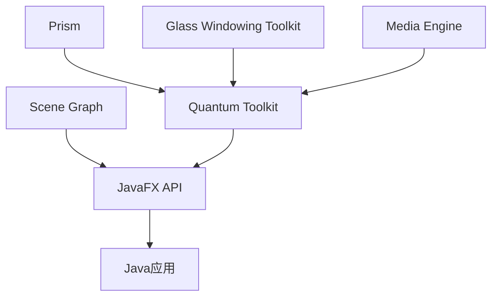

# Java JavaFX简介

## 什么是JavaFX？

JavaFX是一个用于构建富互联网应用程序(RIA)的Java库，它是Java标准版(SE)的一部分，旨在替代较早的Swing库，为Java开发者提供更现代化、功能更丰富的GUI开发选择。JavaFX允许开发者创建跨平台的桌面应用程序，这些应用程序可以在不同的设备和操作系统上运行。

:::note
从Java 11开始，JavaFX已不再包含在JDK中，需要作为单独的模块添加到项目中。
:::

## Java FX的主要特点

JavaFX相比传统的Swing有许多优势：

1. **现代化设计**：提供了更现代的API设计和视觉效果
2. **CSS样式支持**：可以使用CSS来定制界面外观
3. **FXML支持**：允许通过XML文件定义UI布局，实现界面与逻辑的分离
4. **丰富的UI控件**：提供了大量预定义的UI组件
5. **多媒体支持**：内置对音频、视频和图像的处理能力
6. **动画和特效**：提供了丰富的动画和视觉特效API
7. **WebView组件**：集成了WebKit引擎，可以在应用中嵌入Web内容

## Java FX架构

JavaFX的基础架构由以下几个主要部分组成：



- **Scene Graph**：一个树形结构，包含了构成UI的节点
- **Prism**：处理渲染的图形引擎
- **Glass Windowing Toolkit**：处理底层系统交互
- **Media Engine**：处理音频和视频
- **Quantum Toolkit**：连接这些组件的工具包

## Java FX应用程序的基本结构

一个JavaFX应用程序通常包含以下元素：

1. **Stage**：JavaFX应用程序的顶层容器，相当于窗口
2. **Scene**：包含所有UI元素的容器，附加到Stage上
3. **Nodes**：构成Scene的各种UI元素，如按钮、文本、图形等

## 第一个JavaFX程序

让我们创建一个简单的"Hello World"应用程序：

```java
import javafx.application.Application;
import javafx.scene.Scene;
import javafx.scene.control.Label;
import javafx.scene.layout.StackPane;
import javafx.stage.Stage;

public class HelloWorld extends Application {
    
    @Override
    public void start(Stage primaryStage) {
        // 创建一个Label控件
        Label label = new Label("Hello, JavaFX!");
        
        // 创建一个布局容器
        StackPane root = new StackPane();
        
        // 将Label添加到布局容器中
        root.getChildren().add(label);
        
        // 创建一个Scene，指定布局容器和尺寸
        Scene scene = new Scene(root, 300, 200);
        
        // 设置Stage的标题
        primaryStage.setTitle("My First JavaFX App");
        
        // 将Scene设置到Stage
        primaryStage.setScene(scene);
        
        // 显示Stage
        primaryStage.show();
    }

    public static void main(String[] args) {
        // 启动JavaFX应用
        launch(args);
    }
}
```

运行上述代码，你将看到一个标题为"My First JavaFX App"的窗口，窗口中央显示"Hello, JavaFX!"文本。

:::tip
确保你的开发环境已正确配置JavaFX。如果使用Maven，需要添加JavaFX依赖；如果使用IDE，可能需要配置JavaFX模块。
:::

## Java FX的主要布局容器

JavaFX提供了多种布局容器，用于组织UI元素：

1. **BorderPane**：将空间分为上、下、左、右、中五个区域
2. **HBox**：水平排列元素
3. **VBox**：垂直排列元素
4. **GridPane**：在网格中排列元素
5. **FlowPane**：在流中排列元素（类似于网页流布局）
6. **StackPane**：将元素堆叠在一起（后添加的在上层）
7. **AnchorPane**：允许将元素锚定到容器的边缘

## 使用FXML创建UI

FXML是一种XML格式，用于定义JavaFX界面。使用FXML可以将UI设计与应用逻辑分离，实现MVC架构。

示例FXML文件 `sample.fxml`：

```xml
<?xml version="1.0" encoding="UTF-8"?>

<?import javafx.scene.control.*?>
<?import javafx.scene.layout.*?>

<VBox xmlns="http://javafx.com/javafx"
      xmlns:fx="http://javafx.com/fxml"
      fx:controller="SampleController"
      spacing="10"
      alignment="CENTER"
      prefWidth="300" prefHeight="200">
    
    <Label text="Hello FXML!" />
    <Button text="Click Me" onAction="#handleButtonClick" />
    
</VBox>
```

对应的控制器类：

```java
import javafx.event.ActionEvent;
import javafx.fxml.FXML;
import javafx.scene.control.Alert;
import javafx.scene.control.Alert.AlertType;

public class SampleController {
    
    @FXML
    private void handleButtonClick(ActionEvent event) {
        Alert alert = new Alert(AlertType.INFORMATION);
        alert.setTitle("消息");
        alert.setHeaderText(null);
        alert.setContentText("你点击了按钮！");
        alert.showAndWait();
    }
}
```

加载FXML的主类：

```java
import javafx.application.Application;
import javafx.fxml.FXMLLoader;
import javafx.scene.Parent;
import javafx.scene.Scene;
import javafx.stage.Stage;

public class FXMLExample extends Application {
    
    @Override
    public void start(Stage primaryStage) throws Exception {
        // 加载FXML文件
        Parent root = FXMLLoader.load(getClass().getResource("sample.fxml"));
        
        // 创建场景
        Scene scene = new Scene(root);
        
        primaryStage.setTitle("FXML Example");
        primaryStage.setScene(scene);
        primaryStage.show();
    }
    
    public static void main(String[] args) {
        launch(args);
    }
}
```

## 实际应用案例：简单计算器

下面是一个简单计算器应用的例子，展示了JavaFX的实际应用：

```java
import javafx.application.Application;
import javafx.geometry.Insets;
import javafx.geometry.Pos;
import javafx.scene.Scene;
import javafx.scene.control.Button;
import javafx.scene.control.TextField;
import javafx.scene.layout.GridPane;
import javafx.scene.layout.VBox;
import javafx.stage.Stage;

public class SimpleCalculator extends Application {
    
    private TextField display;
    private String currentInput = "";
    private double num1 = 0;
    private String operator = "";
    
    @Override
    public void start(Stage primaryStage) {
        // 创建显示结果的文本框
        display = new TextField();
        display.setEditable(false);
        display.setAlignment(Pos.CENTER_RIGHT);
        display.setPrefHeight(50);
        
        // 创建数字和操作按钮
        GridPane buttonGrid = createButtonGrid();
        
        // 主布局
        VBox root = new VBox(10);
        root.setPadding(new Insets(10));
        root.getChildren().addAll(display, buttonGrid);
        
        // 创建场景
        Scene scene = new Scene(root);
        
        primaryStage.setTitle("简易计算器");
        primaryStage.setScene(scene);
        primaryStage.setResizable(false);
        primaryStage.show();
    }
    
    private GridPane createButtonGrid() {
        GridPane grid = new GridPane();
        grid.setHgap(5);
        grid.setVgap(5);
        
        // 数字按钮
        for (int i = 0; i < 10; i++) {
            final int digit = i;
            Button button = new Button(String.valueOf(digit));
            button.setPrefSize(50, 50);
            button.setOnAction(e -> handleDigit(digit));
            
            if (i == 0) {
                grid.add(button, 1, 3);
            } else {
                grid.add(button, (i - 1) % 3, (i - 1) / 3 + 1);
            }
        }
        
        // 操作符按钮
        String[] operators = {"+", "-", "*", "/", "=", "C"};
        for (int i = 0; i < operators.length; i++) {
            final String op = operators[i];
            Button button = new Button(op);
            button.setPrefSize(50, 50);
            button.setOnAction(e -> handleOperator(op));
            
            if (i < 4) {
                grid.add(button, 3, i);
            } else if (i == 4) {
                grid.add(button, 2, 3);
            } else {
                grid.add(button, 0, 3);
            }
        }
        
        return grid;
    }
    
    private void handleDigit(int digit) {
        currentInput += digit;
        display.setText(currentInput);
    }
    
    private void handleOperator(String op) {
        if (op.equals("C")) {
            currentInput = "";
            num1 = 0;
            operator = "";
            display.setText("");
            return;
        }
        
        if (!currentInput.isEmpty()) {
            if (operator.isEmpty()) {
                num1 = Double.parseDouble(currentInput);
                operator = op;
                currentInput = "";
            } else if (op.equals("=")) {
                double num2 = Double.parseDouble(currentInput);
                double result = calculate(num1, num2, operator);
                display.setText(String.valueOf(result));
                currentInput = String.valueOf(result);
                operator = "";
            } else {
                double num2 = Double.parseDouble(currentInput);
                num1 = calculate(num1, num2, operator);
                operator = op;
                display.setText(String.valueOf(num1));
                currentInput = "";
            }
        } else if (!operator.isEmpty() && !op.equals("=")) {
            operator = op;
        }
    }
    
    private double calculate(double a, double b, String op) {
        switch (op) {
            case "+": return a + b;
            case "-": return a - b;
            case "*": return a * b;
            case "/": return a / b;
            default: return b;
        }
    }
    
    public static void main(String[] args) {
        launch(args);
    }
}
```

此示例展示了如何使用JavaFX创建一个简单但功能完整的计算器应用程序。它演示了布局管理、事件处理和交互逻辑的实现方式。

## Java FX中的事件处理

JavaFX采用事件监听器模式来处理用户交互。以下是处理按钮点击事件的几种方式：

1. **使用匿名内部类**：
```java
button.setOnAction(new EventHandler<ActionEvent>() {
    @Override
    public void handle(ActionEvent event) {
        System.out.println("按钮被点击了！");
    }
});
```

2. **使用Lambda表达式**（Java 8+）：
```java
button.setOnAction(event -> System.out.println("按钮被点击了！"));
```

3. **使用FXML和@FXML注解**：
```java
@FXML
private void handleButtonClick(ActionEvent event) {
    System.out.println("按钮被点击了！");
}
```

## 使用CSS样式化JavaFX应用

JavaFX支持CSS来自定义界面外观。可以创建一个CSS文件并应用到场景：

```css
/* style.css */
.root {
    -fx-background-color: lightgray;
    -fx-font-family: "Arial";
}

.button {
    -fx-background-color: #4CAF50;
    -fx-text-fill: white;
    -fx-font-weight: bold;
    -fx-padding: 8px 16px;
}

.button:hover {
    -fx-background-color: #45a049;
}

.label {
    -fx-font-size: 14px;
    -fx-text-fill: #333333;
}
```

将CSS应用到场景：

```java
Scene scene = new Scene(root);
scene.getStylesheets().add(getClass().getResource("style.css").toExternalForm());
```

## 总结

JavaFX是一个强大而灵活的Java UI库，它提供了现代化的API和丰富的功能，使开发者能够构建视觉吸引力强、功能丰富的桌面应用程序。在本文中，我们已经介绍了：

- JavaFX的基础概念和架构
- 创建和运行JavaFX应用程序的基本步骤
- 主要的布局容器及其用途
- 使用FXML实现界面与逻辑的分离
- 事件处理
- 使用CSS自定义界面样式
- 通过实际案例展示JavaFX的应用

学习JavaFX是Java开发者扩展技能集的重要一步，它为构建现代化、交互性强的桌面应用程序提供了必要的工具和框架。

## 练习与进阶学习

1. **练习**：修改简单计算器程序，添加小数点按钮和百分比功能。
2. **练习**：创建一个简单的图片浏览器应用，允许用户浏览和查看图片。
3. **练习**：使用FXML和CSS重新设计计算器界面，实现MVC模式。

## 附加资源

- [JavaFX官方文档](https://openjfx.io/)
- [JavaFX教程 - Oracle](https://docs.oracle.com/javase/8/javafx/get-started-tutorial/jfx-overview.htm)
- [Scene Builder](https://gluonhq.com/products/scene-builder/) - 用于可视化设计JavaFX界面的工具
- [JavaFX CSS参考指南](https://docs.oracle.com/javase/8/javafx/api/javafx/scene/doc-files/cssref.html)

:::tip
学习JavaFX时，建议结合实际项目进行练习，这样可以更好地理解和掌握各种概念和技术。
:::